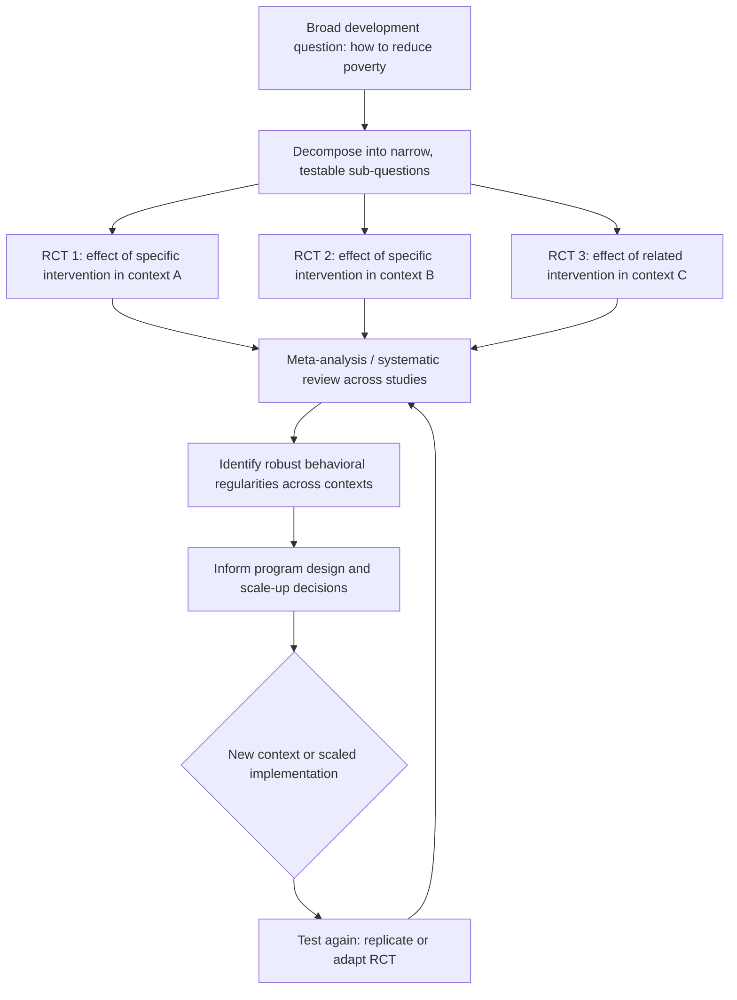

## Randomista Revolution and Its Critics

### Overview

The "randomista revolution" refers to the rapid rise of randomized controlled trials (RCTs) as the dominant methodological approach in development economics from the early 2000s onward, culminating in the 2019 Nobel Memorial Prize in Economic Sciences awarded to Abhijit Banerjee, Esther Duflo, and Michael Kremer "for their experimental approach to alleviating global poverty." The term "randomista" (sometimes used pejoratively, sometimes descriptively) refers to researchers and institutions — most prominently the Abdul Latif Jameel Poverty Action Lab (J-PAL, founded 2003) and Innovations for Poverty Action (IPA, founded 2002) — associated with this experimental turn. The movement has reshaped funding priorities, publication norms, and the training of development economists, while simultaneously generating one of the most sustained methodological debates in the field, principally associated with critics such as Angus Deaton, Lant Pritchett, Martin Ravallion, and Dani Rodrik.

### Historical and Institutional Context

**Origins and Growth**

The movement built on earlier applied microeconometric traditions (natural experiments, instrumental variables) but distinguished itself by prospectively designing randomized field experiments rather than relying solely on found or quasi-experimental variation. Early influential studies included Kremer's work on Kenyan school deworming and textbook provision (1990s), and Banerjee and Duflo's subsequent research program spanning microfinance, education, health, and governance interventions. J-PAL's growth — from a single MIT-based lab to a global network of affiliated researchers conducting evaluations across dozens of countries — is often cited as the institutional embodiment of the movement's scale and influence on donor and government policy (notably shaping approaches at organizations including the World Bank, and various national governments' evidence-based policy units).

**The 2019 Nobel Prize**

The Royal Swedish Academy of Sciences credited the laureates with transforming development economics into "a flourishing field of research" by demonstrating that complex poverty-related questions could be broken into smaller, more precisely answerable questions using field experiments — a framing that itself became a point of methodological contention (see below), since it presupposes that decomposing broad development questions into narrow, testable interventions is the right way to build cumulative knowledge.

### The Core Methodological Case for RCTs

**1. Internal Validity via Random Assignment**

Randomization ensures that, in expectation, treatment and control groups are balanced on both observed and unobserved characteristics, eliminating selection bias without requiring the researcher to specify or observe every confounding variable — the central advantage over matching, regression, or structural approaches that rely on the unconfoundedness or functional-form assumptions discussed elsewhere in this chapter.

**2. Transparency and Falsifiability**

Because the identifying assumption (random assignment) is largely mechanical rather than model-dependent, RCT results are comparatively easy for other researchers to scrutinize, replicate in design, and pool across studies via meta-analysis — a transparency advantage frequently cited relative to structural or reduced-form quasi-experimental designs with more contestable identifying assumptions.

**3. Iterative, Cumulative Evidence-Building**

Proponents (particularly Banerjee and Duflo, articulated extensively in their 2011 book *Poor Economics* and 2019 book *Good Economics for Hard Times*) argue that accumulating many well-identified, narrow-scope RCTs across contexts — on topics such as bed net pricing, teacher incentives, information provision, and savings products — builds a more reliable evidence base than broad cross-country regressions or theory alone, and can reveal robust behavioral regularities (e.g., regarding the price-sensitivity of health product uptake) even absent a single grand theory of development.

**4. Policy Relevance and Direct Testing of Interventions**

RCTs directly test specific, implementable interventions (e.g., a particular subsidy level, a specific information campaign design) rather than aggregate cross-country correlations, making the resulting evidence more directly actionable for program design — a strength particularly emphasized in J-PAL/IPA's model of embedding evaluation within active policy partnerships.

### Diagram: The Randomista Case for Cumulative Evidence

### The Critics' Case

**Angus Deaton's Critique**

Deaton (2010 *Journal of Economic Literature*, and subsequent work, including with Nancy Cartwright) raised several interconnected objections:

- **The "gold standard" framing is misleading**: RCTs are not inherently superior to other identification strategies in all respects; they trade off one set of assumptions (unconfoundedness) for others (e.g., that compliance and behavior are unaffected by the trial itself, that the estimated Local Average Treatment Effect generalizes beyond the specific sample and instrument).
- **External validity is not solved by internal validity**: an RCT's chief methodological strength (a credible internal estimate for the study sample) says little about whether that estimate applies elsewhere — internal and external validity are separate properties, and RCT advocacy has sometimes conflated methodological rigor on the former with confidence about the latter (directly connecting to the external validity debates covered elsewhere in this chapter).
- **Loss of attention to underlying economic theory and mechanisms**: Deaton has argued that the RCT movement's emphasis on "what works" (average treatment effects) can crowd out attention to *why* it works, weakening the discipline's ability to generalize, predict responses to novel policies, and build cumulative theoretical understanding rather than a growing but disconnected catalogue of context-specific findings.
- **Ethical and power dynamics**: Deaton and coauthors have also raised the ethical concerns discussed in the previous section — regarding consent, equipoise, and the asymmetry of who bears research risk versus who benefits from resulting knowledge.

**Lant Pritchett's Critique**

Pritchett (in various essays and coauthored work, including with Justin Sandefur) has focused heavily on **external validity and the "transportability" problem**:

- **Site-selection and context heterogeneity**: Pritchett has argued that treatment effects vary so substantially across contexts (state capacity, market conditions, cultural factors) that a well-identified but narrow RCT estimate can be *less* informative for policy in a new country than even a less rigorously identified estimate drawn from data in that specific country — a provocative claim that internal validity can be "purchased" at the cost of relevance.
- **"Kinky development" and the primacy of growth/institutions**: Pritchett has also argued the RCT movement's focus on marginal, small-scale interventions (bed nets, microfinance products, information nudges) diverts attention and funding away from the "big questions" of development — economic growth, state capacity, and institutional quality — which he and others (including Dani Rodrik) argue are quantitatively far more consequential for poverty reduction than the class of interventions RCTs are well-suited to test. [Inference: this is a normative/priorities critique as much as a methodological one — it concerns what questions the field should prioritize, not solely whether RCT identification is valid for the questions it does address.]
- **Randomization is infeasible for the questions that matter most**: many of the largest determinants of development outcomes (macroeconomic policy, institutional reform, state capacity building) cannot be randomized at all, meaning an RCT-centric methodological hierarchy risks systematically deprioritizing the most policy-relevant questions simply because they are not experimentally tractable.

**Martin Ravallion's Critique**

Ravallion (former Director of the World Bank's Development Research Group) has emphasized:

- **Selection into what gets tested**: RCTs are typically feasible only for interventions an implementing partner (NGO, willing government agency) agrees to randomize, which correlates with intervention type (discrete, small-scale, deliverable by a motivated partner) rather than policy importance, creating a systematic bias in the evidence base toward "RCT-able" interventions.
- **Ecological/general equilibrium limitations**: echoing the external validity literature, Ravallion has stressed that RCTs conducted at small scale cannot capture general equilibrium effects (price changes, spillovers, political economy responses) that emerge only when interventions are implemented at national scale — precisely the scale at which policy decisions are actually made.
- **Complementarity, not replacement, with other methods**: Ravallion has generally argued for a pluralistic methodological toolkit (combining RCTs with structural models, survey-based analysis, and non-experimental methods) rather than treating RCTs as categorically superior evidence.

**Dani Rodrik's Critique**

Rodrik has raised a related but distinct concern about the **portability of "context-free" evidence**: economic mechanisms are frequently context-dependent in ways that a single RCT (or even several) cannot fully characterize, and policy design should rely on locally-grounded diagnostic analysis (identifying the *most binding constraint* in a given context) rather than importing an average treatment effect estimated elsewhere, however rigorously identified.

### Responses from RCT Proponents

**On external validity**: Duflo, Banerjee, and coauthors (and subsequent methodological work, discussed in the external validity section of this chapter) have responded by emphasizing multi-site replication, structural-experimental hybrids, and theory-guided extrapolation (identifying *mechanisms*, not just average effects, so that results can be reasoned about in new contexts) — arguing this is a research design and aggregation challenge to be solved through better practice, not a fundamental flaw unique to RCTs (since all empirical methods, including cross-country growth regressions, face comparable extrapolation challenges).

**On "big questions" versus small-scale interventions**: proponents have argued that (a) rigorous evidence on discrete, implementable interventions has demonstrable, cumulative policy value (citing examples such as evidence-informed scale-up of deworming programs and information-based interventions), and (b) the claim that RCTs crowd out "big question" research is an empirical claim about researcher and funder behavior, not an inherent limitation of the method itself — nothing about randomization precludes studying institutions or governance, and RCT-based governance/political economy research (e.g., studies of corruption, clientelism, and public service delivery) has in fact grown substantially within the movement.

**On selection into "RCT-able" questions**: proponents generally acknowledge this as a genuine limitation, while noting that non-experimental methods face analogous and sometimes more severe selection problems (e.g., in what data happens to be available, or what natural experiments happen to occur), and argue the appropriate response is broadening what gets randomized (including at-scale, government-partnered evaluations) rather than abandoning experimental methods.

### Illustration: Positions in the Debate Along Two Axes (svg_diagram)

<svg xmlns="http://www.w3.org/2000/svg" viewBox="0 0 640 380">
<text x="320" y="20" font-size="14" font-weight="bold" text-anchor="middle">Positions in the Randomista Debate (svg_diagram)</text>
<line x1="80" y1="330" x2="580" y2="330" stroke="#333" />
<line x1="80" y1="50" x2="80" y2="330" stroke="#333" />
<text x="330" y="355" font-size="11" text-anchor="middle">Emphasis on internal validity (identification rigor)</text>
<text x="35" y="190" font-size="11" text-anchor="middle" transform="rotate(-90 35 190)">Emphasis on external validity / big questions</text>
<circle cx="480" cy="290" r="8" fill="#2266cc" />
<text x="490" y="294" font-size="11">Duflo / Banerjee / Kremer</text>
<circle cx="440" cy="250" r="8" fill="#2266cc" />
<text x="450" y="254" font-size="11">J-PAL / IPA institutional model</text>
<circle cx="180" cy="100" r="8" fill="#d33" />
<text x="190" y="104" font-size="11">Pritchett (transportability)</text>
<circle cx="220" cy="130" r="8" fill="#d33" />
<text x="230" y="134" font-size="11">Rodrik (context-dependence)</text>
<circle cx="260" cy="160" r="8" fill="#d33" />
<text x="270" y="164" font-size="11">Deaton (theory + ethics)</text>
<circle cx="300" cy="190" r="8" fill="#f0a" />
<text x="310" y="194" font-size="11">Ravallion (pluralist)</text>
<circle cx="360" cy="220" r="8" fill="#999" />
<text x="370" y="224" font-size="11">Sufficient statistics / hybrid approaches</text>
</svg>

### Comparative Summary of Positions

| Dimension | Randomista Position | Critics' Position |
| --- | --- | --- |
| Primary evidentiary standard | Internally valid causal identification via randomization | Internal validity necessary but insufficient; external validity/theory equally important |
| Preferred scope of research questions | Narrow, well-identified, iteratively replicated interventions | Broader "big questions": growth, institutions, state capacity |
| View of cross-country/macro evidence | Useful but historically overstated in confidence given weak identification | Indispensable for questions RCTs cannot address |
| Role of economic theory | Secondary to empirical identification; theory guides interpretation post hoc | Should guide ex ante model specification and generalization |
| Scaling concern | Addressed via multi-site trials, structural-experimental hybrids, replication | General equilibrium/scale effects are a fundamental, not merely practical, limitation |
| Institutional embodiment | J-PAL, IPA, evidence-based policy units | Dispersed across academic critique; no single counter-institution |

### Where the Debate Stands: Convergence and Ongoing Disagreement

Contemporary methodological practice increasingly reflects partial convergence: multi-site trials, pre-registration, structural-experimental hybrids, and explicit external validity frameworks (discussed in the corresponding section of this chapter) are now standard features of much RCT-based development research, addressing several of the critics' concerns directly. At the same time, substantive disagreement persists over (a) the appropriate allocation of research funding and attention between small-scale interventions and macro/institutional questions, (b) whether "what works" evidence can substitute for deeper causal/theoretical understanding of development processes, and (c) the ethical asymmetries in how and where experimental research is conducted. [Inference: characterizing the current state of the field as either "the randomistas won" or "the critics were vindicated" oversimplifies an ongoing, actively contested methodological landscape; both experimental and non-experimental traditions remain active and mutually influential in current development economics research.]

### Related Topics

- External validity and generalizability debates
- Structural versus reduced-form approaches
- Ethics of field experiments
- Growth economics and cross-country regressions
- Institutions and state capacity in development
- Pre-registration and pre-analysis plans
- J-PAL and Innovations for Poverty Action: institutional models of evidence-based policy
- Sufficient statistics and structural-experimental hybrid designs