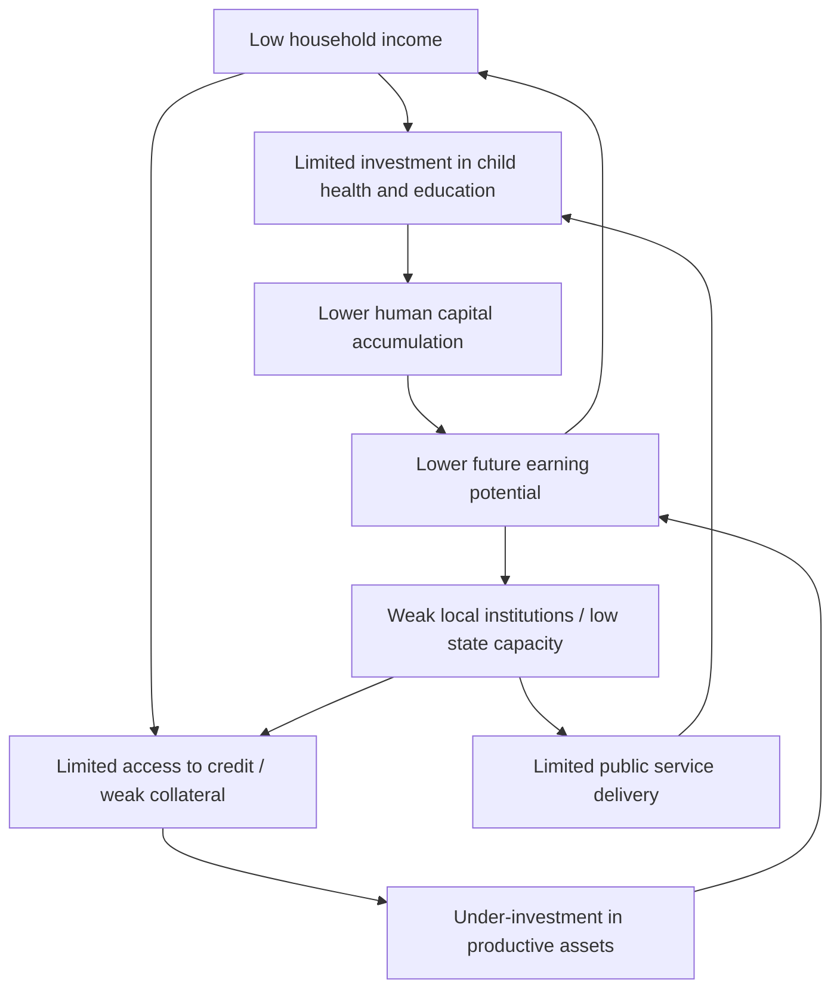
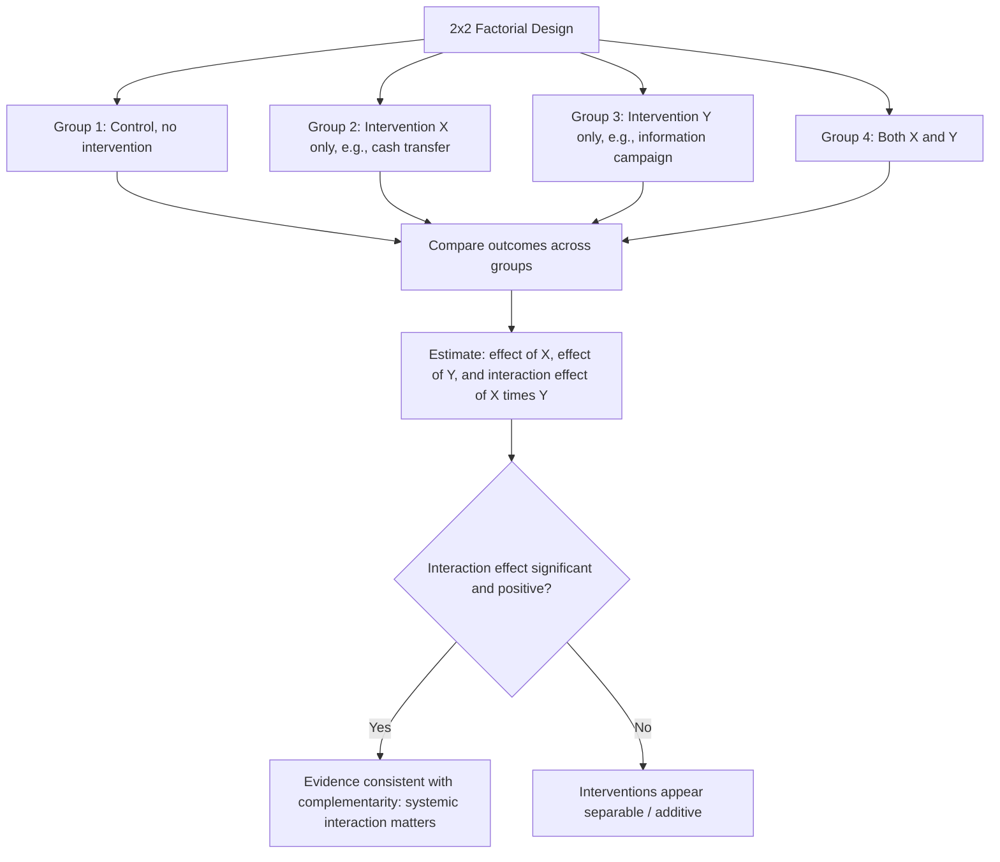

## Systems Thinking versus RCT-Based Approaches

### Overview

This debate concerns two contrasting paradigms for understanding and intervening in development processes: **systems thinking**, which conceptualizes development outcomes as emerging from the interaction of multiple interdependent actors, feedback loops, and institutional structures operating at different scales, versus **RCT-based approaches**, which isolate and test the causal effect of discrete, well-defined interventions holding the surrounding system constant. This debate is closely related to, but distinct from, the broader randomista/critics debate covered elsewhere in this chapter — while that debate centers on identification rigor and external validity, the systems-versus-RCT debate centers more specifically on whether the *unit of analysis* (a single intervention with a measurable average treatment effect) is well-suited to understanding development problems that are inherently multi-causal, non-linear, and context-embedded.

### Core Premises of Systems Thinking

**Definition**

Systems thinking, as applied to development, treats an outcome of interest (e.g., persistent poverty, poor learning outcomes, weak state capacity) as the product of a complex system: a network of interacting components — institutions, markets, social norms, political incentives, ecological conditions — connected by feedback loops, where the behavior of the whole is not reducible to the sum of its parts.

**Key Conceptual Tools**

- **Feedback loops**: reinforcing (positive) feedback loops can generate self-perpetuating cycles (e.g., a poverty trap, where low income reduces investment in health/education, which reduces future income); balancing (negative) feedback loops tend to stabilize a system around an equilibrium, which can make small-scale interventions ineffective if the system "self-corrects" back toward its prior state.
- **Non-linearity and threshold effects**: system responses to an intervention are not assumed to be constant or additive — small changes can have disproportionately large effects near a threshold (e.g., a tipping point in an epidemic model or a coordination equilibrium), while large changes elsewhere in the parameter space may have negligible effect.
- **Multiple equilibria**: some systems-oriented models of development (e.g., certain poverty trap and coordination-failure models in development theory) posit that an economy or community can settle into one of several stable equilibria (a "good" high-investment equilibrium or a "bad" low-investment equilibrium), with the equilibrium reached depending on history, expectations, and coordination among many interacting agents rather than any single intervention.
- **Emergent properties**: system-level outcomes (e.g., a functioning market, a resilient community institution) are treated as emergent from the interaction of many agents and cannot necessarily be engineered by summing the effects of isolated component interventions.
- **Adaptive/complex adaptive systems framing**: some systems approaches, particularly those drawing on complexity science, treat development systems as adaptive — actors change strategies in response to interventions and to each other — meaning an intervention's effect may itself evolve over time as the system adapts, rather than remaining a fixed, estimable parameter.

**Methodological Implications**

Systems thinking tends to favor methods and practices such as:

- **Participatory and adaptive program design** ("problem-driven iterative adaptation," associated with Matt Andrews, Lant Pritchett, and Michael Woolcock), where interventions are iteratively adjusted based on real-time local feedback rather than fixed ex ante and tested via a single average treatment effect.
- **Case studies and process tracing**, aimed at understanding the causal mechanisms and pathways through which change occurs in a specific system, rather than estimating an average effect across many units assumed to be structurally similar.
- **Systems mapping and causal loop diagrams**, used to visualize and reason about the interacting components and feedback structures relevant to a given development problem before designing an intervention.
- **Multi-level/multi-sectoral intervention design**, reflecting the premise that isolated, single-sector interventions may fail to move outcomes if binding constraints lie in complementary sectors or institutions not addressed by the intervention.

### Diagram: A Systems View of a Poverty Trap

### The RCT-Based Counter-Position

**Core Argument: Decomposability and Identifiability**

Proponents of RCT-based approaches (see the randomista revolution discussion elsewhere in this chapter) argue that even complex, systemic problems can often be productively decomposed into more tractable, testable sub-components, each of which can be rigorously evaluated, with cumulative evidence building toward a more general understanding — without requiring a fully specified model of the entire system.

**Response to the "Complexity Objection"**

- **Complexity does not preclude testable mechanisms**: proponents argue that a system being complex does not mean every component of it is untestable — feedback loops and interactions can themselves be hypothesized and tested (e.g., testing whether a credit-access intervention alters investment behavior in the specific way a poverty-trap model predicts), rather than treating "the system" as an unanalyzable whole.
- **Systems claims are frequently underspecified and unfalsifiable**: a common critique from the RCT side is that systems-thinking frameworks, while intuitively appealing, sometimes lack the specificity required to generate testable predictions or to be updated in light of contrary evidence — a concern that systems language can function as a rhetorical alternative to rigorous empirical work rather than a genuinely distinct empirical methodology. [Inference: this is a contested characterization; systems-thinking proponents would argue this reflects immature or poorly executed applications of the framework rather than an inherent limitation, and note that systems dynamics modeling can in principle generate falsifiable, quantitative predictions.]
- **Multi-arm and factorial RCT designs can test interaction effects**: rather than abandoning experimental methods, RCT proponents point to factorial designs that test multiple interventions simultaneously (and their interactions), which can approximate a test of certain systemic complementarities (e.g., testing whether combining a cash transfer with an information intervention produces effects different from the sum of each alone) without requiring a full systems model.

### Diagram: Factorial RCT Design as a Partial Response to Systemic Complementarity Concerns

### Points of Genuine Methodological Tension

**1. The Unit of Analysis Problem**

RCTs require a well-defined, discrete treatment applied to a well-defined unit (individual, household, village) with an outcome measurable at that same unit. Systems-level phenomena — institutional quality, social capital, market functioning, political settlements — often resist this framing, since they are properties of the interaction among units rather than a treatable attribute of any single unit, making them difficult to randomize or measure using standard RCT designs. [Inference: this is a widely acknowledged practical constraint rather than a proof that RCTs cannot in principle study institutions — governance and political economy RCTs have expanded considerably, but genuinely systemic, macro-institutional questions remain comparatively rare in the experimental literature relative to individual/household-level interventions.]

**2. Time Horizon and Dynamic Feedback**

Most RCTs measure outcomes over a relatively short post-intervention window (months to a few years), while systems-level change (institutional evolution, social norm shifts, multi-generational human capital effects) may unfold over far longer horizons, with feedback effects that only become apparent well beyond a typical study's follow-up period. Systems thinking places explicit emphasis on these long-run dynamics, which are structurally difficult for standard RCT designs to capture without extremely long and costly follow-up.

**3. Static Counterfactual versus Adaptive Systems**

An RCT's control group provides an estimate of the counterfactual "what would have happened without treatment," implicitly assuming this counterfactual state does not itself evolve differently due to the very existence of the intervention nearby (e.g., through spillovers, general equilibrium effects, or behavioral adaptation by non-participants) — an assumption in tension with an adaptive-systems view in which the introduction of any intervention changes the incentives and strategies of surrounding actors, potentially altering the "system" being measured. This connects directly to the general equilibrium concerns discussed in the external validity section of this chapter.

**4. The Role of Context-Specific Diagnosis versus Generalizable Findings**

Systems thinking, particularly in the "problem-driven iterative adaptation" (PDIA) tradition, emphasizes that the *most binding constraint* in a given system is highly context-specific and must be diagnosed locally, iteratively, and adaptively — in some tension with the RCT tradition's emphasis on identifying generalizable causal parameters (e.g., "the effect of cash transfers on consumption") that are assumed to have some transportable meaning across contexts, a tension that connects directly to the external validity and structural-versus-reduced-form debates covered elsewhere in this chapter.

### Comparative Summary

| Dimension | Systems Thinking | RCT-Based Approaches |
| --- | --- | --- |
| Unit of analysis | The system: interacting institutions, actors, feedback loops | The individual/household/firm/village receiving a discrete treatment |
| View of causality | Multi-causal, non-linear, potentially path-dependent | Single, isolable treatment effect, typically assumed additive |
| Preferred evidence | Process tracing, case studies, causal loop diagrams, iterative adaptation | Randomized comparison of treatment and control groups |
| Time horizon emphasis | Long-run, dynamic, feedback-driven change | Typically short-to-medium run measured effects |
| Generalizability claim | Explicitly context-specific; skeptical of transportable universal findings | Aims for generalizable causal parameters, tempered by external validity caveats |
| Falsifiability / testability | Can be difficult to specify testable predictions without further formalization | High — explicit ex ante hypotheses and pre-registered analysis plans |
| Typical practitioner tradition | Institutional economics, political science, complexity science, PDIA (Andrews/Pritchett/Woolcock) | Applied microeconomics, "randomista" tradition (J-PAL/IPA) |

### Attempts at Synthesis

**Complexity-Informed Experimental Design**

Some researchers have proposed combining elements of both traditions: using systems mapping and qualitative diagnosis to identify plausible causal mechanisms and binding constraints ex ante, then designing targeted RCTs (including factorial designs testing interaction effects) to test specific, well-specified hypotheses derived from that systems analysis — using systems thinking for hypothesis generation and RCTs for hypothesis testing, rather than treating the two as mutually exclusive.

**Problem-Driven Iterative Adaptation (PDIA) with Embedded Evaluation**

The PDIA approach (Andrews, Pritchett, Woolcock) explicitly incorporates iterative learning cycles, sometimes including light-touch experimentation or A/B-testing-style comparisons *within* an adaptive implementation process, rather than a single, fixed, ex ante randomized design — an attempt to retain some causal identification benefits of experimentation while accommodating the adaptive, context-specific premises of systems thinking.

**Agent-Based and Simulation Modeling**

Agent-based models (ABMs) — computational simulations of multiple interacting agents following specified behavioral rules — offer one formal tool for representing systems-level dynamics (feedback loops, emergent equilibria, non-linear thresholds) explicitly enough to generate testable, falsifiable predictions, addressing the "underspecification" critique of informal systems thinking; RCT-derived micro-parameters (e.g., an estimated behavioral elasticity) can in principle be used as calibrated inputs into such simulations, offering another bridge between the two traditions. [Unverified: the extent to which agent-based modeling has been integrated into mainstream development economics practice, as opposed to remaining a comparatively niche methodological tool relative to standard econometric approaches, should be checked against current literature, as this is an actively evolving area.]

### Illustration: Two Paradigms Side by Side (svg_diagram)

<svg xmlns="http://www.w3.org/2000/svg" viewBox="0 0 640 300">
<text x="320" y="20" font-size="14" font-weight="bold" text-anchor="middle">Systems Thinking vs. RCT-Based Approaches (svg_diagram)</text>
<rect x="40" y="50" width="260" height="220" fill="none" stroke="#2266cc" stroke-width="2" rx="8" />
<text x="170" y="75" font-size="12" font-weight="bold" text-anchor="middle" fill="#2266cc">Systems Thinking</text>
<circle cx="100" cy="120" r="18" fill="#cce0f5" />
<circle cx="200" cy="110" r="18" fill="#cce0f5" />
<circle cx="150" cy="180" r="18" fill="#cce0f5" />
<circle cx="230" cy="200" r="18" fill="#cce0f5" />
<line x1="100" y1="120" x2="200" y2="110" stroke="#2266cc" />
<line x1="100" y1="120" x2="150" y2="180" stroke="#2266cc" />
<line x1="200" y1="110" x2="230" y2="200" stroke="#2266cc" />
<line x1="150" y1="180" x2="230" y2="200" stroke="#2266cc" />
<line x1="230" y1="200" x2="100" y2="120" stroke="#2266cc" stroke-dasharray="3,2" />
<text x="170" y="250" font-size="10" text-anchor="middle">Interacting nodes, feedback loops</text>
<rect x="340" y="50" width="260" height="220" fill="none" stroke="#d33" stroke-width="2" rx="8" />
<text x="470" y="75" font-size="12" font-weight="bold" text-anchor="middle" fill="#d33">RCT-Based Approach</text>
<rect x="380" y="110" width="60" height="40" fill="#f5cccc" />
<text x="410" y="134" font-size="9" text-anchor="middle">Treatment</text>
<rect x="500" y="110" width="60" height="40" fill="#e0e0e0" />
<text x="530" y="134" font-size="9" text-anchor="middle">Control</text>
<line x1="440" y1="130" x2="500" y2="130" stroke="#d33" stroke-dasharray="4,3" />
<text x="470" y="122" font-size="9" text-anchor="middle" fill="#d33">Compare</text>
<text x="470" y="190" font-size="10" text-anchor="middle">Isolated unit, direct comparison,</text>
<text x="470" y="205" font-size="10" text-anchor="middle">system held fixed</text>
</svg>

### Where the Debate Stands

Both traditions have gained ground within contemporary development economics rather than one displacing the other. RCT-based methods remain dominant for evaluating discrete, implementable interventions where a well-defined counterfactual is feasible, while systems-informed approaches have gained particular traction in governance, public sector reform, and institution-building work, where the PDIA framework and related adaptive-management approaches are now widely used by organizations such as the World Bank's governance practice. [Inference: the degree of actual integration between the two traditions in mainstream academic development economics, as opposed to practitioner/policy circles, remains uneven and is an area of ongoing methodological development rather than a settled synthesis.]

### Related Topics

- Randomista revolution and its critics
- External validity and generalizability debates
- Structural versus reduced-form approaches
- Poverty traps and multiple equilibria models
- Problem-driven iterative adaptation (Andrews, Pritchett, Woolcock)
- Institutions and state capacity in development
- Agent-based modeling and computational social science
- Factorial experimental designs and testing intervention complementarities