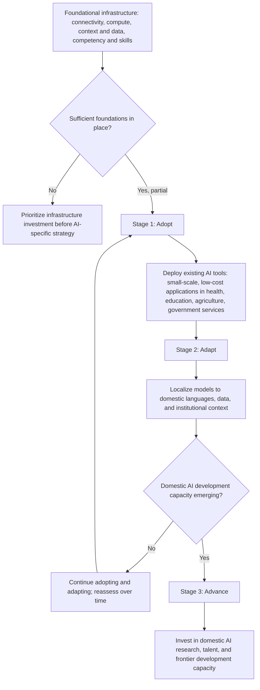

## Development Economics and Artificial Intelligence

### Overview

This topic addresses two distinct but related strands of inquiry at the intersection of artificial intelligence and development economics: (1) AI as a **subject of study** — its economic effects on labor markets, productivity, and growth in low- and middle-income countries (LMICs), and (2) AI as a **research tool** — its use in generating, analyzing, and augmenting the kinds of data and estimates covered elsewhere in this chapter (satellite imagery analysis, survey processing, synthetic data generation). This is an unusually fast-moving area of the discipline, with major institutional reports and academic work being published continuously; the material below reflects the state of discussion as of mid-to-late 2026 and should be understood as describing an actively evolving debate rather than settled findings.

### AI as an Object of Study: Economic Effects on Developing Economies

**The World Bank's "Adopt, Adapt, Advance" Framework**

The World Bank's *World Development Report 2026: The Promise of Artificial Intelligence*, its flagship report addressing AI's implications for developing economies, frames the pathway for LMICs around three sequential stages: **adopt** available AI tools rather than attempting to build frontier systems domestically; **adapt** those tools to local languages, data, and institutional context; and, over the longer term, **advance** toward domestic AI development capacity, in that order. The report frames this sequencing as a way to help countries avoid costly and inefficient attempts to replicate advanced AI before the foundational conditions are in place, and pairs the framework with what it terms the "four Cs" — connectivity, compute, context and data, and competency and skills — as the foundational prerequisites required before adoption can meaningfully occur. [World Bank](https://www.worldbank.org/en/news/press-release/2026/08/04/ai-offers-lifeline-to-developing-economies-in-an-era-of-weak-growth)

**Historically Unprecedented Diffusion Speed**

A central empirical claim in the report is that AI is diffusing into developing economies far faster than prior general-purpose technologies. The report notes it took about 80 years for the steam engine to reach lower-income countries, 40 years for electricity to do so, and 20 years for the internet, while middle-income countries accounted for half of ChatGPT's global traffic within six months of its launch. This compressed diffusion timeline is presented as a genuine opportunity — potentially allowing developing countries to access expertise and solve longstanding problems on a much shorter timetable than earlier technological transitions permitted — but also as a risk, since institutional and regulatory capacity to manage AI's effects cannot diffuse at the same speed as the technology itself. [World Bank](https://www.worldbank.org/en/publication/wdr2026)

**Labor Market and Automation Exposure**

A recurring finding across recent institutional analyses is that developing-country labor markets appear, on current evidence, less exposed to AI-driven automation risk than high-income-country labor markets, though the magnitude and interpretation of this finding are actively debated. Per the World Bank's analysis, jobs in high-income countries are more than three times as likely to be at risk of automation by generative AI than those in low- and middle-income countries, a pattern generally attributed to the sectoral composition of developing-country employment, which is concentrated in manual labor, agriculture, and informal work less amenable to current-generation generative AI automation. Separately, the report estimates that AI could boost productivity in more than 16% of existing jobs in developing economies, compared with more than 18% in advanced economies, suggesting a somewhat smaller but still meaningful productivity upside relative to high-income economies. [Inference: these exposure and productivity-boost estimates rely on task-based automation/augmentation exposure methodologies that are themselves subject to ongoing methodological debate and revision; researchers should treat point estimates as illustrative of current institutional consensus rather than fixed parameters, and should verify against the most recent report editions given how quickly this literature is being revised.] [UN Television](https://media.un.org/unifeed/en/asset/d361/d3615192)[Next IAS](https://www.nextias.com/ca/current-affairs/06-08-2026/world-development-report)

**The Adaptation Problem: Context and Data**

A specific concern raised in the WDR 2026 concept materials is that most frontier AI models are trained predominantly on high-income-country data and languages, creating a structural adaptation gap: adapting and customizing AI models to incorporate local data are likely needed for AI to deliver value and address bias in diverse contexts, and the availability of open-source foundation AI models developed in advanced economies is a prerequisite to facilitate such adaptation. This has been coupled with the observation that cloud-based software development platforms, such as Hugging Face and GitHub, have expanded access to open-source AI models by allowing developers to use them over the internet, while low-code and no-code platforms allow domain experts and non-technical users to interact with AI systems using plain language rather than software code — a development framed as lowering the technical barrier to local adaptation, though actual adoption still depends on the underlying connectivity and skills infrastructure the report identifies as binding constraints in many settings. [Worldbank](https://thedocs.worldbank.org/en/doc/1e4e52502104a331fb42cba0d4afa995-0050062026/original/WDR2026-Concept-Note.pdf)[Worldbank](https://thedocs.worldbank.org/en/doc/1e4e52502104a331fb42cba0d4afa995-0050062026/original/WDR2026-Concept-Note.pdf)

**Infrastructure Preconditions**

The report is explicit that AI's potential benefits are conditional on foundational infrastructure that remains absent in much of the developing world: in Sub-Saharan Africa, nearly one-third of rural schools still lack reliable electricity, and more than two-thirds lack dependable internet access. This grounds the report's broader argument that AI strategy cannot be treated as a standalone policy lever independent of longstanding development priorities (electrification, connectivity, education), directly connecting this topic to the more traditional infrastructure- and institutions-focused literature covered elsewhere in the field. [World Bank](https://www.worldbank.org/en/news/press-release/2026/08/04/ai-offers-lifeline-to-developing-economies-in-an-era-of-weak-growth)

**A Note of Caution on Uneven Gains**

Evidence from the broader (not development-specific) AI economics literature suggests that realized economic returns to AI adoption are currently highly concentrated. A 2026 PwC study found that nearly three-quarters of AI's economic value is captured by just one-fifth of organizations, revealing a stark and widening divide between a small group of AI leaders and the majority of businesses still stuck in pilot mode. While this finding is drawn primarily from a sample of large, publicly listed firms rather than a developing-country-specific sample, it is a relevant cautionary data point for development economists assessing whether AI-driven productivity gains will diffuse broadly within developing economies or concentrate among a small set of firms/governments with the complementary capacity to capture them — echoing longstanding concerns in the technology-adoption literature about complementary-input requirements (skills, capital, organizational capacity) determining who benefits from a new general-purpose technology. [PwC](https://www.pwc.com/gx/en/news-room/press-releases/2026/pwc-2026-ai-performance-study.html)

### Diagram: The Adopt-Adapt-Advance Framework

### AI as a Research Tool in Development Economics

**Estimation and Inference with AI-Generated Data**

A distinct and rapidly growing methodological literature addresses how development (and broader applied microeconomics) researchers should treat data that is itself generated or processed by AI models — for example, using large language models to code open-ended survey responses, classify satellite imagery, extract structured data from unstructured administrative records, or generate synthetic survey responses for pretesting. This raises novel econometric questions that do not map cleanly onto classical measurement-error theory (covered elsewhere in this chapter), since AI-generated labels or data points can carry systematic, model-specific biases and correlated error structures rather than simple classical noise. Recent economics methods literature — including NBER-affiliated work by researchers such as Melissa Dell and Ashesh Rambachan on "Estimation and Inference with AI-Generated Data" — has begun formalizing the statistical properties of point estimates and confidence intervals constructed from AI-generated or AI-augmented variables. [Unverified: as this is a nascent and actively developing subfield, specific formal results, recommended correction procedures, and consensus best practices should be checked against the current published literature rather than assumed stable, given how recently this work has emerged.]

**Applications Building on Existing Big-Data/Satellite Methods**

AI methods (particularly deep learning applied to imagery, discussed in the big-data and satellite data section of this chapter) continue to expand as a complement to survey-based measurement: machine-learning-based poverty and wealth mapping, automated land-use and crop classification, and natural-language-processing applications to administrative text (e.g., classifying government budget documents, court records, or media coverage at scale) are increasingly standard tools in applied development research, subject to the same ground-truthing and validation requirements discussed in that section.

**AI in Program Design and Delivery (as an Intervention)**

Separately from its use as a research tool, AI-based tools are themselves increasingly the subject of program evaluations — for example, RCTs testing AI-powered tutoring, agricultural advisory chatbots, or diagnostic support tools in low-resource health settings. These studies apply the same causal-inference toolkit covered throughout this chapter (RCTs, matching, instrumental variables) to a new class of intervention, while also raising some of the same generalizability concerns discussed in the external validity section — AI tool performance depends heavily on training data coverage, language support, and infrastructure reliability, all of which vary substantially across the contexts to which a given AI-based intervention's evaluated effect might be extrapolated.

### Comparative Summary: AI's Development Economics Relevance

| Dimension | As Subject of Study | As Research Tool |
| --- | --- | --- |
| Core question | How does AI affect growth, jobs, productivity in LMICs? | How can AI improve measurement, analysis, and program delivery? |
| Key institutional reference | World Bank WDR 2026 ("adopt, adapt, advance") | NBER methods literature (e.g., AI-generated data inference) |
| Main empirical challenge | Estimating exposure/productivity effects amid rapid, uneven diffusion | Characterizing statistical properties of AI-generated/processed data |
| Connection to existing chapter topics | Labor economics, technology adoption, growth theory | Measurement error, satellite/big data, RCT evaluation design |
| Current maturity of evidence base | Emerging; major reports published in 2026, evidence base still described as "scant" prior to WDR 2026 | Nascent; formal econometric treatments only beginning to appear |

### Open Methodological and Policy Questions

- **Exposure measurement validity**: task-based AI exposure indices (used to estimate automation/augmentation risk by occupation) rely on assumptions about which tasks are currently or imminently automatable — a rapidly moving target given the pace of model capability improvement, raising a version of the external validity concern (will an exposure estimate calibrated to today's models hold even a few years hence).
- **Distributional effects within developing economies**: aggregate national-level productivity or automation-risk estimates may mask substantial heterogeneity by firm size, urban/rural location, formal/informal sector status, and gender — dimensions the WDR 2026 and related literature have begun but not exhaustively addressed.
- **Data sovereignty and representation in training data**: the adaptation-gap concern (models trained predominantly on high-income-country/language data) raises open questions about whose economic and linguistic contexts are represented in the "foundation" models that developing-country adaptation efforts build upon, with implications for bias and applicability that mirror longstanding representativeness concerns in survey sampling.
- **Appropriate role of AI-generated data in causal inference**: as AI tools are increasingly used to construct outcome or covariate variables in empirical development research, the field has not yet reached consensus on standard practices for bias correction, uncertainty quantification, or disclosure of AI-tool use in a manner analogous to the accepted standards for reduced-form identification strategies discussed elsewhere in this chapter.
- **General equilibrium and displacement effects at scale**: as with other technology-adoption and program-evaluation questions in this chapter, small-scale pilot evidence on AI tool effectiveness (e.g., an AI tutoring RCT) may not capture labor-market displacement or complementary-skill effects that would emerge only from economy-wide AI adoption — an unresolved instance of the scale/general-equilibrium concern raised in the external validity section.

### Related Topics

- External validity and generalizability debates
- Big data and satellite data in development research
- Randomista revolution and its critics
- Systems thinking versus RCT-based approaches
- Labor market effects of automation and technology adoption
- Measurement error in AI-generated or AI-processed data
- Digital divide and infrastructure gaps in developing economies
- Ethics and bias in AI deployment in low-resource settings