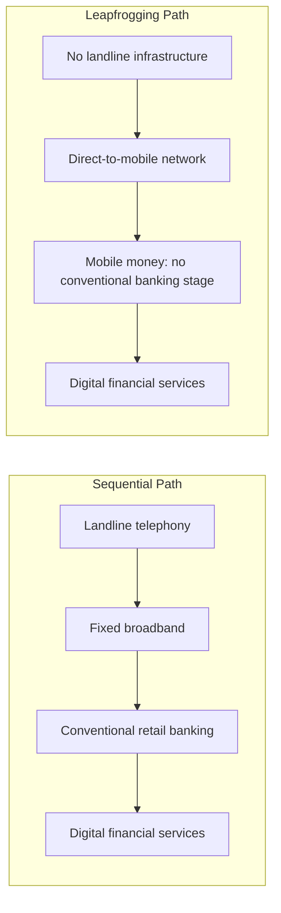
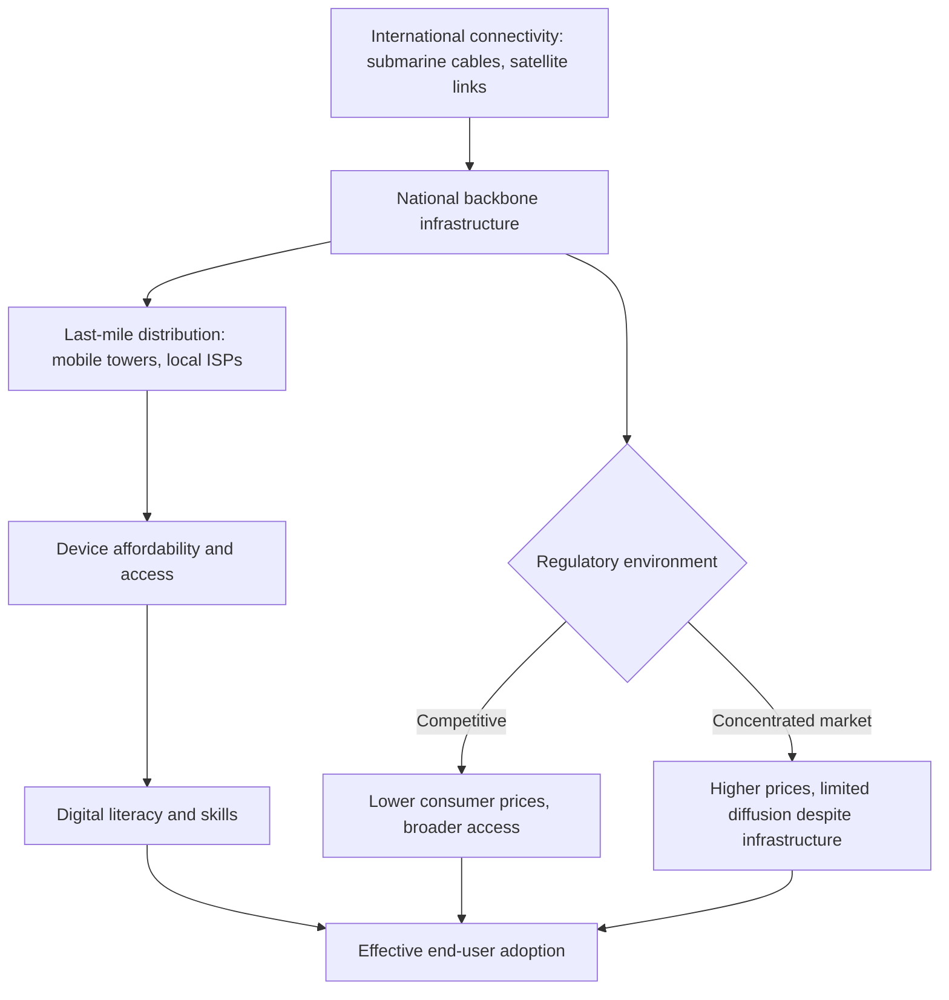

## Digital Technology and Leapfrogging

### Overview

"Leapfrogging" refers to the hypothesis that developing economies can skip intermediate stages of technological and industrial development that industrialized countries historically passed through sequentially, moving directly to newer, more advanced systems rather than replicating the historical development path of early industrializers. The canonical and most empirically documented example is mobile telephony: many developing countries never built extensive fixed-line telephone infrastructure, moving directly to mobile networks, and subsequently to mobile-money-based financial services without first developing conventional retail banking infrastructure at scale. The concept has since been extended to renewable/decentralized energy (skipping centralized grid-based fossil fuel infrastructure), digital financial services, and — most recently — artificial intelligence, which some analysts frame as the next frontier of leapfrogging opportunity.

### Theoretical Foundations

**Definition and Distinguishing Features**

Leapfrogging is generally defined as a country's or firm's ability to skip intermediate stages of technological development and move directly to more advanced systems, rather than following the sequential historical pathway taken by early industrializers. This is conceptually distinct from ordinary technology adoption or catch-up growth: leapfrogging implies *skipping* a stage entirely (e.g., never building extensive copper landline infrastructure) rather than simply adopting existing technology faster than predecessors did.

**Windows of Opportunity**

The technological leapfrogging literature (building on earlier work by Perez and Soete, and more recent syntheses such as UNIDO's leapfrogging framework) identifies several conditions under which latecomer economies gain a genuine opportunity to leapfrog rather than merely lag:

1. **Emergence of new techno-economic paradigms**: a fundamentally new technology (e.g., mobile networks, distributed renewable energy, foundation AI models) creates a discontinuity where prior infrastructure investment by incumbents becomes less relevant, reducing the first-mover advantage that would otherwise favor early industrializers.
2. **Changes in demand conditions**: shifts in what consumers or firms need (e.g., demand for financial inclusion among the previously unbanked) can be more directly served by a new technology than by extending an older paradigm.
3. **Institutional windows**: opportunities created by asymmetric regulation, industrial policy choices, or the absence of legacy institutional/regulatory frameworks that might otherwise constrain adoption of the newer paradigm (e.g., the relative regulatory freedom enjoyed by early mobile money providers, unconstrained by legacy banking regulation).

**Necessary Preconditions**

Leapfrogging is not automatic or guaranteed by the mere existence of a new technology; the literature consistently emphasizes that realizing leapfrogging benefits depends on a country's industrial policy, digital literacy, skill and education levels, domestic market size, and position in global value chains (GVCs). Put differently, leapfrogging describes an *opportunity structure*, not a deterministic outcome — countries can fail to leapfrog even when the technological window is objectively open, if complementary institutional and human-capital conditions are absent.

### Diagram: Sequential Development vs. Leapfrogging Pathway

### Canonical Empirical Case: Mobile Telephony and Mobile Money

The mobile telephony case is the most extensively documented instance of digital leapfrogging in the development economics literature. Many low- and middle-income countries, facing high fixed costs of landline network buildout across dispersed or low-density populations, moved directly to mobile network infrastructure, achieving telephony penetration rates that would have taken far longer to reach via fixed-line expansion. This was subsequently followed by mobile-money platforms (with Kenya's M-Pesa as the most widely cited example), which extended basic financial services — payments, savings, remittances — to populations that had never held a conventional bank account, effectively bypassing the retail-branch-banking stage of financial-sector development that preceded electronic banking in high-income countries.

**Why This Case Is Considered a Genuine Leapfrog (Not Just Fast Adoption)**

- The intermediate technology (extensive landline networks, branch-based retail banking) was not merely adopted late — it was substantially skipped, with mobile-first infrastructure serving as the primary/only channel for large segments of the population.
- The skip was enabled by both a technological discontinuity (cellular networks not requiring physical wireline infrastructure to each household) and an institutional window (in several cases, mobile money was initially regulated more permissively as a telecommunications rather than banking product, easing market entry).

### The Digital Infrastructure Diffusion Perspective

More recent analysis (e.g., WIPO's *World Intellectual Property Report 2026*) frames digital technology diffusion as occurring through a multi-stage pipeline — from "first-mile" international infrastructure (submarine communications cables) through to "end-user fingertips" (device access and affordability) — emphasizing that leapfrogging at the level of a single technology (e.g., skipping landlines for mobile) does not eliminate the need for underlying physical and institutional infrastructure investment; it merely changes *which* infrastructure must be built. Bandwidth delivered through submarine cables, for instance, can reduce broadband costs, but only where accompanying regulatory competition prevents market concentration and high consumer prices — a reminder that "leapfrogging" a stage of technology does not leapfrog the need for good sector regulation, competition policy, and complementary investment.

### Diagram: Digital Diffusion Pipeline (First-Mile to End-User)

### Extending the Concept: Energy, Finance, and AI

**Decentralized Renewable Energy**

Leapfrogging arguments have been extended to energy infrastructure: rather than building centralized, fossil-fuel-based national grids (the historical pathway of industrialized economies), some analyses of African energy development highlight the potential for decentralized renewable energy systems (off-grid and mini-grid solar, in particular) to extend electricity access to dispersed rural populations without first requiring extensive centralized grid buildout — echoing the mobile-over-landline logic.

**Financial Innovation and Informal-Sector Formalization**

Beyond mobile money itself, digitization combined with expanded electricity and internet access is argued to enable more rapid formalization of the informal sector, which can increase government revenue collection and unlock financing channels not previously accessible to informal firms and workers — a mechanism through which digital leapfrogging is linked to broader fiscal and financial-development outcomes, not solely to consumer-facing service access.

**Quantitative Scenario Modeling (Illustrative Example: Africa)**

Long-run scenario-modeling exercises (e.g., the International Futures-based work from the Institute for Security Studies' African Futures programme) have attempted to quantify the macroeconomic impact of a combined "leapfrogging and large infrastructure" policy scenario — modeling the effect of decentralized renewable energy, AI, financial innovation, expanded internet, and household electricity access together with traditional infrastructure investment (roads, ports, railways, airports). One such projection estimated that this combined scenario could improve Africa's average GDP growth rate from 2023 to 2043 by 0.24 percentage points, resulting in an African economy roughly $602 billion larger by 2043 than under a current-path forecast, alongside projected reductions in extreme poverty. [Unverified: these are model-based scenario projections from a specific forecasting exercise (International Futures/IFs) rather than empirically estimated causal effects; the magnitude and even the sign of such projections are sensitive to the underlying model's structural assumptions, and should be treated as illustrative of the scale of claimed potential rather than a precise, causally identified forecast.]

**Artificial Intelligence as the "Next Frontier"**

Some recent analyses explicitly frame AI as the next domain of potential digital leapfrogging, building on expanding mobile/internet connectivity to potentially transform sectors such as agriculture, health, and public administration without requiring the intermediate stages of technological infrastructure that preceded AI adoption in high-income economies (directly connecting to the "Development Economics and Artificial Intelligence" topic covered elsewhere in this chapter, particularly the World Bank's "adopt, adapt, advance" framework). As with earlier leapfrogging waves, this potential is explicitly described as conditional on enabling infrastructure, skills, financing, and regulatory frameworks, which the same sources note remain uneven across countries — the necessary-precondition caveat recurs across every extension of the leapfrogging concept.

### Critical Perspectives and Limits of the Leapfrogging Thesis

**1. Leapfrogging Is Not Automatic or Universal**

A recurring finding across country-level case studies is caution against overstating leapfrogging's inevitability: assessments of Rwanda's ICT-enabled development strategy, for example, have concluded that it remains too early to judge whether long-term growth and development can be achieved through technological leapfrogging alone, since most developing countries are still in the early stages of diversifying away from natural-resource-dependent and subsistence-agriculture economic structures. [Inference: this reflects a broader pattern in the leapfrogging literature — enthusiasm about the *possibility* of leapfrogging is common, but rigorous long-run causal evidence that leapfrogging strategies produce sustained, structurally transformative growth (as opposed to isolated sectoral gains, e.g., in mobile payments specifically) remains comparatively limited, and claims should be evaluated with this evidentiary gap in mind.]

**2. Complementary Capabilities Determine Realized Benefits**

Cross-country comparative work (e.g., the "African Leapfrog Index" benchmarking exercise) finds substantial variation even among countries with comparable mobile/digital technology uptake in their ability to translate that uptake into development outcomes such as platform-enabled jobs, institutional strengthening, and inclusive growth — indicating that digital technology uptake alone is an insufficient condition for realizing leapfrogging's promised development benefits, and that institutional drivers and skills conditions are the binding constraint in many cases, not technology access per se.

**3. Persistent Infrastructure Financing Gaps**

Even for the most-cited leapfrogging success (mobile networks), scaling universal access requires substantial continued investment — one estimate cited in the CIO/Chakravorti research places the cost of doubling Africa's broadband connectivity ratio and the cost of bringing the entire continent online at many tens of billions of dollars, underscoring that leapfrogging a technological stage does not eliminate the capital-intensity of building the technology that is being leapfrogged *to*.

**4. Leapfrogging May Not Address Manufacturing and Structural Transformation**

Empirical work examining leapfrogging's relationship to manufacturing value-added in Sub-Saharan Africa (1990–2018) has generally found that technological leapfrogging alone does not straightforwardly translate into the kind of manufacturing-sector structural transformation historically associated with poverty reduction and sustained growth in earlier industrializers (e.g., East Asian economies), suggesting leapfrogging in digital/services domains may not substitute for, and could in some accounts even bypass, the manufacturing-based development pathway emphasized in classical structural transformation theory. [Inference: this is a genuinely contested empirical question — some scholars view services-and-digital-led growth as a viable alternative development pathway for the 21st century, while others maintain that manufacturing-led structural transformation remains difficult to substitute for; this debate connects to broader unresolved discussions in growth and structural-transformation economics beyond the scope of leapfrogging specifically.]

**5. Winner-Take-Most Dynamics in Global Digital Value Chains**

Even as domestic adoption of a leapfrogged technology occurs, the technology itself (e.g., mobile network equipment, smartphone hardware, foundation AI models) is frequently produced and controlled by firms based in a small number of advanced economies, raising questions about whether leapfrogging in *consumption/use* of digital technology translates into leapfrogging in *production capability and value capture* — a distinction increasingly emphasized in discussions of AI specifically, where a handful of countries and firms possess the resources to advance the technological frontier, while most developing economies remain positioned primarily as adopters and adapters rather than producers.

### Comparative Summary: Leapfrogging Domains

| Domain | Skipped Stage | Enabling Technology | Evidentiary Strength | Key Caveat |
| --- | --- | --- | --- | --- |
| Telephony | Extensive landline networks | Cellular/mobile networks | Strong — widely documented, large-scale | Requires continued tower/spectrum infrastructure investment |
| Financial services | Branch-based retail banking | Mobile money platforms | Strong for access/inclusion metrics | Value-added/growth effects less conclusively established |
| Energy | Centralized fossil-fuel grid | Decentralized/renewable mini-grids | Moderate — technically feasible, scaling uneven | High upfront capital cost; grid-integration challenges remain |
| Manufacturing/structural transformation | Labor-intensive manufacturing-led growth | Digital services-led growth | Weak/contested | Historical growth literature emphasizes manufacturing's distinct role |
| Artificial intelligence | Legacy IT/enterprise software infrastructure | Foundation models via cloud/low-code platforms | Emerging — largely prospective as of 2026 | Adaptation, data, and skills gaps remain substantial constraints |

### Related Topics

- Development economics and artificial intelligence
- Mobile money and financial inclusion (e.g., M-Pesa)
- Structural transformation and manufacturing-led growth
- Infrastructure investment and public-private partnerships in development
- Technology diffusion theory and general-purpose technologies
- Digital divide and connectivity infrastructure gaps
- Industrial policy for latecomer economies
- Decentralized renewable energy and off-grid electrification