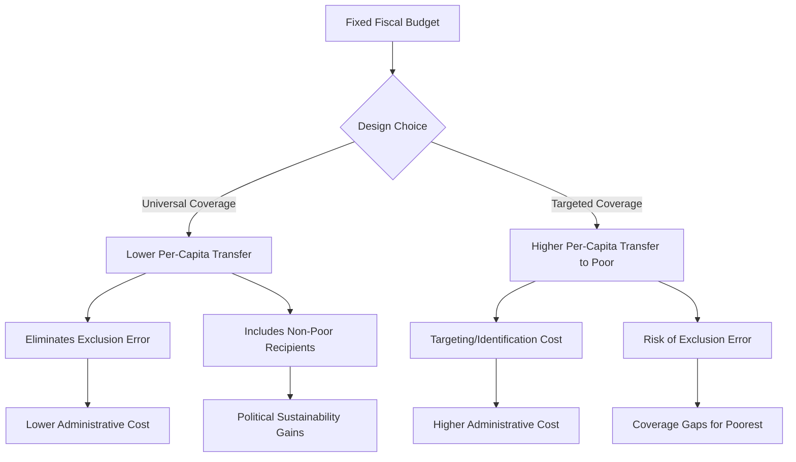

## Universal Basic Income Debates in Developing Contexts

### Overview

Universal Basic Income (UBI) — an unconditional, regular cash transfer paid to all individuals regardless of means or work status — has become one of the most actively contested policy proposals in development economics over the past decade. Debates in developing-country contexts differ substantially from high-income-country UBI debates (which center on automation and labor displacement) because they engage directly with existing social protection architecture, fiscal capacity constraints, informality, and the extensive RCT evidence base on targeted and conditional cash transfers.

### Defining UBI and Distinguishing It From Related Instruments

**Key Points**

- Canonical UBI, per the definitional criteria used by the Basic Income Earth Network (BIEN) and most academic treatments, requires four features: **universal** (all residents/citizens, not means-tested), **unconditional** (no behavioral requirements), **individual** (paid to persons, not households), and **regular/periodic** (recurring payment, not one-off).
- This distinguishes UBI from adjacent instruments frequently discussed alongside it:
  - **Conditional Cash Transfers (CCTs)** — e.g., Mexico's Prospera/Oportunidades, Brazil's Bolsa Família — require behavioral conditions (school attendance, health check-ups) and are typically targeted to poor households, not universal.
  - **Unconditional Cash Transfers (UCTs)** — no behavioral conditions, but usually targeted (means-tested or geographically/categorically targeted) rather than universal — e.g., GiveDirectly's standard programming.
  - **Universal Basic Services (UBS)** — the "in-kind" counterpart proposal, providing free universal access to specific services (healthcare, education, transport) rather than cash.
  - **Negative Income Tax (NIT)** — economically similar to UBI in guaranteeing a floor income, but implemented via the tax system with a phase-out as earned income rises, rather than a flat universal payment to all regardless of income.
- Much of what is empirically tested in developing-country pilots (e.g., GiveDirectly's Kenya "Basic Income" study) is more precisely a **universal, unconditional, long-duration cash transfer at village level** rather than a national UBI — an important distinction for interpreting evidence, since pilot-level general equilibrium effects (price effects, migration effects) may differ from national-scale implementation.

### The Core Economic Arguments For UBI in Developing Contexts

**Key Points**

- **Targeting failure reduction**: means-tested and conditional programs suffer from both **exclusion errors** (eligible poor households not reached, due to identification/documentation failures) and **inclusion errors** (non-poor households receiving benefits) — universality mechanically eliminates exclusion error, since eligibility determination is removed as a failure point. This is weighed against the fiscal cost of extending transfers to non-poor recipients who don't need them.
- **Administrative simplicity and reduced corruption/leakage**: removing means-testing and conditionality reduces the discretionary points at which local officials can extract rents or misallocate benefits, a documented concern in some conditional/targeted program implementations in weak-administrative-capacity settings.
- **Reduced stigma and behavioral distortion**: unconditional transfers avoid the paternalism embedded in conditionality (e.g., school-attendance conditions assuming poor parents wouldn't otherwise send children to school) and avoid the labor-supply distortions associated with means-tested benefit withdrawal (the "welfare cliff" / high effective marginal tax rate problem, where benefit phase-out as earned income rises creates a disincentive to increase market work).
- **Response to informality**: because most developing-country labor markets have large informal sectors, conditioning transfers on formal employment status (as in some high-income unemployment-insurance-style systems) is largely infeasible; universality sidesteps this administrative constraint entirely.
- **Precursor to automation-driven displacement**: [Speculation, more relevant to a subset of the literature] some proponents argue developing countries should build UBI-adjacent infrastructure now in anticipation of automation affecting manufacturing-based development pathways, though this argument is more prominent in the high-income-country UBI literature and its direct empirical relevance to current developing-country labor markets remains contested.

### The Core Economic Arguments Against UBI in Developing Contexts

**Key Points**

- **Fiscal cost and the targeting-efficiency trade-off**: universality means the transfer must reach both poor and non-poor residents, which for a fixed budget either requires a much smaller per-person transfer (diluting poverty-reduction impact per poor recipient) or a much larger total fiscal outlay than an equivalently poverty-reducing targeted program. This is the central quantitative critique, often expressed via the **"iron triangle" of cash transfer design**: at a fixed budget, policymakers must trade off between **coverage** (universal vs. targeted), **transfer size** (adequate vs. thin), and **fiscal sustainability**.
- **Opportunity cost relative to public goods/services provision**: a substantial share of the debate centers on whether the same fiscal envelope produces greater welfare gains as cash (UBI) or as in-kind universal services (healthcare, education infrastructure) — particularly salient in contexts with large healthcare/education access gaps where market failures (information asymmetry, positive externalities of health/education) may argue for in-kind provision over cash on standard public-economics grounds.
- **Tax capacity constraints**: financing a fiscally meaningful UBI in low-revenue-mobilization developing economies (many with tax-to-GDP ratios well below OECD averages) is a binding constraint largely absent from high-income-country UBI debates, where existing welfare-state spending can more plausibly be restructured toward UBI without large net new revenue mobilization.
- **Inflation and general equilibrium price effects**: if local goods/labor markets have limited supply elasticity, large-scale unconditional transfers risk price inflation that erodes real transfer value, particularly for tradables-constrained rural markets — an empirical question the evidence base below speaks to directly.

### Evidence Base: Notable Studies and Pilots

**Key Points**

- **GiveDirectly Kenya "General Equilibrium" / Long-Term Basic Income study**: a large-scale RCT providing village-level universal unconditional transfers over an extended multi-year horizon (one of the longest-duration, largest-scale rigorous UBI-adjacent evaluations to date), explicitly designed to detect general-equilibrium effects (local price inflation, spillovers to non-recipient neighboring villages) that shorter/smaller pilots cannot capture.
- [Unverified — specific point estimates should be checked against the latest published results rather than assumed] Early results reported from this and related GiveDirectly evaluations have generally shown limited local inflationary effects and documented increases in recipient consumption, assets, and enterprise activity, though researchers have emphasized that results should be interpreted specifically as evidence about **long-duration, universal, village-level** transfers rather than generalized to all UBI designs.
- **Namibia's Otjivero-Omitara Basic Income Grant pilot** (2008–2009) and **India's Madhya Pradesh unconditional cash transfer pilot** (SEWA-linked, studied by Davala, Jhabvala, Standing, and Mehta) are earlier, smaller-scale universal/unconditional pilots frequently cited in the qualitative and early quantitative literature, generally reporting improvements in nutrition, school attendance, and small enterprise activity, though these studies are smaller in scale and shorter in duration than the more recent GiveDirectly work and are treated with more caution methodologically in current literature reviews.
- **Meta-analyses and systematic reviews of unconditional cash transfers** (not always at UBI-scale universality, but relevant for extrapolating expected UBI effects) generally find limited support for common critiques that unconditional transfers induce reduced labor supply or increased spending on temptation goods (alcohol, tobacco) — a recurring empirical finding across many contexts in the broader UCT/CCT literature that is frequently invoked in UBI debates to counter a priori behavioral-distortion objections, though effect sizes and confidence intervals vary by study and this should not be read as ruling out any labor-supply response in every context.

### Comparative Instrument Table

| Instrument | Targeting | Conditionality | Key Developing-Country Example |
| --- | --- | --- | --- |
| UBI (canonical) | Universal | None | GiveDirectly Kenya (village-level pilot) |
| CCT | Targeted (means/geography) | Behavioral (school, health) | Bolsa Família (Brazil), Prospera (Mexico) |
| UCT (targeted) | Targeted | None | GiveDirectly standard programs |
| Universal Basic Services | Universal | N/A (in-kind) | Various universal healthcare/education systems |
| Social pension | Categorical (age-based, often universal within category) | None | South Africa Old Age Pension |

### Design Trade-off Diagram

### Political Economy Dimensions

**Key Points**

- **Political sustainability argument**: some political economists argue universal programs (like UBI) generate broader political constituencies and are therefore more durable across electoral cycles than narrowly targeted programs, drawing on the general "targeting vs. universalism" literature in social policy (paralleling arguments made about universal vs. means-tested welfare-state design in high-income countries).
- **Financing mechanism debates**: proposals differ substantially on financing — resource-revenue-funded UBI (e.g., proposals linked to natural resource dividends, drawing on the Alaska Permanent Fund model as a reference case), donor-funded pilots (as with GiveDirectly), versus domestic general-taxation-funded UBI, each carrying different fiscal-sustainability and political-economy implications.
- **Interaction with existing subsidy systems**: several UBI-adjacent policy discussions in developing countries (India's economic-survey UBI discussion is a frequently cited example) have centered on **replacing existing regressive universal subsidies** (e.g., untargeted fuel or food subsidies that disproportionately benefit higher-consumption, often non-poor households) with a cash UBI, framing UBI as a targeting-efficiency improvement over the specific existing instrument being replaced, rather than as a comparison to an idealized perfectly-targeted program.

### Open Empirical and Design Questions

**Key Points**

- Whether general-equilibrium effects (local price inflation, labor market wage effects, migration responses) observed in village-level pilots would hold, amplify, or attenuate at true national scale remains a central unresolved question, since pilot studies — even large ones — cannot fully capture economy-wide price and wage adjustments that a nationally-financed universal program would induce.
- The optimal transfer duration and permanence (time-limited pilot vs. genuinely permanent commitment) affects behavioral response, since a household's consumption-smoothing and investment response to a known-temporary transfer plausibly differs from its response to a credible permanent income floor — a distinction the literature increasingly emphasizes when interpreting pilot results.
- [Inference] The debate is likely to remain empirically unresolved at the "true UBI" (universal, permanent, national-scale) level for the foreseeable future, since no developing country has yet implemented a canonical national-scale UBI meeting all four BIEN criteria, meaning current evidence is necessarily extrapolated from smaller-scale or non-universal analogues.

**Related Topics**

- Conditional vs. unconditional cash transfer design and evidence
- Targeting methods and exclusion/inclusion error trade-offs
- Fiscal capacity and tax-to-GDP constraints in developing economies
- General equilibrium effects of large-scale cash transfer programs
- Universal Basic Services as a policy alternative
- Social protection system design in high-informality economies
- Resource-revenue-funded social dividends (Alaska Permanent Fund model)
- Negative income tax mechanics and comparison to UBI