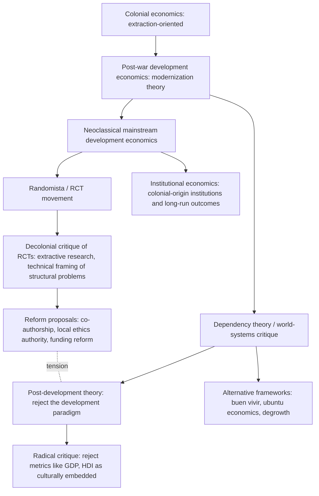

## Decolonizing Development Economics

### Overview

"Decolonizing development economics" refers to a set of critiques and proposed reforms targeting the discipline's historical origins, methodological defaults, institutional power structures, and knowledge-production hierarchies, on the grounds that these retain the intellectual and material legacies of colonialism even in a nominally post-colonial era. It is not a single unified theory but an umbrella term spanning critiques from post-development theory, dependency theory, postcolonial studies, feminist economics, and internal methodological critiques within mainstream development economics itself. [Inference] Because the term is used differently across these traditions, any single definition necessarily simplifies an actively contested debate; this section maps the major strands rather than treating "decolonization" as a settled doctrine.

### Historical and Intellectual Origins

**Colonial Roots of the Discipline**

Development economics as an institutionalized field emerged largely in the mid-20th century, coinciding with decolonization movements across Asia and Africa. Critics argue the field inherited assumptions from its colonial-era predecessor, "colonial economics," which was oriented toward extracting resources and managing colonized populations for the benefit of metropolitan powers.

- **Modernization theory critique**: Post-war development economics (e.g., Rostow's stages-of-growth model) framed "developing" countries as needing to replicate a Western trajectory toward industrial capitalism, implicitly positioning Western Europe and North America as the normative endpoint of development. Critics label this a "civilizational" framing inherited from colonial ideology.
- **Dependency theory response**: Emerging from Latin American structuralist economists (notably associated with the Economic Commission for Latin America, ECLA/CEPAL) in the 1950s–60s, dependency theory argued that "underdevelopment" in the periphery was not a stage prior to development but was actively produced by, and structurally linked to, the enrichment of "core" economies — a direct challenge to the idea that poor countries simply lag behind on a universal path.
- **World-systems theory**: extended dependency theory into a broader framework analyzing global capitalism as a single interconnected system with core, periphery, and semi-periphery zones, reinforcing the idea that underdevelopment is relational, not an intrinsic national characteristic.

### Core Critiques

**1. Epistemic Hierarchy and Knowledge Production**

- **Where knowledge is produced and validated**: critics point out that top development economics journals, PhD programs, and funding bodies are disproportionately located in the US and Europe, meaning theoretical frameworks, "best practices," and evaluation standards are set predominantly by institutions geographically and historically distant from the populations being studied.
- **Citation and authorship patterns**: [Inference] a recurring empirical critique in this literature is that publications about developing countries are frequently authored primarily or solely by researchers based in high-income countries, with local researchers relegated to data-collection or field-coordination roles rather than credited as intellectual contributors; the exact magnitude of this pattern varies by journal and time period and would require citing a specific bibliometric study to quantify precisely.
- **"Parachute" or "extractive" research**: a specific critique (also discussed under research ethics) where foreign researchers collect data, publish, and build careers using local populations' information and time, without meaningful reciprocal benefit, capacity-building, or co-authorship for local scholars and institutions.

**2. Methodological Critiques**

- **Universalizing assumptions in economic models**: standard neoclassical assumptions (rational utility maximization, well-defined property rights, formal market structures) are argued to reflect institutional configurations more typical of industrialized economies and imported wholesale onto contexts with different kinship structures, informal institutions, communal land tenure, or non-market forms of exchange and reciprocity.
- **The RCT/randomista critique**: the rise of randomized controlled trials in development economics (associated with the "randomista" movement, credited substantially to work later recognized by the 2019 Nobel Memorial Prize in Economic Sciences to Abhijit Banerjee, Esther Duflo, and Michael Kremer) has itself been criticized on decolonial grounds:
  - Framing poverty as a technical/behavioral problem solvable through discrete interventions ("nudges," information campaigns, small design tweaks) rather than engaging with structural causes — colonial history, global trade rules, debt architecture, extraction of resources by multinational corporations.
  - Treating study populations as experimental subjects for testing solutions designed largely in Northern research institutions, echoing colonial-era practices of experimentation on colonized populations.
  - [Inference] Proponents of experimental methods have responded that RCTs can be, and increasingly are, co-designed with local governments, NGOs, and researchers, and that rigorous causal identification is itself a tool that can serve local priorities rather than displace them; this is a genuinely contested methodological and political debate rather than a settled matter.

**3. Institutional and Governance Critiques**

- **Conditionality and policy prescription**: the historical role of the International Monetary Fund (IMF) and World Bank in attaching policy conditions (structural adjustment programs, trade liberalization, privatization) to loans for low-income countries is frequently cited as a continuation of colonial-style external control over domestic economic policy, sometimes termed "neocolonialism."
- **Voting power and governance structure**: the IMF and World Bank's weighted-voting governance structures allocate disproportionate influence to wealthy shareholder countries, a structural critique distinct from, but related to, critiques of specific policy content.
- **Debt architecture**: critics link colonial-era extraction to contemporary sovereign debt burdens, arguing that debt structures, credit rating agency practices, and currency hierarchies (dependence on the US dollar or other reserve currencies) perpetuate asymmetric bargaining power inherited from colonial trade relationships.

**4. Measurement and Categorization Critiques**

- **GDP and national accounts**: critics argue that GDP-centric measures of "development," originally designed within industrialized-economy contexts, undervalue informal economies, subsistence production, unpaid care work, and communal resource systems common in many post-colonial economies.
- **The "developed/developing" binary itself**: the terminology of "First World/Third World," "developed/developing," or "advanced/emerging" economies is criticized as inherently hierarchical, encoding a single linear scale with wealthy, historically colonizing nations at the top.
- **Human Development Index and alternative metrics**: while the HDI (incorporating health and education alongside income) was itself partly a response to GDP-centric critiques, some scholars argue it still embeds culturally specific notions of "capability" and progress.

### Proposed Reforms and Alternative Frameworks

**Institutional Reforms**

| Proposed reform | Target critique addressed |
| --- | --- |
| Mandatory local co-authorship / co-investigator requirements | Epistemic hierarchy, parachute research |
| Local ethics review with substantive (not just procedural) authority | Research ethics, extractive data practices |
| Diversifying editorial boards and hiring committees at major journals/institutions | Epistemic hierarchy in knowledge validation |
| Funding directed to Southern-based research institutions rather than routed through Northern intermediaries | Institutional resource concentration |
| Reforming IMF/World Bank voting-share structures | Governance asymmetry |

**Alternative Theoretical and Policy Frameworks**

- **Post-development theory**: a more radical strand (associated with scholars such as Arturo Escobar) arguing that "development" itself is a discursive construct invented by Western powers post-WWII to justify continued intervention in formerly colonized regions, and that the goal should not be reforming development practice but rejecting the development paradigm altogether in favor of pluralistic, locally rooted visions of well-being.
- **Buen vivir / Sumak Kawsay**: an alternative development philosophy drawn from Andean indigenous cosmologies (incorporated into Ecuador's and Bolivia's constitutions in the 2000s), emphasizing harmony with nature and community well-being over GDP growth, cited as an example of a non-Western development paradigm.
- **Ubuntu-influenced economic thought**: African philosophical traditions emphasizing communal interdependence ("I am because we are") have been invoked as a basis for alternative economic ethics distinct from individualist utility-maximization frameworks.
- **Feminist and intersectional critiques**: feminist economists have separately argued that mainstream development economics undervalues unpaid care work and reproduces gendered colonial hierarchies alongside racial and national ones, intersecting with but analytically distinct from decolonial critique.
- **Degrowth and ecological economics**: some decolonial scholars connect critique of GDP-growth-centric development to ecological critiques, arguing that the growth imperative itself, historically tied to colonial resource extraction, is incompatible with ecological limits and with justice for formerly colonized regions bearing disproportionate climate impacts.

### Relationship to Mainstream Development Economics

**Points of Convergence**

- Some critiques have been substantially absorbed into mainstream practice: greater attention to context-specific institutions, increased (though [Inference] still debated in extent) local research partnerships, pre-registration and ethics review reforms partly motivated by extractive-research concerns, and growing scholarship on colonial-era institutional persistence (e.g., work on how historical colonial institutions shape present-day economic outcomes, associated with researchers such as Daron Acemoglu, Simon Johnson, and James Robinson).
- Institutions such as J-PAL and IPA have publicly stated commitments to local capacity-building and partnership models, [Inference] though the degree to which stated commitments translate into structural changes in authorship, funding allocation, and research agenda-setting is itself an object of ongoing debate rather than a settled outcome.

**Points of Persistent Tension**

- Mainstream development economics generally retains core neoclassical tools (optimization, general equilibrium, econometric causal inference) and treats decolonial critique as informing *how* these tools are applied (better context-sensitivity, more local partnership) rather than requiring their wholesale replacement.
- Post-development and more radical decolonial scholars argue this represents cosmetic accommodation rather than genuine epistemic transformation, since the underlying disciplinary authority to define "development" and validate "rigorous" knowledge remains concentrated in the same institutions.
- [Speculation] Whether these tensions converge toward a synthesized methodological consensus or remain a persistent parallel critique is not something that can be forecast with confidence; it depends on institutional, political, and academic-labor-market dynamics that are inherently uncertain.

### Conceptual Map

### Illustrative Debates and Examples

**GDP versus Alternative Well-Being Metrics**

Bhutan's Gross National Happiness index and Ecuador's constitutional incorporation of buen vivir are commonly cited as concrete institutional examples of countries attempting to formally displace GDP-centric development metrics, though critics note the practical policy influence of such alternative metrics varies and is contested even within the countries that have adopted them.

**Debates Over Foreign Aid Architecture**

Critics of conventional foreign aid architecture argue that aid conditionality and donor-driven priority-setting reproduce colonial-style dependency, while defenders argue that well-designed aid, particularly when channeled through recipient-government budgets or recipient-led initiatives (as opposed to donor-controlled projects), can support genuine local agenda-setting; this remains an active empirical and normative debate rather than a resolved question.

**Historical Institutional Persistence Research**

Empirical economic history research on how colonial-era institutions (e.g., extractive versus settler-colonial institutional types, colonial land tenure systems, or the "reversal of fortune" in relative prosperity between historically rich and poor regions after colonization) causally shaped present-day economic outcomes has been influential within mainstream economics, though decolonial critics note this research is still conducted predominantly using frameworks, journals, and career incentives centered in the same Northern institutions being critiqued.

**Related Topics**

- Dependency theory and world-systems analysis
- Post-development theory (Arturo Escobar and related scholarship)
- Colonial institutions and long-run economic outcomes (institutional economics)
- Ethics of field experiments and "parachute research" in development studies
- Feminist economics and unpaid care work in development measurement
- Alternative development paradigms: buen vivir, ubuntu economics, degrowth
- IMF/World Bank governance structure and structural adjustment history
- GDP critique and alternative well-being indices (HDI, Gross National Happiness)
- Local ownership and co-production models in international development research
- Debt architecture, currency hierarchy, and sovereign debt justice debates