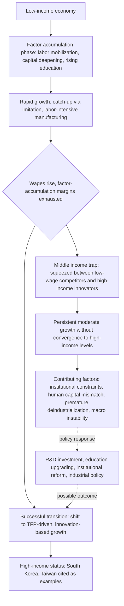

## Middle Income Trap

### Overview

The middle income trap (MIT) describes a pattern in which economies that reach middle-income status experience a marked slowdown in growth, becoming unable to transition further into high-income status. The term was coined in a 2007 World Bank report on East Asia, and has since become a central framework in development economics for analyzing why growth convergence toward high-income levels is not automatic or guaranteed, contrary to simple neoclassical convergence predictions.

### Defining the Concept

**Core Definition**

An economy is generally considered to be in a middle income trap when:

- It has grown out of low-income status (typically defined via World Bank income classifications based on Gross National Income, GNI, per capita).
- Growth subsequently decelerates significantly, well before per capita income converges toward high-income-country levels.
- The economy becomes "squeezed" between low-wage competitors (who can still compete on cheap labor-intensive manufacturing) and high-income, high-innovation economies (who compete on technological frontier products and services).

**Measurement Approaches**

There is no single official definition, and studies vary in operationalization. Common approaches include:

- **Relative income thresholds**: identifying "trap" status by a country remaining within a specific band of per capita income relative to the US or to the global income frontier for an extended period (e.g., multiple decades).
- **Growth deceleration analysis**: examining discrete slowdowns in growth rates as income per capita crosses certain thresholds, following work associated with Barry Eichengreen and coauthors on "growth slowdowns" in fast-growing Asian economies.
- **Absolute income-band definitions**: classifying countries as "trapped" if they remain within World Bank-defined middle-income bands (lower-middle and upper-middle income) for an unusually long duration without transitioning to high-income status.

[Inference] Because these definitions differ methodologically, the list of countries classified as "in" or "at risk of" a middle income trap varies meaningfully across studies, and the concept's empirical robustness (as opposed to its intuitive narrative appeal) has itself been debated in the literature.

### Theoretical Mechanisms

**1. Factor Accumulation Exhaustion**

Early-stage growth in developing economies is often driven substantially by factor accumulation: mobilizing underemployed rural labor into higher-productivity manufacturing (a process associated with the Lewis dual-economy model), rapid capital accumulation, and rising educational attainment. As these margins are exhausted — rural labor surplus depleted, capital-to-labor ratios rising, education levels approaching a ceiling relative to the existing economic structure — continued growth requires a shift toward total factor productivity (TFP) growth, which is harder to generate and sustain.

**2. Wage Competitiveness Squeeze**

As wages rise with rising income, labor-intensive, low-value-added manufacturing become less competitive relative to lower-wage economies. If the economy has not simultaneously developed the innovative capacity, institutions, and skills base needed to move up the value chain into higher-value-added production, it loses competitiveness on both ends: too expensive for the bottom of the value chain, not sophisticated enough for the top.

**3. Institutional Quality Constraints**

A substantial strand of the literature argues that institutions adequate for factor-accumulation-driven growth (e.g., state-directed investment, protection of politically connected firms, weak intellectual property protection facilitating imitation) become binding constraints once innovation-driven growth is required. Innovation-driven growth is argued to require:

- Stronger property rights and intellectual property protection (to incentivize innovation investment).
- More competitive, less politically distorted product and financial markets (to allow efficient capital allocation to productive firms rather than politically connected ones).
- Higher-quality, more autonomous educational and research institutions capable of producing frontier innovation rather than just technology adoption/imitation.

[Inference] This "institutions must evolve with the growth model" argument is influential but contested; alternative accounts place more weight on structural/sectoral factors (below) or macroeconomic and demand-side factors rather than institutional quality per se.

**4. Structural Transformation and Sectoral Composition**

Some scholars (in a tradition associated with Dani Rodrik's work on structural change) argue that MIT dynamics reflect a failure of continued structural transformation: economies that successfully shift labor from agriculture into manufacturing but then experience "premature deindustrialization" — losing manufacturing employment share at lower income levels than historical East Asian or Western developers did — face difficulty sustaining productivity growth, because manufacturing has historically been an unusually strong vehicle for unconditional productivity convergence relative to services.

**5. Human Capital Mismatch**

Even where aggregate education levels rise, the type and quality of education/skills may not match the requirements of higher-value-added production (e.g., emphasis on rote learning and credential attainment over the technical, managerial, and innovative capabilities needed for frontier or near-frontier production).

### Case Studies and Comparative Evidence

**Successful Transitions (Escaped the Trap)**

- **South Korea and Taiwan**: frequently cited as successful transitions from middle- to high-income status within a few decades, associated with sustained investment in education (including higher education and technical training), aggressive industrial policy oriented toward export competitiveness and technological upgrading, and substantial investment in domestic R&D capacity (e.g., the rise of firms such as Samsung and TSMC from initial roles as lower-value-added manufacturers/assemblers into globally competitive innovators).
- [Inference] The precise causal weight of industrial policy versus other factors (macroeconomic stability, education investment, geopolitical circumstances including Cold War-era US support) in these transitions remains debated among economic historians and is not reducible to a single dominant explanation.

**Countries Frequently Cited as Trapped or At Risk**

- **Latin American economies** (e.g., Brazil, Mexico, Argentina) are commonly cited examples, having reached middle-income status decades ago without transitioning to high-income status, often attributed in the literature to combinations of macroeconomic instability (debt crises, inflation episodes), weaker sustained investment in education and innovation relative to East Asian comparators, and continued reliance on commodity exports or import-substitution-oriented industrial structures that did not fully transition to export-oriented upgrading.
- **South Africa** is frequently discussed in this context, with persistent structural unemployment and slow productivity growth cited as contributing factors.
- [Unverified] Claims about which specific countries are "currently" in a middle income trap change with each new growth data release and with which definitional threshold is applied; a current, precise list would require checking the latest World Bank income classifications and recent growth-accounting studies rather than relying on a fixed characterization.

**China as a Contested Case**

China's growth slowdown since roughly the 2010s (from double-digit to more moderate annual GDP growth rates) has generated extensive debate about whether China is entering middle income trap dynamics. Arguments on both sides:

- **Trap-risk arguments**: rising wages eroding low-cost manufacturing competitiveness, demographic aging reducing labor force growth, high corporate and local-government debt levels, and questions about whether state-directed capital allocation can efficiently support innovation-driven growth at China's current income level.
- **Counter-arguments**: China's substantial and sustained investment in R&D, its large and increasingly technologically sophisticated manufacturing base (e.g., in electric vehicles, batteries, renewable energy technology, and telecommunications equipment), and a domestic market large enough to support scale economies in innovation distinct from the smaller economies (South Korea, Taiwan) used as reference points for the "trap" pattern.
- [Speculation] Whether China will ultimately transition to high-income status or exhibit sustained middle income trap dynamics cannot be forecast with confidence based on current evidence; this is an active, unresolved empirical and policy question rather than a settled classification.

### Policy Responses Proposed in the Literature

| Policy area | Rationale |
| --- | --- |
| Investment in higher education and STEM/technical training | Addresses human capital mismatch for innovation-driven growth |
| R&D subsidies and innovation ecosystem development | Directly targets total factor productivity growth needed post-factor-accumulation phase |
| Strengthening property rights and competitive market institutions | Addresses institutional-quality constraints on innovation incentives |
| Industrial policy targeting higher-value-added sectors | Supports continued structural transformation and value-chain upgrading |
| Macroeconomic stability (managing debt, inflation, exchange rate) | Prevents crises that historically interrupted growth trajectories in trapped economies |
| Reducing income inequality and expanding domestic demand | Some accounts link excessive inequality to insufficient domestic market development, constraining firms' incentive to innovate for a broader consumer base |

### Critiques of the Middle Income Trap Framework

**Empirical Robustness Critiques**

- Some economists (including researchers who have examined cross-country growth data systematically) argue that growth slowdowns are not disproportionately concentrated at "middle income" levels specifically, but occur at various income levels for various reasons, and that framing this as a distinct "trap" phenomenon may overstate the specificity of the pattern relative to more general growth volatility.
- The lack of a single agreed-upon definition (noted above) makes it difficult to definitively test whether a genuine discontinuity exists at middle-income levels versus growth deceleration simply being a general feature of long-run convergence dynamics (i.e., growth rates naturally decelerate as economies approach any given comparator's income level, a standard feature of conditional convergence models, not necessarily a distinct "trap").

**Conceptual/Framing Critiques**

- Critics aligned with structuralist and decolonial perspectives on development argue the "trap" framing implicitly treats the historical growth trajectories of a small number of countries (US, Western Europe, and later East Asian economies) as the normative benchmark, without adequately accounting for how global trade rules, historical colonial relationships, and current geopolitical and financial architecture differentially constrain "late developers'" options relative to earlier developers.
- [Inference] This critique connects the middle income trap debate to broader decolonial critiques of development economics discussed elsewhere in this literature, though it is a less central strand of the MIT literature specifically compared to the growth-accounting and institutional-economics strands.

### Conceptual Diagram

**Related Topics**

- Structural transformation and premature deindustrialization
- Total factor productivity growth versus factor accumulation in growth accounting
- Institutional economics and the role of property rights in innovation-driven growth
- Export-oriented industrialization and East Asian development models
- Conditional convergence in cross-country growth models (Solow and endogenous growth frameworks)
- Human capital formation and education quality in middle-income economies
- China's economic transition and structural growth debates
- Decolonizing development economics (framing critiques of normative growth benchmarks)
- Industrial policy design and evaluation in contemporary development economics