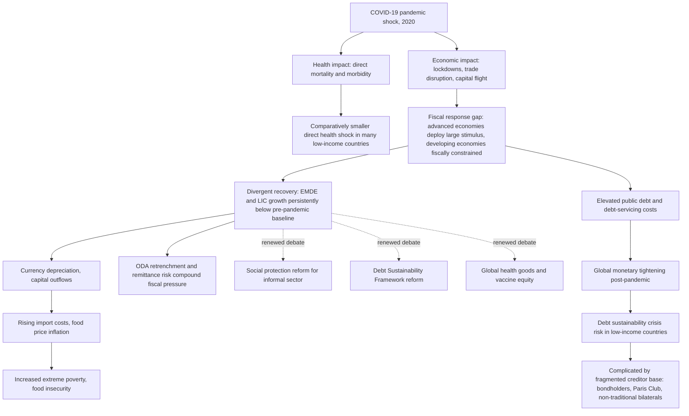

## Development Economics in a Post-Pandemic World

### Overview

The COVID-19 pandemic (2020–2022) produced the deepest global recession since the immediate post-WWII period and generated a divergent, unequal recovery across income levels — a pattern that has become a central organizing theme for contemporary development economics. This section covers the empirical legacy of the pandemic on developing economies, the structural fault lines it exposed or worsened, and the debates over the "new normal" of development policy, financing, and multilateral cooperation that have emerged in its aftermath.

### The Divergent Recovery: Core Empirical Pattern

**Growth and Output Gaps**

Unlike prior global recessions, COVID-19 produced a recovery pattern in which advanced economies regained pre-pandemic output trajectories comparatively faster while developing and low-income economies experienced deeper, more persistent losses. Analysis based on IMF projections found the pandemic recession was the deepest since the end of WWII, with a 3.5% output contraction in 2020, and the consequences were expected to be long-lasting, with world GDP projected to be 3% lower in 2024 relative to a no-COVID scenario — but that figure roughly doubles to 6% for the developing world, despite the pandemic's direct health toll (measured by deaths) having been comparatively more muted in low-income economies. Separate estimates projected African GDP would be permanently 1 to 4 percent lower than in the pre-pandemic outlook, depending on the duration of the crisis.

[Inference] This asymmetry — a smaller direct health shock but a larger and more persistent economic shock in poorer countries — is one of the most cited empirical puzzles motivating post-pandemic development economics research, generally attributed to differences in fiscal response capacity (below) rather than to differences in epidemiological impact.

**Fiscal Capacity Asymmetry**

A defining feature of the pandemic response was the massive difference in fiscal firepower available to different country groups. Contemporary UN analysis noted that countries globally deployed massive resources — estimated at an unprecedented $16 trillion — to prop up their economies, while others were left without strong support to recover, leaving fiscally constrained developing countries facing much poorer prospects for recovery and growth over the coming years and running a risk of a "lost decade." This gap in stimulus capacity — driven by differences in borrowing costs, reserve-currency access, and pre-existing debt levels — is treated in the literature as a central mechanism explaining the divergent recovery, distinct from the pandemic's direct health effects.

**Growth Trajectory Beyond the Immediate Recovery**

The divergence did not fully close in subsequent years. UN reporting on the medium-term trajectory found that the least developed countries were forecast to grow by 4.1 percent in 2023 and 5.2 percent in 2024, far below the 7 percent growth target set in the 2030 Agenda for Sustainable Development, with global trade remaining under pressure from geopolitical tensions, weakening global demand, and tighter monetary and fiscal policy. The same analysis noted that in Africa and Latin America and the Caribbean, GDP per capita was projected to increase only marginally, reinforcing a longer-term trend of stagnating economic performance, as many developing countries faced deteriorating growth prospects amid tightening credit conditions and rising costs of external financing.

### Poverty and Human Development Effects

**Long-Run Poverty Projections**

Modeling work extending poverty projections beyond the immediate crisis period found substantial and persistent effects. Using an integrated assessment framework, one study estimated that relative to a no-pandemic counterfactual, a "COVID Base" scenario increased global extreme poverty by 73.9 million people in 2020, 63.6 million in 2030, and 57.1 million in 2050, with the greatest pandemic-driven increases in poverty occurring in South Asia and sub-Saharan Africa. The same study found that Sustainable Development Goal 1 (ending extreme poverty) would be missed by seven additional countries under the COVID Base scenario relative to a no-COVID counterfactual, rising to seventeen additional countries under the most pessimistic scenario modeled.

**Food Security and Purchasing Power**

Pandemic-era macroeconomic spillovers had significant knock-on effects on food security in low-income countries, operating primarily through income and currency channels rather than physical food availability. Research synthesizing the evidence found that the pandemic amplified pre-existing vulnerabilities in food security across many developing economies, with macroeconomic spillovers — particularly currency depreciation driven by capital outflows and weaker export earnings — raising the local-currency cost of imported staples, and in countries where food inflation was already high, price increases accelerated in 2020–21, often outpacing household income growth. Consistent with this income-channel interpretation, cross-country evidence from a 62-country sample indicated that the main challenge for low-income countries was the affordability of food rather than its availability, with the primary disruption to food security coming through declines in household income and purchasing power following job losses, business closures, and mobility restrictions.

### The Post-Pandemic Sovereign Debt Landscape

**Structural Debt Vulnerabilities**

The interaction between pandemic-era borrowing, subsequent monetary tightening (rising global interest rates), and pre-existing debt vulnerabilities has produced sustained concern about a low-income-country debt crisis extending well past the acute pandemic period. Historical comparison work examining whether current conditions echo the pre-HIPC (Heavily Indebted Poor Countries initiative) era has noted growing concerns that, 25 years after the launch of the HIPC debt relief initiative, many low-income countries are again facing high debt vulnerabilities.

**Fiscal Cost Structure Has Changed, Not Just Debt Levels**

IMF Fiscal Monitor briefings in the mid-2020s emphasized that the character of fiscal risk shifted from concerns about debt stock toward the cost of servicing debt. As described by the IMF's Fiscal Affairs Department at the 2025 Annual Meeting, public debt dynamics have drastically changed in recent years — it's not only the size of debt but also its cost, since the period from the global financial crisis through COVID saw ever-lower interest rates accompany rising debt levels, keeping the interest bill on budgets stable, but the situation is now starkly different, with interest rate increases having raised funding costs and strained budgets; increased interest spending was estimated to rise to 2.9 percent of GDP in 2025 from 2 percent in 2020, continuing to rise through the end of the decade. Notably, the same briefing observed a divergence in the character of the debt problem across country groups: emerging markets and low-income countries face tougher fiscal challenges despite their debt often being below 60 percent of GDP — implying that debt-servicing capacity and market-access conditions, not just headline debt ratios, are the operative constraint for poorer economies, in contrast to G20 economies with debt above 100 percent of GDP that nonetheless retain deep and liquid sovereign bond markets.

**Current Status (2025–2026 IMF Reporting)**

More recent IMF analysis of low-income countries specifically found a generally improving but still fragile growth picture: growth in low-income countries was projected to rise from 4.8 percent in 2025 to 5.3 percent in 2026, though many LICs still face weak per capita income growth, high debt-service burdens, thin reserve buffers, and tighter financing conditions. The same analysis highlighted how shifting policy in major economies is transmitting new shocks: changes in trade, migration, spending priorities, and foreign aid are affecting LICs directly and indirectly; while lower food and energy prices and a weaker dollar have provided some relief, cuts in official development assistance are already weighing on many LICs, and tighter immigration policies could weaken remittance inflows going forward. [Unverified] This reflects IMF reporting as of early-to-mid 2026; given how quickly global fiscal and monetary conditions have been shifting, current figures should be checked against the latest IMF World Economic Outlook or Fiscal Monitor release for the most up-to-date numbers.

**Creditor Composition and Restructuring Complexity**

Post-pandemic debt distress has been complicated relative to earlier debt-relief eras (e.g., HIPC in the 1990s–2000s) by a more diverse and less coordinated creditor base. Recent analysis of low- and lower-middle-income countries found that among countries assessed as at risk of insolvency under the World Bank/IMF debt sustainability framework, obligations to Chinese creditors are the highest of any creditor group relative to GDP — almost 2.5 percent in 2025 — with the magnitude of such obligations still set to remain larger even in 2030 than in almost any other year up to 2024, alongside substantial debt-service obligations owed to Eurobond holders, with market access for new Eurobond issuance remaining highly selective and priced well above historical averages. [Inference] This more fragmented creditor landscape — spanning traditional Paris Club bilateral lenders, private bondholders, and non-traditional bilateral creditors — is widely cited as a key reason debt restructuring negotiations have been slower and more complex than in prior debt-crisis eras, though the degree to which this specific factor, versus others such as differing national legal frameworks or negotiating incentives, is the dominant bottleneck varies by case and is actively debated.

**Reform of the Debt Sustainability Framework**

The post-pandemic period has intensified pre-existing debates over reforming the Debt Sustainability Framework (DSF) that governs how the IMF and World Bank assess low-income-country debt sustainability. Ongoing review work — expected to conclude around mid-2026 — has considered methodological changes to how sustainability is assessed, including debate over whether to retain a servicing-capacity analysis grounded in reserve adequacy and the foreign-exchange constraint specifically, versus alternative formulations, with some analysis suggesting the IMF's current review appears to be moving away from a specific focus on external public debt even as other researchers argue for retaining that focus given the binding nature of foreign-exchange constraints for many LICs.

**Debt Data Transparency Gaps**

A structural problem compounding debt-crisis risk assessment is limited transparency in low-income-country debt reporting. Financing for Development analysis found that in 2020–21, 40 percent of low-income developing countries did not publish any sovereign debt data, and public debt data show discrepancies of up to 30 percent of GDP across different sources, prompting international initiatives such as G20/IMF/World Bank/IIF-linked efforts on debt transparency and the Joint Debt Hub (a joint initiative of the OECD, IMF, World Bank Group, and Bank for International Settlements).

### Structural Debates in the Post-Pandemic Literature

**"Lost Decade" Risk and Divergence, Not Convergence**

A central conceptual shift is the concern that the pandemic reversed, rather than merely paused, prior convergence trends between developing and advanced economies. This connects directly to pre-existing debates about the middle income trap and structural transformation, with the pandemic framed as an exogenous shock that may have widened, rather than randomly distributed, pre-existing structural gaps tied to differences in fiscal space, institutional capacity, and access to capital markets.

**Official Development Assistance (ODA) Retrenchment**

A distinct post-pandemic development is the reduction in aid flows from several traditionally large donor countries, layered on top of pandemic-era debt and fiscal pressures. This ODA retrenchment is treated in current IMF and development-finance literature as a compounding headwind for low-income countries already facing debt-servicing and reserve-buffer constraints, rather than an independent or offsetting force, and is discussed alongside tighter immigration policy in high-income destination countries as a joint risk to remittance-dependent LIC economies.

### Structural and Institutional Debates Renewed by the Pandemic

**Social Protection Systems and Informality**

The pandemic exposed the limited reach of formal social protection systems in economies with large informal sectors, since standard tools (unemployment insurance, employer-based wage subsidies) do not reach informal workers who make up a majority of the labor force in many developing economies. This has renewed research and policy interest in cash-transfer delivery mechanisms — including digital and mobile-money-based transfers — capable of reaching informal-sector households during shocks.

**Health System Resilience and Global Public Goods**

The unequal global distribution of vaccines during the pandemic (with high-income countries securing the large majority of early vaccine supply) renewed debate over global public goods provision, intellectual property rules governing pharmaceutical production (e.g., debates over TRIPS waiver proposals at the WTO), and the case for distributed regional vaccine and pharmaceutical manufacturing capacity in low- and middle-income regions as a resilience measure against future shocks.

**Remote Work, Digitalization, and Structural Transformation**

The pandemic accelerated digital adoption (e-commerce, digital payments, remote service delivery) in many developing economies, generating research interest in whether this could support a form of "leapfrogging" in structural transformation — enabling growth in digitally delivered services trade as an alternative or complement to traditional manufacturing-led industrialization pathways. [Speculation] Whether this digital acceleration will translate into durable, broad-based productivity and employment gains at the scale historically associated with manufacturing-led development, or will remain concentrated in a narrower set of higher-skill service jobs, is an open empirical question rather than a settled finding.

### Conceptual Map: Pandemic Shock Transmission to Long-Run Development Outcomes

### Synthesis: Why This Matters for the Discipline

[Inference] The post-pandemic period has functioned less as a source of entirely new theoretical frameworks and more as an empirical stress test that sharpened and gave new urgency to pre-existing debates already present in development economics: the adequacy of the global debt architecture, the limits of formal social-protection design in economies with large informal sectors, the middle income trap and structural transformation debates, and the governance and voice of low-income countries within multilateral financial institutions (IMF, World Bank). Rather than constituting a wholly distinct sub-field, "post-pandemic development economics" is best understood as a continuation of these established research programs under conditions of demonstrated, rather than merely theorized, fragility.

**Related Topics**

- Sovereign debt sustainability frameworks and Debt Sustainability Framework (DSF) reform
- Middle income trap and post-pandemic growth divergence
- Social protection design for informal-sector economies
- Global health governance and vaccine equity (TRIPS waiver debates)
- Official Development Assistance trends and donor retrenchment
- Currency and exchange rate vulnerability in commodity-importing developing economies
- Structural transformation and digital-services-led growth pathways
- Decolonizing development economics (creditor power asymmetries, IMF/World Bank governance)
- Poverty measurement and long-run SDG projection modeling
- Debt transparency initiatives and the Joint Debt Hub (IMF/World Bank/OECD/BIS)