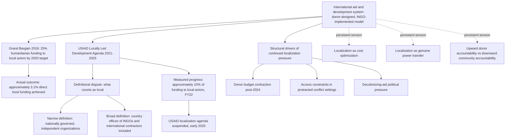

## Localization of Development Practice

### Overview

Localization refers to the movement to shift power, funding, decision-making authority, and program leadership from international donors, UN agencies, and international NGOs (INGOs) toward national and local actors — governments, civil society organizations, and communities — in the countries where development and humanitarian programs operate. It is closely related to, but analytically distinct from, decolonizing development economics (covered elsewhere in this chapter): decolonization is primarily a critique of knowledge production and disciplinary authority, while localization is primarily an operational and financing agenda concerned with where implementation authority and resources actually sit.

### Origins and Formal Commitments

**The Grand Bargain (2016)**

The most widely cited formal commitment originated at the World Humanitarian Summit in 2016, where the "Grand Bargain" was agreed between major donors and humanitarian organizations, envisioning that at least 25 percent of humanitarian funding would be allocated to local and national responders by 2020. In practice, research found that only 3.1 percent of global humanitarian funding went directly to local and national groups in that target year, a figure that had barely changed from 2016 — illustrating the persistent gap between stated commitment and measured outcome that characterizes much of the localization literature.

**USAID's Locally Led Development Agenda (2021–2025)**

A major bilateral-donor commitment came from USAID, whose Administrator in 2021 set out a plan to direct a quarter of the agency's funding to local organizations by 2025, even as assistance funding for local partners had fallen in 2021. USAID subsequently released a flurry of initiatives and metrics to try to make this happen, including a new acquisition and assistance strategy and a new local capacity building policy, along with an attempt to formally define what counts as a "local organization" — a definition that was met with mixed feelings from local leaders, reflecting a recurring tension in the localization debate over definitional criteria. USAID's first Localization Progress Report, published in June 2023, calculated that just over 10 percent of its funding went to local actors in FY22, against the 25 percent target.

**Suspension and Discontinuity**

USAID's localization agenda operated between 2021 and 2024 before being suspended in early 2025, according to research examining the initiative's outcomes using pre-2025 open government data to assess continuity and change during the agency's localization push. [Inference] This suspension marks a significant discontinuity in what had been the most institutionally prominent bilateral-donor localization commitment, and subsequent analysis of the localization agenda more broadly has had to account for a shifting and less certain donor landscape following this change.

### Measurement and Definitional Debates

**What Counts as "Local"?**

A recurring and consequential methodological dispute concerns how "local organization" is defined for the purpose of counting and tracking funding commitments. USAID's own measurement criteria characterized a local partner as, among other criteria, an entity legally organized and operating in a developing country, providing services in that country, working internationally, regionally, or nationally, and managed and governed by nationals of the recipient country or by non-nationals — criteria that allow country-based offices of international NGOs and international for-profit contractors to qualify as "local" organizations and be counted as local recipients of funds. Critics have argued that if the localization vision is to be realized, donors must create and adhere to a narrower definition of "local" that excludes affiliates and offices of international entities, and must include all funds directed for development, including UN projectized funding, rather than a subset.

**Prime versus Subaward Funding**

Independent research examining USAID's localization data found that, in the countries studied, more USAID funding went to local subaward recipients than to local prime implementing partners — a distinction relevant because localization advocates generally view prime-implementer status (direct control over a contract or grant) as conferring substantially more decision-making power and institutional benefit than subaward status (funding passed through an international prime contractor).

**Who Actually Receives Direct Funding**

A less-discussed but analytically important dimension of the localization debate concerns which types of local organizations receive direct funding when localization commitments are implemented — since if the underlying intent is to co-create program agendas with local stakeholders, the specific actors and constituencies who get a genuine seat at the table (versus simply being counted in an aggregate local-funding percentage) determines whether localization achieves its substantive goals or becomes a compliance exercise.

**Data Transparency and Accountability**

Independent tracking organizations have found that assessing which organizations receive funding, and calculating the share of direct local funding, should in principle be a straightforward process given the large quantity of data published by major donors (e.g., USAID's ForeignAssistance.gov, USASpending.gov, and International Aid Transparency Initiative reporting), yet unexplained discrepancies between datasets, data errors, and proprietary determinations about which projects count as "direct local funding" have prevented independent verification of donors' self-reported top-line figures. This has motivated dedicated tracking initiatives (such as Publish What You Fund's "Metrics Matter" series) explicitly aimed at holding donors accountable to their localization commitments through independent measurement.

### Drivers of the Contemporary Localization Push

Beyond formal donor commitments, several structural forces are cited as accelerating localization in the mid-2020s:

- **Donor budget contraction**: budget contractions among several major donors since 2024–2025 — including USAID's transition, cuts to certain European aid budget lines, and partial freezes on certain sovereign funding — are forcing the humanitarian and development sector to optimize indirect costs and reduce layers of intermediation between donors and affected populations, making direct local funding more operationally attractive on cost grounds, not only on normative grounds.
- **Access constraints in complex crises**: the evolution of crises toward protracted conflicts and shrinking humanitarian access makes local actors, in many cases, the only ones able to operate in areas that have become inaccessible to international staff, giving localization an operational necessity dimension distinct from its power-shifting rationale.
- **Political pressure from the decolonizing-aid agenda**: the broader agenda of decolonizing aid, championed by both donors and Global South NGOs, places sustained political pressure on historical aid-delivery models built around international intermediaries.

**Illustrative Example: Local-SPACE in the DRC**

A concrete illustration of localization implementation at the field level is the Local-SPACE project, funded by the EU's civil protection and humanitarian aid arm (ECHO) in the Democratic Republic of the Congo, implemented by humanitarian consortia bringing together national organizations (including CONAFOHD) alongside established international actors (CAFOD, Caritas) and national NGO platforms; in late May 2026 the project organized capacity-strengthening workshops for national Congolese NGOs in Goma, Bukavu, and Bunia. [Unverified] As a single project example reported by one source, this illustrates a type of localization implementation model rather than establishing the overall pace or scale of localization progress across the humanitarian sector.

### Structural Tensions in the Localization Debate

**Localization as Cost-Cutting versus Localization as Power-Shifting**

A central unresolved tension is whether localization, as actually implemented, functions primarily as a genuine transfer of decision-making power and institutional capacity to local actors, or primarily as a cost-optimization strategy for donors facing budget pressure — reducing the "overhead" layers of international intermediation while retaining donor-level control over priorities, conditions, and reporting requirements. [Inference] These two framings are not mutually exclusive in practice, but the balance between them shapes very different assessments of whether a given localization initiative represents meaningful reform, and this is a genuinely contested empirical and normative question rather than one with a settled answer.

**Capacity-Building versus Capacity-Assuming**

Critics of conventional donor practice argue that many localization initiatives are framed around "capacity building" for local organizations — implying local actors currently lack capacity and must be brought up to a donor-defined standard — rather than "capacity assuming" or "capacity strengthening," which starts from the premise that local organizations already possess substantial relevant capacity that has historically been under-resourced and under-recognized by the international system, and that the primary reform needed is resource and authority transfer rather than remedial training.

**Compliance and Fiduciary Requirements as a Barrier**

Donor compliance, financial reporting, and fiduciary risk-management requirements — often designed around the administrative capacity of large international organizations — are frequently cited as a structural barrier to direct local funding, since smaller local organizations may lack the administrative infrastructure to satisfy these requirements even when donors are willing in principle to fund them directly. This has generated interest in alternative funding mechanisms such as pooled funds, simplified due-diligence procedures, and multi-year flexible grants designed specifically to lower this administrative barrier.

**Accountability Direction**

A related structural critique is that localization initiatives frequently retain an accountability structure oriented primarily "upward" toward donors (reporting requirements, results frameworks, audit compliance) rather than "downward" toward the communities and populations the programs are meant to serve — meaning that even substantial funding transfers to local organizations may not, by themselves, shift whose priorities and standards of success actually govern program design.

### Conceptual Map

### Implications for Development Economics as a Discipline

[Inference] Localization intersects with development economics research in several concrete ways: it affects the political economy of program design and evaluation (who sets research questions and success metrics), it bears on debates over aid effectiveness and absorptive capacity (whether channeling funds through local systems improves or complicates measurable outcomes), and it connects to the ethics-of-field-experiments literature discussed elsewhere in this course, since localization advocates argue that local partners should have substantive authority over research design and dissemination, not merely a data-collection role. The empirical literature on whether localized program delivery improves measured development outcomes relative to internationally-managed delivery is still developing and does not, at present, support a single settled conclusion.

**Related Topics**

- Decolonizing development economics (related but distinct: knowledge production versus operational funding)
- Ethics of field experiments and local research partnership models
- Official Development Assistance architecture and donor retrenchment
- Aid effectiveness and absorptive capacity debates
- NGO accountability structures and results-based donor reporting
- Pooled funding mechanisms and simplified due-diligence models for local organizations
- Humanitarian-development-peace nexus programming in protracted crises
- Civil society strengthening and local governance capacity in LMICs