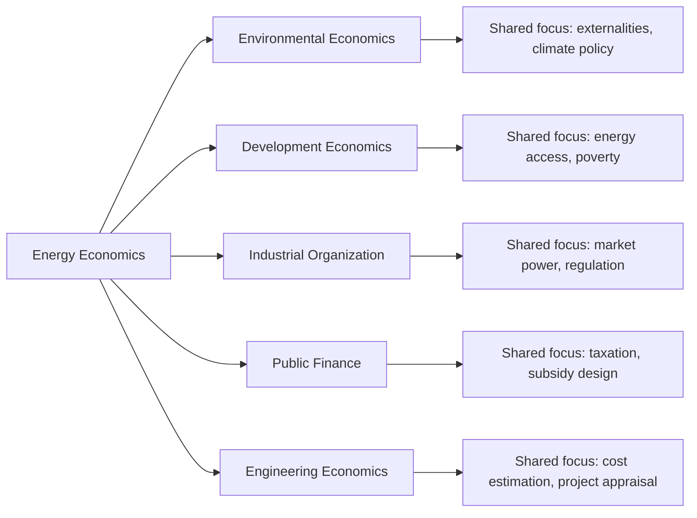

## Defining Energy Economics as a Discipline

### Overview

Energy economics is the applied branch of economics concerned with the production, distribution, conversion, pricing, and consumption of energy resources and services. It sits at the intersection of microeconomics, macroeconomics, public policy, environmental science, and engineering, treating energy as both a commodity traded in markets and a critical input to virtually all economic activity.

The discipline emerged formally in response to the oil shocks of 1973 and 1979, when the fragility of industrialized economies to energy supply disruptions became undeniable. Since then, it has expanded to cover electricity market design, resource depletion, climate policy, and the economics of the energy transition.

### Core Definition

Energy economics can be defined as the study of how societies allocate scarce energy resources to satisfy competing wants, under conditions of technological constraint, geopolitical risk, and (increasingly) environmental limits.

**Key Points**

- It applies standard economic tools (supply and demand, cost-benefit analysis, market structure analysis) to energy-specific problems
- It treats energy carriers (oil, gas, coal, electricity, renewables) as both intermediate goods (inputs to production) and final goods (heating, mobility, lighting)
- It is inherently interdisciplinary, drawing on thermodynamics, geology, engineering, and political science
- It operates across multiple scales: firm-level (utility pricing), national (energy security policy), and global (climate agreements, OPEC dynamics)

### Scope of the Discipline

Energy economics is typically organized around several interlocking subfields:

#### 1. Resource Economics

Concerned with the extraction and depletion of exhaustible resources (oil, natural gas, coal, uranium) versus renewable flows (solar, wind, hydro). Central to this subfield is the **Hotelling Rule**, which describes the optimal extraction path of a non-renewable resource under competitive conditions:

$$\frac{dP/dt}{P} = r$$

This states that the price of an exhaustible resource, net of extraction cost, should rise at the rate of interest $r$ along an efficient extraction path.

#### 2. Energy Markets and Market Structure

Studies how energy commodities are priced and traded, including:

- Spot and futures markets for oil and gas
- Wholesale and retail electricity markets
- Market power, regulation, and the economics of natural monopolies (transmission and distribution grids)

#### 3. Energy Demand Analysis

Examines how consumers and firms respond to energy prices, income changes, and technology, using concepts like price elasticity of demand:

$$E_d = \frac{\%\Delta Q_d}{\%\Delta P}$$

Energy demand is generally price-inelastic in the short run (limited substitution options) and more elastic in the long run (as capital stock, such as vehicles or appliances, turns over).

#### 4. Energy Policy and Regulation

Covers taxation (carbon taxes, fuel excise duties), subsidies (for fossil fuels or renewables), emissions trading schemes, and regulatory design for natural monopolies in transmission and distribution.

#### 5. Environmental and Climate Economics

Increasingly treated as inseparable from energy economics, this covers externalities from energy production and use, notably the social cost of carbon, and the economics of decarbonization pathways.

#### 6. Energy Security and Geopolitics

Analyzes the economic dimensions of supply reliability, strategic reserves, import dependence, and the strategic behavior of resource-rich states and cartels such as OPEC.

### Distinguishing Features from General Economics

| Feature | General Economics | Energy Economics |
| --- | --- | --- |
| Good type | Often assumes homogeneous, storable goods | Deals with goods that vary in storability (electricity is largely non-storable at scale) |
| Externalities | Present but not always central | Central — pollution, climate change, energy security are core concerns |
| Market structure | Broad range assumed | Frequently characterized by natural monopoly (grids) and oligopoly (upstream oil/gas) |
| Time horizon | Varies by application | Long investment horizons (decades for power plants, pipelines) are the norm |
| Physical constraints | Rarely binding | Thermodynamic and engineering constraints (grid balancing, energy density) directly shape economic outcomes |

### Conceptual Framework (svg_diagram)

<svg xmlns="http://www.w3.org/2000/svg" viewBox="0 0 800 420">
<text x="400" y="30" font-size="18" font-weight="bold" text-anchor="middle" fill="#1a1a1a">Structure of Energy Economics as a Discipline (svg_diagram)</text>
<rect x="300" y="55" width="200" height="50" rx="8" fill="#2c5f7c" />
<text x="400" y="85" font-size="14" fill="#ffffff" text-anchor="middle">Energy Economics</text>
<line x1="400" y1="105" x2="130" y2="150" stroke="#555" stroke-width="1.5" />
<line x1="400" y1="105" x2="290" y2="150" stroke="#555" stroke-width="1.5" />
<line x1="400" y1="105" x2="450" y2="150" stroke="#555" stroke-width="1.5" />
<line x1="400" y1="105" x2="610" y2="150" stroke="#555" stroke-width="1.5" />
<rect x="40" y="150" width="180" height="50" rx="8" fill="#3f7d5c" />
<text x="130" y="180" font-size="12.5" fill="#ffffff" text-anchor="middle">Resource Economics</text>
<rect x="230" y="150" width="180" height="50" rx="8" fill="#3f7d5c" />
<text x="320" y="172" font-size="12" fill="#ffffff" text-anchor="middle">Markets &amp;</text>
<text x="320" y="188" font-size="12" fill="#ffffff" text-anchor="middle">Market Structure</text>
<rect x="420" y="150" width="180" height="50" rx="8" fill="#3f7d5c" />
<text x="510" y="172" font-size="12" fill="#ffffff" text-anchor="middle">Demand</text>
<text x="510" y="188" font-size="12" fill="#ffffff" text-anchor="middle">Analysis</text>
<rect x="610" y="150" width="180" height="50" rx="8" fill="#3f7d5c" />
<text x="700" y="172" font-size="12" fill="#ffffff" text-anchor="middle">Policy &amp;</text>
<text x="700" y="188" font-size="12" fill="#ffffff" text-anchor="middle">Regulation</text>
<line x1="400" y1="105" x2="700" y2="245" stroke="#555" stroke-width="1.5" />
<line x1="400" y1="105" x2="500" y2="245" stroke="#555" stroke-width="1.5" />
<rect x="405" y="245" width="200" height="50" rx="8" fill="#8a5a2c" />
<text x="505" y="267" font-size="12" fill="#ffffff" text-anchor="middle">Environmental &amp;</text>
<text x="505" y="283" font-size="12" fill="#ffffff" text-anchor="middle">Climate Economics</text>
<rect x="615" y="245" width="180" height="50" rx="8" fill="#8a5a2c" />
<text x="705" y="267" font-size="12" fill="#ffffff" text-anchor="middle">Energy Security &amp;</text>
<text x="705" y="283" font-size="12" fill="#ffffff" text-anchor="middle">Geopolitics</text>
<rect x="40" y="330" width="720" height="70" rx="8" fill="#f4f0e8" stroke="#999" stroke-width="1" />
<text x="400" y="355" font-size="12.5" fill="#333" text-anchor="middle">Underlying disciplines: Microeconomics · Macroeconomics · Thermodynamics ·</text>
<text x="400" y="375" font-size="12.5" fill="#333" text-anchor="middle">Engineering · Political Science · Environmental Science</text>
</svg>

### Methodological Toolkit

Energy economists rely on:

- **Partial and general equilibrium modeling** — to assess how energy price shocks propagate through an economy
- **Econometric estimation** — for demand elasticities, price pass-through, and forecasting
- **Cost-benefit analysis** — for infrastructure investment and policy evaluation
- **Optimization models** — such as capacity expansion models used in utility planning and integrated assessment models (IAMs) used in climate-energy policy

### Illustrative Example

Consider a national government deciding whether to impose a carbon tax on coal-fired electricity generation. An energy economist would:

1. Estimate the price elasticity of electricity demand to project consumption changes
2. Model **fuel switching** potential (coal to gas or renewables) given relative costs
3. Quantify the externality being corrected (social cost of carbon) to justify tax level
4. Assess distributional effects on low-income households (energy poverty considerations)
5. Evaluate revenue recycling options (tax rebates, renewable subsidies)

This example illustrates why energy economics cannot be reduced to pure market analysis — it necessarily incorporates physical system constraints (grid reliability, fuel substitutability) and normative policy objectives (equity, environmental protection).

### Relationship to Adjacent Fields

[Inference] The precise disciplinary boundaries between energy economics and environmental/climate economics are not universally agreed upon in the literature; some scholars treat climate economics as a subset of energy economics, while others treat energy economics as one input into a broader climate economics framework.

### Conclusion

Energy economics is best understood not as a narrow specialization but as an applied lens through which core economic principles — scarcity, price formation, market structure, and externalities — are used to analyze one of the most physically constrained and geopolitically significant sectors of the global economy. Its boundaries are porous, overlapping substantially with environmental economics, development economics, and industrial organization, but its defining feature is the persistent need to reconcile abstract economic reasoning with the hard physical and engineering realities of energy systems.

**Related Topics**

- History and evolution of energy economics (1973 oil shock to present)
- The Hotelling Rule and exhaustible resource extraction theory
- Price elasticity of energy demand (short-run vs. long-run)
- Structure of global oil, gas, and coal markets
- Electricity market design and grid economics
- Externalities and the social cost of carbon
- Energy security and strategic petroleum reserves
- OPEC and cartel behavior in resource markets
- Energy poverty and distributional impacts of energy policy
- Integrated assessment models (IAMs) in climate-energy analysis