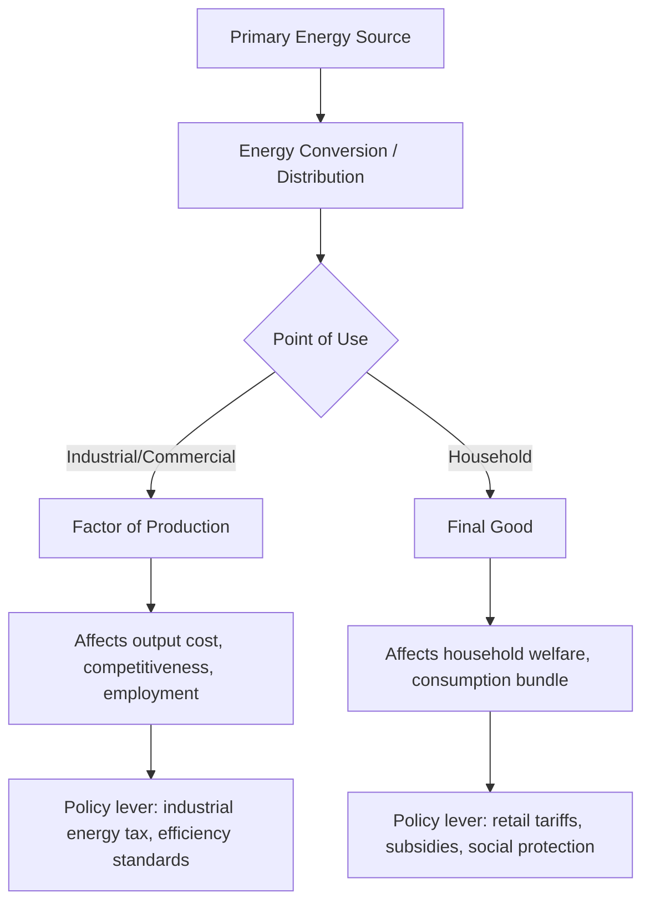

## Energy as a Factor of Production and Final Good

### Overview

Energy occupies a dual economic role that distinguishes it from most other commodities: it functions simultaneously as an **intermediate input** into the production of virtually all other goods and services, and as a **final good** consumed directly by households for welfare-generating activities such as heating, lighting, cooking, and mobility. This duality has significant implications for how energy is modeled, priced, taxed, and regulated.

### Energy as a Factor of Production

#### Conceptual Basis

In production theory, output is typically modeled as a function of capital ($K$), labor ($L$), and increasingly, energy ($E$), often alongside materials ($M$). A generalized production function (the **KLEM** framework) is expressed as:

$$Q = f(K, L, E, M)$$

Unlike capital and labor, energy is a **flow input** — it is consumed in the act of production and cannot be recovered or reused, distinguishing it from capital stock which depreciates but persists.

**Key Points**

- Energy is often described as an "enabling" input: it activates capital (machinery cannot operate without power) and complements labor (productivity gains via mechanization depend on energy availability)
- The degree of substitutability between energy and capital is a central empirical question — historically, capital and energy have been found to be complements in the short run and substitutes in the long run as firms adopt energy-efficient technology
- Energy intensity (energy use per unit of output) is a widely used metric for the energy-output relationship:

$$EI = \frac{E}{Q}$$

#### Energy in Cost Structures

Firms treat energy as a variable cost that responds to price signals. The **elasticity of substitution** between energy and other inputs determines how firms adjust their input mix when energy prices rise:

$$\sigma_{EK} = \frac{\%\Delta(E/K)}{\%\Delta(P_K/P_E)}$$

A higher elasticity implies firms can more readily substitute capital (e.g., more efficient equipment) for energy when energy prices increase.

#### Sectoral Variation

Energy's role as a production input varies dramatically by sector:

| Sector | Energy Intensity | Typical Role |
| --- | --- | --- |
| Heavy industry (steel, cement, aluminum) | Very high | Direct process input (smelting, kilns) |
| Manufacturing (general) | Moderate | Machinery operation, climate control |
| Agriculture | Moderate | Irrigation, machinery, fertilizer production (indirect) |
| Services | Low | Lighting, HVAC, IT infrastructure |
| Transport | High (fuel-dependent) | Direct propulsion input |

[Unverified] Precise energy intensity figures vary substantially by country, technology vintage, and measurement methodology; sector-level values should be treated as illustrative rather than universal constants.

### Energy as a Final Good

#### Conceptual Basis

Households do not typically value energy commodities (electricity, natural gas, gasoline) for their own sake, but rather for the **energy services** they enable — warmth, illumination, mobility, refrigeration, and communication. This distinction is central to demand-side energy economics.

$$\text{Energy Service} = \text{Energy Input} \times \text{Conversion Efficiency}$$

For example, a household does not want kilowatt-hours of electricity per se; it wants a cool room, which can be achieved with fewer kilowatt-hours if the air conditioner is more efficient.

**Key Points**

- Because energy is consumed for the services it provides rather than as an end in itself, demand for energy is a classic case of **derived demand**
- Final-good energy demand is shaped by appliance/vehicle stock, climate, income, and behavioral factors, not just current prices
- Income elasticity of energy demand is generally positive, though it declines as households reach saturation in ownership of energy-consuming durables

#### Rebound Effect

A key phenomenon in final-good energy consumption is the **rebound effect**: improvements in energy efficiency lower the effective price of energy services, which can partially offset expected energy savings as consumers use more of the now-cheaper service.

$$\text{Rebound (\%)} = 1 - \frac{\text{Actual Energy Savings}}{\text{Engineering-Predicted Savings}}$$

[Inference] The magnitude of the rebound effect is contested in the literature, with estimates ranging from a few percent to, in some direct rebound studies, over 50% depending on sector, income level, and study methodology; this remains an active empirical research area rather than a settled parameter.

### The Dual Role in Practice

The dual classification matters for policy design:

**Example**

A rise in natural gas prices illustrates the dual impact clearly:

- As a **production input**, higher gas prices raise the marginal cost of electricity generation and industrial processes (fertilizer, glass, ceramics), which can reduce output, employment, and export competitiveness in gas-intensive industries
- As a **final good**, higher gas prices raise household heating and cooking bills directly, disproportionately affecting lower-income households who spend a larger share of income on energy (a phenomenon linked to energy poverty)

This dual transmission channel is why energy price shocks tend to have both **cost-push inflationary effects** (via production) and **direct welfare effects** (via consumption), amplifying their macroeconomic significance relative to most other commodities.

### Distinguishing Features from Other Dual-Role Goods

Energy is not unique in serving both production and consumption roles (water and certain raw materials share this feature), but it is distinguished by:

- **Near-universal necessity** — virtually no production process or household activity is energy-independent
- **Limited short-run substitutability** — capital stock (factories, vehicles, buildings) is often energy-specific and cannot be quickly reconfigured
- **Storage and transport constraints** — particularly for electricity, which must be consumed near-instantaneously with production, unlike storable final goods

### Implications for Economic Modeling

Because of this duality, macroeconomic models increasingly treat energy as a distinct factor of production rather than folding it into capital, particularly in:

- **Growth accounting** — decomposing output growth into contributions from capital, labor, energy, and total factor productivity
- **Computable general equilibrium (CGE) models** — used to simulate energy price shocks or carbon tax impacts across interlinked sectors and households
- **Input-output analysis** — tracing how energy price changes propagate through supply chains to final consumer prices

### Conclusion

Energy's dual identity as both an intermediate input and a final good is foundational to why it is treated as a distinct subject of economic inquiry rather than a routine commodity. This duality explains energy's outsized macroeconomic influence, the complexity of designing energy taxation and subsidy policy (which must account for both firm competitiveness and household welfare), and the necessity of disaggregated models that track energy separately from generic capital or consumption goods.

**Related Topics**

- KLEM production function framework and energy-capital substitutability
- Energy intensity of GDP and international comparisons
- Derived demand theory applied to energy services
- The rebound effect and its policy implications
- Energy poverty and distributional impacts of energy pricing
- Input-output and computable general equilibrium (CGE) modeling of energy shocks
- Industrial competitiveness and carbon leakage under asymmetric energy pricing