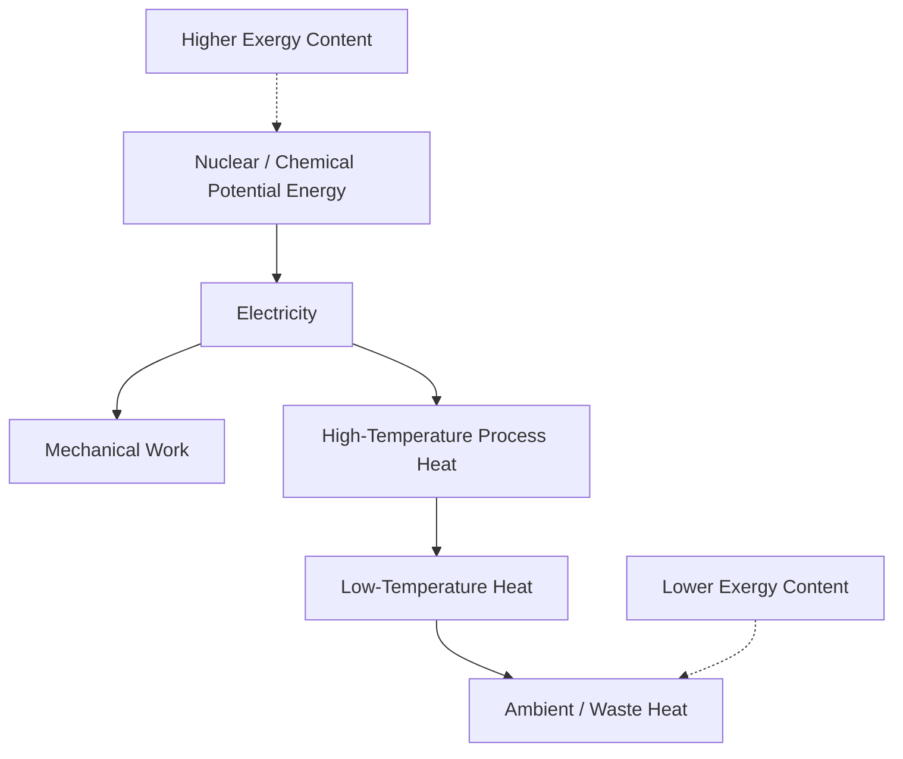

## Energy Density, Heat Content, and Quality Differences

### Overview

Not all energy is economically equivalent, even when measured in identical thermal units. A joule of electricity, a joule of crude oil, and a joule of low-grade heat differ substantially in their usefulness for performing economic work. This distinction — between the raw quantity of energy and its **quality** — is essential for understanding fuel substitution, technology choice, pricing differentials, and why energy carriers with similar heat content can command vastly different market prices.

### Energy Density: Definitions

Energy density measures how much energy is contained per unit of mass or volume of a given carrier, and comes in two principal forms:

#### Gravimetric (Specific) Energy Density

Energy per unit mass, typically expressed in MJ/kg or kWh/kg:

$$\rho_g = \frac{E}{m}$$

#### Volumetric Energy Density

Energy per unit volume, typically expressed in MJ/L or MJ/m³:

$$\rho_v = \frac{E}{V}$$

**Key Points**

- Gravimetric density matters most where weight is the binding constraint (aviation, portable electronics)
- Volumetric density matters most where storage space is the binding constraint (vehicle fuel tanks, gas pipelines, LNG shipping)
- A fuel can be excellent on one metric and poor on the other (hydrogen gas has very high gravimetric density but very low volumetric density unless compressed or liquefied)

### Comparative Energy Density Table

| Carrier | Gravimetric Density (MJ/kg) | Volumetric Density (MJ/L) | Notes |
| --- | --- | --- | --- |
| Gasoline | ~46 | ~34 | Benchmark liquid transport fuel |
| Diesel | ~45 | ~38 | Higher volumetric density than gasoline |
| Natural gas (compressed, CNG) | ~53 (mass basis) | ~9 (at typical CNG pressure) | Requires pressurization for practical volumetric density |
| LNG | ~53 | ~22.2 | Liquefaction dramatically raises volumetric density |
| Coal (bituminous) | ~24–27 | ~20–24 | Varies with grade and moisture |
| Hydrogen (compressed gas, 700 bar) | ~120 | ~4.5–5.6 | Highest gravimetric density of common fuels; poor volumetric density even compressed |
| Lithium-ion battery | ~0.9–1.0 | ~2.5–2.9 | Orders of magnitude below hydrocarbons |
| Uranium-235 (fission) | ~3.9 × 10⁶ | N/A (context-dependent) | Nuclear fuel density vastly exceeds chemical fuels |

[Unverified] Figures for battery and hydrogen storage energy density vary meaningfully with technology generation, pressure/vessel design, and manufacturer; values above should be read as representative orders of magnitude rather than precise universal constants, given the rapid pace of change in battery and hydrogen storage technology.

**Example**

This table explains a persistent economic and engineering challenge in transport electrification and hydrogen fuel adoption: batteries and even compressed hydrogen carry dramatically less energy per unit of mass or volume than liquid hydrocarbons, which is why aviation — an application acutely sensitive to weight — has proven far harder to electrify or convert to hydrogen than ground transport.

### Heat Content and Combustion Basis

Heat content (calorific value) measures the energy released when a fuel undergoes complete combustion, and is reported on two bases:

- **Higher Heating Value (HHV) / Gross Calorific Value (GCV):** includes latent heat recovered when water vapor produced in combustion condenses back to liquid
- **Lower Heating Value (LHV) / Net Calorific Value (NCV):** excludes this latent heat, since in most real-world combustion equipment the water vapor escapes as vapor without condensing

$$HHV = LHV + (\text{latent heat of vaporization of water produced})$$

The gap between HHV and LHV is fuel-dependent: it is proportional to the hydrogen content of the fuel, since hydrogen combustion produces water. Hydrogen-rich fuels (natural gas, hydrogen itself) show a larger HHV-LHV gap than carbon-rich fuels like coal.

| Fuel | Approx. HHV-LHV Gap |
| --- | --- |
| Coal | ~2–3% |
| Gasoline/Diesel | ~5–6% |
| Natural gas | ~10–11% |
| Hydrogen | ~18–19% |

[Inference] These percentage gaps are commonly cited approximations in engineering references; exact values depend on specific fuel composition (e.g., blend ratios in natural gas), so they should be treated as typical ranges rather than fixed physical constants applicable to every sample of a given fuel.

### Energy Quality: Beyond Heat Content

Energy quality refers to the **capacity of a unit of energy to perform useful work**, which is not fully captured by its raw heat content. This concept draws on the second law of thermodynamics and the notion of **exergy** — the maximum useful work extractable from an energy source given its surrounding environment.

#### Why Electricity Is "Higher Quality" Than Heat

A joule of electricity can, in principle, be converted to mechanical work, light, heat, or chemical energy with near-total efficiency. A joule of low-temperature heat cannot be fully converted into work — this limit is captured by the **Carnot efficiency**:

$$\eta_{Carnot} = 1 - \frac{T_{cold}}{T_{hot}}$$

where temperatures are in Kelvin. Because heat at ambient or near-ambient temperature has very limited capacity to do work, it is considered "low-quality" energy even if its raw thermal content (in joules) is substantial.

**Key Points**

- Electricity, mechanical work, and high-temperature process heat are generally ranked as "high-quality" energy forms
- Low-temperature waste heat (e.g., from industrial cooling systems) is "low-quality" — it contains real thermal energy but limited economic usability
- This quality hierarchy explains why waste heat recovery projects are often only marginally profitable, despite representing genuine (if low-grade) energy that would otherwise be discarded
- Energy quality differences justify why energy carriers with similar heat content are priced very differently in markets (electricity commands a substantial premium per joule over coal or natural gas)

### Economic Implications of Quality Differences

#### Price Differentials Across Carriers

It is common to observe electricity priced at several multiples of the per-joule cost of the primary fuel (coal, gas) used to generate it. This price gap reflects:

1. **Conversion losses** — thermal power plants typically convert only ~35–45% of fuel input energy into electricity, with the remainder rejected as waste heat
2. **Quality premium** — electricity's versatility (near-100% conversion efficiency into light, mechanical work, or electronic processing) commands a price premium independent of conversion losses
3. **Transport, transmission, and distribution costs** — added infrastructure costs layered onto the primary energy cost

#### Substitutability Implications

Because energy quality varies, fuels are not perfect substitutes even at equal heat content. Industrial processes requiring very high-temperature heat (e.g., steelmaking, cement kilns) cannot easily substitute low-temperature waste heat or intermittent renewable electricity without additional conversion or storage infrastructure — a key friction in electrification-based decarbonization strategies.

### Energy Quality Hierarchy Diagram

### Practical Example

Consider a factory with a choice between two energy sources of equal delivered heat content: (1) grid electricity used in a resistive heater, and (2) recovered low-temperature waste heat from an adjacent process (~60°C).

Even though both may deliver the same number of joules to the process, the electricity is versatile — it could alternatively power motors, lighting, or electronics — while the low-temperature waste heat is essentially usable only for other low-temperature heating needs (space heating, preheating). An energy economist evaluating this substitution would weigh not just the heat content, but the **opportunity cost embedded in quality**: using high-quality electricity for a low-temperature heating task that low-grade waste heat could satisfy is often considered thermodynamically (and economically) inefficient, sometimes described as "using a scalpel to cut firewood."

### Conclusion

Energy density determines how much energy a given mass or volume of a carrier can store or deliver, while heat content quantifies the thermal energy released on combustion, measured on either a gross or net basis. Energy quality extends both concepts by recognizing that not all joules are economically equal — a distinction rooted in thermodynamics (exergy and the Carnot limit) that explains persistent price differentials between electricity and primary fuels, the economic challenges of electrifying weight-sensitive applications like aviation, and the limited value of recovered low-temperature waste heat despite its genuine energy content.

**Related Topics**

- Exergy analysis and second-law efficiency in energy systems
- Thermal power plant conversion efficiency and waste heat losses
- HHV vs. LHV reporting conventions in fuel specifications
- Battery and hydrogen storage energy density trends
- Electrification of hard-to-abate sectors (aviation, heavy industry)
- Waste heat recovery economics and cogeneration (CHP) systems
- Carnot efficiency and thermodynamic limits on energy conversion