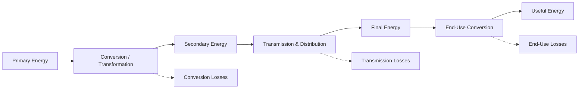

## Primary vs Secondary vs Final Energy Distinctions

### Overview

Energy statistics and economic analysis rely on a standardized classification of energy at different stages of the supply chain — from raw natural resources to the energy services actually consumed by end users. Distinguishing **primary**, **secondary**, and **final** (and further, **useful**) energy is essential for accurately measuring conversion losses, comparing energy systems, constructing national energy balances, and avoiding double-counting in economic analysis.

### The Energy Supply Chain

### Primary Energy

**Definition:** Energy embodied in natural resources that has not undergone any anthropogenic conversion process. This is the energy content of raw fuels and resources as extracted or captured.

**Examples:**

- Crude oil (as extracted)
- Raw natural gas
- Coal (as mined)
- Uranium ore (fissile material content)
- Solar radiation incident on a panel
- Kinetic energy of wind
- Potential energy of water at a hydro dam

**Key Points**

- Primary energy is the foundational metric used in national and global energy balances (e.g., IEA "Total Primary Energy Supply," TPES)
- Renewable primary energy accounting requires methodological choices (physical content vs. substitution method — see prior discussion of accounting conventions), since solar and wind do not have an obvious "raw fuel" equivalent
- Primary energy figures include energy that will later be lost in conversion, so they are always greater than or equal to final energy consumption

### Secondary Energy

**Definition:** Energy that has been converted from a primary form into another, more usable form via a transformation process. Secondary energy carriers are what most economic transactions in energy markets actually involve.

**Examples:**

- Electricity (converted from coal, gas, nuclear, wind, etc.)
- Refined petroleum products (gasoline, diesel, jet fuel, refined from crude oil)
- Coke (converted from coal for steelmaking)
- Hydrogen (produced via electrolysis or steam methane reforming)
- District heat (produced from combustion or waste heat recovery)

**Key Points**

- The conversion from primary to secondary energy always involves losses, governed by the efficiency of the conversion technology
- A single primary energy source can yield multiple secondary carriers (crude oil refines into gasoline, diesel, jet fuel, and other products simultaneously)
- Secondary energy is what is typically traded on wholesale energy markets (electricity markets, refined product markets)

$$E_{secondary} = E_{primary} \times \eta_{conversion}$$

where $\eta_{conversion}$ is the conversion efficiency, always less than 1 for thermal conversion processes (though electrolysis, refining, and other processes have their own characteristic efficiency ranges).

### Final Energy

**Definition:** Energy delivered to the end consumer (household, firm, vehicle) after all transformation, transmission, and distribution stages, but before the final end-use conversion into a service.

**Examples:**

- Electricity delivered to a household meter
- Gasoline pumped into a vehicle's fuel tank
- Natural gas delivered to a residential furnace
- Diesel delivered to an industrial generator

**Key Points**

- Final energy consumption (FEC) is the standard metric used for demand-side analysis, energy efficiency policy targets, and sectoral energy accounting
- Final energy is lower than secondary energy due to transmission and distribution losses (notably significant for electricity grids, typically several percent, and for natural gas pipeline networks)
- National and EU energy efficiency targets are frequently expressed in terms of final energy consumption reduction

### Useful Energy (Extension of the Framework)

Many analytical frameworks add a fourth stage: **useful energy**, representing the energy actually delivered as a service after accounting for the efficiency of the end-use device (furnace, engine, light bulb, motor).

$$E_{useful} = E_{final} \times \eta_{end-use}$$

**Example**

A gasoline-powered vehicle receives final energy in the form of gasoline in its tank, but due to internal combustion engine thermodynamic limits, only roughly 20-35% [Unverified — varies substantially by engine type, driving conditions, and vehicle generation] of that energy converts into useful mechanical energy for propulsion; the remainder is lost primarily as waste heat.

### Comparative Table

| Stage | Definition | Example | Typical Loss Mechanism |
| --- | --- | --- | --- |
| Primary | Raw natural resource energy content | Crude oil in the ground, wind kinetic energy | N/A (starting point) |
| Secondary | Converted, tradable energy carrier | Electricity, gasoline, refined diesel | Conversion/refining losses |
| Final | Delivered to end-user meter/tank | Electricity at the wall socket, fuel in the tank | Transmission & distribution losses |
| Useful | Energy service actually rendered | Light output, propulsion, heat delivered to a room | End-use device inefficiency |

### Worked Numerical Example

Consider coal-fired electricity delivered to a household incandescent light bulb (used here for illustrative simplicity):

1. **Primary energy**: 100 units of coal energy content extracted
2. **Secondary energy**: Power plant converts coal to electricity at ~35% efficiency → 35 units of electricity generated
3. **Final energy**: Transmission and distribution losses of ~7% → approximately 32.6 units of electricity delivered to the household
4. **Useful energy**: An incandescent bulb converts only ~5% [Unverified — illustrative approximation; actual efficiency depends on bulb type and specification] of electrical input into visible light, with the rest lost as heat → approximately 1.6 units of useful light energy

This example demonstrates how the cascading losses across the primary-to-useful chain mean that only a small fraction of the original primary energy resource ultimately performs the intended economic service — a central justification for policy emphasis on efficiency improvements at *every* stage of the chain, not just at extraction or generation.

### Illustrative Loss Cascade (svg_diagram)

<svg xmlns="http://www.w3.org/2000/svg" viewBox="0 0 800 260">
<text x="400" y="25" font-size="16" font-weight="bold" text-anchor="middle" fill="#1a1a1a">Primary-to-Useful Energy Loss Cascade (svg_diagram)</text>
<rect x="20" y="60" width="150" height="140" fill="#2c5f7c" />
<text x="95" y="45" font-size="11" text-anchor="middle" fill="#333">Primary</text>
<text x="95" y="135" font-size="13" fill="#fff" text-anchor="middle">100</text>
<rect x="220" y="127" width="150" height="73" fill="#3f7d5c" />
<text x="295" y="45" font-size="11" text-anchor="middle" fill="#333">Secondary</text>
<text x="295" y="168" font-size="13" fill="#fff" text-anchor="middle">35</text>
<rect x="420" y="132" width="150" height="68" fill="#8a5a2c" />
<text x="495" y="45" font-size="11" text-anchor="middle" fill="#333">Final</text>
<text x="495" y="170" font-size="13" fill="#fff" text-anchor="middle">32.6</text>
<rect x="620" y="196" width="150" height="4" fill="#6b4c9a" />
<text x="695" y="45" font-size="11" text-anchor="middle" fill="#333">Useful</text>
<text x="695" y="215" font-size="12" fill="#333" text-anchor="middle">1.6</text>
<line x1="0" y1="200" x2="800" y2="200" stroke="#999" stroke-width="1" />
</svg>

### Why This Distinction Matters Economically

**Key Points**

- **Avoiding double-counting**: Energy balances must carefully track conversions to avoid summing primary and secondary energy as if they were additive independent quantities
- **Policy targeting**: Efficiency policies aimed at final energy consumption (e.g., building codes, appliance standards) differ from policies aimed at primary energy supply (e.g., resource extraction taxes) or conversion efficiency (e.g., power plant emissions standards)
- **Cross-country comparability**: Countries with different generation mixes (more nuclear/renewables vs. more fossil thermal generation) will show different ratios of primary-to-final energy, complicating naive comparisons of "energy consumption" if the primary/final distinction is not made explicit
- **Investment appraisal**: Understanding where losses occur along the chain identifies where efficiency investment yields the greatest system-wide primary energy savings

### Conclusion

The primary-secondary-final-useful energy framework provides the structural backbone for virtually all quantitative energy economics, from national energy balance construction to efficiency policy design. Because substantial energy is lost at each conversion, transmission, and end-use stage, failing to specify which stage a given figure refers to can lead to significant misinterpretation — a primary energy statistic can differ from the corresponding useful energy delivered to consumers by an order of magnitude or more, depending on the technologies and pathways involved.

**Related Topics**

- National energy balance construction (IEA, EIA methodologies)
- Conversion efficiency of thermal power generation
- Transmission and distribution losses in electricity grids
- End-use efficiency standards and appliance/vehicle regulation
- Exergy and useful energy analysis
- Energy return on energy invested (EROEI) as a related supply-chain concept