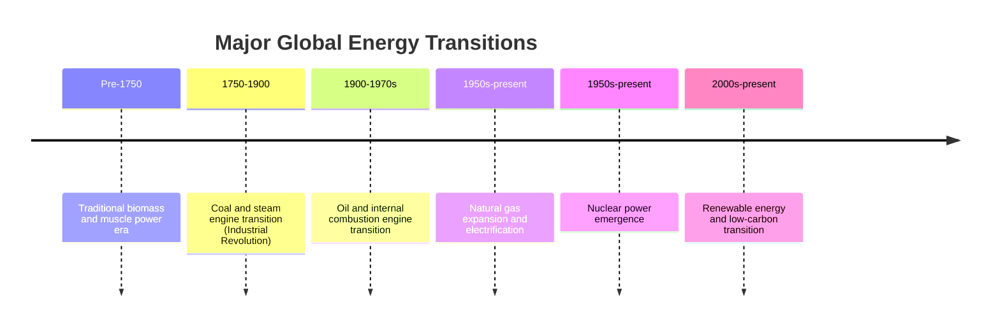

## Historical Evolution of Energy Systems and Transitions

### Overview

Energy transitions — shifts in the dominant sources and technologies societies use to meet their energy needs — are among the most consequential processes in economic history. Each transition has been driven by a combination of resource scarcity, technological innovation, relative pricing, and infrastructure development, and each has reshaped economic geography, industrial organization, and geopolitical power. Understanding this history provides essential context for analyzing the contemporary transition toward low-carbon energy systems.

### Conceptual Framework: What Constitutes an Energy Transition

An energy transition is generally understood as a shift in the primary energy mix at the level of a society or the global economy, typically characterized by:

- A new energy source or carrier gaining a rising share of primary energy supply
- Displacement (relative or absolute) of the previously dominant source
- Associated shifts in end-use technology, infrastructure, and economic structure

[Inference] Historians and energy economists debate the degree to which past transitions were truly rapid "revolutions" versus prolonged, overlapping additions to the energy mix; much of the academic literature (notably work associated with historian Vaclav Smil) emphasizes that historical transitions were generally slower and more additive than commonly assumed, with older energy sources often persisting alongside newer ones for extended periods rather than being fully displaced.

### Major Historical Energy Transitions

#### 1. Traditional Biomass Era (Pre-Industrial)

For most of human history, energy needs were met through:

- **Human and animal muscle power** for agriculture and transport
- **Traditional biomass** (wood, dung, crop residue) for heating and cooking
- **Wind and water power** (mills) for limited mechanical applications

This era was characterized by low energy density, severe geographic constraints (energy availability tied to local biomass and water resources), and correspondingly limited economic output per capita.

#### 2. The Coal Transition (Industrial Revolution, ~1750–1900)

Coal's rise as the dominant industrial energy source is closely tied to the Industrial Revolution, driven by:

- The **steam engine**, which allowed coal's chemical energy to be converted into mechanical work at a scale and reliability impossible with wind, water, or muscle power
- Coal's superior energy density relative to wood, enabling concentrated industrial production (ironworks, textile mills, railways)
- The development of rail and shipping infrastructure, which itself was enabled by and further propelled coal demand

**Key Points**

- Coal's rise was strongly geographically path-dependent — regions with accessible coal deposits (Britain, the Ruhr Valley, the Appalachian basin) industrialized earliest
- The coal transition took many decades; wood and traditional biomass remained significant energy sources well into the transition period in most economies
- Coal enabled the first sustained decoupling of energy supply from immediate biological/agricultural constraints (unlike biomass and animal power, coal was a stock resource extractable independent of land productivity)

#### 3. The Oil and Internal Combustion Transition (~1900–1970s)

Petroleum's rise to global energy dominance was driven by:

- The invention and mass adoption of the **internal combustion engine**, particularly for automobiles (Ford's Model T and subsequent mass production) and later aviation
- Oil's superior energy density and liquid form, offering major logistical advantages over coal (easier transport via pipeline and tanker, no ash residue, higher energy-per-volume for transport applications)
- The discovery of major oil reserves (United States, Middle East, later North Sea and other regions) and the development of the global oil industry (Standard Oil, the "Seven Sisters" majors, and later OPEC)
- Military strategic importance, particularly evident in both World Wars, which accelerated state interest in securing oil supply

**Key Points**

- Oil's dominance in transport (a sector where its energy density advantages are most pronounced) was more complete than its dominance in electricity generation, where coal (and later natural gas and nuclear) remained more competitive
- The rise of oil corresponded with the rise of the automobile-centered suburban economic geography in many industrialized countries
- Formation of OPEC in 1960 and the 1973 and 1979 oil shocks marked a shift in the global political economy of oil, transferring substantial pricing power to resource-holding nations and catalyzing the formal emergence of energy economics as a distinct academic discipline

#### 4. The Natural Gas and Electrification Expansion (~1950s–present)

Running partly in parallel with the oil era:

- **Electrification** transformed end-use energy consumption across industrial, commercial, and residential sectors, creating a secondary energy carrier that could be generated from multiple primary sources (coal, gas, nuclear, hydro, and later renewables)
- **Natural gas** grew from a byproduct often flared at oil wells into a major energy carrier in its own right, driven by pipeline infrastructure development, and later by the "shale revolution" enabled by hydraulic fracturing and horizontal drilling technology (particularly in the United States from the mid-2000s onward)
- **Nuclear power**, emerging from the 1950s onward, represented a distinct transition pathway — offering very high energy density and low direct emissions, but facing constraints related to capital cost, public acceptance following high-profile accidents (Three Mile Island 1979, Chernobyl 1986, Fukushima 2011), and waste management

#### 5. The Contemporary Low-Carbon Transition (~2000s–present)

The ongoing transition is distinguished from prior transitions by being **policy-driven** rather than purely market- or resource-driven, motivated primarily by climate change mitigation rather than a scarcity or cost advantage of the incumbent fuel:

- **Solar photovoltaic and wind power** costs have declined dramatically over the past two decades, driven by manufacturing scale, technology learning curves, and supportive policy (feed-in tariffs, renewable portfolio standards, tax credits)
- **Battery storage** and electric vehicle technology have advanced significantly, addressing the intermittency and mobility limitations that historically constrained renewable electricity and electrified transport
- **Carbon pricing, emissions trading schemes, and international agreements** (Kyoto Protocol, Paris Agreement) have introduced explicit policy costs on fossil fuel combustion, altering relative economics

[Unverified] Given the ongoing and unresolved nature of this transition as of the current period, claims about its ultimate pace, trajectory, or eventual dominant technology mix remain forecasts rather than established historical fact, and should be treated with appropriate caution regarding external uncertainties such as future policy direction, technology cost trajectories, and geopolitical developments.

### Timeline Overview

### Structural Features Common to Historical Transitions

**Key Points**

- **Additive, not purely substitutive**: New energy sources have historically been layered onto rather than fully replacing older ones — global coal and oil consumption in absolute terms have both continued rising even as their relative *share* of primary energy has shifted
- **Infrastructure lock-in**: Each transition required significant complementary infrastructure investment (railways for coal, pipelines and roads for oil, transmission grids for electricity), creating path dependency that slowed subsequent transitions
- **Multi-decade timescales**: Even rapid historical transitions (e.g., oil's rise in transport) unfolded over multiple decades from initial adoption to dominance, a point frequently raised in debates over the feasible pace of the current low-carbon transition
- **Geopolitical realignment**: Each transition redistributed economic and strategic power toward regions holding the newly dominant resource or technology (coal regions in the 19th century, oil-exporting states in the 20th century, and potentially critical mineral and renewable technology manufacturing hubs in the 21st)

### Economic Lessons for Contemporary Analysis

**Example**

The oil shocks of 1973 and 1979 illustrate a recurring pattern relevant to energy transition economics: sudden supply-side disruption or price shock in a dominant energy carrier triggers accelerated substitution and efficiency investment that would not have occurred under stable pricing. This pattern is echoed in contemporary discussions of how energy security concerns (e.g., following the 2022 disruption to European natural gas supply) can accelerate renewable energy and efficiency investment beyond what climate policy alone might have achieved — [Unverified] though the degree to which any single such episode causally accelerates a broader multi-decade transition, versus being one contributing factor among the underlying technology cost trends already in motion, remains a matter of ongoing empirical and historical assessment rather than settled consensus.

### Conclusion

The historical evolution of energy systems demonstrates that transitions are typically multi-decade, infrastructure-dependent, and geopolitically consequential processes, more often additive than fully substitutive. From traditional biomass through coal, oil, natural gas, and electrification, each transition has been shaped by the interaction of technological innovation, relative energy density and cost, and infrastructure investment. The contemporary low-carbon transition shares many of these historical dynamics but is distinguished by being substantially policy-driven, motivated by climate objectives rather than resource scarcity or cost advantage alone — a distinction with significant implications for how quickly and how completely it may unfold relative to its historical predecessors.

**Related Topics**

- The 1973 and 1979 oil shocks and the emergence of energy economics
- Technology learning curves and renewable energy cost decline
- Path dependency and infrastructure lock-in in energy systems
- OPEC formation and cartel dynamics in global oil markets
- The shale revolution and its impact on global gas and oil markets
- Energy transition theory (Vaclav Smil and related scholarship)
- Stranded assets and the economics of fossil fuel phase-out