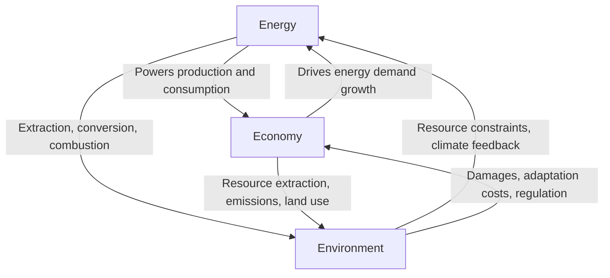

## The Energy-Economy-Environment Nexus

### Overview

The energy-economy-environment (3E) nexus is a conceptual and analytical framework describing the tightly interlinked feedback relationships between energy systems, economic activity, and environmental outcomes. No single one of these three domains can be fully understood or effectively managed in isolation: energy use drives economic output, economic output drives energy demand, and both energy production and economic activity generate environmental impacts that, in turn, feed back into economic costs and energy system constraints.

### The Three Core Linkages

#### 1. Energy → Economy

Energy availability, price, and quality directly influence economic output, as established in the treatment of energy as a factor of production. Energy price shocks transmit into inflation, industrial competitiveness, and household welfare, while reliable and affordable energy access is a widely recognized precondition for economic development.

#### 2. Economy → Energy

Economic growth drives energy demand growth, mediated by structural composition (industrial vs. service-based economies), technology, and behavior. This relationship underlies the energy intensity and decoupling debates addressed previously.

#### 3. Energy ↔ Environment

Energy extraction, conversion, and combustion generate environmental impacts across multiple scales:

- **Local**: air and water pollution from fossil fuel combustion and extraction, land degradation from mining
- **Regional**: acid rain from sulfur emissions, water stress from thermal power plant cooling and biofuel production
- **Global**: greenhouse gas emissions and climate change from fossil fuel combustion

#### 4. Environment → Economy

Environmental degradation and climate change impose economic costs — reduced agricultural productivity, infrastructure damage from extreme weather, health costs from air pollution, and adaptation expenditure — creating a feedback loop back into the economic system.

#### 5. Environment → Energy

Climate change and environmental constraints increasingly affect energy systems directly: reduced hydropower output during droughts, thermal power plant derating during extreme heat (due to cooling water temperature limits), and physical climate risks to energy infrastructure (storms, sea-level rise affecting coastal facilities).

### Analytical Frameworks for the Nexus

#### The IPAT Identity

A foundational (if simplified) framework decomposing environmental impact:

$$I = P \times A \times T$$

where $I$ is environmental impact, $P$ is population, $A$ is affluence (GDP per capita), and $T$ is technology (impact per unit of economic activity, often further decomposed into energy intensity and carbon intensity of energy).

**Key Points**

- The IPAT framework is widely used pedagogically but is recognized as a simplification — it assumes a multiplicative, non-interactive relationship between factors that in reality interact in complex ways
- An extended version, the **Kaya Identity**, is specifically applied to carbon emissions and is the standard decomposition used in climate-energy scenario analysis:

$$CO_2 = \text{Population} \times \frac{GDP}{\text{Population}} \times \frac{Energy}{GDP} \times \frac{CO_2}{Energy}$$

This separates emissions growth into population growth, income growth, energy intensity of the economy, and carbon intensity of energy supply — providing a structured way to identify which lever(s) (population, affluence, efficiency, or fuel mix) are driving or could reduce emissions.

#### Environmental Kuznets Curve (EKC)

A hypothesized (and contested) inverted-U relationship between income per capita and certain environmental pressures, positing that environmental degradation initially rises with income during early industrialization, then declines as wealthier societies demand and can afford cleaner technology and stronger environmental regulation.

[Inference] The Environmental Kuznets Curve hypothesis has received mixed empirical support depending on the specific pollutant studied — evidence is comparatively stronger for certain local pollutants (e.g., some particulate and sulfur emissions in specific contexts) and notably weaker or absent for global greenhouse gas emissions, where many high-income economies have not shown a clear, uniform decoupling of emissions from income growth without policy intervention; this remains an actively debated area of environmental economics rather than an established universal law.

#### General Equilibrium and Integrated Assessment Models (IAMs)

The nexus is often formally modeled using:

- **Computable General Equilibrium (CGE) models**, which capture how energy price or policy shocks (e.g., a carbon tax) propagate through interlinked sectors of the economy
- **Integrated Assessment Models (IAMs)**, which combine simplified representations of the economy, energy system, and climate system to project long-run scenarios under different policy assumptions (e.g., the models underlying IPCC scenario analysis)

### Key Tensions Within the Nexus

#### The Growth-Emissions Tension

A central policy tension arises because, historically, economic growth and energy consumption (and associated emissions) have been positively correlated. This raises the contested question of whether continued economic growth is compatible with the emissions reductions required to meet climate targets — sometimes framed as the "green growth" versus "degrowth" debate in the academic and policy literature.

**Key Points**

- Proponents of green growth argue that decoupling (particularly through efficiency, renewable energy, and structural shift toward services) can allow continued GDP growth alongside declining emissions
- Degrowth-oriented scholars argue that the scale of required emissions reduction is incompatible with continued aggregate economic growth, particularly in already-high-income economies
- [Unverified] This remains a genuinely unresolved debate among economists and other scholars rather than a settled empirical question, and reasonable analysts disagree substantially on the interpretation of available decoupling evidence

#### The Energy Trilemma

A widely used practical framework in energy policy describing the tension between three often-competing objectives:

| Objective | Description | Nexus Dimension |
| --- | --- | --- |
| Energy security | Reliable, uninterrupted energy supply | Energy |
| Energy affordability | Reasonable cost to consumers and industry | Economy |
| Environmental sustainability | Low emissions and ecological impact | Environment |

**Example**

A government considering a rapid phase-out of domestic coal-fired power generation faces the trilemma directly: phasing out coal advances environmental sustainability, but if replacement capacity (renewables plus storage, or gas) is not yet sufficiently built out, energy security risk rises (potential shortfalls during demand peaks) and affordability may suffer (higher-cost replacement generation, stranded asset costs passed to consumers). Effective energy policy design in the nexus framework requires managing all three objectives simultaneously rather than optimizing any single one in isolation.

### Externalities as the Core Economic Link

The environment-economy connection within the nexus is formalized in economics primarily through the concept of **externalities** — costs (or occasionally benefits) imposed on third parties not reflected in market prices. Energy production and consumption generate some of the most significant externalities in the modern economy:

$$SC = PC + MEC$$

where $SC$ is social cost, $PC$ is private cost (borne by the producer/consumer), and $MEC$ is marginal external cost (borne by society, e.g., climate and health damages).

**Key Points**

- The **social cost of carbon (SCC)** is the standard monetized metric attempting to capture the marginal external cost of greenhouse gas emissions, used in cost-benefit analysis of climate policy
- Because these externalities are not reflected in market prices absent policy intervention (carbon taxes, cap-and-trade), energy markets left unregulated will tend to over-produce and over-consume emissions-intensive energy relative to the social optimum
- Estimates of the social cost of carbon vary substantially depending on discount rate assumptions, damage function specifications, and treatment of catastrophic/tail risk — making it one of the more contested quantitative parameters in environmental economics

### Nexus Diagram: Policy Intervention Points (svg_diagram)

<svg xmlns="http://www.w3.org/2000/svg" viewBox="0 0 800 340">
<text x="400" y="25" font-size="16" font-weight="bold" text-anchor="middle" fill="#1a1a1a">Policy Intervention Points in the 3E Nexus (svg_diagram)</text>
<circle cx="200" cy="180" r="90" fill="#2c5f7c" opacity="0.85" />
<text x="200" y="180" font-size="14" fill="#fff" text-anchor="middle">Energy</text>
<circle cx="600" cy="180" r="90" fill="#3f7d5c" opacity="0.85" />
<text x="600" y="180" font-size="14" fill="#fff" text-anchor="middle">Economy</text>
<circle cx="400" cy="290" r="90" fill="#8a5a2c" opacity="0.85" />
<text x="400" y="290" font-size="14" fill="#fff" text-anchor="middle">Environment</text>

<text x="400" y="130" font-size="11" text-anchor="middle" fill="#333">Energy prices, taxes,</text>

<text x="400" y="145" font-size="11" text-anchor="middle" fill="#333">subsidies</text>

<text x="300" y="245" font-size="11" text-anchor="middle" fill="#333">Emissions</text>

<text x="300" y="260" font-size="11" text-anchor="middle" fill="#333">standards</text>

<text x="500" y="245" font-size="11" text-anchor="middle" fill="#333">Carbon pricing,</text>

<text x="500" y="260" font-size="11" text-anchor="middle" fill="#333">green investment</text>

</svg>

### Implications for Policy Design

Because the three domains are interlinked through feedback loops rather than a simple linear chain, effective policy interventions in one domain typically must anticipate spillover effects in the others:

- A carbon tax (environment-targeted) affects energy prices and, through them, economic competitiveness and household welfare (economy)
- Renewable energy subsidies (energy-targeted) affect government fiscal balances and industrial structure (economy) while reducing emissions (environment)
- Economic stimulus or industrial policy (economy-targeted) can significantly affect energy demand trajectories and associated emissions (energy, environment)

This interconnection is a central justification for integrated policy frameworks (such as combined climate-energy-industrial strategies) rather than siloed sectoral policymaking.

### Conclusion

The energy-economy-environment nexus captures the reality that energy, economic activity, and environmental outcomes cannot be analyzed or managed as independent systems. Frameworks such as the Kaya Identity, the Environmental Kuznets Curve, the energy trilemma, and externality-based cost accounting provide structured tools for analyzing these interlinkages, but significant empirical and theoretical debates remain — particularly regarding the compatibility of continued economic growth with the scale of emissions reduction required to meet climate objectives. Recognizing the nexus as a set of bidirectional feedback loops, rather than a one-directional chain, is essential for designing energy and environmental policy that avoids unintended consequences in adjacent domains.

**Related Topics**

- The Kaya Identity and emissions decomposition analysis
- Environmental Kuznets Curve: theory and empirical evidence
- Social cost of carbon: methodology and estimation controversies
- Green growth versus degrowth debate
- The energy trilemma in policy design
- Integrated Assessment Models (IAMs) and climate-energy scenario analysis
- Externalities and Pigouvian taxation in energy markets