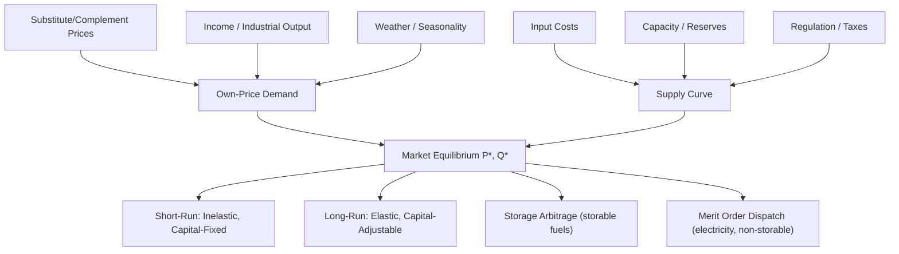

## Supply and Demand Fundamentals in Energy Markets

### Overview

Supply and demand analysis forms the analytical backbone of energy economics, adapted from general microeconomic theory to account for the distinctive physical, temporal, and institutional characteristics of energy commodities. Unlike generic goods, energy carriers (electricity, crude oil, natural gas, coal) often exhibit inelastic short-run demand, storage constraints, network-bound delivery, and joint production, all of which modify how classical supply-demand equilibrium concepts apply.

### Core Theoretical Framework

#### Demand Function

The quantity of an energy good demanded is modeled as a function of its own price, substitute/complement prices, income, and other shifters:

$$Q_d = f(P, P_s, P_c, Y, T, \varepsilon)$$

Where:

- $P$ = own price of the energy good
- $P_s$ = price of substitutes (e.g., natural gas vs. coal for power generation)
- $P_c$ = price of complements (e.g., natural gas vs. gas turbines)
- $Y$ = income or output (GDP, industrial production index)
- $T$ = technology/efficiency shifter
- $\varepsilon$ = weather, seasonality, and other stochastic shifters

A linear approximation commonly used in applied energy demand studies is:

$$Q_d = a - bP + cP_s + dY + \varepsilon$$

#### Supply Function

Energy supply reflects production decisions bounded by resource availability, extraction costs, and capacity:

$$Q_s = g(P, P_i, K, R, \tau)$$

Where:

- $P_i$ = input costs (drilling costs, labor, capital equipment)
- $K$ = installed capacity or reserves
- $R$ = regulatory constraints (production quotas, environmental limits)
- $\tau$ = taxes/subsidies

#### Market Equilibrium

Equilibrium price $P^*$ and quantity $Q^*$ occur where:

$$Q_d(P^*) = Q_s(P^*)$$

This is the standard market-clearing condition, though in energy markets this clearing often happens at very short intervals (real-time electricity markets clear every 5 minutes to an hour) or over long horizons (multi-year LNG contracts).

### Elasticity Concepts Applied to Energy

#### Price Elasticity of Demand

$$E_d = \frac{\%\Delta Q_d}{\%\Delta P} = \frac{\partial Q_d}{\partial P} \cdot \frac{P}{Q_d}$$

**Key Points**

- Short-run energy demand elasticity is typically low (inelastic), often in the range of $-0.1$ to $-0.3$ for gasoline and electricity, because consumption is tied to existing capital stock (vehicles, appliances, industrial equipment) that cannot be quickly altered.
- Long-run elasticity is substantially higher in magnitude (commonly cited around $-0.6$ to $-0.9$ for gasoline in many empirical studies), reflecting capital stock turnover — consumers can switch to more efficient vehicles, relocate, or adopt alternative technologies. [Inference: exact magnitudes vary considerably by country, time period, and estimation method; treat cited ranges as illustrative rather than universal constants.]
- Electricity demand is particularly inelastic in the short run due to limited substitutability for lighting, refrigeration, and climate control.

#### Price Elasticity of Supply

$$E_s = \frac{\%\Delta Q_s}{\%\Delta P} = \frac{\partial Q_s}{\partial P} \cdot \frac{P}{Q_s}$$

- Short-run oil supply elasticity is low because production from existing wells is largely fixed by reservoir physics and prior capital commitments.
- Long-run supply is more elastic as new exploration, drilling, and capacity investment respond to sustained price signals. Shale/tight oil producers, due to shorter drilling-to-production cycles, exhibit comparatively faster supply response than conventional offshore projects. [Inference: response speed is asset- and basin-specific.]

#### Cross-Price Elasticity

$$E_{xy} = \frac{\%\Delta Q_x}{\%\Delta P_y}$$

Relevant for fuel-switching analysis, e.g., the responsiveness of coal demand in power generation to changes in natural gas prices. A positive cross-price elasticity indicates substitutes (gas and coal in power dispatch); a negative value indicates complements (crude oil and refining capacity utilization).

### Distinctive Features of Energy Supply-Demand Analysis

#### 1. Short-Run Demand Inelasticity and Price Volatility

Because energy demand shifts slowly relative to supply shocks, small supply disruptions can cause disproportionately large price swings. This is visualized through steep short-run demand curves intersecting with supply curves that shift due to geopolitical or weather events.

flowchart_supply_demand_shock (svg_diagram)

<svg xmlns="http://www.w3.org/2000/svg" viewBox="0 0 720 460" font-family="Helvetica, Arial, sans-serif">
<rect x="0" y="0" width="720" height="460" fill="#ffffff" />
<text x="360" y="28" text-anchor="middle" font-size="18" font-weight="bold" fill="#1a1a1a">Inelastic Demand + Supply Shock → Price Spike (svg_diagram)</text>

<line x1="90" y1="400" x2="650" y2="400" stroke="#333" stroke-width="2" />
<line x1="90" y1="400" x2="90" y2="50" stroke="#333" stroke-width="2" />
<text x="660" y="405" font-size="14" fill="#333">Quantity</text>
<text x="55" y="55" font-size="14" fill="#333">Price</text>

<path d="M 250 60 L 400 400" stroke="#1f6feb" stroke-width="2.5" fill="none" />
<text x="255" y="55" font-size="13" fill="#1f6feb" font-weight="bold">D (inelastic)</text>

<path d="M 130 380 C 250 300, 400 200, 560 90" stroke="#2ea043" stroke-width="2.5" fill="none" />
<text x="565" y="88" font-size="13" fill="#2ea043" font-weight="bold">S1</text>

<path d="M 180 380 C 280 300, 400 190, 520 90" stroke="#d1242f" stroke-width="2.5" fill="none" stroke-dasharray="6,4" />
<text x="500" y="80" font-size="13" fill="#d1242f" font-weight="bold">S2 (shock)</text>

<circle cx="345" cy="205" r="5" fill="#111" />
<text x="352" y="200" font-size="12" fill="#111">E1 (P1, Q1)</text>
<circle cx="315" cy="140" r="5" fill="#111" />
<text x="322" y="135" font-size="12" fill="#111">E2 (P2, Q2)</text>

<line x1="345" y1="205" x2="90" y2="205" stroke="#888" stroke-width="1" stroke-dasharray="3,3" />
<line x1="345" y1="205" x2="345" y2="400" stroke="#888" stroke-width="1" stroke-dasharray="3,3" />
<line x1="315" y1="140" x2="90" y2="140" stroke="#888" stroke-width="1" stroke-dasharray="3,3" />
<line x1="315" y1="140" x2="315" y2="400" stroke="#888" stroke-width="1" stroke-dasharray="3,3" />

<text x="30" y="209" font-size="12" fill="#333">P1</text>

<text x="30" y="144" font-size="12" fill="#333">P2</text>

<text x="340" y="418" font-size="12" fill="#333">Q2</text>

<text x="345" y="418" font-size="12" fill="#333" dx="10">Q1</text>

<text x="130" y="440" font-size="12" fill="#555">Note: Small leftward supply shift causes large price rise (P1→P2) but only modest quantity drop, because demand is steep (inelastic).</text>

</svg>

**Key Points**

- The steepness of the demand curve relative to the supply shift determines the magnitude of price response.
- This dynamic explains why geopolitical disruptions to oil supply (e.g., OPEC production changes, conflict-related outages) produce outsized price movements relative to the percentage volume affected.

#### 2. Storage and Intertemporal Arbitrage

Storable energy commodities (crude oil, natural gas, coal) link current and future supply-demand balances through storage economics. The theory of storage predicts a relationship between spot and futures prices:

$$F_t = S_t \cdot e^{(r + u - y)(T-t)}$$

Where:

- $F_t$ = futures price at time $t$
- $S_t$ = spot price
- $r$ = risk-free interest rate
- $u$ = storage/carrying cost
- $y$ = convenience yield (the benefit of holding physical inventory)
- $T - t$ = time to maturity

When markets are in **contango** ($F_t > S_t$), it signals ample supply/inventory and incentivizes storage. When markets are in **backwardation** ($F_t < S_t$), it signals tight physical supply, with a high convenience yield reflecting the value of immediate access to the commodity.

**Note:** Non-storable energy — electricity in particular — cannot be arbitraged this way; supply and demand must balance instantaneously, which drives extreme intraday and seasonal price volatility (see below).

#### 3. Electricity: The Non-Storability Constraint

Electricity's near-total non-storability (barring limited/expensive battery and pumped-hydro storage) fundamentally alters the standard supply-demand model:

- Supply must equal demand at every instant to maintain grid frequency and stability.
- The supply curve is effectively the **merit order** — generation units ranked by marginal cost, dispatched sequentially from cheapest to most expensive to meet load.
- Demand is met by intersecting the (near-vertical, inelastic) load curve with the merit-order supply stack, and the marginal (last dispatched) unit sets the clearing price.

merit_order_dispatch_curve (svg_diagram)

<svg xmlns="http://www.w3.org/2000/svg" viewBox="0 0 720 420" font-family="Helvetica, Arial, sans-serif">
<rect x="0" y="0" width="720" height="420" fill="#ffffff" />
<text x="360" y="28" text-anchor="middle" font-size="18" font-weight="bold" fill="#1a1a1a">Merit Order Supply Stack (svg_diagram)</text>
<line x1="80" y1="370" x2="660" y2="370" stroke="#333" stroke-width="2" />
<line x1="80" y1="370" x2="80" y2="50" stroke="#333" stroke-width="2" />
<text x="665" y="375" font-size="13" fill="#333">Cumulative MW</text>
<text x="30" y="45" font-size="13" fill="#333">€/MWh</text>

<rect x="80" y="340" width="80" height="30" fill="#2ea043" />
<text x="90" y="360" font-size="11" fill="#fff">Nuclear</text>
<rect x="160" y="310" width="80" height="60" fill="#57ab5a" />
<text x="170" y="345" font-size="11" fill="#fff">Hydro</text>
<rect x="240" y="260" width="90" height="110" fill="#79c0ff" />
<text x="250" y="320" font-size="11" fill="#111">Wind/Solar</text>
<rect x="330" y="200" width="100" height="170" fill="#f0b429" />
<text x="345" y="290" font-size="11" fill="#111">Gas CCGT</text>
<rect x="430" y="140" width="90" height="230" fill="#e8590c" />
<text x="440" y="260" font-size="11" fill="#fff">Gas OCGT</text>
<rect x="520" y="90" width="90" height="280" fill="#d1242f" />
<text x="530" y="240" font-size="11" fill="#fff">Oil Peaker</text>

<line x1="480" y1="50" x2="480" y2="370" stroke="#1f6feb" stroke-width="2.5" stroke-dasharray="5,3" />
<text x="486" y="65" font-size="12" fill="#1f6feb" font-weight="bold">Demand (Load)</text>

<circle cx="480" cy="140" r="5" fill="#111" />
<line x1="80" y1="140" x2="480" y2="140" stroke="#111" stroke-width="1" stroke-dasharray="3,3" />
<text x="30" y="144" font-size="12" fill="#111">P* (clearing)</text>
</svg>

**Key Points**

- The marginal generation unit at the intersection of the demand line and the merit-order stack sets the uniform clearing price in most wholesale electricity markets (marginal-cost pricing/pay-as-clear auctions).
- Because renewable generation (wind, solar) has near-zero marginal cost, high penetration shifts the merit order and compresses prices during high-output periods — a phenomenon often termed the "merit order effect."
- Demand-side load shifts (time-of-day, seasonal, temperature-driven) move the vertical demand line rightward/leftward, changing which unit is marginal and hence the clearing price. [Inference: exact market design/settlement rules vary by jurisdiction — e.g., nodal vs. zonal pricing, uniform vs. pay-as-bid.]

#### 4. Derived Demand

Energy demand is largely a **derived demand** — consumers do not want fuel or electricity per se, but the services they provide (mobility, heating, lighting, industrial process heat). This has implications:

- Demand for energy is tied to the stock and efficiency of energy-using capital (vehicle fleets, building insulation, industrial equipment).
- Energy demand shifts are often driven by changes in the derived-from sector (e.g., transportation demand growth, industrial output).
- This underlies the distinction between short-run (capital-fixed) and long-run (capital-adjustable) elasticity discussed above.

#### 5. Backward-Bending or Kinked Supply in Resource Extraction

For some energy commodities, especially where producers are revenue-targeting (e.g., certain national oil companies) rather than strictly profit-maximizing, the supply curve can be **backward-bending**: below a target revenue, falling prices induce producers to increase output to maintain income, reversing the standard upward-sloping relationship. [Inference: this behavior is documented in institutional/political-economy literature on OPEC and NOC behavior, but is not universal across all producers and periods.]

### Market Structure Considerations

#### Perfect Competition Benchmark

The standard supply-demand model assumes price-taking behavior. This benchmark applies reasonably well to:

- Retail gasoline markets in many competitive jurisdictions
- Spot coal markets with many buyers/sellers

#### Market Power and Strategic Behavior

Many energy markets deviate from perfect competition:

- **OPEC and OPEC+**: acts as a partial cartel exercising some control over crude oil supply via production quotas, shifting the effective supply curve inward relative to a competitive baseline.
- **Electricity generators**: in concentrated markets, large generators can exercise unilateral market power by withholding capacity to raise the clearing price (economic withholding), or through capacity withholding strategies analyzed via oligopoly models (Cournot, Bertrand-Edgeworth).
- **Natural gas pipelines/LNG terminals**: often natural monopoly characteristics in transport/regasification segments, requiring regulatory oversight (rate-of-return or price-cap regulation).

**Key Points**

- Standard supply-demand equilibrium (competitive benchmark) should be understood as a reference case; actual price formation in many energy sub-markets requires oligopoly, cartel, or regulated-monopoly extensions.
- Market power analysis in electricity commonly uses the **Lerner Index**: $L = (P - MC)/P$, measuring the gap between price and marginal cost as a proxy for market power exercised.

### Applied Example: Natural Gas Market Shock

**Example**

Consider a simplified natural gas market with the following linear demand and supply (illustrative numbers, not empirical estimates):

- Demand: $Q_d = 100 - 2P$
- Supply: $Q_s = -20 + 3P$

Equilibrium: $100 - 2P = -20 + 3P \Rightarrow 120 = 5P \Rightarrow P^* = 24$, $Q^* = 52$

Now suppose a pipeline outage reduces supply capacity, shifting supply to $Q_s = -35 + 3P$ (a parallel leftward shift):

$100 - 2P = -35 + 3P \Rightarrow 135 = 5P \Rightarrow P^{*\prime} = 27$, $Q^{*\prime} = 46$

**Output**

- Price rises from 24 to 27 (a 12.5% increase)
- Quantity falls from 52 to 46 (an 11.5% decrease)
- Implied short-run demand elasticity over this range: $E_d \approx \frac{(46-52)/52}{(27-24)/24} \approx \frac{-0.1154}{0.125} \approx -0.92$ [Note: this is a calculated arc elasticity specific to these illustrative numbers, not a general empirical estimate for real-world natural gas demand.]

This numeric exercise illustrates the mechanics of comparative statics — shifting one curve while holding the other constant and solving for the new equilibrium — a standard technique for policy and shock analysis in energy economics.

### Comparative Statics Reference Table

| Shock Type | Curve Affected | Direction of Shift | Price Effect | Quantity Effect |
| --- | --- | --- | --- | --- |
| New pipeline/LNG capacity added | Supply | Rightward | Decrease | Increase |
| Extreme cold weather (heating demand) | Demand | Rightward | Increase | Increase |
| Carbon tax on fossil generation | Supply | Leftward (higher MC) | Increase | Decrease |
| Efficiency mandate (e.g., fuel economy standards) | Demand | Leftward (long run) | Decrease | Decrease |
| OPEC production cut | Supply | Leftward | Increase | Decrease |
| Recession / lower industrial output | Demand | Leftward | Decrease | Decrease |
| Renewable subsidy (lowers effective marginal cost) | Supply | Rightward | Decrease | Increase |
| Refinery outage | Supply (refined products) | Leftward | Increase | Decrease |

### Welfare Analysis

Standard consumer and producer surplus concepts apply directly:

$$\text{Consumer Surplus} = \int_0^{Q^*} D(Q)\, dQ - P^* Q^*$$

$$\text{Producer Surplus} = P^* Q^* - \int_0^{Q^*} S(Q)\, dQ$$

**Key Points**

- Energy taxes (fuel excise, carbon pricing) create deadweight loss by driving a wedge between the price consumers pay and the price producers receive, but this must be weighed against externality-correction benefits (see negative externality framework in later chapters on environmental economics).
- Because short-run energy demand is inelastic, the burden (incidence) of an energy tax falls disproportionately on consumers in the short run, since producers can pass through most of the tax without losing significant volume. The incidence formula:

$$\frac{\text{Consumer share of tax}}{\text{Producer share of tax}} = \frac{E_s}{|E_d|}$$

### Mermaid Diagram: Conceptual Map of Energy Supply-Demand Interactions

### Common Pitfalls in Applying the Standard Model

- Treating electricity like a storable commodity when modeling price formation — the instantaneous balancing requirement fundamentally changes the analysis (see merit order framework above).
- Ignoring capital-stock lags when estimating short-run vs. long-run elasticities from short time-series data, which can bias elasticity estimates toward apparent inelasticity even in contexts where long-run adjustment is substantial.
- Assuming perfectly competitive price-taking behavior in markets with significant cartel influence (OPEC+) or concentrated generation ownership, without adjusting the equilibrium concept accordingly.
- Overlooking derived-demand linkages, which can lead to overlooking indirect demand shifters (e.g., changes in vehicle fuel efficiency standards affecting gasoline demand years later).

### **Related Topics**

- Price elasticity estimation methods in energy demand modeling (econometric approaches)
- Theory of storage and futures pricing for oil and natural gas
- Merit order effect and renewable energy integration in wholesale electricity markets
- OPEC as a cartel: game-theoretic models of production quota behavior
- Market power measurement: Lerner Index and Herfindahl-Hirschman Index (HHI) in electricity markets
- Tax incidence and deadweight loss in energy taxation
- Derived demand and capital-stock adjustment models
- Externalities and the case for carbon pricing (transition to environmental economics chapter)
- Natural monopoly regulation in pipeline and transmission networks
- Nodal vs. zonal electricity market pricing structures