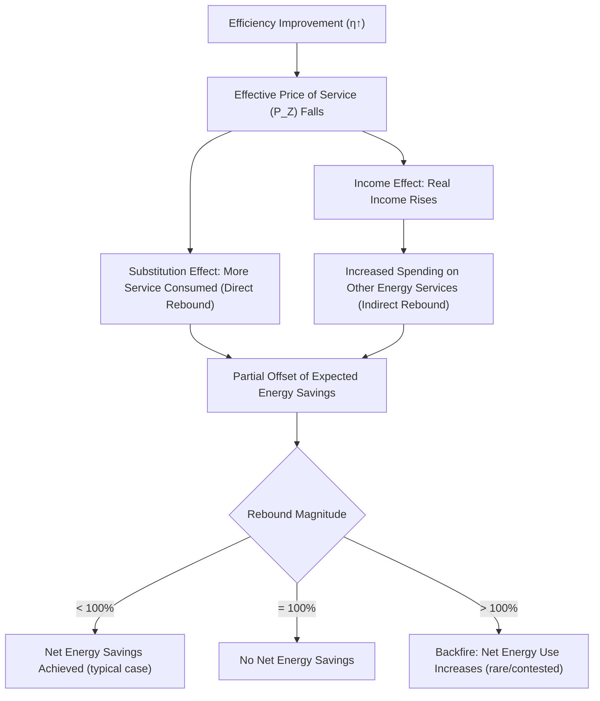

## Consumer Theory and Energy Service Demand

### Conceptual Foundation

Standard consumer theory models utility maximization over goods directly consumed. Energy economics extends this framework by recognizing that households and firms rarely value energy commodities (kWh, therms, liters of gasoline) for their own sake — they value the **energy services** those commodities produce: illumination, thermal comfort, mobility, refrigeration, mechanical power. This distinction, formalized in household production theory, reshapes how demand, elasticity, and welfare are analyzed in energy contexts.

### The Household Production Framework

#### Becker's Household Production Model Applied to Energy

Gary Becker's household production theory treats consumers as producers of utility-generating "commodities" (denoted $Z$) using market goods and time as inputs. Applied to energy:

$$U = U(Z_1, Z_2, \ldots, Z_n)$$

$$Z_i = f_i(E_i, K_i, T_i)$$

Where:

- $Z_i$ = energy service $i$ (e.g., thermal comfort, illumination, mobility)
- $E_i$ = energy input (fuel, electricity)
- $K_i$ = capital stock/appliance efficiency (furnace, vehicle, light bulb)
- $T_i$ = time input (e.g., time spent operating equipment)

**Key Points**

- This reframes "demand for energy" as a **derived demand**: households do not choose $E_i$ directly for utility, but as an input to producing $Z_i$, jointly with capital $K_i$.
- The efficiency of $K_i$ determines how much $E_i$ is required to produce a given level of service $Z_i$ — a critical link between energy demand and technology/appliance stock, since improving $K_i$ (a more efficient furnace or LED bulb) reduces $E_i$ needed for the same $Z_i$.

#### Energy Service Production Function

For a single energy service (e.g., space heating), a common simplified specification is:

$$Z = \eta \cdot K \cdot E$$

Where $\eta$ is the technical efficiency parameter (e.g., a furnace's thermal efficiency rating), $K$ represents capital scale (system capacity), and $E$ is energy consumed. Rearranging:

$$E = \frac{Z}{\eta K}$$

This shows directly that, holding desired service level $Z$ constant, energy consumption $E$ falls as efficiency $\eta$ rises — the foundation of efficiency-standard policy analysis.

### Utility Maximization with Energy Services

The consumer's problem becomes:

$$\max_{E_1,\ldots,E_n} U(Z_1(E_1,K_1), \ldots, Z_n(E_n,K_n)) \quad \text{s.t.} \quad \sum_i P_{E_i} E_i + \sum_i P_{K_i} K_i \le Y$$

Where $P_{E_i}$ is the price of energy input $i$, $P_{K_i}$ is the (often durable, up-front) cost of capital $K_i$, and $Y$ is income/budget.

**Key Points**

- This is a two-stage decision problem in practice: (1) a long-run capital choice (which furnace, which vehicle, which appliance to purchase), largely fixed once made, and (2) a short-run utilization choice (how much to run the furnace, how far to drive), adjustable continuously.
- This two-stage structure is the formal microeconomic basis for the short-run/long-run elasticity divergence discussed in energy demand analysis: short-run demand elasticity reflects utilization adjustment holding $K$ fixed, while long-run elasticity additionally captures capital $K$ replacement.

### Indifference Curves and the Energy-Comfort Tradeoff

Consider a simplified two-good model: energy expenditure ($E$, priced at $P_E$) versus a composite consumption good ($C$, priced at $P_C$), subject to budget constraint $P_E E + P_C C \le Y$.

Standard indifference curve analysis applies:

$$MRS_{E,C} = \frac{MU_E}{MU_C} = \frac{P_E}{P_C}$$

At the optimum, the consumer allocates the budget such that the marginal rate of substitution between energy-derived services and other consumption equals the relative price ratio.

energy_consumption_indifference_diagram (svg_diagram)

<svg xmlns="http://www.w3.org/2000/svg" viewBox="0 0 700 440" font-family="Helvetica, Arial, sans-serif">
<rect x="0" y="0" width="700" height="440" fill="#ffffff" />
<text x="350" y="28" text-anchor="middle" font-size="18" font-weight="bold" fill="#1a1a1a">Energy Service vs. Composite Good: Consumer Optimum (svg_diagram)</text>
<line x1="90" y1="380" x2="640" y2="380" stroke="#333" stroke-width="2" />
<line x1="90" y1="380" x2="90" y2="50" stroke="#333" stroke-width="2" />
<text x="645" y="385" font-size="13" fill="#333">Energy Service (Z)</text>
<text x="30" y="55" font-size="13" fill="#333">Composite Good (C)</text>

<line x1="150" y1="90" x2="580" y2="360" stroke="#1f6feb" stroke-width="2.5" />
<text x="500" y="345" font-size="12" fill="#1f6feb" font-weight="bold">Budget Line</text>

<path d="M 200 340 C 260 250, 350 200, 480 190" stroke="#2ea043" stroke-width="2" fill="none" />
<text x="485" y="188" font-size="11" fill="#2ea043">IC1</text>
<path d="M 260 355 C 330 270, 420 220, 550 210" stroke="#57ab5a" stroke-width="2" fill="none" stroke-dasharray="5,3" />
<text x="555" y="208" font-size="11" fill="#57ab5a">IC2 (higher utility)</text>

<circle cx="365" cy="225" r="5" fill="#111" />
<text x="372" y="220" font-size="12" fill="#111">Optimum (E*, C*)</text>

<text x="100" y="410" font-size="12" fill="#555">Optimum occurs where the budget line is tangent to the highest attainable indifference curve.</text>

</svg>

### Income and Substitution Effects in Energy Consumption

A change in energy price decomposes into two effects (Slutsky decomposition):

$$\frac{\partial E}{\partial P_E} = \underbrace{\left.\frac{\partial E}{\partial P_E}\right|_{U=\bar{U}}}_{\text{substitution effect}} - E \cdot \underbrace{\frac{\partial E}{\partial Y}}_{\text{income effect}}$$

**Key Points**

- **Substitution effect**: a rise in energy price induces substitution toward the composite good or toward more efficient energy-using capital, holding utility constant — always operates to reduce energy consumption for a price increase.
- **Income effect**: a rise in energy price reduces effective real income, which (for a normal good) further reduces energy consumption — reinforcing the substitution effect for energy, since energy is generally a normal good.
- This reinforcement (rather than offsetting, as can occur with Giffen-type goods) is part of why energy demand curves are robustly downward-sloping, even though the *magnitude* of response (elasticity) is often small in the short run due to capital-stock rigidity discussed above.

### Household Energy Budget Shares and Distributional Analysis

**Key Points**

- Energy expenditure typically represents a larger *share* of income for lower-income households than higher-income households (a form of energy Engel curve), meaning price increases or energy taxes tend to be regressive in incidence absent offsetting rebates or targeted assistance.
- This is formalized via the energy budget share: $s_E = \frac{P_E E}{Y}$; empirical studies across many countries document $s_E$ declining as $Y$ rises, though the exact rate of decline is country- and dataset-specific. [Inference: general regularity, magnitude varies]
- This distributional dimension is central to debates over carbon tax design (e.g., "carbon dividend" or lump-sum rebate schemes intended to offset regressive incidence while preserving the price signal for the substitution effect).

### The Energy Efficiency Gap and Rebound Effect

#### Energy Efficiency Gap

Consumer theory predicts that rational agents will invest in cost-effective efficiency capital ($K$) whenever the net present value of energy savings exceeds the incremental capital cost. Empirically, however, observed adoption of efficient technologies often lags what a standard NPV calculation would predict — a puzzle termed the **energy efficiency gap** or **energy paradox**.

**Proposed explanations** (each with varying empirical support):

- High implicit discount rates used by consumers for energy-related capital decisions, relative to market interest rates
- Split incentives (e.g., landlord-tenant problem: landlords choose appliances/insulation but tenants pay energy bills, weakening the landlord's incentive to invest in efficiency)
- Information asymmetries and search costs regarding true operating-cost differences
- Behavioral factors: bounded rationality, present bias, inattention to energy costs relative to salient purchase price [Speculation as to relative importance of each channel — the literature does not converge on a single dominant explanation, and the extent of any true "gap" versus rational risk/option-value considerations is actively debated.]

#### Rebound Effect

When efficiency improves ($\eta$ or $K$ rises in the service production function), the *effective price* of the energy service $Z$ falls, since less energy is needed per unit of service:

$$P_Z = \frac{P_E}{\eta K}$$

Standard consumer theory predicts this effective price decline induces a **rebound effect**: consumption of the energy service rises somewhat, partially offsetting the expected energy savings from the efficiency improvement.

$$\text{Rebound} = -E_{Z,P_Z} \quad \text{(elasticity of service demand w.r.t. its effective price)}$$

**Key Points**

- **Direct rebound**: consumers use the now-cheaper service more (e.g., driving more with a fuel-efficient car, or setting a more efficient air conditioner to a lower temperature).
- **Indirect rebound**: money saved on the specific service is redirected to *other* energy-consuming goods, spreading rather than eliminating expected total energy savings.
- **Backfire** (rebound > 100%): a theoretical extreme case where efficiency improvement actually *increases* total energy consumption; documented in some industrial/economy-wide contexts but treated as an exception rather than the norm for most residential/transport rebound estimates. [Inference: magnitude and even existence of backfire is contested in the literature; typical direct rebound estimates for residential and transport energy services are commonly cited in the 10%–30% range, but this varies considerably by service, country, and study design.]

### Diagram: Rebound Effect Mechanism

### Applied Example: Efficiency Investment Decision

**Example**

A household evaluates replacing an old furnace (efficiency $\eta_1 = 0.65$) with a new one ($\eta_2 = 0.95$), where the annual heating service requirement $Z$ is fixed at a level requiring 100 million BTU of *useful heat* delivered per year, and natural gas costs $10/MMBtu of input fuel.

Fuel required under old furnace:

$$E_1 = \frac{Z}{\eta_1} = \frac{100}{0.65} \approx 153.8 \text{ MMBtu}$$

Fuel required under new furnace (holding $Z$ constant, i.e., ignoring rebound):

$$E_2 = \frac{Z}{\eta_2} = \frac{100}{0.95} \approx 105.3 \text{ MMBtu}$$

**Output (no-rebound case)**

- Annual fuel cost, old furnace: $153.8 \times \$10 \approx \$1{,}538$
- Annual fuel cost, new furnace: $105.3 \times \$10 \approx \$1{,}053$
- Naive expected annual savings: $\approx \$485$

**Adjusting for a 15% direct rebound** (household modestly increases thermostat setting/heated area given lower effective heating cost):

- Effective service consumption rises to $Z' = 100 \times 1.15 = 115$
- Actual fuel use: $E_2' = \frac{115}{0.95} \approx 121.1$ MMBtu
- Actual annual cost: $121.1 \times \$10 \approx \$1{,}211$
- **Realized savings**: $\$1{,}538 - \$1{,}211 = \$327$, roughly 67% of the naively projected $485 savings — illustrating how rebound reduces (but in this typical-magnitude example does not eliminate) realized energy savings from efficiency investment. [Note: rebound magnitude used here (15%) is illustrative for pedagogical purposes, not a specific empirical estimate for residential heating.]

### Time Allocation and Energy Services

Becker's framework also incorporates **time** as an input alongside energy and capital, relevant for:

- Transportation: mobility service $Z$ depends jointly on fuel $E$, vehicle capital $K$, and travel time $T$; a household may substitute time for fuel (e.g., choosing slower but more efficient driving speeds, or trip-chaining to reduce total distance).
- Appliance use: e.g., manually adjusting thermostats vs. investing in a programmable/smart thermostat that reduces required time input for the same comfort outcome.

**Key Points**

- This time dimension helps explain why energy demand response to price signals is sometimes muted for time-constrained households (the "time cost" of adjusting behavior — e.g., trip consolidation, off-peak scheduling — can outweigh moderate energy cost savings for some consumers).

### Welfare Analysis Under Household Production

Because utility is derived from $Z$ (the service) rather than $E$ (the energy commodity) directly, welfare analysis of energy price changes or efficiency policy should, in principle, be evaluated in terms of the compensating or equivalent variation in the *service* space, not merely the energy expenditure space:

$$CV = e(P_E', U^0) - e(P_E^0, U^0)$$

Where $e(\cdot)$ is the expenditure function. This distinction matters for policy evaluation: a naive welfare calculation based solely on energy expenditure changes can overstate consumer harm from price increases if it ignores the household's ability to substitute toward capital efficiency or service-level adjustment to partially mitigate the impact. [Inference: the direction of overstatement follows standard consumer theory logic; the empirical magnitude of this correction is context-specific.]

### Common Pitfalls in Applying Consumer Theory to Energy

- Treating energy commodities as directly utility-yielding goods rather than inputs to service production, which can lead to mis-specified demand models that ignore the capital-efficiency margin entirely.
- Ignoring the two-stage (capital choice vs. utilization choice) nature of energy demand, conflating short-run and long-run elasticity in policy simulations.
- Assuming zero rebound when evaluating efficiency policy (e.g., naive "negawatt" accounting), which can overstate projected energy or emissions savings from efficiency mandates or subsidies.
- Overlooking split-incentive problems in rental/leased-property contexts when designing efficiency policy, since the capital-purchase decision-maker and the energy-bill payer may not be the same economic agent.
- Applying representative-household elasticity estimates uniformly across income groups, obscuring regressive incidence effects relevant to equity-focused policy design.

### **Related Topics**

- Becker's household production theory and time allocation models
- The energy efficiency gap: behavioral and institutional explanations
- Direct, indirect, and economy-wide rebound effect estimation methods
- Split-incentive (principal-agent) problems in energy efficiency investment
- Energy budget shares, Engel curves, and regressive tax incidence
- Compensating vs. equivalent variation in energy price welfare analysis
- Discrete choice models for appliance/vehicle efficiency adoption
- Behavioral economics applications to energy consumption (present bias, salience, default effects)
- Smart thermostats, time allocation, and demand-side management technologies