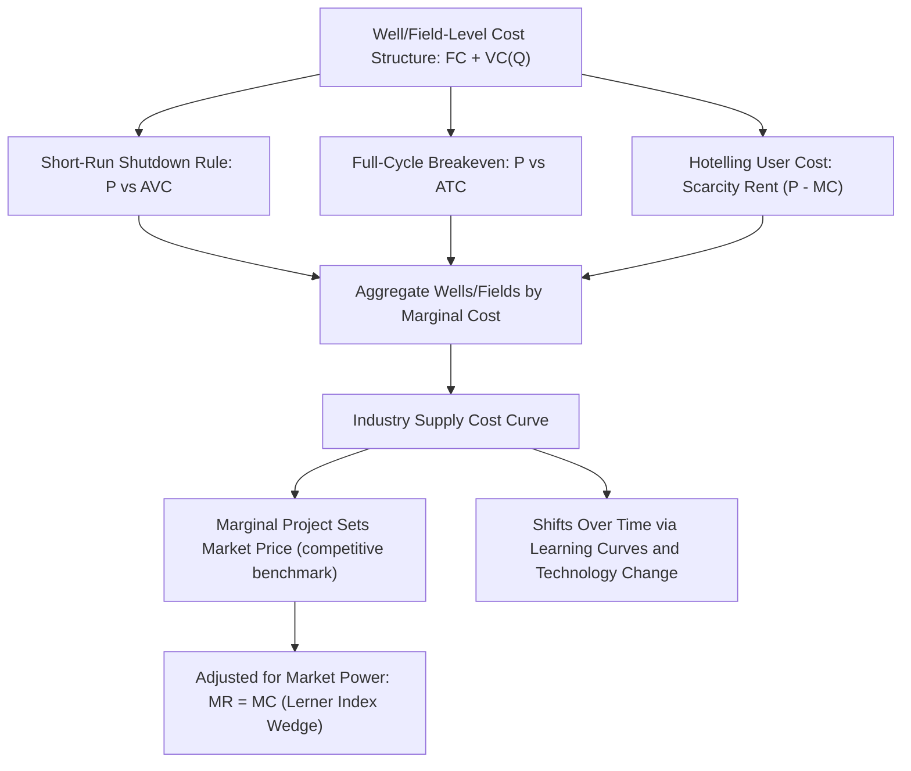

## Producer Theory, Cost Curves, and Marginal Cost of Extraction

### Conceptual Foundation

Producer theory models firm behavior as cost minimization subject to a production technology, followed by output/profit maximization given market price. In energy economics, this framework is adapted to capture the distinctive features of extractive resource production — depletable reserves, geological heterogeneity, high sunk capital costs, and long project lead times — which cause energy supply cost curves to behave quite differently from standard manufacturing cost structures.

### Standard Production and Cost Framework

#### Production Function

$$Q = F(L, K, R)$$

Where $L$ = labor, $K$ = capital (rigs, wells, refining/processing equipment), and $R$ = resource-specific inputs (reservoir quality, reserve accessibility). Extractive energy production functions frequently exhibit **non-constant returns** driven by geology: as extraction proceeds, remaining resource quality typically declines (easier, cheaper deposits are exploited first), a phenomenon absent from a generic manufacturing production function.

#### Cost Functions

Total cost is decomposed into fixed and variable components:

$$TC(Q) = FC + VC(Q)$$

From which standard derived cost curves follow:

$$AFC = \frac{FC}{Q}, \quad AVC = \frac{VC(Q)}{Q}, \quad ATC = \frac{TC(Q)}{Q} = AFC + AVC$$

$$MC = \frac{dTC}{dQ} = \frac{dVC}{dQ}$$

**Key Points**

- In extractive industries, $FC$ often includes exploration, appraisal, and capital expenditure on wells/platforms/mines — frequently sunk once committed, which materially affects short-run shutdown decisions (see below).
- $VC(Q)$ includes lifting costs, energy inputs for extraction, labor, and maintenance — but critically, in depletable-resource contexts, $VC$ also implicitly depends on cumulative extraction to date, not just the current period's output rate (see user-cost/Hotelling discussion below).

### The Short-Run Shutdown Rule Applied to Extraction

Standard theory: a firm continues producing in the short run as long as price covers average variable cost, since fixed costs are sunk regardless of the output decision:

$$P \geq AVC(Q) \Rightarrow \text{produce}; \quad P < AVC(Q) \Rightarrow \text{shut down}$$

**Key Points**

- This explains why, during severe price collapses (e.g., 2020 oil price crash), producers with low operating (lifting) costs continued producing even when prices fell well below full-cycle breakeven — because sunk drilling/platform capital costs are irrelevant to the continue/shutdown margin once already committed.
- However, extraction involves an added wrinkle absent from standard manufacturing: shutting in a well is not always costless or instantly reversible — reservoir damage, well integrity issues, and restart costs can make temporary shut-in economically or technically undesirable even at a loss, introducing a real-options dimension to the shutdown decision. [Inference: the materiality of this effect varies significantly by reservoir type and well design.]

### Marginal Cost of Extraction: The Depletable Resource Extension

#### Static Marginal Cost vs. User Cost (Hotelling's Rule)

For a non-renewable resource, the firm's extraction decision involves an intertemporal tradeoff: extracting one more unit today means one fewer unit available for extraction (at potentially higher future prices) later. This is formalized by Hotelling's Rule.

The firm maximizes the present value of profit across an extraction horizon:

$$\max \sum_{t=0}^{T} \frac{[P_t - MC(Q_t)]Q_t}{(1+r)^t} \quad \text{s.t.} \quad \sum_{t=0}^T Q_t \le \bar{R}$$

Where $\bar{R}$ is the fixed total reserve. The first-order condition yields the **Hotelling Rule**: the marginal net return (scarcity rent, or "user cost") on an extracted unit must grow at the rate of interest along an efficient extraction path:

$$\frac{d(P_t - MC_t)}{dt} = r(P_t - MC_t)$$

Equivalently, in discrete/simplified form:

$$P_t - MC_t = (P_0 - MC_0)(1+r)^t$$

**Key Points**

- $(P_t - MC_t)$ is the **scarcity rent** or **user cost of depletion** — the shadow value of one unit of in-ground reserve, reflecting the opportunity cost of extracting now rather than later.
- Under Hotelling's baseline assumptions (constant marginal extraction cost, fixed reserves, perfect foresight, no technological change, competitive markets), the theory predicts the scarcity rent — and hence, holding $MC$ constant, the price — should rise over time at rate $r$.
- Empirically, observed long-run resource price paths have frequently diverged substantially from this simple prediction (prices have not shown a persistent, smooth exponential rise across most historical periods for oil, coal, or metals). Commonly cited explanations include ongoing resource discovery, technological cost reductions (offsetting the pure scarcity effect), demand-side shocks, and market power effects overlaying the competitive Hotelling baseline. [Inference: the empirical failure of the strict Hotelling prediction is well documented in the literature, but the relative weight of each explanatory factor remains actively debated and is not fully resolved.]

#### Full Marginal Cost Decomposition

For applied resource economics, marginal cost is often decomposed as:

$$MC_t^{full} = MC_t^{extraction} + MC_t^{user cost}$$

Where $MC_t^{extraction}$ is the direct physical/engineering marginal cost (labor, energy, materials to extract one more unit) and $MC_t^{user cost}$ is the Hotelling scarcity rent reflecting depletion.

### The Supply Cost Curve (Cost Curve / Merit-Order-of-Extraction)

Because reserve quality is heterogeneous across deposits (different fields, wells, seams, or resource grades), the industry-wide marginal cost of extraction is commonly represented as an upward-sloping **supply cost curve**, ranking available reserves/projects from lowest to highest marginal cost.

supply_cost_curve_by_resource_type (svg_diagram)

<svg xmlns="http://www.w3.org/2000/svg" viewBox="0 0 720 440" font-family="Helvetica, Arial, sans-serif">
<rect x="0" y="0" width="720" height="440" fill="#ffffff" />
<text x="360" y="28" text-anchor="middle" font-size="18" font-weight="bold" fill="#1a1a1a">Global Oil Supply Cost Curve (svg_diagram)</text>
<line x1="80" y1="380" x2="660" y2="380" stroke="#333" stroke-width="2" />
<line x1="80" y1="380" x2="80" y2="50" stroke="#333" stroke-width="2" />
<text x="665" y="385" font-size="13" fill="#333">Cumulative Reserves (bbl)</text>
<text x="30" y="55" font-size="13" fill="#333">\$/bbl Breakeven</text>
<rect x="80" y="340" width="60" height="40" fill="#2ea043" />
<text x="82" y="360" font-size="10" fill="#fff">Onshore ME</text>
<rect x="140" y="310" width="70" height="70" fill="#57ab5a" />
<text x="145" y="350" font-size="10" fill="#fff">Onshore Other</text>
<rect x="210" y="270" width="90" height="110" fill="#79c0ff" />
<text x="215" y="330" font-size="10" fill="#111">Shale/Tight Oil</text>
<rect x="300" y="220" width="90" height="160" fill="#f0b429" />
<text x="305" y="305" font-size="10" fill="#111">Shallow Offshore</text>
<rect x="390" y="150" width="100" height="230" fill="#e8590c" />
<text x="400" y="270" font-size="10" fill="#fff">Deepwater</text>
<rect x="490" y="90" width="100" height="290" fill="#d1242f" />
<text x="495" y="240" font-size="10" fill="#fff">Oil Sands / Arctic</text>

<text x="150" y="415" font-size="12" fill="#555">Firms/projects to the left have lower breakeven cost and are extracted/developed first under efficient allocation.</text>

</svg>

**Key Points**

- The **marginal (last-needed) project** on this curve, given prevailing demand, determines the market-clearing price under competitive conditions — analogous to the merit-order concept in electricity generation, but applied to a stock of heterogeneous-quality reserves rather than a flow of generation capacity.
- Technological change (e.g., improvements in hydraulic fracturing and horizontal drilling for shale oil) can shift entire cost-curve segments downward and leftward over time, which is one reason shale/tight oil supply cost estimates fell substantially over the 2010s. [Inference: general documented trend; specific magnitude depends on time period, basin, and cost-accounting methodology used in a given study.]
- These cost curves inform long-run supply elasticity: a flatter (more bunched) portion of the curve implies more price-elastic supply in that output range, while a steep segment implies inelastic supply.

### Returns to Scale and Long-Run Cost Behavior

$$LRAC(Q) = \min_{K} \left[\frac{TC(Q,K)}{Q}\right]$$

- **Economies of scale**: common in midstream/downstream segments (pipelines, LNG liquefaction trains, refineries) where large fixed capital costs are spread over higher throughput, producing declining long-run average cost over a substantial output range — a factor supporting natural-monopoly characteristics in transport/network segments.
- **Diseconomies of scale in extraction**: as a given field or basin is developed further, marginal wells often access lower-quality or harder-to-reach resource, producing rising marginal cost with cumulative extraction — the opposite tendency from manufacturing scale economies, and specific to resource depletion.

### Learning Curves and Cost Reduction Over Time

Distinct from static returns to scale, extractive and energy-technology costs frequently exhibit **learning-curve** (experience-curve) effects, where unit cost falls with *cumulative* production/deployment (not current-period output):

$$C(N) = C_1 \cdot N^{-b}$$

Where $C(N)$ is the cost at cumulative production/installation level $N$, $C_1$ is the cost of the first unit, and $b$ relates to the "learning rate" (percentage cost reduction per doubling of cumulative output).

**Key Points**

- This is the standard framework used to explain the sustained, rapid decline in solar photovoltaic and battery storage costs over recent decades, distinguishing technology learning effects from short-run marginal cost of operation.
- Learning-curve effects operate over a much longer horizon than the standard short-run cost curves discussed above and are typically analyzed separately in technology-diffusion and innovation-economics literature, though they interact with long-run supply cost curves by shifting them downward over time.

### Profit Maximization and the Marginal Cost Rule

Under price-taking (competitive) assumptions, the profit-maximizing output satisfies:

$$P = MC(Q^*)$$

Under market power (e.g., an OPEC member internalizing its effect on world price, or a dominant generator in a concentrated power market), the condition instead follows marginal revenue equals marginal cost:

$$MR(Q^*) = MC(Q^*), \quad \text{where } MR = P\left(1 + \frac{1}{E_d}\right)$$

**Key Points**

- This is why the standard $P=MC$ competitive benchmark requires adjustment for extraction economics in markets with significant producer concentration; the wedge between $P$ and $MC$ under market power is captured by the Lerner Index discussed in the supply-demand equilibrium context: $L = (P-MC)/P = -1/E_d$ at the optimum.

### Applied Example: Break-Even Analysis for a Shale Oil Well

**Example**

A shale oil well has the following illustrative cost structure over its production life:

- Drilling and completion (sunk fixed cost): $6,000,000
- Estimated ultimate recovery (EUR): 400,000 barrels
- Variable lifting cost: $12/barrel
- Discount rate: 10% (simplified as a single-period approximation for illustration)

**Full-cycle breakeven price** (covering both fixed and variable cost, amortized over EUR, ignoring discounting for simplicity):

$$P_{breakeven}^{full} = \frac{FC}{EUR} + VC = \frac{6{,}000{,}000}{400{,}000} + 12 = 15 + 12 = \$27/\text{bbl}$$

**Short-run shutdown price** (variable cost only, since drilling capital is already sunk):

$$P_{shutdown} = VC = \$12/\text{bbl}$$

**Output**

- At a market price of $40/bbl, the well is highly profitable on a full-cycle basis (well above $27 breakeven).
- At a market price of $20/bbl, the well is unprofitable on a full-cycle basis (below $27) but the operator will *still choose to continue producing* in the short run, since $20 exceeds the $12 shutdown threshold — new drilling activity would likely pause, but existing wells keep flowing.
- At a market price of $10/bbl, price falls below even the $12 variable cost threshold, and shutting in the well becomes the profit-maximizing short-run choice (subject to the reservoir-integrity caveats noted earlier). [Note: numbers are illustrative for pedagogical purposes, not representative of a specific real-world well or basin.]

### Cost Curve Concepts Summary Table

| Concept | Formula | Energy Economics Interpretation |
| --- | --- | --- |
| Average Variable Cost | $AVC = VC(Q)/Q$ | Short-run shutdown threshold (lifting costs) |
| Average Total Cost | $ATC = TC(Q)/Q$ | Full-cycle breakeven (drilling + lifting) |
| Marginal Cost | $MC = dTC/dQ$ | Basis for competitive supply curve |
| User Cost (Hotelling Rent) | $P_t - MC_t$ | Scarcity value of in-ground reserves |
| Learning Curve | $C(N) = C_1 N^{-b}$ | Long-run technology cost decline (solar, batteries) |
| Lerner Index | $L = (P-MC)/P$ | Degree of market power exercised over price |

### Diagram: From Well-Level Cost to Industry Supply Curve

### Common Pitfalls in Applying Producer Theory to Extraction

- Confusing full-cycle breakeven cost (relevant to new investment decisions) with short-run variable/shutdown cost (relevant to already-sunk production decisions) — a frequent source of confusion in interpreting why producers "keep pumping" at prices below commonly cited breakeven levels.
- Applying the strict Hotelling Rule prediction (smooth exponential price rise) as a literal empirical forecast, without accounting for technological change, new discoveries, and demand shocks that have historically dominated pure scarcity effects.
- Treating extraction cost curves as static, when learning-curve effects and technological improvement can shift them meaningdfully over multi-year to multi-decade horizons (particularly relevant for renewables and unconventional oil/gas).
- Ignoring reservoir-engineering constraints (restart costs, integrity risk) that can make the textbook shutdown rule an incomplete description of real-world shut-in decisions — behavior may vary by well type, reservoir characteristics, and operator-specific engineering considerations. [Inference]
- Applying a competitive $P=MC$ benchmark uncritically to segments of the energy value chain (pipelines, LNG terminals, OPEC-influenced crude supply) where natural monopoly or cartel dynamics require an adjusted framework.

### **Related Topics**

- Hotelling's Rule and dynamic optimization of non-renewable resource extraction
- Learning curves and experience-curve cost modeling for renewable technologies
- Real options theory applied to shut-in/restart decisions in resource extraction
- Natural monopoly cost structures in pipeline and LNG infrastructure
- OPEC and market power: Lerner Index applications to crude oil supply
- Full-cycle vs. half-cycle breakeven cost analysis in upstream project evaluation
- Reserve reporting standards (proved, probable, possible) and their link to cost-curve construction
- Technological change and cost-curve shifts in shale/tight oil development
- Scarcity rent estimation and empirical tests of the Hotelling prediction