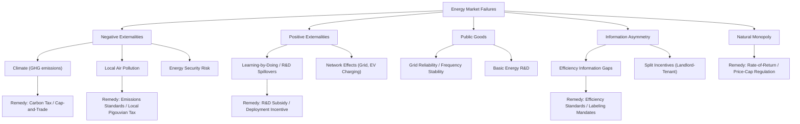

## Externalities and Market Failure in Energy Systems

### Conceptual Foundation

A market failure occurs when unregulated market outcomes fail to achieve allocative efficiency — the socially optimal allocation of resources. Energy systems are among the most externality-intensive sectors in the economy: combustion-based energy production imposes costs on third parties (pollution, climate damage) that are not reflected in market prices, while certain energy investments (grid infrastructure, R&D, energy security) generate benefits that spill over beyond the paying party. This chapter formalizes these divergences between private and social costs/benefits and the standard economic remedies.

### Externalities: Formal Definition

An externality exists when an economic agent's production or consumption decision affects the utility or production possibilities of a third party not involved in the transaction, without that effect being reflected in market price.

$$MSC = MPC + MEC$$

Where $MSC$ = marginal social cost, $MPC$ = marginal private cost, and $MEC$ = marginal external cost (the uncompensated cost imposed on third parties).

For a **negative externality** (the dominant case in energy), $MEC > 0$, so $MSC > MPC$, meaning the market — which equates supply/demand based only on $MPC$ — produces at a level exceeding the socially efficient quantity.

### The Negative Externality Diagram: Overproduction Under Market Pricing

negative_externality_diagram (svg_diagram)

<svg xmlns="http://www.w3.org/2000/svg" viewBox="0 0 700 440" font-family="Helvetica, Arial, sans-serif">
<rect x="0" y="0" width="700" height="440" fill="#ffffff" />
<text x="350" y="28" text-anchor="middle" font-size="18" font-weight="bold" fill="#1a1a1a">Negative Externality: Market vs. Social Optimum (svg_diagram)</text>
<line x1="90" y1="380" x2="640" y2="380" stroke="#333" stroke-width="2" />
<line x1="90" y1="380" x2="90" y2="50" stroke="#333" stroke-width="2" />
<text x="645" y="385" font-size="13" fill="#333">Quantity (energy output)</text>
<text x="45" y="55" font-size="13" fill="#333">Price / Cost</text>

<path d="M 150 90 L 580 370" stroke="#1f6feb" stroke-width="2.5" fill="none" />
<text x="500" y="355" font-size="12" fill="#1f6feb" font-weight="bold">Demand (MPB = MSB)</text>

<path d="M 150 370 L 520 130" stroke="#2ea043" stroke-width="2.5" fill="none" />
<text x="500" y="122" font-size="12" fill="#2ea043" font-weight="bold">MPC (Supply)</text>

<path d="M 150 290 L 460 100" stroke="#d1242f" stroke-width="2.5" fill="none" stroke-dasharray="6,4" />
<text x="440" y="92" font-size="12" fill="#d1242f" font-weight="bold">MSC = MPC + MEC</text>

<circle cx="400" cy="225" r="5" fill="#111" />
<text x="408" y="220" font-size="11" fill="#111">Market Eq. (Q_market)</text>

<circle cx="310" cy="270" r="5" fill="#111" />
<text x="150" y="265" font-size="11" fill="#111">Social Optimum (Q*)</text>
<line x1="400" y1="225" x2="400" y2="380" stroke="#888" stroke-width="1" stroke-dasharray="3,3" />
<line x1="310" y1="270" x2="310" y2="380" stroke="#888" stroke-width="1" stroke-dasharray="3,3" />

<path d="M 310 270 L 400 225 L 400 300 Z" fill="#f0b429" fill-opacity="0.4" stroke="#f0b429" stroke-width="1.5" />
<text x="345" y="265" font-size="10" fill="#7d5a00">DWL</text>

<text x="80" y="415" font-size="12" fill="#555">Unpriced external cost causes market output (Q_market) to exceed the socially efficient level (Q*), creating deadweight loss.</text>

</svg>

**Key Points**

- The gap between $Q_{market}$ and $Q^*$ represents overproduction/overconsumption of the externality-generating good, and the shaded region represents the deadweight loss from this misallocation.
- This framework applies most directly to combustion-based energy (coal, oil, natural gas power generation, vehicle fuel combustion), where local air pollutants and greenhouse gas emissions constitute the marginal external cost.

### Major Categories of Energy-Related Externalities

#### 1. Climate Externality (Greenhouse Gas Emissions)

The archetypal energy externality: CO2 and other greenhouse gases from fossil fuel combustion contribute to global climate change, imposing costs (extreme weather, sea-level rise, agricultural disruption, health impacts) distributed globally and intergenerationally, entirely disconnected from the point of emission.

**Key Points**

- This is characterized as a **global public bad** — non-excludable and non-rival in its damage — meaning no single jurisdiction can unilaterally solve the externality through domestic policy alone, motivating international coordination frameworks (e.g., UNFCCC processes, Paris Agreement) alongside domestic pricing instruments.
- The standard valuation tool is the **Social Cost of Carbon (SCC)**: an estimate of the discounted present value of damages from emitting one additional ton of CO2, used to calibrate carbon taxes or evaluate policy via cost-benefit analysis. Published SCC estimates vary substantially depending on discount rate assumptions, damage function specification, and modeling framework (e.g., DICE, FUND, PAGE integrated assessment models); given the sensitivity of SCC estimates to methodology and the fact that official government figures are periodically revised, a targeted search is recommended for any current official SCC figure needed for policy application. [Unverified as a specific current number — treat any cited dollar figure as time- and methodology-dependent rather than a fixed constant.]

#### 2. Local Air Pollution

Combustion of fossil fuels (particularly coal and diesel) releases particulate matter (PM2.5), sulfur dioxide (SO2), nitrogen oxides (NOx), and other pollutants causing localized health damages (respiratory and cardiovascular disease, premature mortality) concentrated near emission sources.

**Key Points**

- Unlike the climate externality, local air pollution damages are geographically concentrated, meaning unilateral domestic policy (e.g., emissions standards, local pollutant taxes) can directly and fully internalize this cost without requiring international coordination.
- Health-damage-based valuation (e.g., cost-per-ton estimates for PM2.5 or SO2 based on epidemiological dose-response functions and value-of-statistical-life estimates) is the standard methodology, distinct from the climate-damage valuation used for CO2.

#### 3. Energy Security Externality

Reliance on imported fuels, particularly from geopolitically volatile regions, can create externalities where individual consumption decisions do not account for macroeconomic vulnerability to supply disruption or price shocks borne collectively by the economy (e.g., strategic reserve costs, defense expenditures related to securing supply routes). [Inference: this is a recognized concept in the energy security literature, though quantification of the externality's magnitude is more contested and methodologically varied than climate/local pollution externalities.]

#### 4. Positive Externalities: Learning-by-Doing and Innovation Spillovers

Not all energy externalities are negative. Investment in emerging clean energy technologies (solar, batteries, advanced nuclear, carbon capture) can generate **knowledge spillovers**: a firm's R&D or deployment experience reduces costs for the entire industry (not just the investing firm), an externality the private investor cannot fully capture and is therefore undersupplied relative to the social optimum.

$$MSB = MPB + MEB$$

Where $MEB$ = marginal external benefit. Underprovision occurs because private actors invest based only on $MPB$, yielding less investment than the social optimum where $MSB$ is fully accounted for.

**Key Points**

- This underpins the standard economic rationale for public R&D funding, feed-in tariffs, and deployment subsidies for early-stage clean energy technologies — correcting underinvestment from a positive externality is analytically distinct from, though often bundled with, correcting the negative climate externality from fossil fuels.
- Network externalities also apply to grid infrastructure and electric vehicle charging infrastructure: the value of a charging network to any individual user rises with the number of other users/stations, a classic positive-feedback (network effect) market failure that can justify coordinated infrastructure investment.

### Other Sources of Market Failure in Energy Systems

Beyond externalities, several additional market-failure categories are relevant:

#### Public Goods Characteristics

- **Grid reliability and frequency stability** in electricity systems have public-good-like characteristics (non-excludable, non-rival within the interconnected system), motivating system-operator functions and ancillary service markets that would not emerge from a purely bilateral trading framework.
- **Basic energy R&D** often exhibits public-good characteristics (non-rival, difficult to fully exclude non-payers via patents alone), reinforcing the innovation-spillover rationale above.

#### Information Asymmetry

- **Energy efficiency information gaps**: consumers/renters often lack full information about the true energy performance of buildings, appliances, or vehicles at the point of purchase, a case examined extensively in the energy efficiency gap literature (see consumer theory discussion).
- **Split incentives**: as discussed in the household-production framework, landlord-tenant and builder-buyer relationships create principal-agent problems where the decision-maker on efficiency investment does not bear the energy cost consequence.

#### Natural Monopoly (Structural Market Failure)

As covered in the market structures topic, natural monopoly in transmission/distribution networks is itself a form of market failure distinct from externalities — requiring economic regulation rather than Pigouvian correction.

### Standard Policy Remedies

#### 1. Pigouvian Taxation

A tax set equal to the marginal external cost at the socially efficient quantity internalizes the externality by aligning private cost with social cost:

$$t^* = MEC(Q^*)$$

This is the theoretical basis for **carbon taxes**: setting $t = SCC$ theoretically induces firms and consumers to reduce emissions to the point where marginal abatement cost equals the tax, replicating the socially efficient outcome under standard assumptions (competitive markets, correctly estimated SCC, no other distorting market failures).

**Key Points**

- Carbon tax design questions include: point of taxation (upstream at fuel extraction/import vs. downstream at emission source), revenue use (general revenue, rebates/dividends, or earmarked for clean energy investment), and border adjustment mechanisms to address competitiveness/leakage concerns for trade-exposed industries.
- As discussed in the consumer-theory context, carbon/energy taxes can be regressive in incidence, motivating rebate or dividend mechanisms designed to preserve the price-signal efficiency benefit while offsetting distributional impact.

#### 2. Cap-and-Trade (Tradable Permits)

An alternative instrument sets a fixed aggregate emissions cap and allocates/auctions tradable permits, allowing the market to discover the efficient marginal abatement cost (equivalent to price) through trading:

$$\bar{E} = \sum_i e_i, \quad \text{permits traded until } MAC_i = MAC_j \, \forall i,j$$

**Key Points**

- Under the Coase-Theorem-adjacent logic underlying cap-and-trade, if transaction costs are low, the initial permit *allocation* (grandfathered vs. auctioned) does not affect the efficiency of the final abatement outcome — only the distribution of costs/rents across firms — though this result depends on idealized assumptions (competitive permit market, negligible transaction costs) that may not fully hold in practice. [Inference: theoretical result well-established in environmental economics; empirical deviations from the idealized Coasean equivalence are documented but context-dependent.]
- Price vs. quantity instrument choice (tax vs. cap-and-trade) has a classic theoretical resolution in the **Weitzman (1974) framework**: when marginal abatement cost curves are uncertain and steeper than marginal damage curves, a price instrument (tax) is generally preferred; when marginal damage curves are steeper (as some argue applies near climate tipping points), a quantity instrument (cap) is generally preferred. [Inference: this is a well-known theoretical result; its practical application to real-world climate policy design remains a subject of ongoing debate given uncertainty about the true shape of both curves.]

#### 3. Command-and-Control Regulation

Direct regulatory standards (emissions limits per unit output, technology mandates, fuel efficiency standards such as CAFE standards) bypass price mechanisms entirely, mandating specific technical outcomes.

**Key Points**

- Generally considered less cost-effective than price-based (tax/cap-and-trade) instruments in standard economic analysis, because uniform standards do not equalize marginal abatement cost across heterogeneous firms/sources — some firms face much higher compliance costs than others for the same required reduction.
- Nonetheless widely used in practice due to political feasibility, administrative simplicity, and effectiveness in addressing market failures (e.g., information asymmetry, split incentives) that price instruments alone do not fully correct — efficiency standards for appliances/vehicles are a direct response to the energy-efficiency-gap market failure discussed under consumer theory, not solely to the externality problem.

#### 4. Direct Subsidies for Positive-Externality Technologies

Subsidies (production tax credits, investment tax credits, feed-in tariffs) targeting clean energy deployment are the standard remedy for the innovation-spillover positive externality, calibrated ideally to the magnitude of $MEB$ (though in practice often set based on policy/budgetary considerations rather than a precisely estimated spillover value). [Inference: precise calibration to a measured MEB is the theoretical ideal; actual subsidy levels in most jurisdictions reflect a mix of economic and political-economy considerations.]

### Policy Instrument Comparison Table

| Instrument | Mechanism | Price Certainty | Quantity Certainty | Key Advantage | Key Limitation |
| --- | --- | --- | --- | --- | --- |
| Carbon Tax | Fixed price per ton | High | Low | Administrative simplicity, revenue stability | Emissions outcome uncertain |
| Cap-and-Trade | Fixed quantity, tradable permits | Low (unless price collar) | High | Guarantees emissions target | Price volatility |
| Command-and-Control | Mandated technology/standard | N/A | Moderate | Addresses non-price market failures directly | Cost-ineffective across heterogeneous sources |
| Subsidy | Payment per unit of clean output/investment | N/A | Low | Directly corrects underinvestment (positive externality) | Fiscal cost; potential for misallocation absent good targeting |

### Diagram: Market Failure Types in Energy Systems

### Applied Example: Setting a Pigouvian Carbon Tax

**Example**

Suppose the marginal private cost (supply) of coal-fired electricity is $MPC = 20 + 0.1Q$ ($/MWh), demand is $P = 100 - 0.2Q$, and the marginal external cost from emissions is estimated at a constant $MEC = \$15$/MWh.

**Market equilibrium (ignoring externality):**

$$100 - 0.2Q = 20 + 0.1Q \Rightarrow 80 = 0.3Q \Rightarrow Q_{market} = 266.7, \, P_{market} = 46.7$$

**Social optimum (internalizing MEC):**

$$MSC = MPC + MEC = 35 + 0.1Q$$

$$100 - 0.2Q = 35 + 0.1Q \Rightarrow 65 = 0.3Q \Rightarrow Q^* = 216.7$$

**Required Pigouvian tax** to achieve $Q^*$: set $t = MEC = \$15$/MWh (a constant marginal external cost implies a flat per-unit tax equal to that value achieves the social optimum directly in this simplified linear case).

**Output**

- Without correction, the market overproduces by $266.7 - 216.7 = 50$ MWh relative to the efficient level.
- A $15/MWh tax shifts the effective private supply curve up by the external cost, moving the market to the socially efficient quantity of 216.7 MWh.
- This numeric example uses simplified linear functional forms and a constant $MEC$ for illustrative clarity; real-world marginal external cost curves are typically nonlinear and location/technology-specific, requiring empirical estimation rather than an assumed constant. [Note: illustrative example, not a calibrated real-world estimate.]

### Common Pitfalls in Externality and Market Failure Analysis

- Treating all energy externalities as equivalent to the climate externality, when local pollution, energy security, and innovation spillovers each have distinct geographic scope, valuation methodology, and appropriate policy remedy.
- Assuming a single "correct" Social Cost of Carbon figure exists independent of discount rate and damage function assumptions — published SCC estimates are model- and assumption-dependent and should be sourced from current, specific studies rather than treated as a fixed universal constant.
- Applying the Coase Theorem's allocation-neutrality result (permit allocation doesn't affect efficiency) without acknowledging its dependence on low transaction costs and well-functioning markets, conditions that may not fully hold in real permit markets. [Inference]
- Confusing positive-externality market failures (innovation spillovers, network effects) with negative-externality market failures (emissions) when designing policy — these require different instruments (subsidies vs. taxes/caps) and are not simply mirror images of one another in practical policy design.
- Overlooking non-externality market failures (information asymmetry, split incentives, public goods) when evaluating whether a carbon price alone is sufficient policy, since these failures require complementary instruments (standards, disclosure mandates, R&D funding) that a price signal alone does not fully address.

### **Related Topics**

- Social Cost of Carbon estimation methodologies (DICE, FUND, PAGE integrated assessment models)
- Carbon tax vs. cap-and-trade design: the Weitzman price-versus-quantity framework
- Coase Theorem and its application/limitations in tradable permit market design
- Learning curves and the innovation-spillover rationale for clean energy subsidies
- Energy efficiency gap and information asymmetry as distinct market failures from externalities
- Border carbon adjustments and competitiveness/leakage concerns in unilateral carbon pricing
- Rate-of-return vs. price-cap regulation for natural monopoly network segments
- International climate policy coordination and the global public bad problem
- Value of Statistical Life and health-damage valuation methods for local air pollution