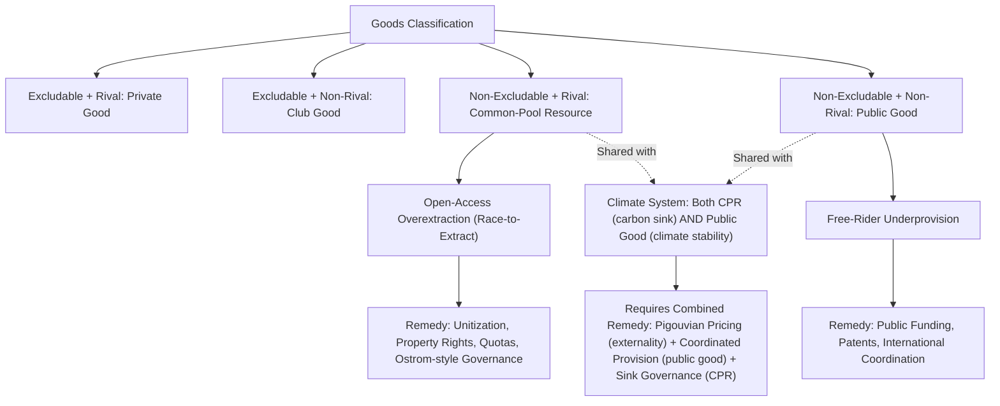

## Public Goods and Common-Pool Resource Problems

### Conceptual Foundation

Goods can be classified along two dimensions: **excludability** (can non-payers be prevented from consuming the good?) and **rivalry** (does one person's consumption reduce availability for others?). This 2×2 classification generates four fundamental goods categories, each associated with a distinct market failure mode. Energy systems contain important examples of all four categories, with common-pool resources and public goods presenting particularly persistent challenges distinct from the simple externality framework covered previously.

### The Goods Classification Matrix

|  | Excludable | Non-Excludable |
| --- | --- | --- |
| **Rival** | Private Goods (e.g., gasoline, coal) | Common-Pool Resources (e.g., groundwater for fracking, fisheries, atmospheric carbon sink) |
| **Non-Rival** | Club Goods (e.g., subscription grid services, toll roads) | Public Goods (e.g., grid frequency stability, basic energy R&D, climate stability) |

**Key Points**

- This classification is analytically distinct from (though sometimes related to) the externality framework: a public good problem arises from the *nature of the good itself* (non-excludable, non-rival), whereas an externality arises from a *side effect* of an otherwise ordinary transaction. Climate stability is illustrative of both frameworks operating simultaneously — GHG emissions are a negative externality from combustion, while the resulting atmospheric capacity to safely absorb carbon is itself a global common-pool resource being depleted.
- The distinction matters for policy design: pure public goods require provision mechanisms (funding a good that would otherwise be undersupplied by private markets), while common-pool resources require access/extraction governance mechanisms (prevent overuse of a resource that is rival but hard to exclude access to).

### Public Goods in Energy Systems

#### Defining Characteristics

A pure public good exhibits both:

- **Non-excludability**: it is technically or economically infeasible to prevent non-payers from benefiting once the good is provided.
- **Non-rivalry**: one party's enjoyment of the good does not diminish its availability to others.

#### The Free-Rider Problem and Underprovision

Because non-payers cannot be excluded, individual agents have an incentive to free-ride on others' provision rather than contribute themselves, leading to systematic underprovision relative to the social optimum in a purely private/voluntary market.

Formally, the socially efficient quantity of a public good satisfies the **Samuelson condition** — summing individual marginal benefits (since the good is non-rival, all consumers benefit simultaneously from a given unit) rather than the standard private-good condition of equating a single marginal benefit to marginal cost:

$$\sum_i MB_i(Q^*) = MC(Q^*)$$

This contrasts with a private good's efficiency condition, $MB_i(Q^*) = MC(Q^*)$ for the marginal individual buyer alone.

**Key Points**

- Voluntary private provision of a public good typically yields far less than $Q^*$, because each individual, in deciding how much to voluntarily contribute, only weighs their own $MB_i$ against the full $MC$, ignoring the benefit accruing to all other consumers — this is the formal mechanism behind free-riding underprovision.

#### Energy Sector Examples of Public Goods

- **Basic energy R&D**: fundamental research (e.g., materials science underlying battery chemistry, novel photovoltaic physics) is largely non-rival (one firm using a scientific insight does not prevent another from using it) and difficult to fully exclude non-payers from benefiting via patents alone, especially for foundational (as opposed to applied/product-specific) research.
- **Grid frequency stability and system reliability**: within an interconnected AC power system, frequency stability is a shared characteristic of the entire system — an individual generator's or consumer's contribution to maintaining stability (or their disruption of it) affects all connected parties simultaneously, and stability cannot be selectively provided to paying customers only within a synchronous grid.
- **Energy security / strategic reserves**: national strategic petroleum reserves provide a buffer against supply shocks that benefits the entire economy non-exclusively, motivating public (rather than purely private) provision. [Inference: characterization as a public good is a standard framing in the energy security literature, though some elements of energy security provision have partially excludable/club-good characteristics depending on the specific arrangement.]
- **Climate stability**: a textbook global public good — non-excludable (no country can be excluded from the benefits of a stabilized climate) and non-rival (one country's benefit from climate stability does not reduce another's) at a planetary scale.

#### Standard Remedies for Public Goods Underprovision

- **Public/government provision and funding**: direct government funding of basic energy R&D (national laboratories, research grants) is the most common real-world remedy, since taxation can overcome the free-rider problem by making contribution compulsory.
- **Patent systems and intellectual property**: converts otherwise non-excludable knowledge into a temporarily excludable private good, creating an incentive for private R&D investment despite the underlying non-rivalry — though this is an imperfect fix, since patents only address applied/near-market innovation well and are less effective for foundational research (see innovation-spillover discussion under externalities).
- **International agreements and coordination mechanisms**: for global public goods like climate stability, coordination frameworks (UNFCCC processes, Paris Agreement architecture) attempt to overcome the international free-rider problem, though enforcement remains a persistent challenge given the absence of a supranational enforcement authority. [Inference: general characterization of the coordination challenge; the specific state of any international agreement's provisions requires current sourcing.]

### Common-Pool Resources in Energy Systems

#### Defining Characteristics

A common-pool resource (CPR) is **rival** (one user's extraction reduces availability for others) but **non-excludable** (difficult or costly to prevent access), creating conditions for overexploitation absent effective governance — a dynamic famously termed the **"Tragedy of the Commons"** (Hardin, 1968).

#### The Open-Access Overexploitation Problem

Under open access (no restriction on entry/extraction), individual extractors do not account for the cost their extraction imposes on other current and future users of the shared resource stock. This produces a wedge analogous to the externality framework, but applied to a shared *stock* rather than a flow externality:

$$MPC_{extractor} < MSC_{resource}$$

Where the difference reflects the **stock externality**: each unit extracted reduces the remaining resource available to all other users, a cost the individual extractor does not bear.

**Key Points**

- This is formally related to, but analytically distinct from, the Hotelling depletable-resource framework covered under producer theory: Hotelling analyzes a *single owner's* optimal intertemporal extraction of a resource they fully control, whereas the common-pool problem analyzes *multiple competing extractors* accessing a shared resource stock, each with an incentive to extract faster than the jointly optimal rate because they cannot be assured of capturing the benefit of restraint (since a rival extractor may capture the resource instead).
- The common-pool dynamic tends to produce **excessively rapid depletion** relative to a single-owner optimum, since competing extractors effectively apply a private discount rate to a resource that also faces displacement risk from rivals — sometimes termed the "common-pool" or "race-to-extract" effect, distinguishing it from the smoother, rent-maximizing extraction path a monopoly resource owner would choose under Hotelling's Rule.

#### Energy Sector Examples of Common-Pool Resources

- **Shared oil/gas reservoirs**: a single geological reservoir may span multiple surface leases held by different operators; absent unitization agreements, competing operators have an incentive to extract as quickly as possible before a rival captures the same oil/gas via nearby wells (documented historically as a driver of excessive early-20th-century drilling density in U.S. oil fields before regulatory and contractual reforms).
- **Groundwater used in resource extraction**: water used for hydraulic fracturing or oil sands processing draws on shared aquifers, where multiple extraction operations can collectively deplete or degrade a resource that no single operator fully controls.
- **Atmospheric carbon sink capacity**: the atmosphere's capacity to absorb greenhouse gases without triggering severe climate damage can be modeled as a global common-pool resource with a finite "budget," where individual emitters (countries, firms) have an incentive to use this shared capacity without bearing the full cost of its depletion — closely related to, and often analyzed alongside, the climate externality framework.
- **Congested transmission corridors and constrained pipeline capacity**: in some contexts, shared infrastructure capacity used by multiple shippers/generators without well-defined property rights can exhibit common-pool-like congestion dynamics, though most modern systems address this via explicit capacity rights/auction mechanisms (see remedies below).

#### Standard Remedies for Common-Pool Resource Problems

- **Unitization agreements** (oil and gas): converting a shared reservoir into a single jointly managed unit, with extraction and revenue shared according to agreed formulas, aligns individual operator incentives with reservoir-wide optimal extraction — a well-documented and long-standing institutional response in petroleum engineering/law.
- **Assigning well-defined property rights**: converting an open-access resource into an excludable private or clearly delineated communal property right (e.g., water rights allocation systems, individual transferable extraction quotas) internalizes the stock externality by giving the rights-holder a direct stake in the resource's future value.
- **Regulatory extraction quotas and licensing**: government-imposed limits on extraction rates or well-spacing requirements (common in oil and gas regulation) directly constrain the race-to-extract dynamic without requiring a full property-rights restructuring.
- **Polycentric/community-based governance**: as documented extensively in Elinor Ostrom's work on common-pool resource governance, many real-world common-pool resources (including some energy-adjacent water and land resources) have been successfully managed through community-designed rules, monitoring, and graduated sanctions, without requiring either full privatization or centralized government control — an important qualification to the pure "tragedy of the commons" narrative, which assumed no such institutional response was possible. [Inference: Ostrom's design principles are a well-established framework in the CPR governance literature; their applicability to any specific modern energy-related resource requires case-specific assessment rather than automatic assumption of success.]

### Diagram: Extraction Path Comparison — Single Owner vs. Common-Pool Competition

extraction_path_comparison_diagram (svg_diagram)

<svg xmlns="http://www.w3.org/2000/svg" viewBox="0 0 700 420" font-family="Helvetica, Arial, sans-serif">
<rect x="0" y="0" width="700" height="420" fill="#ffffff" />
<text x="350" y="28" text-anchor="middle" font-size="18" font-weight="bold" fill="#1a1a1a">Single-Owner vs. Common-Pool Extraction Paths (svg_diagram)</text>
<line x1="90" y1="360" x2="640" y2="360" stroke="#333" stroke-width="2" />
<line x1="90" y1="360" x2="90" y2="50" stroke="#333" stroke-width="2" />
<text x="645" y="365" font-size="13" fill="#333">Time</text>
<text x="35" y="55" font-size="13" fill="#333">Extraction Rate</text>

<path d="M 130 320 C 250 300, 400 250, 600 150" stroke="#2ea043" stroke-width="2.5" fill="none" />
<text x="450" y="200" font-size="12" fill="#2ea043" font-weight="bold">Single-Owner (Hotelling-Optimal)</text>

<path d="M 130 250 C 220 90, 320 80, 400 180 C 480 280, 550 340, 620 350" stroke="#d1242f" stroke-width="2.5" fill="none" stroke-dasharray="6,4" />
<text x="200" y="75" font-size="12" fill="#d1242f" font-weight="bold">Common-Pool (Race-to-Extract)</text>

<text x="100" y="395" font-size="12" fill="#555">Competing extractors front-load extraction relative to the smoother, rent-maximizing single-owner path, risking premature depletion.</text>

</svg>

### The Interaction Between Public Goods, Common-Pool Resources, and Externalities

### Applied Example: Unitization of a Shared Oil Reservoir

**Example**

Consider a reservoir estimated to contain 50 million barrels of recoverable oil, accessible via wells drilled by three separate operators (A, B, C) on adjacent surface leases, with no unitization agreement in place.

**Open-access (no unitization) behavior:**

- Each operator, aware that oil not extracted by them may be captured by a competitor's nearby well (due to reservoir pressure dynamics allowing lateral migration of oil toward whichever well is drilled/pumped most aggressively), has an incentive to drill more wells and extract faster than the reservoir-wide optimal rate.
- This commonly leads to: excessive well density (more wells than the reservoir's optimal drainage pattern requires), faster pressure depletion (reducing the reservoir's natural drive energy and ultimately lowering total recoverable oil), and higher aggregate capital expenditure than a coordinated development plan would require. [Inference: general well-documented historical pattern in the petroleum engineering/economics literature on common-pool reservoir dynamics; the specific magnitude of loss depends on reservoir characteristics and is not a fixed universal figure.]

**Unitized development:**

- Operators A, B, and C agree to jointly manage the reservoir as a single unit, sharing production revenue according to a pre-agreed formula (often based on each party's estimated share of original oil in place), with well placement and production rates determined by reservoir engineers optimizing for total recovery rather than each party's individual extraction race.

**Output**

- Unitization is documented extensively in petroleum economics as generally increasing total ultimate recovery from a shared reservoir (by preserving reservoir pressure/drive mechanisms) while reducing redundant well-drilling capital expenditure, relative to open-access competitive extraction from the same reservoir. [Inference: this is a well-established qualitative conclusion in the petroleum engineering and resource economics literature; exact quantitative recovery-rate improvements are reservoir-specific and require engineering studies rather than a general formula.]

### Public Goods vs. Common-Pool Resources: Key Distinctions Summary

| Dimension | Public Good | Common-Pool Resource |
| --- | --- | --- |
| Rivalry | Non-rival | Rival |
| Core problem | Underprovision (free-riding) | Overexploitation (race-to-extract) |
| Efficiency condition | $\sum_i MB_i = MC$ (Samuelson) | Account for stock externality in extraction |
| Primary remedy category | Funding/provision mechanisms | Access/extraction governance mechanisms |
| Energy example | Basic R&D, grid frequency stability | Shared oil/gas reservoirs, shared groundwater |
| Related but distinct concept | Positive externality (innovation spillovers) | Hotelling single-owner depletion (contrast case) |

### Common Pitfalls in Public Goods and Common-Pool Analysis

- Conflating public goods (non-rival, underprovision problem) with common-pool resources (rival, overexploitation problem) — the two require fundamentally different policy remedies (funding vs. access restriction) despite both stemming from non-excludability.
- Assuming Hardin's original "tragedy of the commons" framing (predicting inevitable overexploitation absent privatization or government control) is the only possible outcome, without acknowledging the extensive empirical and theoretical literature (particularly Ostrom's work) documenting successful community-based governance of common-pool resources under specific institutional conditions.
- Applying the single-owner Hotelling extraction framework to a multi-operator shared reservoir without recognizing that competitive access fundamentally changes the optimal extraction path (faster, less rent-preserving) relative to the coordinated/unitized case.
- Treating patents as a complete solution to the public-goods underprovision problem for energy R&D, when patents address applied/near-market innovation more effectively than foundational/basic research, which often still requires direct public funding.
- Overlooking that some resources (notably the global climate system) simultaneously exhibit public-good and common-pool-resource characteristics, requiring a combined policy response (Pigouvian pricing plus coordinated international provision) rather than a single-instrument fix.

### **Related Topics**

- Elinor Ostrom's design principles for common-pool resource governance
- Unitization and pooling agreements in oil and gas law and reservoir engineering
- Free-rider problem and mechanism design for public goods provision (e.g., Lindahl pricing, Clarke-Groves mechanisms)
- International climate agreements as a response to a combined public-good/common-pool problem
- Patents, intellectual property, and the economics of innovation for energy technology
- Water rights allocation systems and their application to energy-sector water use (fracking, cooling water)
- Strategic petroleum reserves as a public-good response to energy security risk
- Grid reliability standards and system operator functions as public-good provision mechanisms