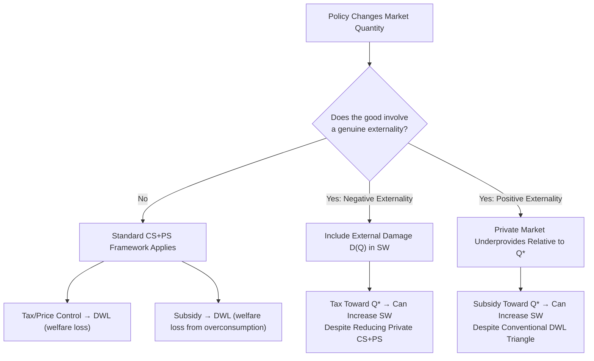

## Welfare Economics and Consumer/Producer Surplus in Energy Markets

### Conceptual Foundation

Welfare economics evaluates market outcomes against efficiency and distributional criteria, using consumer surplus and producer surplus as the standard measures of gains from trade. This chapter integrates concepts introduced in the supply-demand, elasticity, producer theory, and externality discussions into a unified welfare-analytic framework, applying it specifically to policy evaluation questions distinctive to energy markets: taxation, price controls, subsidies, and externality correction.

### Core Definitions

#### Consumer Surplus

Consumer surplus (CS) measures the aggregate difference between what consumers are willing to pay (reflected in the demand curve) and what they actually pay at the market price:

$$CS = \int_0^{Q^*} D(Q)\, dQ - P^* Q^*$$

Geometrically, this is the area below the demand curve and above the market price, up to the equilibrium quantity.

#### Producer Surplus

Producer surplus (PS) measures the aggregate difference between the market price received and the minimum price at which producers would be willing to supply each unit (reflected in the supply/marginal cost curve):

$$PS = P^* Q^* - \int_0^{Q^*} S(Q)\, dQ$$

Geometrically, this is the area above the supply curve and below the market price, up to the equilibrium quantity.

#### Total Surplus and Efficiency

$$TS = CS + PS$$

The competitive equilibrium quantity $Q^*$ (where $P = MC$) maximizes total surplus absent externalities or other market failures — this is the formal statement of the **First Welfare Theorem** as applied to a single market.

surplus_diagram_energy_market (svg_diagram)

<svg xmlns="http://www.w3.org/2000/svg" viewBox="0 0 700 440" font-family="Helvetica, Arial, sans-serif">
<rect x="0" y="0" width="700" height="440" fill="#ffffff" />
<text x="350" y="28" text-anchor="middle" font-size="18" font-weight="bold" fill="#1a1a1a">Consumer and Producer Surplus at Market Equilibrium (svg_diagram)</text>
<line x1="90" y1="380" x2="640" y2="380" stroke="#333" stroke-width="2" />
<line x1="90" y1="380" x2="90" y2="50" stroke="#333" stroke-width="2" />
<text x="645" y="385" font-size="13" fill="#333">Quantity</text>
<text x="45" y="55" font-size="13" fill="#333">Price</text>

<path d="M 150 90 L 580 370" stroke="#1f6feb" stroke-width="2.5" fill="none" />
<text x="500" y="355" font-size="12" fill="#1f6feb" font-weight="bold">Demand</text>

<path d="M 150 370 L 520 100" stroke="#2ea043" stroke-width="2.5" fill="none" />
<text x="500" y="92" font-size="12" fill="#2ea043" font-weight="bold">Supply</text>

<circle cx="365" cy="230" r="5" fill="#111" />
<line x1="365" y1="230" x2="90" y2="230" stroke="#888" stroke-width="1" stroke-dasharray="3,3" />
<line x1="365" y1="230" x2="365" y2="380" stroke="#888" stroke-width="1" stroke-dasharray="3,3" />
<text x="35" y="234" font-size="11" fill="#333">P*</text>
<text x="368" y="398" font-size="11" fill="#333">Q*</text>

<path d="M 150 90 L 365 230 L 90 230 L 90 90 Z" fill="#1f6feb" fill-opacity="0.15" />
<text x="160" y="150" font-size="12" fill="#1f6feb" font-weight="bold">CS</text>

<path d="M 150 370 L 365 230 L 90 230 L 90 370 Z" fill="#2ea043" fill-opacity="0.15" />
<text x="160" y="320" font-size="12" fill="#2ea043" font-weight="bold">PS</text>
</svg>

### Welfare Effects of Price Controls in Energy Markets

#### Price Ceilings

A price ceiling set below the equilibrium price ($P_{ceiling} < P^*$) — historically applied to retail gasoline and natural gas prices in various price-control episodes — creates excess demand (shortage) and a deadweight loss.

$$Q_s(P_{ceiling}) < Q_d(P_{ceiling})$$

**Key Points**

- Consumer surplus effect is ambiguous in direction: consumers who can still obtain the good at the lower price gain a per-unit surplus increase, but total quantity available falls (since suppliers reduce output to $Q_s(P_{ceiling})$), and some consumers who valued the good above $P_{ceiling}$ may be unable to obtain it at all (rationed out) — the net CS change depends on the specific shape of demand and how the shortage is rationed.
- Producer surplus unambiguously falls: producers receive a lower price and produce less quantity, both effects reducing PS relative to the competitive equilibrium.
- Historical price-ceiling episodes on energy goods (e.g., 1970s U.S. gasoline price controls) are frequently cited in the literature as generating well-documented shortages, queuing costs (time spent waiting, itself a real resource cost not captured in simple surplus triangles), and black-market activity — the "deadweight loss" in practice often exceeds the simple triangle shown in textbook diagrams once search/queuing costs are included. [Inference: qualitative pattern well documented in historical accounts of these episodes; precise deadweight loss magnitude estimates vary by study and methodology.]

#### Price Floors

A price floor set above equilibrium ($P_{floor} > P^*$) creates a surplus (excess supply), historically less common for retail energy goods but relevant to some renewable energy support mechanisms (e.g., feed-in tariffs functioning as a price floor for renewable generation).

**Key Points**

- A feed-in tariff set above the market wholesale price guarantees renewable generators a minimum price, increasing producer surplus for renewable generators and incentivizing capacity buildout beyond what the unsubsidized market price would support — while the cost of the floor (the gap between guaranteed price and market price, multiplied by quantity) is typically borne by ratepayers or taxpayers depending on program design, representing a transfer alongside any net welfare cost.

### Welfare Effects of Taxation

#### Per-Unit Tax Incidence and Deadweight Loss

A per-unit tax $t$ (e.g., a fuel excise tax or carbon tax without an underlying externality correction motive) drives a wedge between the price consumers pay ($P_c$) and the price producers receive ($P_p = P_c - t$), reducing equilibrium quantity from $Q^*$ to $Q^t < Q^*$.

$$DWL = \frac{1}{2} \times t \times (Q^* - Q^t)$$

tax_wedge_deadweight_loss_diagram (svg_diagram)

<svg xmlns="http://www.w3.org/2000/svg" viewBox="0 0 700 440" font-family="Helvetica, Arial, sans-serif">
<rect x="0" y="0" width="700" height="440" fill="#ffffff" />
<text x="350" y="28" text-anchor="middle" font-size="18" font-weight="bold" fill="#1a1a1a">Tax Wedge and Deadweight Loss (svg_diagram)</text>
<line x1="90" y1="380" x2="640" y2="380" stroke="#333" stroke-width="2" />
<line x1="90" y1="380" x2="90" y2="50" stroke="#333" stroke-width="2" />
<text x="645" y="385" font-size="13" fill="#333">Quantity</text>
<text x="45" y="55" font-size="13" fill="#333">Price</text>
<path d="M 150 90 L 580 370" stroke="#1f6feb" stroke-width="2.5" fill="none" />
<text x="500" y="355" font-size="12" fill="#1f6feb" font-weight="bold">Demand</text>
<path d="M 150 370 L 520 100" stroke="#2ea043" stroke-width="2.5" fill="none" />
<text x="500" y="92" font-size="12" fill="#2ea043" font-weight="bold">Supply</text>

<circle cx="365" cy="230" r="4" fill="#888" />

<line x1="300" y1="50" x2="300" y2="380" stroke="#888" stroke-width="1" stroke-dasharray="3,3" />
<text x="295" y="398" font-size="11" fill="#333">Q^t</text>

<circle cx="300" cy="175" r="5" fill="#d1242f" />
<text x="35" y="179" font-size="11" fill="#d1242f">P_c</text>
<line x1="300" y1="175" x2="90" y2="175" stroke="#d1242f" stroke-width="1" stroke-dasharray="3,3" />
<circle cx="300" cy="270" r="5" fill="#f0b429" />
<text x="35" y="274" font-size="11" fill="#7d5a00">P_p</text>
<line x1="300" y1="270" x2="90" y2="270" stroke="#f0b429" stroke-width="1" stroke-dasharray="3,3" />

<line x1="310" y1="175" x2="310" y2="270" stroke="#111" stroke-width="1.5" />
<text x="315" y="225" font-size="11" fill="#111">t</text>

<path d="M 300 175 L 300 270 L 365 230 Z" fill="#8250df" fill-opacity="0.35" stroke="#8250df" stroke-width="1.5" />
<text x="320" y="235" font-size="10" fill="#54278f">DWL</text>

<text x="80" y="415" font-size="12" fill="#555">Tax wedge (t) reduces quantity from Q* to Q^t; DWL triangle represents lost surplus from foregone efficient trades.</text>

</svg>

**Key Points**

- **Tax revenue** ($t \times Q^t$) is a transfer from consumers/producers to the government, not itself a welfare loss — the deadweight loss represents only the surplus lost on the trades that no longer occur ($Q^* - Q^t$), not the entire tax payment.
- **Tax incidence** (who bears the burden) depends on relative elasticities, as established in the elasticity chapter: $\frac{\text{Consumer share}}{\text{Producer share}} = \frac{E_s}{|E_d|}$. Because short-run energy demand is typically inelastic relative to supply, energy/fuel taxes tend to fall predominantly on consumers in the short run.
- This standard deadweight-loss framework applies most directly to taxes *without* an underlying externality-correction rationale. When the tax corrects a genuine externality (a Pigouvian tax, as covered in the externalities topic), the welfare calculus changes materially: the "deadweight loss" triangle in the private-market sense is offset (partially or fully) by the avoided external damage, and the socially efficient tax can *increase* total social welfare despite reducing conventionally measured private-market surplus.

### Welfare Analysis with Externalities: Reconciling the Two Frameworks

Combining the externality framework with surplus analysis, total social welfare properly includes external damages:

$$SW = CS + PS - D(Q)$$

Where $D(Q)$ represents cumulative external damage (e.g., climate/local pollution cost) as a function of output.

**Key Points**

- At the unregulated market equilibrium (ignoring externality), $CS+PS$ is maximized in isolation, but $SW$ is *not* maximized because $D(Q)$ is excessive at $Q_{market}$ — this is precisely why the socially efficient quantity $Q^*$ (from the externality chapter) is lower than $Q_{market}$, and why a correctly calibrated Pigouvian tax raises $SW$ even though it reduces conventionally measured $CS+PS$ in the private-market sense.
- This reconciliation is a common point of confusion: a policy that reduces private consumer-plus-producer surplus is not necessarily welfare-reducing once externality costs are correctly netted out — the standard "deadweight loss of taxation" framework applies cleanly only to taxes on goods *without* an externality rationale.

### Welfare Effects of Subsidies

A per-unit subsidy $s$ operates as a negative tax, lowering the price consumers pay below the price producers receive ($P_p = P_c + s$), expanding output beyond $Q^*$.

$$DWL_{subsidy} = \frac{1}{2} \times s \times (Q^{subsidy} - Q^*)$$

**Key Points**

- For a good with no positive externality (e.g., a fossil fuel consumption subsidy), this DWL represents genuine welfare loss from overconsumption relative to the efficient competitive benchmark — a key finding underlying the long-standing policy critique of fossil fuel consumption subsidies in many countries, alongside their well-documented fiscal cost and typically regressive incidence (benefiting higher-consumption, often higher-income households disproportionately in absolute terms). [Inference: general characterization consistent with extensive literature (e.g., IMF, IEA analyses) critiquing fossil fuel consumption subsidies; specific current subsidy magnitudes and country-level incidence data require current sourcing.]
- Conversely, for a good with a genuine *positive* externality (e.g., early-stage clean energy technology exhibiting learning-by-doing spillovers, as covered in the externalities topic), an appropriately calibrated subsidy can move output *toward* rather than away from the social optimum, since the unsubsidized private market underprovides relative to $Q^*$ in that case.

### Welfare Analysis of Market Power

As established in the market structures topic, an unregulated monopolist (or successful cartel) restricts output below the competitive level, transferring surplus from consumers to the monopolist while also generating a net deadweight loss:

$$\Delta CS = -(A + B), \quad \Delta PS = +A - C, \quad DWL = B + C$$

Where $A$ is the surplus transferred from consumers to the monopolist (higher price on the units still sold), and $B+C$ is the deadweight loss triangle from the reduction in traded quantity.

**Key Points**

- This framework directly informs assessment of OPEC+ coordinated production decisions: successful coordination transfers surplus from global oil consumers to producing nations/firms and generates a global deadweight loss, though producing-country perspectives may reasonably weigh the producer-surplus gain (a distributional outcome) differently than a purely global-efficiency welfare criterion would. [Inference: this reflects the standard economic framing of cartel welfare effects; how different stakeholders weigh distributional vs. efficiency outcomes is a normative question outside the scope of positive economic analysis alone.]

### Welfare Analysis Reference Table: Policy Interventions and Surplus Effects

| Intervention | CS Effect | PS Effect | Government Revenue/Cost | Net Welfare (no externality) | Net Welfare (with externality correction) |
| --- | --- | --- | --- | --- | --- |
| Price ceiling (below $P^*$) | Ambiguous (gain per unit, loss from shortage/rationing) | Decrease | None | Decrease (DWL) | N/A (rarely externality-motivated) |
| Price floor (above $P^*$) | Decrease | Ambiguous (higher price, lower quantity sold) | Cost if government purchases surplus | Decrease (DWL) | Can be efficiency-improving if correcting a positive-externality underprovision (e.g., feed-in tariff) |
| Per-unit tax | Decrease | Decrease | Revenue gain (transfer) | Decrease (DWL) | Can increase SW if $t \approx MEC$ (Pigouvian) |
| Per-unit subsidy | Increase | Increase | Fiscal cost (transfer) | Decrease (DWL) if no externality | Can increase SW if correcting positive externality (innovation spillover) |
| Unregulated monopoly/cartel | Decrease | Increase (partial offset) | None | Decrease (DWL) | N/A (separate market failure category) |

### Applied Example: Comparing Tax Welfare Effects With and Without Externality Correction

**Example**

Using the coal-fired electricity example from the externalities topic: demand $P = 100 - 0.2Q$, private supply $MPC = 20 + 0.1Q$, and $MEC = \$15$/MWh (constant).

**Scenario 1 — Tax on a good with no externality** (hypothetical, for contrast): Suppose $MEC = 0$ and a $15/MWh tax is imposed purely for revenue purposes.

- Market equilibrium (no tax): $Q^* = 266.7$, $P^* = 46.7$ (from prior calculation)
- With $15 tax: effective supply becomes $P = 35 + 0.1Q$; new equilibrium: $100-0.2Q = 35+0.1Q \Rightarrow Q^t = 216.7$
- $DWL = \frac{1}{2} \times 15 \times (266.7-216.7) = \frac{1}{2} \times 15 \times 50 = \$375$ (in the same output units as the linear model) — a **pure welfare loss** since there was no externality to correct.

**Scenario 2 — Identical $15 tax, but $MEC = \$15$/MWh is real** (the Pigouvian case from the externalities topic):

- The quantity outcome is mathematically identical ($Q^t = 216.7$), and the *conventionally measured* $CS+PS$ falls by the same $375 in this framework.
- However, because $MEC = \$15$ was genuinely being imposed on third parties at the pre-tax equilibrium, the avoided external damage from reducing output by 50 units is $\approx 15 \times 50 = \$750$ (using the constant-MEC simplification), substantially exceeding the $375 conventional DWL.

**Output**

- In Scenario 1 (no real externality), the tax is purely welfare-reducing: $\Delta SW = -\$375$.
- In Scenario 2 (genuine Pigouvian correction), $\Delta SW = -\$375 \text{ (private surplus loss)} + \$750 \text{ (avoided external damage)} = +\$375$ — a **net welfare gain**, despite the identical reduction in conventionally measured consumer-plus-producer surplus.
- This example illustrates precisely why the same-looking tax and the same-looking "DWL triangle" can represent either a welfare loss or a welfare gain depending entirely on whether a genuine externality is being corrected — the surplus mechanics are identical, but the welfare conclusion inverts. [Note: illustrative simplified numbers carried over from the externalities topic example, not calibrated real-world estimates.]

### Diagram: Welfare Analysis Decision Framework

### Common Pitfalls in Welfare Analysis

- Treating the standard tax/subsidy deadweight-loss framework as universally applicable without checking whether the underlying good involves a genuine externality — the welfare conclusion inverts entirely depending on this distinction, even when the surplus-triangle mechanics look identical.
- Conflating tax revenue (a transfer between parties) with deadweight loss (genuine lost surplus from foregone efficient trades) — only the latter represents an efficiency cost.
- Treating market-power-driven surplus transfer (from consumers to a monopolist/cartel) as equivalent in welfare terms to the accompanying deadweight loss — the transfer component is a distributional issue, while only the DWL component is a pure efficiency loss.
- Ignoring queuing, search, and black-market costs when estimating the welfare cost of price ceilings, which can cause simple textbook DWL triangles to significantly understate real-world welfare losses from binding price controls. [Inference: general pattern documented in historical price-control episodes; exact magnitude is case-specific.]
- Assuming all energy subsidies are welfare-reducing, without distinguishing consumption subsidies for fossil fuels (typically welfare-reducing, no positive externality) from targeted deployment subsidies for early-stage clean technologies with documented learning-spillover characteristics (potentially welfare-improving if properly calibrated).

### **Related Topics**

- First and Second Welfare Theorems and their application to imperfectly competitive energy markets
- Tax incidence formulas and the role of relative elasticities (cross-reference: elasticity chapter)
- Pigouvian taxation and Social Cost of Carbon calibration (cross-reference: externalities chapter)
- Fossil fuel consumption subsidy reform: fiscal, distributional, and welfare analysis
- Feed-in tariffs and renewable portfolio standards as price-floor/quantity-mandate welfare interventions
- Cost-benefit analysis methodology for energy infrastructure and climate policy
- Distributional (equity) weighting in welfare analysis versus pure efficiency criteria
- Deadweight loss estimation under price controls: queuing, rationing, and black-market costs