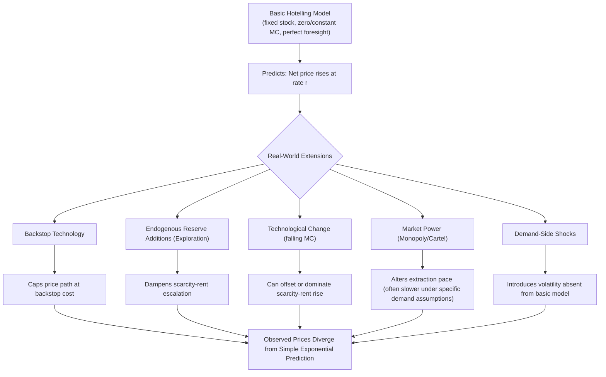

## Hotelling's Rule and the Theory of Optimal Depletion

### Conceptual Foundation

Hotelling's Rule, formalized by Harold Hotelling in his 1931 paper "The Economics of Exhaustible Resources," is the foundational dynamic optimization result in exhaustible resource economics. It addresses a question absent from standard static producer theory: given a fixed, finite stock of a non-renewable resource, how should extraction be allocated across time to maximize the present value of returns from that stock? The rule's central prediction — that the scarcity rent on an efficiently managed exhaustible resource should grow at the rate of interest — has become the benchmark against which real-world depletion patterns, and departures from it, are analyzed throughout energy and resource economics.

### The Intertemporal Optimization Problem

#### Setup

Consider a resource owner with a fixed initial stock $\bar{R}$ (e.g., proven oil reserves), choosing an extraction path $\{q_t\}_{t=0}^{T}$ to maximize the present discounted value of profit, where extraction at any rate is constrained by cumulative depletion of the finite stock:

$$\max_{\{q_t\}} \sum_{t=0}^{T} \frac{[P(q_t) - c(q_t)]\, q_t}{(1+r)^t} \quad \text{subject to} \quad \sum_{t=0}^{T} q_t \le \bar{R}, \quad q_t \ge 0$$

Where $P(q_t)$ is the inverse demand function, $c(q_t)$ is the marginal extraction cost, and $r$ is the discount rate (opportunity cost of capital).

#### Lagrangian and First-Order Conditions

Introducing a Lagrange multiplier $\lambda$ on the exhaustibility constraint (representing the shadow value of one unit of in-ground reserve), the Lagrangian is:

$$\mathcal{L} = \sum_{t=0}^{T} \frac{[P(q_t) - c(q_t)]q_t}{(1+r)^t} + \lambda \left(\bar{R} - \sum_{t=0}^T q_t\right)$$

The first-order condition for each period requires marginal profit (net price) discounted to present value to equal the (constant, undiscounted) shadow value of the resource:

$$\frac{P_t - MC_t}{(1+r)^t} = \lambda \quad \text{for all } t \text{ with } q_t > 0$$

**Key Points**

- Because $\lambda$ is constant across all time periods (it represents the present-value shadow price of the *entire* finite stock, determined once at the outset by the exhaustibility constraint), this condition implies that the *undiscounted* net price $(P_t - MC_t)$ must grow over time to exactly offset discounting — this is the formal origin of Hotelling's Rule.

### The Hotelling Rule: Formal Statement

Rearranging the first-order condition across two adjacent periods yields the canonical continuous-time form:

$$\frac{d(P_t - MC_t)}{dt} = r \cdot (P_t - MC_t)$$

Or in discrete-time form:

$$P_{t+1} - MC_{t+1} = (1+r)(P_t - MC_t)$$

**In words:** the marginal net return from extraction — the **scarcity rent** or **user cost** — must grow at exactly the rate of interest $r$ along an efficient extraction path.

**Key Points**

- If the scarcity rent grew *faster* than $r$, resource owners would have an incentive to extract less now and more later (since delayed extraction offers a higher return than investing the proceeds elsewhere at rate $r$), reducing current supply and raising current price until the growth rate falls back to $r$.
- If the scarcity rent grew *slower* than $r$, owners would have an incentive to extract more now and invest the proceeds in the capital market at rate $r$ rather than leaving the resource in the ground, increasing current supply and lowering current price until the growth rate rises to $r$.
- This is the resource-economics analogue of a no-arbitrage condition: in equilibrium, the resource owner must be indifferent between extracting now versus extracting later, given the option to invest proceeds at the market interest rate.

### Special Case: Zero Marginal Extraction Cost

The simplest and most commonly taught version of Hotelling's Rule assumes $MC = 0$ (extraction is essentially costless, so the entire price is scarcity rent):

$$P_{t+1} = (1+r)P_t \quad \Rightarrow \quad P_t = P_0 (1+r)^t$$

This predicts a smooth **exponential price path** rising at rate $r$ over the resource's extraction horizon.

hotelling_price_path_diagram (svg_diagram)

<svg xmlns="http://www.w3.org/2000/svg" viewBox="0 0 700 420" font-family="Helvetica, Arial, sans-serif">
<rect x="0" y="0" width="700" height="420" fill="#ffffff" />
<text x="350" y="28" text-anchor="middle" font-size="18" font-weight="bold" fill="#1a1a1a">Hotelling Price Path: Zero-Cost Extraction Case (svg_diagram)</text>
<line x1="90" y1="360" x2="640" y2="360" stroke="#333" stroke-width="2" />
<line x1="90" y1="360" x2="90" y2="50" stroke="#333" stroke-width="2" />
<text x="645" y="365" font-size="13" fill="#333">Time</text>
<text x="35" y="55" font-size="13" fill="#333">Price</text>

<path d="M 120 330 C 250 315, 400 270, 500 190 C 560 145, 600 100, 620 70" stroke="#d1242f" stroke-width="2.5" fill="none" />
<text x="440" y="160" font-size="12" fill="#d1242f" font-weight="bold">P_t = P_0(1+r)^t</text>

<line x1="90" y1="70" x2="640" y2="70" stroke="#8250df" stroke-width="1.5" stroke-dasharray="6,4" />
<text x="500" y="63" font-size="12" fill="#8250df" font-weight="bold">Choke Price (P_choke)</text>

<text x="620" y="75" font-size="11" fill="`#8250df`">T*</text>

<line x1="620" y1="70" x2="620" y2="360" stroke="#888" stroke-width="1" stroke-dasharray="3,3" />

<text x="100" y="395" font-size="12" fill="#555">Price rises exponentially at rate r until reaching the choke price, at which point demand for the resource falls to zero.</text>

</svg>

**Key Points**

- The extraction horizon $T^*$ is endogenously determined by when price reaches the **choke price** $P_{choke}$ — the price at which demand for the resource falls to zero (e.g., because a backstop substitute becomes fully competitive), which also determines when the entire fixed stock $\bar{R}$ is exhausted, given the terminal condition $\int_0^{T^*} q_t\, dt = \bar{R}$.
- Total extraction quantity across the horizon must exactly equal $\bar{R}$, linking the price path, the extraction-rate path, and the terminal date into a single jointly-determined equilibrium.

### General Case: Positive Marginal Extraction Cost

With positive and constant marginal extraction cost $c$, the Hotelling condition applies to the *net* price (scarcity rent), not gross price:

$$(P_{t+1} - c) = (1+r)(P_t - c)$$

**Key Points**

- Gross price $P_t$ still rises over time, but the rate of increase is *slower* than a pure $(1+r)$ path when extraction cost is positive, since only the rent portion (not the full price) grows at rate $r$ — this decomposition, introduced in the producer-theory chapter as $MC^{full} = MC^{extraction} + MC^{user cost}$, is precisely the Hotelling framework applied.
- If marginal extraction cost itself varies with cumulative extraction (e.g., rising as easier deposits are exhausted first, per the supply-cost-curve discussion in producer theory), the optimization becomes considerably more complex, generally requiring numerical rather than closed-form solution methods, though the core no-arbitrage logic (net rent growing at rate $r$) still governs the optimal path locally at each point in time.

### The Role of the Discount Rate

**Key Points**

- A **higher discount rate** implies resource owners place less weight on future returns, inducing more rapid current extraction (a steeper front-loading of the extraction path) and, all else equal, a *lower* initial price (since more is being sold today) — this is a standard and important comparative-static result: higher discount rates accelerate depletion.
- A **discount rate of zero** implies no preference for present over future extraction from a pure time-value perspective, and the model collapses toward extraction paths determined primarily by demand-choke-price dynamics and, if applicable, extraction-cost considerations rather than a rising-price requirement.
- The appropriate discount rate for exhaustible resource decisions (private market rate vs. a potentially lower "social" discount rate for resources with public-good or intergenerational-equity dimensions) is a genuinely contested normative and empirical question in resource economics, closely paralleling debates over the discount rate used in Social Cost of Carbon estimation (covered in the externalities chapter). [Inference: the existence of this debate is well documented; there is no consensus "correct" discount rate that applies universally across contexts.]

### Extensions to the Basic Hotelling Model

#### Backstop Technologies

A **backstop technology** is a substitute available in unlimited (or very large) quantity at a fixed cost once the exhaustible resource becomes too expensive (e.g., synthetic fuels, direct air capture-derived fuels, or renewable electricity as a backstop to fossil generation).

**Key Points**

- Introducing a backstop caps the price path: once $P_t$ reaches the backstop cost $P_{backstop}$, consumers switch entirely to the backstop, and the exhaustible resource price path asymptotically approaches (rather than exceeds) $P_{backstop}$ — this modifies the choke-price mechanism described above by providing an economically motivated ceiling rather than requiring demand to literally fall to zero.
- The presence of an anticipated future backstop technology, even before it becomes competitive, is theoretically predicted to *moderate* current-period scarcity rent and extraction pace relative to a model with no backstop at all, since resource owners rationally anticipate the eventual price ceiling. [Inference: this is a standard theoretical prediction in the backstop-technology extension literature; the empirical magnitude of this anticipatory effect on historical resource prices is difficult to isolate and is not a settled empirical matter.]

#### Exploration and Reserve Additions

The basic model assumes a fixed, known stock $\bar{R}$. In practice, $\bar{R}$ is better modeled as an endogenously expandable quantity through exploration investment, since proven reserves respond to exploration effort, which itself responds to price signals.

**Key Points**

- Allowing for endogenous reserve additions (exploration as a costly activity undertaken when expected returns justify it) tends to dampen the pure scarcity-rent price escalation predicted by the basic model, since rising prices induce exploration investment that expands $\bar{R}$, partially offsetting the depletion-driven scarcity signal — commonly cited as a major reason historical oil/mineral price paths have not exhibited the smooth Hotelling-predicted exponential rise. [Inference: well-established qualitative explanation in the literature; the precise quantitative offset varies by resource and time period.]

#### Technological Change

Ongoing improvements in extraction technology (reducing $MC_t$ over time, as discussed under producer theory's learning-curve framework) can also counteract or dominate the pure scarcity-rent effect, since falling extraction costs can outweigh a rising resource-scarcity component within the full marginal cost.

#### Market Structure: Monopoly Extraction

A monopolist resource owner (or a coordinating cartel) follows a modified Hotelling condition based on marginal revenue rather than price:

$$MR_{t+1} - MC_{t+1} = (1+r)(MR_t - MC_t)$$

**Key Points**

- Because a monopolist internalizes the effect of current extraction on price (restricting output to raise marginal revenue above price), a monopolist facing a constant-elasticity demand curve is commonly shown to extract the exhaustible resource *more slowly* than a competitive industry would — sometimes summarized as "a monopolist is the conservationist's best friend" in the exhaustible-resource literature, though this specific result depends on demand-curve-shape assumptions (in particular, that demand elasticity is constant or that other qualifying conditions hold) and does not hold unconditionally across all possible demand specifications. [Inference: this is a documented theoretical result under specific assumptions in the exhaustible-resource literature, not a universal law applicable to any monopolist facing any demand curve.]

### Empirical Performance of the Hotelling Prediction

**Key Points**

- Extensive empirical testing of the Hotelling Rule against historical price data for oil, coal, and various minerals has generally found the simple model's core prediction — a smooth, sustained exponential rise in scarcity rent at the rate of interest — is not well supported by observed long-run price patterns, which instead show substantial volatility, periods of decline, and demand/supply-shock-driven fluctuations that dominate any underlying scarcity trend. [Inference: this is a well-established and widely cited empirical finding across the resource-economics literature spanning several decades; the specific studies and datasets involved have evolved over time.]
- Commonly cited explanations for this empirical divergence include the extensions discussed above (endogenous reserve additions via exploration, technological cost reductions, backstop technology anticipation) as well as demand-side shocks (recessions, efficiency improvements) that are absent from the basic model's assumptions of perfect foresight and a fixed technology/demand environment.
- This divergence is widely treated in the literature not as invalidating the Hotelling framework's internal logic (the no-arbitrage condition remains theoretically sound given its assumptions), but as indicating that the basic model's simplifying assumptions (fixed stock, fixed technology, fixed demand, perfect foresight, no market power) are frequently violated in real-world resource markets, motivating the extensions above.

### Diagram: Hotelling Model Extensions and Their Effects on the Basic Prediction

### Applied Example: Solving a Two-Period Hotelling Model

**Example**

A resource owner has a fixed stock $\bar{R} = 100$ units to allocate across two periods ($t=0, 1$), facing linear inverse demand $P_t = 50 - q_t$ in each period, zero marginal extraction cost, and discount rate $r = 0.10$.

**Setting up the Hotelling condition:**

$$P_1 = (1+r) P_0 \Rightarrow 50 - q_1 = 1.10(50-q_0)$$

**Resource constraint:** $q_0 + q_1 = 100$

Substituting $q_1 = 100 - q_0$ into the Hotelling condition:

$$50-(100-q_0) = 1.10(50-q_0)$$

$$q_0 - 50 = 55 - 1.10q_0$$

$$2.10 q_0 = 105$$

$$q_0 = 50$$

**Output**

- $q_0 = 50$, so $q_1 = 100 - 50 = 50$ (in this particular symmetric numeric case, equal split happens to emerge, though this is a coincidence of the specific parameter values chosen, not a general feature of the two-period model).
- $P_0 = 50 - 50 = 0$; $P_1 = 50-50=0$ [Note: this degenerate zero-price result arises from the specific illustrative parameters chosen (in particular, that the resource stock is abundant relative to two-period demand at these demand-curve parameters) and is included only to demonstrate solution mechanics — real applied two-period models are typically calibrated so equilibrium prices are strictly positive in both periods.]
- The exercise demonstrates the general solution method: combine the Hotelling no-arbitrage condition with the exhaustibility (resource-stock) constraint to jointly solve for the extraction path and implied price path — the same method extends to multi-period and continuous-time versions of the model, typically requiring numerical solution methods once nonlinear demand, positive extraction costs, or exploration are introduced.

### Hotelling's Rule: Summary of Key Relationships

| Element | Basic Model Prediction | Common Real-World Modification |
| --- | --- | --- |
| Scarcity rent growth | Grows at rate $r$ | Dampened by exploration, technology change |
| Price path | Smooth exponential rise | Volatile, shock-driven, often non-monotonic |
| Extraction pace | Determined by no-arbitrage + stock constraint | Slower under monopoly (demand-dependent); faster under common-pool competition |
| Terminal condition | Price reaches choke price at $T^*$ | Price approaches backstop cost asymptotically if backstop exists |
| Market structure assumed | Competitive, price-taking owner | Modified for monopoly/cartel (MR-based condition) |

### Common Pitfalls in Applying Hotelling's Rule

- Treating the exponential price-rise prediction as an empirical forecasting tool for real resource prices, when extensive empirical literature documents this simple prediction's general failure to match observed long-run price patterns for oil, coal, and minerals.
- Applying the Hotelling framework to the *gross* price rather than the *net* price (scarcity rent) when marginal extraction cost is positive — only the rent component is predicted to grow at rate $r$, not the full price.
- Confusing the single-owner Hotelling framework with the multi-operator common-pool resource framework (covered in the public goods/CPR chapter) — competing extractors facing a shared resource pursue a fundamentally different, generally faster-depleting extraction path than a single owner optimizing the same total resource stock.
- Assuming the "monopolist as conservationist" result applies universally to any monopolist, when this specific slower-extraction conclusion depends on particular demand-curve-shape assumptions (e.g., constant elasticity) and does not generalize unconditionally to all monopoly settings.
- Treating the resource stock $\bar{R}$ as literally fixed and known with certainty, when in applied contexts reserve estimates are themselves uncertain and responsive to exploration investment, price signals, and technological change — a static, certainty-equivalent version of the model can meaningfully mischaracterize real-world extraction incentives if these dynamics are ignored.

### **Related Topics**

- Backstop technology models and their effect on exhaustible resource price paths
- Endogenous exploration and reserve-addition models in resource economics
- Common-pool resource extraction vs. single-owner Hotelling depletion (cross-reference: public goods/CPR chapter)
- Monopoly and cartel extraction under the modified Hotelling condition (cross-reference: market structures chapter)
- Empirical tests of Hotelling's Rule against historical oil, coal, and mineral price data
- Social discount rate debates in exhaustible resource and climate policy contexts
- Learning curves and technological change as a countervailing force to scarcity-driven price escalation
- Reserve classification standards (proved, probable, possible) and their role in defining the exhaustibility constraint