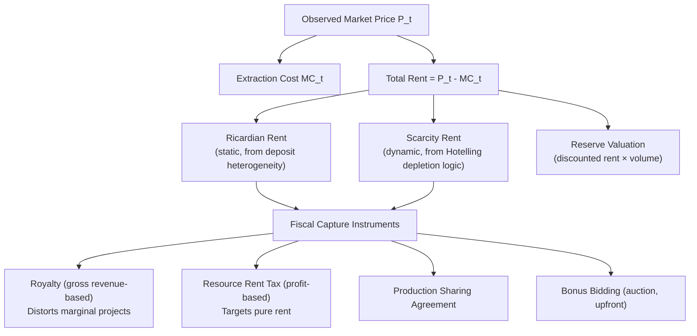

## Resource Rent and Scarcity Rent Concepts

### Conceptual Foundation

Resource rent and scarcity rent are the core value-capture concepts in exhaustible resource economics, distinguishing the portion of a resource's market value attributable to genuine economic surplus from the portion attributable simply to covering the costs of extraction. These concepts underpin fiscal policy design (royalties, resource taxation), reserve valuation, and the interpretation of the Hotelling framework introduced previously. Precise terminology matters here: "rent" in this context follows the classical economic meaning (return to a factor in fixed or scarce supply, above its opportunity cost) rather than a payment for a rental agreement.

### Defining Resource Rent

#### Ricardian Rent (Differential Rent)

The classical concept, extending David Ricardo's land-rent theory to extractive resources: rent arises because resource deposits are heterogeneous in quality/accessibility, and the market price is set by the marginal (highest-cost) unit needed to satisfy demand. Any producer with lower-than-marginal cost earns a rent equal to the difference:

$$Rent_i = P - MC_i \quad \text{for the marginal unit}, \quad \text{Total Rent} = \int_0^{Q^*} [P^* - MC(q)]\, dq$$

Where $MC(q)$ is the supply cost curve (as introduced in the producer theory chapter), ranking deposits from lowest to highest extraction cost.

ricardian_rent_diagram (svg_diagram)

<svg xmlns="http://www.w3.org/2000/svg" viewBox="0 0 700 420" font-family="Helvetica, Arial, sans-serif">
<rect x="0" y="0" width="700" height="420" fill="#ffffff" />
<text x="350" y="28" text-anchor="middle" font-size="18" font-weight="bold" fill="#1a1a1a">Ricardian (Differential) Rent Across Heterogeneous Deposits (svg_diagram)</text>
<line x1="90" y1="360" x2="640" y2="360" stroke="#333" stroke-width="2" />
<line x1="90" y1="360" x2="90" y2="50" stroke="#333" stroke-width="2" />
<text x="645" y="365" font-size="13" fill="#333">Cumulative Output</text>
<text x="35" y="55" font-size="13" fill="#333">\$/unit</text>

<path d="M 130 320 L 250 320 L 250 280 L 350 280 L 350 220 L 450 220 L 450 150 L 560 150" stroke="#2ea043" stroke-width="2.5" fill="none" />
<text x="480" y="145" font-size="12" fill="#2ea043" font-weight="bold">MC(q) supply curve</text>

<line x1="90" y1="150" x2="560" y2="150" stroke="#d1242f" stroke-width="2" stroke-dasharray="5,3" />
<text x="35" y="154" font-size="11" fill="#d1242f">P*</text>

<path d="M 130 320 L 250 320 L 250 280 L 350 280 L 350 220 L 450 220 L 450 150 L 130 150 Z" fill="#f0b429" fill-opacity="0.35" />
<text x="250" y="245" font-size="12" fill="#7d5a00" font-weight="bold">Ricardian Rent</text>

<text x="100" y="395" font-size="12" fill="#555">Low-cost deposits earn rent equal to the gap between market price and their own extraction cost; the marginal (highest-cost) deposit earns zero rent.</text>

</svg>

**Key Points**

- The marginal (last-needed) deposit earns zero Ricardian rent by definition — its extraction cost exactly equals the market price, so it is the price-setting unit.
- Lower-cost, higher-quality deposits (e.g., shallow, high-porosity oil reservoirs; thick, easily mined coal seams) earn positive Ricardian rent purely from their favorable geological characteristics relative to the marginal deposit, not from any temporal scarcity consideration.
- This is a **static** concept — it exists even in a single time period with no consideration of depletion dynamics, distinguishing it conceptually from scarcity rent (below).

#### Scarcity Rent (Hotelling Rent / User Cost)

The dynamic concept introduced in the Hotelling framework: the shadow value of one additional unit of the resource *in the ground*, reflecting the opportunity cost of extracting now versus preserving the option to extract later at a potentially higher future price.

$$\text{Scarcity Rent}_t = P_t - MC_t = \lambda \cdot (1+r)^t$$

(from the Hotelling first-order condition, where $\lambda$ is the constant present-value shadow price of the resource stock)

**Key Points**

- Unlike Ricardian rent, scarcity rent exists purely because the *total stock* is finite and exhaustible — even a single homogeneous-quality deposit (no Ricardian differential at all) commands a positive scarcity rent above its marginal extraction cost if the aggregate resource is genuinely scarce relative to demand over the relevant horizon.
- Under Hotelling's Rule, scarcity rent is predicted to grow over time at the discount rate $r$, whereas Ricardian rent has no inherent time-trend of its own (it responds instead to shifts in the supply cost curve or demand, as covered in supply-demand fundamentals).
- In practice, observed market price at any point in time reflects the *sum* of both rent concepts layered on top of extraction cost: $P_t = MC_t^{marginal\ deposit} + \text{Scarcity Rent}_t$, where $MC_t^{marginal\ deposit}$ itself may embed a Ricardian-rent-generating cost structure relative to other deposits.

### Decomposing Observed Resource Price

$$P_t = \underbrace{MC_t}_{\text{extraction cost}} + \underbrace{(P_t - MC_t)}_{\text{total rent (Ricardian + scarcity)}}$$

For a specific low-cost producer relative to the marginal producer:

$$P_t = MC_t^{low-cost} + \underbrace{(MC_t^{marginal} - MC_t^{low-cost})}_{\text{Ricardian rent}} + \underbrace{(P_t - MC_t^{marginal})}_{\text{scarcity rent}}$$

**Key Points**

- This full decomposition is central to resource taxation design: a well-designed resource rent tax aims to capture the rent components (both Ricardian and scarcity) without distorting the extraction-cost-covering portion of price, since taxing genuine extraction costs (rather than pure rent) would discourage efficient production at the margin.
- Distinguishing the two rent types matters for policy: a windfall profits tax targeting Ricardian rent (e.g., from an unusually productive, low-cost field) has different efficiency implications than a tax attempting to capture scarcity rent (which, if miscalibrated, can distort the intertemporal extraction path predicted by Hotelling's Rule).

### Rent Capture Mechanisms: Fiscal Regimes for Resource Extraction

Governments (as owners of subsurface mineral/petroleum rights in most jurisdictions, or as tax authorities more broadly) employ various instruments to capture resource rent for public revenue, each with distinct efficiency properties:

#### 1. Royalties (Output-Based)

A royalty is a fixed percentage of gross revenue or physical output, paid regardless of profitability:

$$Royalty = \tau_{royalty} \times P_t \times Q_t$$

**Key Points**

- Administratively simple and provides revenue certainty to the government from the first unit of production, but is **not a pure rent tax**: because it applies to gross revenue rather than profit/rent, it effectively raises the marginal cost of extraction, potentially causing economically viable (rent-generating) marginal deposits to become uneconomic and be prematurely abandoned — a documented distortionary cost of royalty-based regimes relative to pure rent-capture instruments. [Inference: this efficiency critique is standard in the resource-fiscal-policy literature; the empirical magnitude of premature abandonment induced by any specific royalty rate is context- and deposit-specific.]

#### 2. Resource Rent Tax (Profit/Rent-Based)

A tax applied only to *economic profit* above a normal/threshold rate of return, intended to more precisely target rent while leaving the extraction decision at the margin undistorted:

$$RRT = \tau_{rent} \times \max(0, \, \Pi_t - \text{Normal Return Threshold})$$

**Key Points**

- Because the tax applies only above a normal-return threshold, in theory it does not discourage marginal (breakeven) projects from proceeding, since such projects pay little or no rent tax — this is the standard efficiency rationale for preferring rent-based over output-based (royalty) fiscal instruments in resource-tax design literature.
- In practice, rent-based taxes are more complex to administer (requiring verified cost and profit accounting, vulnerable to transfer-pricing and cost-inflation strategies by extracting firms) and provide less certain/immediate revenue to government than royalties, representing a genuine administrative-simplicity-versus-efficiency tradeoff in fiscal regime design. [Inference: standard tradeoff documented in resource fiscal policy literature; specific administrative challenges vary by jurisdiction's tax-enforcement capacity.]

#### 3. Production Sharing Agreements (PSAs)

Common in international petroleum contracts: the government (via a national oil company or directly) and a private operator share physical production according to a negotiated formula, often with the government's share increasing at higher profitability levels (a form of built-in progressivity capturing more rent as profitability rises).

#### 4. Bonus Bidding (Auction-Based Rent Capture)

Rather than taxing ongoing production, governments can auction extraction rights (e.g., offshore lease blocks) to the highest bidder, theoretically capturing the full expected present value of future rent up front through competitive bidding — assuming sufficiently competitive bidding and accurate information about resource potential among bidders.

**Key Points**

- Auction-based capture shifts extraction-cost and price risk to the winning bidder (who has already paid for expected rent), meaning subsequent government revenue from royalties/taxes on the same field can, in principle, be set lower without under-capturing total rent — though this depends heavily on bidders having reasonably accurate information about resource quality at the time of the auction. [Inference: a well-established theoretical property of competitive rent-seeking auction design, though real-world resource auctions may deviate from idealized competitive bidding assumptions due to information asymmetry or limited bidder competition.]

### Rent Capture Instrument Comparison Table

| Instrument | Tax Base | Marginal-Project Distortion | Revenue Timing/Certainty | Administrative Complexity |
| --- | --- | --- | --- | --- |
| Royalty | Gross revenue/output | Higher (can discourage marginal projects) | Immediate, high certainty | Low |
| Resource Rent Tax | Profit above normal-return threshold | Lower (targets pure rent) | Delayed, lower certainty | High |
| Production Sharing Agreement | Physical output, profitability-tiered | Moderate (contract-specific) | Immediate, negotiated | Moderate–High |
| Bonus Bidding (Auction) | Expected present value of rent | Low if competitive bidding | Upfront, one-time | Low (post-auction); requires competitive market design |

### Resource Rent and Reserve Valuation

Resource rent concepts underpin standard methods for valuing in-ground reserves (relevant to company balance sheets, sovereign wealth accounting, and national income accounting for resource-rich economies):

$$V_{reserves} = \sum_{t=0}^{T} \frac{Rent_t \times q_t}{(1+r)^t}$$

**Key Points**

- This "net price" or "resource rent" valuation method — valuing reserves at the discounted present value of *rent* per unit (not full market price, and not full cost) times projected extraction volumes — is a standard approach recommended in natural resource accounting frameworks (e.g., UN System of Environmental-Economic Accounting) for measuring the depletion of natural capital in national wealth accounts. [Inference: general methodological characterization consistent with established natural resource accounting literature; specific implementation details and current guidance should be verified against current SEEA documentation if precise application is needed.]
- This valuation approach is directly analogous to standard financial asset valuation (discounted cash flow of expected future net returns), but applied to a depleting physical stock rather than a renewable income-generating asset — a key conceptual link between resource economics and broader capital theory.

### Applied Example: Decomposing Rent for Two Oil Fields

**Example**

Consider two oil fields supplying a market with prevailing price $P = \$70$/barrel:

- **Field A** (high-quality, easily accessible): extraction cost $MC_A = \$20$/barrel
- **Field B** (marginal field, sets the market price): extraction cost $MC_B = \$70$/barrel — i.e., Field B is the highest-cost producer whose output is still needed to meet demand at $P^* = 70$.

Assume, for this static single-period illustration, no additional scarcity rent beyond what is embedded in the observed market price (i.e., treating $P^*=70$ as already reflecting whatever scarcity premium exists at this point in time, and focusing the decomposition on the Ricardian/differential component across fields).

**Output**

- **Field A's total rent**: $P^* - MC_A = 70 - 20 = \$50$/barrel — this is pure Ricardian (differential) rent, arising entirely because Field A's geology is more favorable than the marginal field.
- **Field B's total rent**: $P^* - MC_B = 70-70 = \$0$/barrel — Field B, as the marginal producer, earns zero rent by construction, consistent with the Ricardian framework.
- If a government wished to tax away Field A's $50/barrel rent via a royalty on gross revenue rather than a targeted rent tax, an equivalent-revenue royalty rate would also apply to Field B's revenue, potentially pushing Field B (which earns zero rent at the current price) into a loss position and causing its output to be withdrawn from the market — illustrating concretely why royalties are described as distorting marginal-project decisions relative to a rent tax that could in principle apply $50/barrel to Field A and $0/barrel to Field B. [Note: simplified single-period illustrative numbers, isolating the Ricardian rent concept; a full applied analysis would also need to layer in the dynamic scarcity-rent component from the Hotelling framework and account for multi-period extraction paths.]

### Diagram: Relationship Between Rent Concepts and Fiscal Policy

### Rent Dissipation Under Open Access

**Key Points**

- As covered in the common-pool resource chapter, under open-access competitive extraction (multiple operators racing to extract from a shared resource), rent can be substantially or entirely **dissipated** — competing extractors, unable to secure exclusive rights to future resource value, extract up to the point where price approximately equals private marginal cost, leaving little or no rent captured by anyone (producers or government) despite the resource's genuine scarcity value.
- This is a central argument for well-defined property rights or unitization arrangements (covered in the CPR chapter): converting an open-access resource into an excludable right allows rent to be preserved and subsequently captured via the fiscal instruments discussed above, rather than being competed away through excessive extraction effort and capital expenditure.

### Common Pitfalls in Applying Rent Concepts

- Conflating Ricardian (static, quality-differential) rent with scarcity (dynamic, Hotelling) rent — the two arise from distinct economic mechanisms (deposit heterogeneity vs. finite total stock) and respond to different policy levers and time dynamics.
- Treating royalty and resource-rent-tax instruments as economically equivalent because both are described loosely as "capturing resource rent" — their marginal-incentive effects on extraction decisions differ substantially, with royalties generally imposing a larger distortion on marginal (low-rent) projects.
- Assuming all observed price above extraction cost represents "excess" or "unearned" rent suitable for full taxation without efficiency cost, when in reality even a well-designed rent tax faces genuine administrative and measurement challenges (accurately identifying true economic cost and profit) that can themselves introduce distortions if implemented imprecisely.
- Ignoring rent dissipation under open-access/common-pool conditions when evaluating the fiscal revenue potential of a resource, since a resource with substantial theoretical scarcity value can still generate minimal effective rent (and hence minimal capturable government revenue) absent well-defined access rights.
- Applying reserve-valuation formulas using full market price rather than the rent component, which would substantially overstate the "net" contribution of resource depletion to national wealth/income accounts relative to standard resource-accounting methodology.

### **Related Topics**

- Hotelling's Rule and the dynamic optimization of scarcity rent over time (cross-reference: prior chapter topic)
- Resource rent taxation design and comparative international fiscal regimes for petroleum/mining
- Production sharing agreements and their profitability-tiered rent-sharing structures
- Rent dissipation under open-access extraction (cross-reference: common-pool resource chapter)
- Natural resource accounting and the UN System of Environmental-Economic Accounting (SEEA) framework
- Sovereign wealth funds and intergenerational rent-transfer mechanisms for resource-rich economies
- Auction design theory applied to mineral/petroleum lease bidding
- Ricardo's original land-rent theory and its extension to non-renewable resources