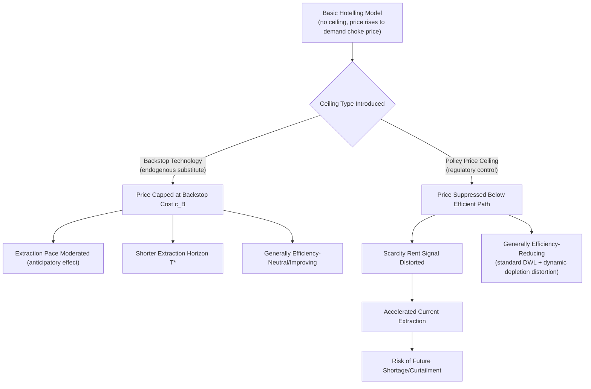

## Backstop Technologies and Price Ceilings

### Conceptual Foundation

A backstop technology is a substitute resource or technology available in effectively unlimited quantity at a fixed (or slowly changing) marginal cost, which becomes economically competitive once the price of a primary exhaustible resource rises sufficiently. Introduced formally into exhaustible resource theory as an extension of the basic Hotelling model, backstop technologies fundamentally alter the depletion path, price trajectory, and terminal conditions of the standard model by imposing an economically-motivated ceiling on how high resource prices can rise before demand shifts entirely to the substitute.

### Defining the Backstop Technology

#### Formal Characteristics

A backstop technology is characterized by:

- **Perfectly (or near-perfectly) elastic long-run supply**: unlike the exhaustible resource, the backstop is not subject to a binding stock constraint over the relevant planning horizon (e.g., solar energy, direct air capture-derived synthetic fuels, or sufficiently abundant unconventional resources relative to demand).
- **A fixed marginal cost** $c_B$, generally treated as constant or only slowly declining (via learning-curve effects, as covered in the producer-theory chapter) over the model's time horizon.
- **Full substitutability** with the exhaustible resource for the relevant end-use, meaning consumers switch entirely to the backstop once its cost becomes competitive with the primary resource's price.

**Key Points**

- Commonly cited energy-sector backstop examples include: renewable electricity (solar, wind) as a backstop to fossil-fuel-based generation; synthetic or biomass-derived liquid fuels as a backstop to conventional petroleum; and, in some analytical frameworks, sufficiently abundant unconventional gas/oil resources treated as a backstop relative to conventional reserves. [Inference: the specific choice of what constitutes "the" backstop for a given resource is a modeling assumption dependent on the analytical context, not a universally agreed single technology.]
- The backstop need not be currently cost-competitive — its relevance to the model derives from its *future* availability at a known or estimated cost ceiling, which resource owners are assumed to anticipate and factor into current extraction decisions under the rational-expectations assumptions of the standard model.

### The Backstop-Augmented Hotelling Model

#### Modified Terminal Condition

In the basic Hotelling model (no backstop), the extraction horizon $T^*$ is determined by price reaching the **choke price** — the price at which demand for the resource falls to zero. With a backstop technology, the terminal condition changes: extraction of the exhaustible resource ceases once its price reaches the backstop cost $c_B$, at which point consumers switch entirely to the backstop rather than continuing to pay ever-higher prices for the depleting resource.

$$P_{T^*} = c_B$$

**Key Points**

- This is a critical modification: without a backstop, price in the simple zero-extraction-cost model can in principle rise without bound as the resource approaches exhaustion (limited only by the demand curve's own choke price). With a backstop, price is capped at $c_B$ — the resource owner cannot extract rent indefinitely beyond what the backstop's availability allows, since consumers would simply switch technologies at that price point.
- The transition to backstop reliance is theoretically predicted to be **smooth** (price approaches $c_B$ asymptotically as the resource nears exhaustion) under the standard model's assumptions of perfect foresight and continuous markets, rather than an abrupt discontinuity — though this smoothness result depends on idealized assumptions that may not hold precisely in practice.

#### Price Path Comparison

backstop_price_path_diagram (svg_diagram)

<svg xmlns="http://www.w3.org/2000/svg" viewBox="0 0 700 440" font-family="Helvetica, Arial, sans-serif">
<rect x="0" y="0" width="700" height="440" fill="#ffffff" />
<text x="350" y="28" text-anchor="middle" font-size="18" font-weight="bold" fill="#1a1a1a">Resource Price Path: With vs. Without Backstop Technology (svg_diagram)</text>
<line x1="90" y1="380" x2="640" y2="380" stroke="#333" stroke-width="2" />
<line x1="90" y1="380" x2="90" y2="50" stroke="#333" stroke-width="2" />
<text x="645" y="385" font-size="13" fill="#333">Time</text>
<text x="35" y="55" font-size="13" fill="#333">Price</text>

<path d="M 120 340 C 250 320, 400 260, 500 160 C 560 100, 590 65, 610 50" stroke="#d1242f" stroke-width="2.5" fill="none" stroke-dasharray="6,4" />
<text x="430" y="130" font-size="12" fill="#d1242f" font-weight="bold">No Backstop (rises to demand choke price)</text>

<line x1="90" y1="180" x2="640" y2="180" stroke="#8250df" stroke-width="1.5" stroke-dasharray="3,3" />
<text x="500" y="173" font-size="12" fill="#8250df" font-weight="bold">Backstop Cost (c_B)</text>

<path d="M 120 340 C 250 300, 380 220, 470 190 C 540 178, 580 178, 620 178" stroke="#2ea043" stroke-width="2.5" fill="none" />
<text x="440" y="215" font-size="12" fill="#2ea043" font-weight="bold">With Backstop (asymptotes to c_B)</text>

<text x="100" y="415" font-size="12" fill="#555">The backstop cost acts as a price ceiling: extraction ceases once resource price reaches c_B, capping the escalation predicted by the basic Hotelling model.</text>

</svg>

**Key Points**

- Anticipation of the backstop, even well before it becomes competitive, is theoretically predicted to *moderate* the exhaustible resource's near-term extraction pace and price trajectory relative to a no-backstop scenario, because resource owners rationally recognize that scarcity rent cannot be extracted indefinitely beyond the eventual cost ceiling. [Inference: this anticipatory-moderation result is a standard theoretical prediction; isolating its empirical magnitude in historical resource-price data is difficult and not a settled empirical matter given the many other factors affecting observed prices.]
- The extraction horizon $T^*$ tends to be *shorter* with a backstop present (all else equal) than without one, since the price ceiling accelerates the point at which the resource becomes uncompetitive relative to the alternative, compared to a model where price could theoretically continue rising toward a much higher demand-choke-price level.

### Backstop Cost as a Long-Run Price Anchor

**Key Points**

- The backstop cost functions analogously to a **long-run marginal cost anchor** for the entire resource-substitute system: even though the exhaustible resource's own extraction cost may be far below the backstop cost during early extraction phases, the eventual availability of the backstop constrains how far scarcity rent can drive price upward over the full horizon.
- This has a direct practical implication for long-run energy price forecasting: analysts frequently use current or projected backstop technology costs (e.g., the levelized cost of solar-plus-storage, or the cost of synthetic fuel production) as a plausible long-run price ceiling reference point for fossil fuel price scenarios, distinct from short/medium-run price forecasting which is dominated by the supply-demand and elasticity dynamics covered in earlier chapters.
- Because backstop technologies (particularly renewables and battery storage) have historically exhibited significant learning-curve cost declines (as discussed in the producer-theory chapter), $c_B$ itself should generally be treated as a *declining* rather than fixed parameter over long horizons in applied analysis — a refinement of the basic constant-$c_B$ theoretical model. [Inference: well-documented historical cost-decline pattern for specific backstop-candidate technologies like solar PV and batteries; the future trajectory of any specific technology's learning curve is inherently uncertain and should not be assumed to continue indefinitely at historical rates.]

### Price Ceilings: Policy-Imposed vs. Technology-Imposed

It is important to distinguish the *endogenous* backstop-cost ceiling described above (an economic outcome of technology substitution) from a *policy-imposed* price ceiling (a regulatory price control), though both share the common feature of capping how high price can rise.

#### Policy Price Ceilings on Exhaustible Resources

Governments have, in various historical episodes, imposed direct regulatory price ceilings on exhaustible energy resources (e.g., wellhead natural gas price controls, retail gasoline price controls during periods of price-control policy). These operate through the standard price-ceiling mechanism covered in the welfare-economics chapter, but interact distinctively with the intertemporal Hotelling framework:

**Key Points**

- A binding regulatory price ceiling set below the Hotelling-optimal price path effectively **short-circuits** the intertemporal allocation mechanism: because producers cannot capture the full scarcity rent that would otherwise signal the true opportunity cost of current versus future extraction, the ceiling can induce **excessive current-period extraction and consumption** relative to the intertemporally efficient path, potentially accelerating depletion and creating shortages when demand exceeds the artificially suppressed-price-induced supply.
- This dynamic is frequently cited as a contributing factor in historical energy shortage episodes under price-control regimes (e.g., natural gas curtailments under wellhead price ceilings in some historical contexts), illustrating that price controls on exhaustible resources carry an *additional* distortion — accelerated depletion and future scarcity — beyond the standard static shortage/deadweight-loss analysis covered in the welfare-economics chapter. [Inference: this dynamic-depletion-acceleration mechanism is a well-established theoretical extension of price-ceiling analysis to exhaustible resources; the magnitude of its contribution to any specific historical shortage episode is a matter of historical/empirical assessment requiring case-specific study.]
- Removing or relaxing such price controls, according to the standard efficient-market restoration logic, allows scarcity rent to again reflect true intertemporal opportunity cost, theoretically realigning the extraction path with the efficient Hotelling trajectory (subject to whatever backstop or other extensions are relevant).

#### Distinguishing the Two Ceiling Types

| Feature | Backstop-Cost Ceiling | Policy Price Ceiling |
| --- | --- | --- |
| Origin | Endogenous technology/market outcome | Exogenous regulatory intervention |
| Effect on extraction pace | Moderates/slows extraction (anticipatory effect) | Accelerates extraction (depletes rent signal) |
| Welfare implication | Generally efficiency-neutral or -improving (reflects genuine substitute availability) | Generally efficiency-reducing (distorts price signal, as in standard price-ceiling analysis) |
| Persistence | Permanent once backstop is available | Contingent on continued policy enforcement |
| Relationship to scarcity rent | Caps maximum rent extractable | Suppresses rent signal below efficient level |

### Diagram: Backstop and Policy Ceiling Interaction with the Hotelling Path

### Applied Example: Backstop-Constrained Extraction Path

**Example**

Extending the two-period Hotelling example from the prior topic: resource stock $\bar{R} = 100$, inverse demand $P_t = 50 - q_t$ in each period, zero extraction cost, discount rate $r = 0.10$. Now introduce a backstop technology available at constant cost $c_B = 30$.

**Without backstop** (from the prior topic's solution method, applied here with these parameters): solving $50-(100-q_0) = 1.10(50-q_0)$ and $q_0+q_1=100$ yields $q_0 = 50$, giving $P_0 = 0$, $P_1 = 0$ — prices remain below the backstop cost throughout, meaning the backstop is never actually reached in this particular numeric case.

**Reinterpreting with a binding backstop consideration:** Suppose instead demand is such that the no-backstop solution would imply $P_1 > c_B = 30$. In that case, the correct approach recognizes that once price would reach $30, consumers switch to the backstop rather than paying more, so the terminal condition becomes $P_{T^*} = 30$ rather than the pure demand-choke-price condition — this requires resolving the model with the backstop cost imposed as the binding terminal constraint, generally shortening the resource's economic extraction life relative to a scenario without the constraint.

**Output**

- The key qualitative lesson: whenever a candidate no-backstop solution would imply a terminal/peak price exceeding the backstop cost $c_B$, the backstop constraint becomes binding, and the model must be resolved with $P_{T^*} = c_B$ as the terminal condition rather than allowing price to rise further — this typically results in more of the resource being extracted at a lower price path than the unconstrained model would predict, since the ceiling limits how much rent can ultimately be captured. [Note: the specific numeric example above is illustrative of the solution *logic* for a binding backstop case rather than a fully worked numeric solution, since the initial parameters chosen for continuity with the prior topic did not produce a binding backstop constraint; a fully worked example would require adjusting demand or extraction-cost parameters so that the unconstrained solution exceeds $c_B$.]

### Backstop Technologies and Climate/Energy Transition Policy

**Key Points**

- The backstop-technology framework has direct relevance to energy transition analysis: renewable electricity, green hydrogen, and other low-carbon substitutes function as backstops to fossil fuel combustion in various sectoral models, and their cost trajectories (heavily influenced by learning curves, as discussed in producer theory) are a central input to projections of how quickly and at what price fossil fuel demand might decline.
- Policies that accelerate backstop cost reduction (R&D subsidies, deployment incentives addressing the positive-externality underinvestment problem covered in the externalities chapter) can be understood, within this framework, as effectively lowering $c_B$ over time — which, per the model's logic, is predicted to further moderate near-term fossil resource extraction incentives by lowering the ceiling resource owners anticipate.
- This connects the exhaustible-resource-economics literature directly to climate policy design: a credible, anticipated future backstop (or a policy-accelerated lower-cost backstop) can in principle contribute to earlier tapering of fossil fuel extraction than a Hotelling model without such a substitute would predict, independent of any direct emissions pricing on the fossil resource itself. [Inference: this is a documented theoretical linkage in the resource/climate economics literature connecting backstop theory to transition dynamics; the practical empirical significance of this specific channel, relative to direct carbon pricing and regulatory policy, is a subject of ongoing research and is not a settled quantitative matter.]

### Common Pitfalls in Applying Backstop and Price-Ceiling Concepts

- Treating the backstop cost $c_B$ as a fixed, known constant over long time horizons, when in practice — particularly for renewable and storage technologies — historical evidence shows substantial cost decline over time, meaning static-$c_B$ models can materially overstate long-run fossil resource price ceilings if not updated to reflect an evolving backstop cost.
- Confusing the endogenous backstop-cost ceiling (a market-driven substitution outcome, generally efficiency-neutral or -improving) with a policy-imposed price ceiling (a regulatory distortion) — the two share a superficial similarity (both cap price) but have opposite efficiency implications and different effects on the extraction pace.
- Assuming the transition to backstop reliance will be smooth and continuous in practice, when the idealized model's smoothness prediction depends on perfect foresight and frictionless markets — real-world transitions may exhibit discontinuities, stranded-asset dynamics, or path-dependencies not captured in the basic theoretical framework. [Inference]
- Applying a single, universally-agreed "the" backstop technology to a given resource without acknowledging that backstop identification is a modeling choice specific to the analytical context and sector (e.g., different backstops are relevant for electricity generation, ground transportation, and industrial heat).
- Overlooking the dynamic (accelerated-depletion) distortion of policy price ceilings on exhaustible resources, and analyzing such ceilings using only the static deadweight-loss framework from standard welfare economics without the additional intertemporal consideration specific to depletable resources.

### **Related Topics**

- Hotelling's Rule and the basic dynamic depletion framework (cross-reference: prior chapter topic)
- Learning curves and technological cost decline for renewable/storage backstop candidates (cross-reference: producer theory chapter)
- Historical energy price control episodes and their effects on shortage dynamics
- Stranded assets and transition risk in fossil fuel resource valuation
- Positive externalities and R&D subsidy rationale for accelerating backstop cost decline (cross-reference: externalities chapter)
- Levelized cost of energy (LCOE) methodology for comparing backstop technology costs
- Energy transition modeling and the role of substitute-technology cost trajectories
- Resource rent and scarcity rent capture when a binding backstop constrains maximum extractable rent (cross-reference: prior chapter topic)