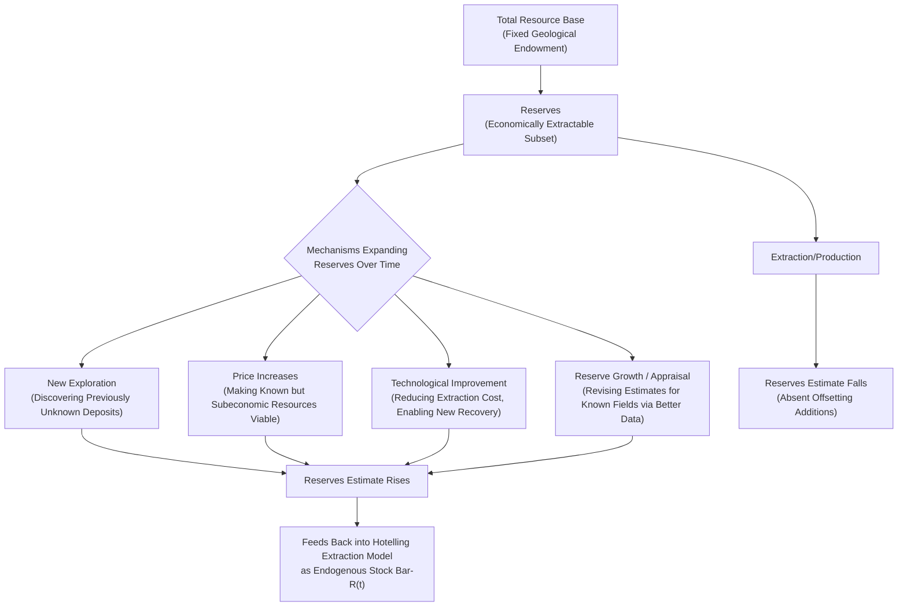

## Reserves, Resources, and the Economics of Exploration

### Conceptual Foundation

The basic Hotelling framework treats the resource stock $\bar{R}$ as fixed and known. In reality, the quantity of a resource considered "available" is not a single physical fact but an economically and technically contingent classification that responds to price, technology, and exploration investment. This topic formalizes the distinction between reserves and resources, and develops the economics of exploration as a costly, uncertain investment activity that endogenously determines how much of the resource base becomes economically extractable — a critical extension bridging static geological endowment and the dynamic depletion theory covered in the Hotelling chapter.

### Reserves vs. Resources: The Fundamental Distinction

#### Resources (The Total Endowment)

"Resources" refers to the total physical quantity of a mineral or hydrocarbon estimated to exist in the earth's crust in a given area, regardless of current economic viability or technical extractability. This is primarily a geological concept.

#### Reserves (The Economically Extractable Subset)

"Reserves" refers to the subset of resources that are technically and economically extractable under current (or reasonably anticipated near-term) prices, costs, and technology. Reserves are a strict subset of resources.

$$Reserves \subseteq Resources$$

**Key Points**

- This distinction is central to understanding why "running out" of a resource in the reserves sense does not necessarily mean physical exhaustion of the resource in the ground — reserve estimates can rise even as cumulative extraction proceeds, if price increases, technology improves, or new geological information reclassifies previously uneconomic resources as economically viable reserves.
- The reserves/resources distinction directly explains a commonly observed empirical pattern noted in the Hotelling chapter: proven reserves for many commodities (oil, natural gas, various minerals) have historically not declined monotonically despite decades of continuous extraction, because reserve additions through exploration and reclassification have frequently offset or exceeded the depletion from production. [Inference: this pattern is well documented for major hydrocarbon and mineral commodities historically; whether it continues to hold for any specific commodity going forward is an empirical question requiring current data rather than an assumed permanent regularity.]

### Standard Reserve Classification Frameworks

#### Petroleum Reserve Categories (SPE/PRMS-Style Framework)

The petroleum industry commonly classifies reserves along two dimensions: **certainty** of recovery and **project maturity/commerciality**. A widely referenced classification (broadly consistent with Society of Petroleum Engineers Petroleum Resources Management System conventions, though specific terminology and thresholds should be verified against current SPE-PRMS documentation for precise regulatory or reporting purposes) distinguishes:

| Category | Typical Probability Threshold | Description |
| --- | --- | --- |
| Proved (1P) | Generally ≥90% probability of recovery | High confidence, based on current data and economic conditions |
| Proved + Probable (2P) | Generally ≥50% probability | Best estimate, combining proved and probable volumes |
| Proved + Probable + Possible (3P) | Generally ≥10% probability | Low-confidence upper bound, includes speculative volumes |

[Note: specific probability thresholds and exact category definitions are governed by industry/regulatory standards (e.g., SPE-PRMS, SEC reporting rules) that have been periodically revised; a targeted search of current SPE-PRMS or relevant regulatory documentation is recommended if precise, current classification criteria are needed for a specific application.]

**Key Points**

- Reserve classification requires both **geological confidence** (how certain is it that the resource physically exists in the estimated quantity) and **commercial viability** (is extraction economically justified at current or reasonably anticipated prices/costs) — a discovery can be geologically well-confirmed but still classified as a "contingent resource" rather than a "reserve" if it is not currently commercially viable.
- Reserve estimates reported by companies (particularly under securities-regulator reporting requirements in various jurisdictions) are generally required to reflect *proved* reserves under specified price and cost assumptions (often a trailing average price rather than a forward-looking forecast), meaning reported reserve figures are inherently sensitive to the price assumption used and are not a pure geological measurement independent of economic conditions. [Inference: general characterization of standard reserve-reporting conventions; specific current regulatory requirements (e.g., SEC rules for oil and gas reporting) should be verified directly if precise compliance-related detail is needed.]

#### Mineral Resource Classification (Analogous Framework)

Solid mineral resources (coal, metals, uranium) use analogous frameworks (e.g., JORC Code, CRIRSCO-family standards, NI 43-101 in some jurisdictions), typically distinguishing **Mineral Resources** (geologically identified, not necessarily economic) from **Mineral Reserves** (economically and technically extractable subset), with confidence sub-categories (inferred, indicated, measured for resources; probable, proved for reserves) broadly analogous to the petroleum framework above. [Inference: general structural analogy well-established across extractive-industry reporting standards; exact terminology and specific current standard provisions vary by framework/jurisdiction and should be verified against current documentation if precise application is required.]

### The Resource Pyramid / McKelvey Diagram

A standard visualization tool in resource economics organizes the total resource base along two axes: **geological certainty** (horizontal) and **economic viability** (vertical), producing a classification often depicted as a pyramid or grid (commonly attributed to the McKelvey framework).

mckelvey_resource_pyramid_diagram (svg_diagram)

<svg xmlns="http://www.w3.org/2000/svg" viewBox="0 0 700 460" font-family="Helvetica, Arial, sans-serif">
<rect x="0" y="0" width="700" height="460" fill="#ffffff" />
<text x="350" y="28" text-anchor="middle" font-size="18" font-weight="bold" fill="#1a1a1a">Resource Classification: Economic Viability vs. Geological Certainty (svg_diagram)</text>
<line x1="80" y1="400" x2="620" y2="400" stroke="#333" stroke-width="2" />
<line x1="80" y1="400" x2="80" y2="60" stroke="#333" stroke-width="2" />
<text x="200" y="425" font-size="13" fill="#333">Decreasing Geological Certainty →</text>
<text x="30" y="55" font-size="13" fill="#333">↑ Increasing Economic Viability</text>

<rect x="100" y="70" width="150" height="100" fill="#2ea043" fill-opacity="0.7" />
<text x="115" y="115" font-size="13" fill="#fff" font-weight="bold">Reserves</text>
<text x="115" y="135" font-size="10" fill="#fff">(Proved / Probable)</text>

<rect x="100" y="180" width="150" height="80" fill="#f0b429" fill-opacity="0.7" />
<text x="115" y="215" font-size="12" fill="#111" font-weight="bold">Marginal / Subeconomic</text>
<text x="115" y="232" font-size="10" fill="#111">Reserves</text>

<rect x="260" y="70" width="180" height="190" fill="#79c0ff" fill-opacity="0.6" />
<text x="275" y="115" font-size="13" fill="#111" font-weight="bold">Contingent Resources</text>
<text x="275" y="135" font-size="10" fill="#111">(Identified, not yet commercial)</text>

<rect x="450" y="70" width="150" height="290" fill="#c9d1d9" fill-opacity="0.6" />
<text x="465" y="115" font-size="13" fill="#111" font-weight="bold">Undiscovered</text>
<text x="465" y="135" font-size="10" fill="#111">Resources</text>
<text x="465" y="155" font-size="10" fill="#111">(Speculative)</text>

<rect x="260" y="270" width="340" height="90" fill="#8b949e" fill-opacity="0.4" />
<text x="275" y="310" font-size="12" fill="#111">Subeconomic / Uneconomic at Current Prices &amp; Technology</text>

<text x="90" y="440" font-size="12" fill="#555">Reserves (upper-left) are the economically viable, geologically confirmed subset of the much larger total resource base.</text>

</svg>

**Key Points**

- Movement of resources from the right/lower portions of this diagram into the "Reserves" category (upper-left) can occur through: (1) **exploration** (increasing geological certainty, moving rightward-to-leftward across the horizontal axis), (2) **price increases** (moving a given deposit upward into economic viability without any change in geological knowledge), or (3) **technological improvement** (reducing extraction cost, also moving deposits upward into viability) — all three mechanisms discussed further below.
- This framework directly illustrates why reserve estimates are not a fixed ceiling on future supply but a dynamic, price- and technology-contingent classification of a much larger underlying resource base.

### The Economics of Exploration as Investment

#### Exploration as a Costly Search Activity Under Uncertainty

Exploration (seismic surveys, exploratory drilling, geological/geophysical assessment) is itself a costly investment activity undertaken when the expected value of discovery exceeds the cost of exploration effort:

$$E[NPV_{exploration}] = p_{discovery} \times V_{discovery} - C_{exploration}$$

Where $p_{discovery}$ is the probability of a commercially viable discovery, $V_{discovery}$ is the expected value of that discovery (a function of expected reserve size and future price/cost conditions), and $C_{exploration}$ is the sunk cost of exploration effort (surveys, exploratory wells).

**Key Points**

- Because exploration outcomes are genuinely uncertain (a "dry hole" or subeconomic discovery is a real and common outcome, not merely a modeling abstraction), firms undertake portfolios of exploration investments, accepting a substantial failure rate in exchange for the expected value of successful discoveries — standard real-options and portfolio-theory concepts are frequently applied in the applied petroleum-economics literature to this decision problem.
- Higher expected future prices (or credible expectations of price increases, consistent with the Hotelling framework's prediction of rising scarcity rent) increase $V_{discovery}$ and therefore incentivize greater exploration effort — this is the key economic mechanism linking price signals to reserve additions, and the primary reason the basic fixed-stock Hotelling model is extended to allow for endogenous reserve growth.

#### Exploration Supply Curve and Diminishing Returns

As exploration proceeds within a given geological basin/region, the most promising, easily identified prospects are typically explored first, with subsequent exploration effort searching progressively less favorable or more difficult-to-access prospects — a pattern often described as the exploration equivalent of the extraction-cost curve covered in producer theory.

$$MC_{exploration}(N) \text{ generally rising in cumulative exploration effort } N$$

**Key Points**

- This rising exploration-cost pattern is analogous to, but analytically distinct from, the extraction-cost curve: extraction cost curves rank *already-discovered* deposits by extraction cost, while exploration cost curves describe the rising cost/difficulty of *discovering new* deposits as a basin/region matures and the most accessible prospects are exhausted.
- Technological improvements in exploration methods (e.g., advances in seismic imaging, sub-salt exploration techniques enabling deepwater discoveries, or unconventional-resource identification methods enabling shale play delineation) can shift this exploration cost curve downward over time, analogous to the learning-curve effects on extraction cost covered in producer theory — historically credited with enabling major reserve additions in previously overlooked or technically inaccessible resource categories. [Inference: general pattern well documented in petroleum industry history; specific technology-to-reserve-addition attributions are matters of industry/historical record requiring case-specific verification.]

### Reserve Growth Mechanisms: A Taxonomy

**Key Points**

- "Reserve growth" or "appraisal-driven" reserve additions — upward revisions to estimated recoverable volumes for *already-discovered* fields, based on improved data, extended production history, or enhanced recovery techniques — is empirically documented as a major (in some historical assessments, the dominant) contributor to cumulative reserve additions for mature hydrocarbon basins, distinct from and often exceeding the contribution of entirely new-field exploration discoveries in well-explored regions. [Inference: this pattern is documented in petroleum resource assessment literature, notably in USGS and similar assessments of reserve-growth phenomena; the relative magnitude of appraisal-driven growth versus new discovery varies substantially by basin maturity and should not be assumed uniform across all resource contexts.]

### Integrating Endogenous Reserves into the Hotelling Framework

The basic Hotelling model treats $\bar{R}$ as exogenous and fixed. A fuller model treats the reserve stock as endogenously evolving:

$$\bar{R}_{t+1} = \bar{R}_t - q_t + \Delta R_t^{exploration}$$

Where $\Delta R_t^{exploration}$ is the reserve addition in period $t$, itself a function of exploration investment, which responds to anticipated future prices and costs.

**Key Points**

- This integration formally explains why observed long-run resource prices have frequently failed to exhibit the smooth exponential rise predicted by the basic fixed-stock Hotelling model (as discussed in the Hotelling chapter): rising prices induce exploration investment, which expands $\bar{R}_t$, which in turn dampens the scarcity-rent escalation that would otherwise occur under a truly fixed stock.
- This creates a stabilizing (negative) feedback loop absent from the basic model: price increases → increased exploration incentive → reserve additions → moderated future scarcity rent → moderated future price increases — though this feedback operates with a considerable time lag (exploration, appraisal, and development typically require years, particularly for large or technically complex projects), meaning short-run price volatility is not fully offset by this longer-run mechanism.

### Exploration Risk and Real Options

**Key Points**

- Exploration and subsequent field development decisions are frequently analyzed using **real options theory** rather than simple static net-present-value calculation, because the firm holds valuable *options* at each stage (option to explore, option to appraise a discovery further, option to develop, option to delay development pending better price information) rather than a single irreversible go/no-go decision.
- This option-value framework helps explain apparently "irrational" behavior under a naive NPV lens — such as a firm holding an economically marginal discovery undeveloped for an extended period — as potentially rational deferral of an irreversible investment decision pending resolution of price or cost uncertainty, a standard real-options insight applicable broadly to capital-intensive, irreversible energy investments (also relevant to the shut-in/restart well decisions covered in the producer-theory chapter). [Inference: real options framework is a well-established analytical approach in petroleum/resource investment literature; whether any specific observed firm behavior reflects rational option-value reasoning versus other factors requires case-specific analysis rather than a general presumption.]

### Applied Example: Exploration Investment Decision Under Uncertainty

**Example**

A firm is evaluating an exploratory well in a frontier basin with the following characteristics:

- Cost of exploratory drilling: $40 million
- Estimated probability of commercial discovery: 25%
- If successful, estimated discovered reserves: 100 million barrels, with an estimated net present value (post-discovery development economics) of $8/barrel in rent (net of remaining extraction/development cost)

**Expected value calculation:**

$$E[V_{discovery}] = 0.25 \times (100{,}000{,}000 \times \$8) = 0.25 \times \$800{,}000{,}000 = \$200{,}000{,}000$$

$$E[NPV] = \$200{,}000{,}000 - \$40{,}000{,}000 = \$160{,}000{,}000$$

**Output**

- On a simple expected-value basis, this exploration investment shows a strongly positive expected NPV ($160 million), suggesting it is an attractive investment despite the 75% probability of an unsuccessful (dry hole or subeconomic) outcome.
- This illustrates the standard logic underlying exploration portfolio decisions: individual exploration wells frequently carry a substantial probability of complete loss of the drilling cost, but a portfolio of similarly-structured opportunities with positive expected value can be rational for a firm with sufficient capital to withstand the variance across multiple independent exploration attempts. [Note: illustrative numbers for pedagogical purposes; real exploration economics require considerably more detailed probabilistic modeling of reserve-size distributions, price scenarios, and development-cost uncertainty than this simplified single-point-estimate example captures, and a full treatment would also incorporate real-options considerations regarding the timing and staging of the decision.]

### Common Pitfalls in Reserve and Exploration Economics

- Treating reported "reserves" figures as a fixed physical ceiling on future supply, when reserves are an economically and technically contingent classification that has historically responded significantly to price changes, technological improvement, and exploration investment.
- Confusing "resources" (total geological endowment, largely price/technology-independent) with "reserves" (the economically viable subset) — a common source of confusion in popular discussions of "how much oil/gas is left," which frequently conflate the two categories.
- Assuming reserve-to-production ratios (a commonly cited but limited metric dividing current reserves by current production rate) provide a meaningful forecast of "years remaining," when this ratio does not account for future reserve additions, demand changes, or price-induced supply response, and is better understood as a snapshot of currently booked economic reserves under current price/technology assumptions rather than a genuine depletion-timeline forecast. [Inference: this critique of reserve-to-production ratio interpretation is standard in the resource-economics literature.]
- Overlooking the substantial historical contribution of appraisal-driven reserve growth in already-discovered fields (as opposed to new-field exploration) when modeling future reserve trajectories for mature basins.
- Applying a naive static NPV framework to exploration and field-development decisions without considering real-options value from the ability to delay, stage, or abandon investment as new information (price, geological, cost) arrives over time.

### **Related Topics**

- SPE-PRMS and analogous mineral resource classification standards (JORC, NI 43-101, CRIRSCO frameworks)
- Real options theory applied to exploration, appraisal, and field development decisions
- Reserve growth and appraisal-driven estimate revisions in mature hydrocarbon basins
- Endogenous reserve modeling and its dampening effect on Hotelling scarcity-rent predictions (cross-reference: prior chapter topic)
- Technological change in exploration methods (seismic imaging, unconventional resource identification)
- Reserve-to-production ratios and their limitations as depletion-timeline indicators
- Portfolio theory and risk management in exploration investment decisions
- Securities regulation and reserve-reporting requirements for extractive industry disclosures