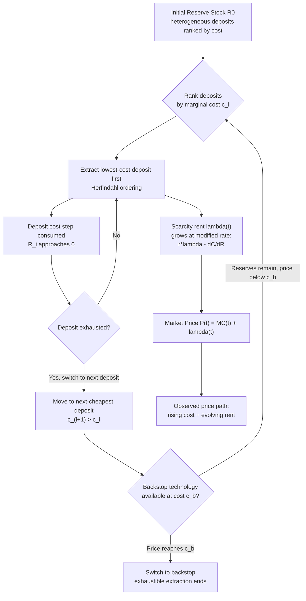

## Extraction Cost Curves and the Order of Resource Use

### Conceptual Foundations

**Definition**

Extraction cost curves describe how the marginal cost of extracting a unit of a natural resource changes as a function of cumulative extraction, remaining reserves, extraction rate, and the physical/geological characteristics of the deposit. The "order of resource use" refers to the sequence in which heterogeneous resource deposits (or heterogeneous resource types) are exploited over time when multiple grades, locations, or types of a resource exist simultaneously.

These two concepts are joined by a single organizing principle in exhaustible resource economics: **rational, forward-looking economic agents extract resources in order of increasing cost (or decreasing net value), such that the cheapest-to-extract units are used first**, unless cost differentials are dominated by other factors (e.g., quality-adjusted output price, transport cost, strategic/political considerations, or capacity constraints).

**Key Points**

- Extraction cost is distinct from resource *scarcity rent* (or *royalty*) — total marginal value at the wellhead/minehead equals marginal extraction cost plus scarcity rent.
- The order-of-use principle generalizes the Herfindahl Principle (least-cost-first extraction) from the theory of nonrenewable resource substitutes.
- Cost curves are typically upward-sloping in cumulative extraction (stock-dependent) and may also depend on the *rate* of extraction (flow-dependent, due to congestion/capacity effects).

---

### The Marginal Cost Function: Formal Structure

**Stock-Dependent Costs**

Let $R(t)$ be the remaining reserve stock at time $t$, $q(t)$ the extraction rate, and $C(q(t), R(t))$ the total cost of extraction. The stock-dependent marginal cost is:

$$MC(t) = \frac{\partial C}{\partial q}\bigg|_{q(t), R(t)}$$

with the defining property:

$$\frac{\partial MC}{\partial R} < 0 \quad \Longleftrightarrow \quad \frac{\partial MC}{\partial (\text{cumulative extraction})} > 0$$

As cumulative extraction $Q(t) = \int_0^t q(s)\,ds$ rises and $R(t) = R_0 - Q(t)$ falls, marginal cost rises because:

- Remaining deposits are of lower physical grade (ore grade decline)
- Remaining deposits are geologically harder to access (depth, pressure, remoteness)
- Infrastructure and logistics costs increase (longer haul distances, deeper wells)

**Flow-Dependent Costs**

Many textbook treatments (e.g., oil reservoirs, fisheries-adjacent formulations) also allow costs to depend on the *rate* of extraction independent of the stock, due to congestion in extraction capacity:

$$C = C(q, R), \quad \frac{\partial C}{\partial q} > 0, \quad \frac{\partial^2 C}{\partial q^2} \geq 0$$

This flow effect matters because it can make it optimal to spread extraction of even a single homogeneous deposit over time (rather than extracting instantaneously), independent of scarcity-rent considerations.

**Key Points**

- Pure stock effects: cost rises only with *cumulative* extraction — a "how much is left" cost function.
- Pure flow effects: cost rises with the *rate* of current extraction — a "how fast are you going" cost function.
- Realistic models combine both: $C(q(t), R(t))$.

---

### The Hotelling Framework and Cost Curves

**Baseline Hotelling Model (Constant Marginal Cost)**

In the simplest Hotelling (1931) model, marginal extraction cost is constant (often normalized to zero or a constant $c$), and the entire dynamic adjustment falls on the **scarcity rent** (shadow price of the resource in the ground), $\lambda(t)$, which must grow at the rate of interest:

$$\dot{\lambda}(t) = r\lambda(t) \quad \Longrightarrow \quad \lambda(t) = \lambda(0)e^{rt}$$

The market price is:

$$P(t) = MC + \lambda(t) = c + \lambda(0)e^{rt}$$

**Extended Model with Rising Marginal Cost**

When marginal cost is stock-dependent, $MC(R(t))$, the **Hotelling rule generalizes** to the *net price* (or *Hotelling rent*) rule: it is the marginal value net of extraction cost — not the price itself — that must rise at the rate of interest:

$$\frac{d}{dt}\big[P(t) - MC(R(t))\big] = r\big[P(t) - MC(R(t))\big]$$

This is often called the **generalized Hotelling rule** or **net-price rule**. It follows from the Hamiltonian of the dynamic optimization problem:

$$\mathcal{H} = U(q(t)) - C(q(t), R(t)) + \lambda(t)[-q(t)]$$

subject to $\dot{R}(t) = -q(t)$, where $\lambda(t)$ is the costate variable (shadow value of the in-situ resource stock). The first-order condition yields $P(t) = MC(q,R) + \lambda(t)$, and $\lambda(t)$ still grows at rate $r$ under standard conditions — but because $MC$ is itself rising with cumulative extraction, price need not rise monotonically or exponentially; in some cases price can even *fall* over parts of the extraction path if declining scarcity rent (as reserves are used up) is outweighed in certain configurations, though the more common empirical/theoretical result is that **both price and marginal cost rise, but net price (rent) rises smoothly at rate $r$**.

**Key Points**

- Constant-cost Hotelling: all dynamics loaded onto rising scarcity rent.
- Rising-cost Hotelling: dynamics split between rising extraction cost (moving up the cost curve) and rising (or sometimes falling) scarcity rent.
- The "net price" or "royalty"/"rent" — not the market price — is the variable disciplined by the arbitrage condition $\dot\lambda = r\lambda$.

---

### The Order of Resource Use: The Herfindahl Principle

**Statement of the Principle**

When there are multiple deposits or grades of a resource with different (but constant, within-deposit) marginal extraction costs $c_1 < c_2 < \dots < c_n$, the **Herfindahl Principle** (Herfindahl, 1967) states that under a cost-minimizing, perfect-foresight, perfect-capital-markets equilibrium:

> The lowest-cost deposit is extracted first, in its entirety, before extraction of the next-lowest-cost deposit begins. Deposits are used strictly in ascending order of extraction cost, with no overlap.

**Intuition and Proof Sketch**

Because the resource is homogeneous in the eyes of the consumer (a unit of oil is a unit of oil regardless of source), and because capital markets allow costless intertemporal reallocation, extracting a *more expensive* unit before a *cheaper* unit is a pure efficiency loss — the same intertemporal consumption path could be delivered at lower total discounted cost by resequencing extraction. Formally, this is a consequence of the **cost-minimization / no-arbitrage condition**: at any point in time, only the cheapest available (unextracted) unit should be supplied, because switching the order while holding the extraction path of *quantity* fixed strictly reduces total discounted cost.

**Key Points**

- Deposits are exhausted **sequentially**, not blended, under the idealized Herfindahl setting.
- The switch point between deposit $i$ and deposit $i+1$ occurs exactly when deposit $i$'s reserves are exhausted.
- At the switch point, price is continuous, but the *shadow price* (scarcity rent) of the deposit changes discretely, since a lower-cost deposit commands a *higher* scarcity rent than a higher-cost deposit of the same eventual sale price (rent falls as one moves to using higher-cost deposits, because the higher extraction cost "eats into" the available rent at a given output price).

**Example**

Consider two deposits:

- Deposit A: $R_A = 100$ units, $c_A = \$10$/unit
- Deposit B: $R_B = 200$ units, $c_B = \$25$/unit

Under Herfindahl ordering, all 100 units of A are extracted first (in some optimal declining-extraction-rate path determined by demand and $r$), and only after $R_A$ is exhausted does extraction of B begin. The economy never extracts from B while any of A remains, because doing so would raise total discounted cost without changing the delivered quantity path — a strict Pareto improvement is available by reordering.

**Deviations from Strict Herfindahl Ordering [Inference/Contextual Nuance]**

The strict "no overlap" result depends on idealized assumptions. In practice, several factors can cause **simultaneous exploitation of different-cost deposits**, which is a well-documented theoretical extension rather than a violation of the underlying logic:

- **Extraction capacity constraints** (flow costs): if the cheapest deposit has a maximum extraction rate below desired total output, higher-cost deposits must be tapped concurrently to meet demand.
- **Quality/heterogeneity in the final good**: if deposits produce non-substitutable grades (e.g., sweet vs. sour crude, high-sulfur vs. low-sulfur coal) commanding different prices, the "cost ranking" must be done in *net-price* (price minus cost) terms, not cost terms alone, and rankings can reverse.
- **Risk and exploration cost**: uncertain reserve sizes and costly information acquisition can make it optimal to develop multiple prospects in parallel to preserve flexibility ([Inference] — option-value considerations, a standard extension in the real-options-under-uncertainty literature).
- **Political/strategic supply considerations**: state actors (e.g., OPEC members) may deviate from cost-minimizing sequencing for revenue-smoothing, market-share, or geopolitical objectives.
- **Locational/transport cost heterogeneity**: a deposit's "delivered cost" to a specific market may not rank the same as its "extraction cost," so the relevant ordering variable is delivered marginal cost, not FOB extraction cost.

---

### Cost Curve Shapes and Their Economic Implications

**Convex (Increasing Marginal Cost) Curve**

$$MC(Q) = a + bQ, \quad b > 0$$

This is the standard depiction, generating a smoothly rising step-free cost schedule as cumulative extraction $Q$ increases. It underlies most textbook treatments of continuously graded ore bodies or fields with continuously declining reservoir pressure.

**Step Function (Discrete Deposits)**

When deposits are discrete and internally homogeneous, the marginal cost curve is a **step function** in cumulative reserves:

$$MC(Q) = \begin{cases} c_1 & 0 \le Q < R_1 \\ c_2 & R_1 \le Q < R_1+R_2 \\ c_3 & R_1+R_2 \le Q < R_1+R_2+R_3 \\ \vdots \end{cases}$$

This is the natural representation of the Herfindahl setting and is standard in applied resource-supply modeling (used, e.g., in long-run oil and mineral supply curves that stack "supply steps" by field or basin).

**Illustration (SVG): Step-Function Extraction Cost Curve (svg_diagram)**

<svg xmlns="http://www.w3.org/2000/svg" viewBox="0 0 640 400" font-family="Helvetica, Arial, sans-serif">
<title>Extraction Cost Curve by Cumulative Reserves (svg_diagram)</title>
<rect x="0" y="0" width="640" height="400" fill="#ffffff" />
<line x1="70" y1="330" x2="600" y2="330" stroke="#333333" stroke-width="2" />
<line x1="70" y1="330" x2="70" y2="40" stroke="#333333" stroke-width="2" />
<text x="335" y="375" font-size="15" text-anchor="middle" fill="#111111">Cumulative Extraction, Q (units)</text>
<text x="25" y="185" font-size="15" text-anchor="middle" fill="#111111" transform="rotate(-90 25 185)">Marginal Cost ($/unit)</text>
<line x1="70" y1="290" x2="220" y2="290" stroke="#1f77b4" stroke-width="4" />
<line x1="220" y1="290" x2="220" y2="230" stroke="#1f77b4" stroke-width="1.5" stroke-dasharray="4,3" />
<line x1="220" y1="230" x2="400" y2="230" stroke="#2ca02c" stroke-width="4" />
<line x1="400" y1="230" x2="400" y2="150" stroke="#2ca02c" stroke-width="1.5" stroke-dasharray="4,3" />
<line x1="400" y1="150" x2="560" y2="150" stroke="#d62728" stroke-width="4" />
<line x1="560" y1="150" x2="560" y2="90" stroke="#d62728" stroke-width="1.5" stroke-dasharray="4,3" />
<line x1="560" y1="90" x2="600" y2="90" stroke="#9467bd" stroke-width="4" />
<text x="145" y="310" font-size="13" text-anchor="middle" fill="#1f77b4">Deposit A: c₁ = $10</text>
<text x="310" y="250" font-size="13" text-anchor="middle" fill="#2ca02c">Deposit B: c₂ = $25</text>
<text x="480" y="170" font-size="13" text-anchor="middle" fill="#d62728">Deposit C: c₃ = $45</text>
<text x="580" y="70" font-size="12" text-anchor="middle" fill="#9467bd">Deposit D</text>
<line x1="220" y1="330" x2="220" y2="335" stroke="#333333" stroke-width="1.5" />
<line x1="400" y1="330" x2="400" y2="335" stroke="#333333" stroke-width="1.5" />
<line x1="560" y1="330" x2="560" y2="335" stroke="#333333" stroke-width="1.5" />
<text x="220" y="350" font-size="11" text-anchor="middle" fill="#555555">R_A</text>
<text x="400" y="350" font-size="11" text-anchor="middle" fill="#555555">R_A+R_B</text>
<text x="560" y="350" font-size="11" text-anchor="middle" fill="#555555">R_A+R_B+R_C</text>
<text x="335" y="20" font-size="16" text-anchor="middle" font-weight="bold" fill="#111111">Herfindahl Step-Function Extraction Order</text>
</svg>

**Key Points**

- The area under the marginal cost curve up to any $Q$ gives total variable extraction cost.
- The *height* at any point gives the cost of the marginal (next) unit — the relevant magnitude for the extraction/no-extraction decision at each instant.
- A convex smooth curve can be viewed as the continuum limit of infinitely many infinitesimally small discrete deposits stacked in cost order.

---

### Integration with Optimal Extraction Path and Price Dynamics

**The Full Dynamic Optimization Problem**

A representative social planner (or a competitive industry with perfect foresight, by the First Welfare Theorem correspondence) solves:

$$\max_{q(t)} \int_0^\infty \left[ U(q(t)) - C(q(t), R(t)) \right] e^{-rt}\, dt$$

subject to:

$$\dot{R}(t) = -q(t), \quad R(0) = R_0, \quad R(t) \geq 0$$

The current-value Hamiltonian is:

$$\mathcal{H} = U(q(t)) - C(q(t), R(t)) + \lambda(t)\left[-q(t)\right]$$

First-order and costate conditions:

$$\frac{\partial \mathcal{H}}{\partial q} = 0 \;\Rightarrow\; U'(q(t)) = \underbrace{\frac{\partial C}{\partial q}}_{MC} + \lambda(t) \equiv P(t)$$

$$\dot{\lambda}(t) = r\lambda(t) - \frac{\partial \mathcal{H}}{\partial R} = r\lambda(t) + \frac{\partial C}{\partial R}$$

Since $\partial C/\partial R < 0$ (higher remaining stock lowers marginal cost, i.e., depleting the stock raises cost), this generates:

$$\dot{\lambda}(t) = r\lambda(t) - \left|\frac{\partial C}{\partial R}\right|$$

This shows explicitly that the scarcity rent $\lambda(t)$ grows **more slowly than $r\lambda(t)$** when the stock effect on cost is significant — part of the "return" to holding the resource in the ground is realized through cost savings (avoiding future higher-cost extraction) rather than pure price appreciation. This is the formal mechanism by which extraction cost curves interact with, and modify, the pure Hotelling rule.

**Transversality and Terminal Conditions**

For a finite initial stock with no backstop technology, the standard transversality condition is:

$$\lim_{t\to\infty} \lambda(t)R(t) = 0$$

with $R(t) \to 0$ typically in finite or infinite time depending on demand elasticity and cost curvature. When a **backstop technology** (a substitute available in unlimited supply at constant cost $c_b$) exists, the exhaustible resource's price path rises smoothly until it reaches $c_b$, at which point extraction ceases and the economy switches entirely to the backstop — this is the standard extension due to Nordhaus (1973) and Dasgupta & Heal (1979).

**Key Points**

- Rising marginal cost *dampens* the pure Hotelling price-growth prediction, partially explaining why observed exhaustible-resource prices historically have not always risen as the simplest Hotelling model predicts.
- The "order of use" (Herfindahl) result and the "cost curve shape" result (generalized Hotelling) are two faces of the same underlying cost-minimization logic applied at different levels of aggregation (across deposits vs. within a single deposit over time).
- Empirical tests of Hotelling-type models (e.g., Slade 1982; Livernois 2009) generally find that **technological progress in extraction** (which shifts the entire cost curve down over time) has historically outweighed the pure stock-depletion effect (which shifts cost up as reserves are drawn down), producing observed price paths that are far flatter, and sometimes declining, relative to naive Hotelling predictions. [Unverified — specific empirical magnitudes vary substantially by resource and study period; treat as a well-documented qualitative pattern rather than a precise quantitative law.]

---

### Diagram: Interaction of Order-of-Use and Price Path Over Time

---

### Applied Extensions and Real-World Analogues

**Petroleum Supply Curves**

Long-run global oil supply curves are frequently constructed empirically as **stacked step functions** ranked by breakeven cost: Middle East conventional onshore (lowest cost) → other conventional onshore/offshore → deepwater → oil sands/heavy oil → tight oil/shale (higher, but historically declining due to technology) → Arctic/ultra-deepwater (highest cost, largely marginal). This is a direct real-world instantiation of the Herfindahl step-function structure, though with the caveat that **shale and tight oil violate pure sequential ordering** because their short-cycle, flexible investment characteristics make them a "swing" source extracted concurrently with lower-cost conventional supply, rather than strictly after it is exhausted. [Inference — this is a widely cited feature of 2010s–2020s oil markets, but exact ordering has shifted with technology and prices over time.]

**Mining Ore-Grade Decline**

In metal mining, cost curves are driven by the **ore-grade decline** phenomenon: as high-grade ore near the surface is mined out, operations must process progressively lower-grade ore (requiring more rock moved and processed per unit of metal recovered), mechanically raising marginal cost — a textbook illustration of the stock-dependent cost function $MC(R)$.

**Fisheries Contrast [Contextual Note]**

Extraction cost curves in *renewable* resource economics (e.g., fisheries) differ structurally because cost typically depends on the *stock* through a **biological growth function**, not pure depletion — cost can eventually *fall* again if stock is allowed to recover, which has no analogue in truly exhaustible (nonrenewable) resource cost curves. This distinction is important pedagogically to avoid conflating renewable-resource cost dynamics with exhaustible-resource cost dynamics.

---

### Common Analytical Pitfalls

**Key Points**

- **Confusing cost with price**: a rising marginal cost curve does not by itself imply a rising price path — price is cost *plus* scarcity rent, and rent dynamics can offset or reinforce cost dynamics.
- **Assuming strict Herfindahl ordering always holds**: capacity constraints, quality heterogeneity, and strategic behavior routinely generate concurrent extraction from deposits of different costs in real markets.
- **Ignoring technological change**: static cost-curve analysis can drastically overstate future scarcity if extraction technology (e.g., horizontal drilling, hydraulic fracturing, deep-sea robotics) shifts the entire curve downward over time — a first-order empirical phenomenon in resource history that pure Hotelling-Herfindahl theory does not endogenize without extension.
- **Treating extraction cost curves as time-invariant**: in practice $C(q,R,t)$ should often include an explicit technology index $t$, since $\partial C/\partial t < 0$ historically for most extractive industries even as $R$ falls.

---

**Related Topics**

- The Hotelling Rule and the net-price (rent) growth condition
- Backstop technologies and the transition price ceiling (Nordhaus/Dasgupta-Heal model)
- Reserve-to-production ratios and their relationship to optimal depletion paths
- Exploration economics and endogenous reserve additions (Pindyck's model of exploration and extraction)
- User cost / opportunity cost of resource depletion in national accounting
- OPEC and cartel behavior as a deviation from competitive Herfindahl ordering
- Ore-grade decline models and cumulative-availability curves in mineral economics
- Empirical tests of the Hotelling Rule (Slade 1982; Halvorsen & Smith 1991; Livernois 2009)
- Real options theory applied to sequential resource development under uncertainty