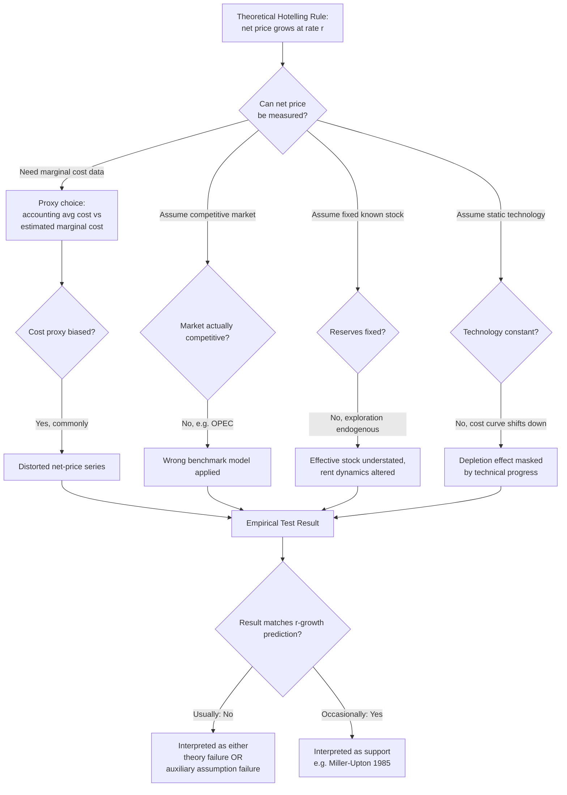

## Empirical Tests and Critiques of Hotelling's Rule

### Conceptual Baseline: What the Rule Predicts

**The Testable Prediction**

Hotelling's rule (1931) predicts that, under efficient extraction with perfect foresight, perfect capital markets, constant marginal extraction cost, and a competitive (or otherwise efficiently organized) market structure, the **net price** (also called *scarcity rent*, *royalty*, or *user cost*) of an exhaustible resource — price minus marginal extraction cost — grows at the rate of interest:

$$\frac{\dot{\lambda}(t)}{\lambda(t)} = r, \qquad \lambda(t) \equiv P(t) - MC(t)$$

This single equation generates the empirical research program: does observed net price data actually grow at rate $r$? The rule is deceptively simple to state but has proven extraordinarily difficult to test cleanly, and the accumulated empirical literature is now widely regarded as delivering a **negative or, at best, deeply qualified verdict** on the rule's descriptive accuracy.

**Key Points**

- The rule is a statement about **net price** (rent), not market price — testing it requires separating price into cost and rent components, which is itself the central empirical difficulty.
- The rule is derived under idealized assumptions (perfect foresight, no extraction externalities, competitive market structure, constant or well-specified cost functions, no technological change) — each relaxed assumption generates a distinct branch of critique.
- Failure to find $r$-consistent rent growth in the data can mean either (a) the theory is wrong/incomplete, or (b) the theory is right but the auxiliary assumptions needed to test it are violated, or (c) measurement of rent is simply too noisy/biased to detect the true signal. Disentangling these three possibilities is the central methodological challenge of the literature.

---

### The Core Measurement Problem: Constructing "Net Price"

**Two Competing Empirical Proxies for Scarcity Rent**

Because $\lambda(t)$ (in-situ resource rent) is not directly observed, researchers have used two main empirical strategies, each with serious limitations:

1. **Net-price (price-minus-cost) approach**: Estimate $\lambda(t) = P(t) - MC(t)$ using observed market prices and estimated or accounting-based marginal extraction costs.
2. **In-situ value / capital-market approach**: Infer resource value from the market valuation of firms holding reserves (e.g., stock market valuation of mining/oil companies relative to their reserves) — used by Miller & Upton (1985) and others as an alternative to accounting-cost-based net price.

**Key Points**

- Marginal cost is rarely directly observed; researchers typically use *average variable cost* or *average total cost* from accounting data as a (theoretically inexact) proxy for marginal cost, introducing potential bias.
- Different cost proxies (average cost vs. marginal cost, cash cost vs. full cost, current cost vs. historical/book cost) can generate qualitatively different conclusions about whether rent is rising or falling — a recurring critique across the literature (e.g., Halvorsen & Smith, 1991; Livernois & Uhler, 1987).
- The choice of discount rate $r$ used in testing is itself contested: risk-free rate, resource-specific cost of capital, and firm-level weighted average cost of capital (WACC) all give different predicted growth rates, and results are sensitive to this choice.

---

### Major Empirical Studies and Their Findings

**Barnett & Morse (1963) — The Precursor**

Though predating formal Hotelling-rule testing, Barnett and Morse's landmark study of long-run U.S. natural resource scarcity examined unit extraction costs (labor and capital per unit of output) for several resource categories from roughly 1870 onward. They found that **real unit costs of extraction had generally *declined* over the long run** for most minerals (with agriculture and forestry showing more mixed patterns), a finding widely interpreted as evidence that technological progress had outpaced depletion-driven cost increases — setting up the central tension that later Hotelling-rule tests would grapple with directly.

**Slade (1982) — Quadratic Price Paths**

Margaret Slade's influential study examined long-run price series (real prices, 1870s–1970s) for eleven nonfuel minerals. Rather than testing for simple exponential (constant-percentage) growth predicted by the baseline model, she fit a **quadratic time trend** to real prices, motivated by the idea that if extraction costs first fall (due to technology) and later rise (due to depletion dominating), the net price path could be U-shaped even though *rent* still grows monotonically. She found statistically significant U-shaped (initially declining, later rising) patterns for several minerals — interpreted as **broadly consistent with an augmented Hotelling model** incorporating a declining-then-rising cost trajectory, rather than as outright refutation. This remains one of the more sympathetic empirical results in the literature, though it has itself been critiqued for the fragility of quadratic-trend extrapolation and for not directly testing the $r$-growth-rate restriction.

**Miller & Upton (1985) — The Valuation Approach**

Merton Miller and Charles Upton tested Hotelling's rule using an alternative strategy: rather than constructing net price from cost data, they used the market's own valuation of oil and gas reserves *in the ground*, inferred from the stock market capitalization of oil-producing firms relative to their reported reserves. If Hotelling's rule (in a risk-adjusted form) held, the market value of a barrel of reserves should equal the present value of extracting it at the optimal future date, appreciating at (roughly) the firm's cost of capital. Their results were **broadly supportive** of the theory for the U.S. oil and gas sector in their sample period — one of the few major studies reporting a result consistent with Hotelling-type efficient depletion. [Unverified — subsequent replications and extensions of this valuation approach to other periods and other resources have produced more mixed results; treat the Miller-Upton finding as period- and sector-specific rather than universally generalizable.]

**Halvorsen & Smith (1991) — Canadian Metal Mining**

Robert Halvorsen and Tim Smith constructed a rigorous marginal-cost-based net-price series for the Canadian metal mining industry using an econometrically estimated cost function (rather than accounting averages). Their central finding was that **estimated scarcity rent had been declining, not rising, over their sample period** — directly at odds with the basic Hotelling prediction of rent growth at the rate of interest. This is one of the most frequently cited "negative results" in the literature and is often used to illustrate how methodologically careful (marginal-cost-based, structurally estimated) tests tend to produce *less* supportive results than cruder accounting-based tests.

**Livernois & Uhler (1987) and Livernois (2009) — Survey and Reassessment**

John Livernois has been a central figure in both conducting and later surveying Hotelling-rule tests. His widely cited 2009 review article ("On the Empirical Significance of the Hotelling Rule") synthesizes several decades of testing and concludes that:

- The overwhelming majority of direct empirical tests **fail to find support** for the simple $r$-percent net-price growth prediction.
- Much of this failure is attributable not to the falsity of the underlying optimizing framework, but to **auxiliary assumption violations**: nonstationary and poorly measured cost data, non-competitive market structure (especially in oil, where OPEC behavior is not well described by a competitive Hotelling model), unmodeled technological change, and exploration/reserve-addition dynamics that the baseline fixed-stock model ignores entirely.
- He argues the rule should be understood as a **first-order theoretical benchmark and organizing framework**, not a directly falsifiable point prediction, given the difficulty of constructing clean tests.

**Key Points**

- No consensus "clean" empirical confirmation of the basic Hotelling rule exists across the literature; results range from weakly supportive (Miller-Upton, some interpretations of Slade) to clearly negative (Halvorsen-Smith and many others).
- The general pattern across most minerals and fuels historically has been **flat or declining real resource prices** over long periods (with cyclical volatility, especially for oil), which is difficult to reconcile with a naive reading of Hotelling's rule but is consistent with an *augmented* model in which technological progress continuously shifts the cost curve down faster than depletion shifts it up.

---

### Major Theoretical Critiques (Why the Simple Rule May Not Hold Empirically)

**1. Endogenous Technological Change**

The baseline model treats the cost function $C(q, R)$ as fixed over time. In reality, extraction and exploration technology improves continuously (better drilling, seismic imaging, ore processing, enhanced recovery techniques), **shifting the entire cost curve downward** even as cumulative extraction rises. This can offset or dominate the pure depletion effect, producing flat or falling prices despite ongoing extraction — a central explanation offered for the Barnett-Morse and subsequent findings.

**2. Exploration and Reserve Additions (Endogenous Stock)**

The simple model assumes a known, fixed initial stock $R_0$. In practice, "reserves" are an economic (not purely geological) concept: **exploration effort responds to price signals**, continuously adding to proved reserves. Pindyck (1978) formalized a model in which the resource stock itself is a choice variable determined by exploration investment, fundamentally altering the dynamics — reserve additions can keep the *effective* scarcity rent from rising even as cumulative production increases, because the "stock" the theory should condition on is not fixed.

**3. Market Power and Non-Competitive Structure**

The Hotelling framework is typically derived for either a fully competitive industry or, under a well-known **equivalence result**, a monopolist facing a specific class of demand curves (constant-elasticity demand) — in which the monopolist's extraction path coincides with the competitive path (though the monopolist charges a higher price level throughout, extracting more slowly). For other demand specifications, monopoly/oligopoly extraction paths **diverge** from the competitive Hotelling path (typically extracting more slowly and pricing at a premium, but with different rent-growth dynamics). Since real-world resource markets — especially oil, with OPEC as a dominant coordinating cartel — are not competitive, applying the competitive-market Hotelling prediction directly to observed oil prices is a **frequently cited misspecification** in the critique literature.

**4. Uncertainty and Risk**

The baseline model assumes perfect foresight. Introducing uncertainty (about future prices, reserve sizes, extraction costs, or policy) generally modifies the rule to require that the *expected*, risk-adjusted net price grows at the risk-adjusted discount rate — but this substantially weakens the model's testability, since expectations are unobserved and risk premia are difficult to estimate independently.

**5. Non-Constant or Stock-Dependent Costs**

As covered in the extraction-cost-curve literature, once $MC$ is allowed to depend on cumulative extraction $R(t)$, the rule shifts from a statement about *price* to a statement about *price minus cost*. Many empirical tests that fail to properly account for this stock-dependence effectively test the **wrong equation** (testing for price growth at rate $r$ rather than net-price growth), a methodological critique raised explicitly by several reviewers including Livernois.

**6. Backstop Technology Expectations**

If economic agents anticipate a future backstop technology (e.g., renewable energy substituting for oil, or synthetic substitutes for a mineral), the anticipated *future* price ceiling affects *current* optimal extraction and pricing even before the backstop is actually deployed — meaning current price/rent behavior is shaped by expectations about technologies that may not yet exist in the historical data sample, complicating retrospective testing.

**7. Property Rights and Institutional Frictions**

The efficient-extraction result depends on well-defined, enforceable property rights over the resource stock. Common-pool problems (e.g., in oil field extraction under the historic "rule of capture" in the U.S.), regulatory constraints (well-spacing rules, prorationing), and taxation/royalty regimes can all drive a wedge between the theoretically efficient Hotelling path and observed extraction behavior — this is a frequently cited institutional-critique branch distinct from the purely econometric critiques above.

---

### Diagram: The Chain of Auxiliary Assumptions Between Theory and Test

---

### Synthesis: How the Literature Currently Interprets These Results

**Key Points**

- The dominant contemporary interpretation (reflected in Livernois's survey work) is that Hotelling's rule remains a **valid and useful normative/organizing benchmark** for how an efficient, forward-looking resource economy *should* behave, but that it is a poor **direct positive predictor** of observed price paths once technological change, exploration, and market power are present — which is to say, essentially always in real-world data.
- Rather than being "rejected" in the strict Popperian sense, the rule has been progressively **extended and augmented** — incorporating stock-dependent costs, endogenous reserves, market power, and uncertainty — to the point where the *augmented* Hotelling framework is difficult to cleanly distinguish empirically from a general reduced-form model of natural-resource price and extraction behavior.
- A persistent methodological critique across the literature (echoed by, among others, Krautkraemer's 1998 survey of nonrenewable resource scarcity) is that **the joint hypothesis problem** — testing Hotelling's rule always simultaneously tests the auxiliary assumptions bundled with it — makes clean falsification essentially impossible with the data typically available, an issue analogous to the Fama-style joint-hypothesis problem in tests of market efficiency.
- [Inference] Given the accumulated weight of negative and mixed findings, most contemporary energy/resource economists treat Hotelling's rule primarily as a **pedagogical and conceptual tool** — useful for organizing thinking about scarcity rent, user cost, and intertemporal allocation — rather than as an empirically validated law governing observed commodity price paths.

---

**Related Topics**

- Extraction cost curves and the order of resource use (Herfindahl Principle)
- Backstop technologies and the Nordhaus/Dasgupta-Heal transition-price model
- Pindyck's model of exploration and endogenous reserve additions
- OPEC as a dominant-firm/cartel model versus competitive Hotelling benchmarks
- The joint-hypothesis problem in empirical tests of dynamic optimizing models
- Real options and irreversible investment under uncertainty in resource extraction
- Barnett-Morse resource scarcity indicators and long-run unit-cost measures
- Risk-adjusted discount rates and uncertainty extensions to the Hotelling model
- Common-pool resource problems and the "rule of capture" in oil extraction