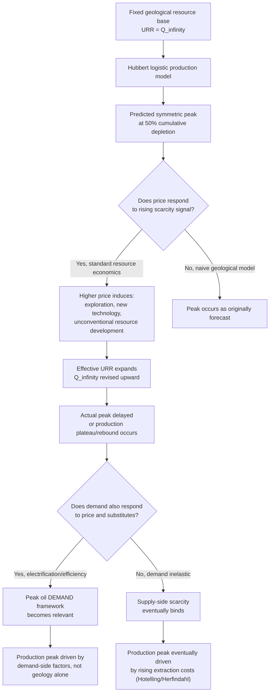

## Peak Oil Theory and Its Economic Implications

### Conceptual Foundations

**Definition**

Peak oil theory refers to the proposition that production of crude oil (or petroleum liquids more broadly) from a given field, region, or the world as a whole follows a **bell-shaped (roughly Gaussian or logistic-derivative) trajectory over time**, rising, reaching a maximum rate ("peak"), and then declining, driven by the finite and depleting nature of the underlying resource stock. The theory is most closely associated with geophysicist **M. King Hubbert**, and the associated production trajectory is commonly called the **Hubbert curve**.

Peak oil is fundamentally a *geological/physical production-rate* hypothesis, distinct from (though often conflated with) exhaustible-resource *economic* theories such as Hotelling's rule, which concern optimal intertemporal price and extraction paths rather than a specific bell-shaped production profile.

**Key Points**

- Peak oil is a claim about the **rate** of extraction over time reaching a maximum, not a claim that oil "runs out" abruptly.
- It is a **supply-side, physical-production** framework, in contrast with Hotelling-style models, which are **demand/price-optimization** frameworks; the two are complementary but analytically distinct, and much confusion in popular discourse stems from treating them as substitutes.
- The theory generates strong, falsifiable, near-term predictions (a specific peak year and decline rate), which is precisely what has made it empirically contentious.

---

### The Hubbert Curve: Mathematical Structure

**Logistic Growth Model**

Hubbert modeled *cumulative* production $Q(t)$ as following a logistic (S-shaped) curve approaching an ultimate recoverable resource base $Q_{\infty}$ (also called Ultimately Recoverable Resources, URR):

$$Q(t) = \frac{Q_{\infty}}{1 + e^{-b(t - t_m)}}$$

where $t_m$ is the inflection point (the time of peak production) and $b$ is a growth-rate parameter governing the steepness of the S-curve.

**The Production-Rate (Hubbert) Curve**

The instantaneous production rate $q(t) = \dot{Q}(t)$ is the derivative of the logistic function, yielding the characteristic symmetric bell shape:

$$q(t) = \frac{dQ}{dt} = \frac{b\,Q_{\infty}\,e^{-b(t-t_m)}}{\left(1+e^{-b(t-t_m)}\right)^2}$$

This can be rewritten in the equivalent, more commonly cited form:

$$q(t) = \frac{b}{4}\,Q_{\infty}\,\text{sech}^2\!\left(\frac{b(t-t_m)}{2}\right)$$

Peak production occurs precisely when $Q(t) = Q_{\infty}/2$ — i.e., **at the point where half of the ultimately recoverable resource has been produced**. This "50% depletion" heuristic is the central operational prediction used in most Hubbert-style peak forecasting.

**Key Points**

- The curve is symmetric by construction in the basic logistic specification — the decline phase mirrors the rise phase, though real-world production profiles frequently deviate from this symmetry (asymmetric curves, plateaus, "undulating plateaus," and multiple local peaks are common empirical departures).
- $Q_{\infty}$ (URR) is not a physical constant known with certainty; it must be *estimated*, typically via curve-fitting production history, geological assessment, or analogy to comparable basins — and estimates of $Q_{\infty}$ have historically been revised upward repeatedly as new reserves, technologies, and unconventional resources (shale, deepwater, oil sands) have been incorporated. This revision dynamic is the single most important empirical weakness of naive Hubbert forecasting.
- The Hubbert Linearization technique — plotting $q(t)/Q(t)$ against $Q(t)$, which should trace a straight line under the logistic model — is the standard estimation method Hubbert-school analysts use to back out $Q_{\infty}$ from historical production data.

---

### Historical Track Record: Predictions vs. Outcomes

**Hubbert's 1956 U.S. Prediction**

Hubbert's most celebrated forecast, presented in 1956, predicted that U.S. lower-48 crude oil production would peak between **1965 and 1970**. Lower-48 conventional crude production did in fact peak in **1970**, a result widely cited as vindicating the model and establishing Hubbert's methodological credibility for subsequent global forecasting efforts.

**Subsequent U.S. Production History — The Shale Revolution Reversal**

However, U.S. total crude oil production **subsequently rose dramatically well beyond the 1970 peak**, driven by the horizontal drilling and hydraulic fracturing ("fracking") revolution applied to shale/tight-oil formations from roughly the mid-2000s onward, making the U.S. the world's largest crude oil producer by the late 2010s. [Inference — the specific historical peak/rebound pattern is well documented; exact production figures and ranking dates should be verified against current EIA data for any time-sensitive application, as this exceeds what should be treated as a fixed historical fact given continued data revisions.]

This reversal is the single most important empirical counter-example cited against strict Hubbert-curve forecasting: a resource base once treated as geologically fixed and near-exhausted (conventional lower-48 oil) was supplemented by an entirely different resource category (tight oil/shale) that was not economically extractable at the time of the original forecast, fundamentally altering the effective $Q_{\infty}$.

**Global "Peak Oil" Predictions**

Various analysts (notably Colin Campbell, Jean Laherrère, and the Association for the Study of Peak Oil, ASPO) extended Hubbert-style modeling to global conventional crude oil production from the 1990s onward, with predicted global peak dates clustering around **2005–2015** in most such forecasts. Global crude oil production did **not** decline as these forecasts anticipated; instead, it continued rising through the 2010s, driven substantially by unconventional resources (U.S. shale, Canadian oil sands, deepwater production) that were either not counted in, or systematically underestimated by, the original URR assessments underlying those forecasts.

**Key Points**

- The historical record shows Hubbert-style modeling performing well for **mature, single-technology, well-delineated basins** (the U.S. lower-48 conventional case) but performing poorly for **global aggregate forecasts** spanning multiple resource categories and long forecast horizons, precisely because technology and economics continuously redefine what counts as "recoverable."
- This pattern generates the central methodological critique: **URR is not a fixed geological quantity but an economically and technologically contingent one**, since a barrel of oil is "recoverable" only if it can be extracted at a cost below the prevailing (or expected future) price — a point emphasized repeatedly by resource economists critiquing pure-geology peak-oil forecasting.

---

### The Economic Critique: Reconciling Peak Oil with Resource Economics

**1. Endogenizing the Resource Base**

The central economic critique of naive peak-oil theory is that it treats $Q_{\infty}$ as exogenous and fixed, whereas standard resource economics (per Pindyck's exploration models and the broader literature) treats the **economically recoverable resource base as endogenous to price**. As price rises, previously uneconomic resources (deepwater, tight oil, oil sands, enhanced recovery from mature fields) become profitable to develop, effectively expanding $Q_{\infty}$ — meaning the "peak" is not a fixed date but a **moving target that responds to the price path itself**.

**2. Price as the Equilibrating Mechanism**

In the Hotelling/Herfindahl framework, price is expected to rise as low-cost resources are exhausted (moving up the cost-curve steps described in the "extraction cost curves" topic), which is precisely the mechanism that induces the technological and exploratory responses that shift $Q_{\infty}$ upward. Peak-oil theory, in its pure geological form, does not incorporate this price-feedback loop, treating production as a function of time and remaining geological stock alone, independent of the price signal that governs whether extraction is economically rational.

**3. Substitution and Demand-Side Responses**

Standard resource economics also emphasizes that even if a **physical** supply peak eventually occurs for conventional oil, the *economic* consequences depend heavily on the availability of substitutes (backstop technologies) and demand elasticity. If demand growth slows or reverses — due to efficiency improvements, electrification of transport, or climate policy — a production peak could in principle be driven by **declining demand** ("peak demand") rather than by supply exhaustion, an outcome increasingly emphasized in energy-transition-era analysis and one that inverts the causal logic of classical peak-oil theory.

**4. "Peak Oil Demand" as a Competing/Successor Framework**

Since roughly the mid-2010s, much industry and analyst discussion has shifted from "peak oil supply" to **"peak oil demand"** — the idea that global oil consumption may plateau or decline due to transport electrification, efficiency gains, and climate policy, well before physical resource exhaustion becomes binding. [Unverified/Speculation — the timing and magnitude of any demand peak remains genuinely contested among forecasters (e.g., IEA, OPEC, and major oil companies have published materially different demand-peak timelines and trajectories), and this represents a live, unsettled empirical and policy question rather than an established fact.]

---

### Key Points: Reconciling the Two Frameworks

**Key Points**

- Peak oil theory (Hubbert) and Hotelling-style resource economics are **not competing theories of the same phenomenon** — Hubbert models physical production rate under a fixed, exogenous resource base; Hotelling/Herfindahl models economically optimal extraction and pricing under an endogenous, price-responsive resource base. A complete picture of exhaustible-resource dynamics generally requires both perspectives.
- The empirical failure of most global peak-oil forecasts is best understood economically as a failure to endogenize the **price-induced expansion of the economically recoverable resource base**, not necessarily as evidence that oil is not finite (it certainly is) or that a production peak can never occur (it eventually must, in some form, for any exhaustible resource).
- A useful synthesis: geological Hubbert-curve analysis is most reliable for **describing/fitting the decline of a specific, mature, well-understood basin under stable technology**, while it is least reliable for **forecasting global aggregate peaks over multi-decade horizons** spanning technological regime changes — precisely the horizon over which economic (price and substitution) effects dominate.

---

### Diagram: Hubbert Curve vs. Actual Observed Pattern (Stylized)

<svg xmlns="http://www.w3.org/2000/svg" viewBox="0 0 640 400" font-family="Helvetica, Arial, sans-serif">
<title>Hubbert Curve Prediction vs. Stylized Actual Production Pattern (svg_diagram)</title>
<rect x="0" y="0" width="640" height="400" fill="#ffffff" />
<line x1="70" y1="330" x2="600" y2="330" stroke="#333333" stroke-width="2" />
<line x1="70" y1="330" x2="70" y2="40" stroke="#333333" stroke-width="2" />
<text x="335" y="375" font-size="15" text-anchor="middle" fill="#111111">Time</text>
<text x="25" y="185" font-size="15" text-anchor="middle" fill="#111111" transform="rotate(-90 25 185)">Production Rate</text>
<path d="M 90 320 Q 250 320 330 100 Q 410 320 570 320" fill="none" stroke="#1f77b4" stroke-width="3" />
<text x="480" y="130" font-size="13" fill="#1f77b4">Hubbert Prediction (symmetric bell)</text>
<path d="M 90 320 Q 250 320 330 100 Q 400 180 420 175 Q 480 165 520 90 Q 560 60 590 65" fill="none" stroke="#d62728" stroke-width="3" stroke-dasharray="6,3" />
<text x="430" y="45" font-size="13" fill="#d62728">Actual Pattern (technology-driven rebound)</text>
<line x1="330" y1="330" x2="330" y2="100" stroke="#888888" stroke-width="1" stroke-dasharray="3,3" />
<text x="330" y="345" font-size="12" text-anchor="middle" fill="#555555">Predicted Peak (t_m)</text>
<line x1="420" y1="330" x2="420" y2="175" stroke="#888888" stroke-width="1" stroke-dasharray="3,3" />
<text x="420" y="360" font-size="12" text-anchor="middle" fill="#555555">Shale/Tech Inflection</text>
<text x="335" y="20" font-size="16" text-anchor="middle" font-weight="bold" fill="#111111">Geological Forecast vs. Economically Endogenous Outcome</text>
</svg>

---

### Diagram: Causal Chain Linking Peak Oil Theory to Economic Outcomes

---

### Economic Implications: Broader Policy and Market Consequences

**Energy Security and Investment Cycles**

Peak-oil narratives, particularly during the 2000s, materially influenced energy policy discourse, driving increased investment in alternative energy, strategic petroleum reserves, and demand-reduction policy, independent of whether the specific forecasts proved accurate — an example of how a contested economic/geological theory can still generate real economic and policy effects through its influence on expectations and investment behavior.

**Boom-Bust Investment Cycles in Oil Markets**

The historical alternation between "scarcity" narratives (driving high prices and heavy upstream investment, as in 2005–2014) and "abundance" narratives (following the shale boom's price-depressing effect from roughly 2014 onward) illustrates a broader economic implication: **peak-oil-adjacent narratives themselves function as a coordinating signal for investment behavior**, and mismatches between narrative-driven investment and realized geological/technological outcomes have historically generated significant price volatility and capital misallocation in the sector. [Inference — this narrative-cycle interpretation is a widely discussed pattern in energy-market commentary rather than a formally tested econometric result.]

**Climate Policy Interaction**

The rise of "peak demand" framing intersects directly with climate policy: if binding climate constraints (carbon pricing, electrification mandates) suppress oil demand before geological supply constraints bind, a substantial fraction of currently classified "reserves" could become **stranded assets** — economically unrecoverable not because of geological exhaustion but because of demand-side policy and substitution effects. This "stranded asset" framing has become a significant topic in energy-transition financial-risk analysis, connecting peak-oil-adjacent theory directly to modern climate-finance debates. [Speculation — the scale and timing of stranded-asset risk remains an actively debated and evolving area of both economic modeling and financial regulation.]

---

**Related Topics**

- Extraction cost curves and the order of resource use (Herfindahl Principle)
- Empirical tests and critiques of Hotelling's rule
- Backstop technologies and the Nordhaus/Dasgupta-Heal transition model
- Pindyck's model of exploration and endogenous reserve additions
- Stranded assets and climate-policy risk in fossil fuel valuation
- Shale oil/gas economics and the short-cycle investment model
- OPEC production management and strategic behavior in global oil markets
- Energy transition scenarios and demand elasticity for petroleum products
- Ultimately Recoverable Resources (URR) estimation methodologies