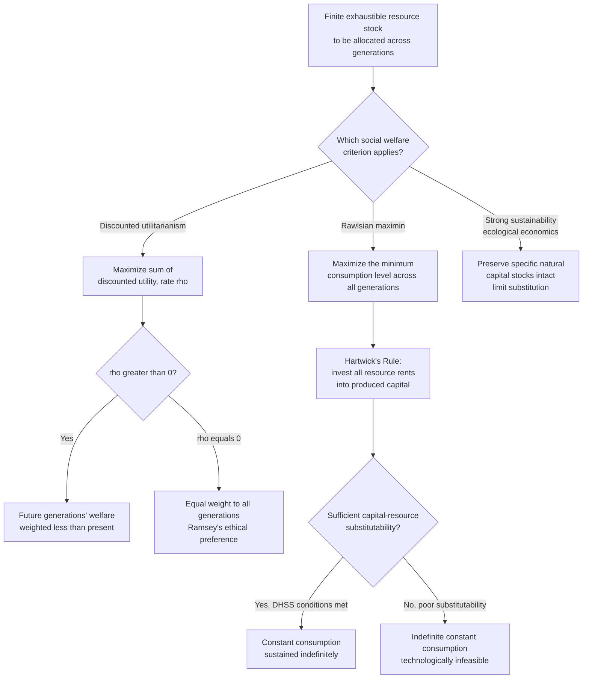

## Intergenerational Equity in Resource Depletion

### Conceptual Foundations

**Definition**

Intergenerational equity in resource depletion concerns the normative and welfare-economic question of **how the benefits of exhaustible natural resource extraction should be distributed across present and future generations**, given that consumption of a nonrenewable resource by the current generation permanently forecloses its consumption by future generations. This is distinct from the *positive* question of how resources are actually extracted (addressed by Hotelling's rule and the Herfindahl principle); intergenerational equity is fundamentally a **normative welfare-economics question** about what allocation *ought* to occur, and under what ethical/social welfare criteria.

**Key Points**

- The core tension: exhaustible resources are a fixed (or slowly-augmented) stock, so any consumption path chosen imposes an allocation across generations who cannot bargain with one another directly, since future generations do not yet exist to represent their own interests in current markets or political processes.
- Intergenerational equity questions arise wherever a competitive market equilibrium (which discounts future consumption at a market interest rate) may diverge from a socially optimal path evaluated by a different ethical/social welfare criterion — this divergence is the central analytical object of the field.
- The literature intersects three domains: **capital theory** (optimal growth with exhaustible resources), **social choice/welfare economics** (aggregating welfare across generations), and **environmental ethics** (philosophical justifications for weighting future generations' interests).

---

### The Discounting Problem: Why Market Outcomes May Not Be Equitable

**The Role of the Discount Rate**

In the standard Hotelling/Ramsey-style optimal-growth framework, the social planner's objective is:

$$\max \int_0^\infty U(c(t))\,e^{-\rho t}\,dt$$

where $\rho$ is the **social rate of time preference** (or "utility discount rate") — the rate at which the welfare of future generations is discounted relative to the present generation, purely because it occurs later in time. The central intergenerational-equity critique is that **any $\rho > 0$ embeds an ethically loaded judgment**: it explicitly treats a unit of utility to a person born later as worth *less*, for no reason other than the date of their birth — a position many welfare economists and philosophers (most famously Frank Ramsey himself, and later Amartya Sen and others) have argued is difficult to justify on pure ethical grounds, since a future person's capacity for wellbeing is not intrinsically less valuable than a present person's.

**Key Points**

- **Ramsey's own view** (1928) was that discounting future utility purely for its "futureness" is ethically indefensible ("a practice which is ethically indefensible and arises merely from the weakness of the imagination"), even though he included a discount factor in his formal model for tractability/pragmatic reasons.
- A positive $\rho$ combined with the standard Hotelling framework tends to **favor faster present extraction and higher present consumption**, since future consumption (and future resource stocks) are valued less in present-value terms — this is the direct channel through which the choice of discount rate determines the degree of intergenerational equity or inequity in the resulting extraction path.
- Empirically, a small difference in $\rho$ (e.g., 1% vs. 3%) compounds dramatically over century-long horizons relevant to exhaustible-resource and climate policy, making the discount-rate choice one of the single most consequential — and contested — parameters in all of long-run resource and environmental economics (this exact debate is central to climate-policy discounting controversies, e.g., the Stern Review vs. Nordhaus debate on optimal carbon pricing).

---

### The Sustainability Criterion: Rawlsian Maximin and Hartwick's Rule

**The Solow-Hartwick "Constant Consumption" Criterion**

An influential alternative to discounted-utilitarian optimization is the **maximin (Rawlsian) criterion**, applied to intergenerational choice by Robert Solow (1974) and formalized operationally by John Hartwick (1977). Rather than maximizing the discounted sum of utility (which permits declining consumption for distant generations as long as early generations' higher utility outweighs it in present-value terms), the Rawlsian approach asks: **what is the maximum constant level of consumption that can be sustained indefinitely**, given a finite resource stock and a production technology that combines exhaustible resources with reproducible (man-made) capital?

**Hartwick's Rule**

Hartwick's Rule states the investment condition required to sustain constant consumption indefinitely in an economy with exhaustible resources and a reproducible capital stock:

$$\text{Invest all Hotelling rents (resource royalties) in reproducible capital}$$

Formally, if $R(t)$ is the resource extraction rate, $\rho_R(t)$ is the resource's scarcity rent (Hotelling rent) per unit, and $K(t)$ is the man-made capital stock, Hartwick's Rule requires:

$$\dot{K}(t) = \rho_R(t)\, R(t)$$

That is, the economy must reinvest the entire flow of resource rents (not the entire revenue — only the *rent*, i.e., price minus extraction cost) into produced capital at every instant. Under a Cobb-Douglas-type production technology combining capital, labor, and the exhaustible resource, following Hartwick's Rule generates **exactly constant consumption forever** — the built-up capital stock substitutes for the depleting resource stock, keeping total productive capacity (and hence sustainable consumption) constant.

**Key Points**

- Hartwick's Rule operationalizes a specific, strong sustainability criterion: intergenerational equity is satisfied if and only if **total capital (produced capital plus remaining natural resource capital, appropriately valued) is non-declining over time** — a concept later generalized into the broader "genuine savings" or "adjusted net saving" framework used by the World Bank and others to assess whether nations are depleting their total capital base.
- The rule depends critically on the production technology permitting substitution between capital and the resource (an elasticity-of-substitution condition, related to the Dasgupta-Heal-Solow-Stiglitz, DHSS, model conditions for sustainability); if capital and the resource are strong complements with limited substitutability, indefinite constant consumption may be technologically infeasible regardless of the savings/investment rule followed.
- Hartwick's Rule is often cited as the theoretical foundation for **resource-revenue sovereign wealth funds** (e.g., Norway's Government Pension Fund Global, funded by North Sea oil and gas rents), which explicitly reinvest resource extraction proceeds into a diversified financial-asset portfolio rather than current consumption, as a practical institutional analogue to the Hartwick investment rule. [Inference — while Norway's fund is widely cited in the academic literature as *consistent with* Hartwick-style reasoning, the fund's design was not derived directly as an implementation of the formal Hartwick model, and the correspondence is illustrative rather than exact.]

---

### Weak vs. Strong Sustainability

**Weak Sustainability**

The Hartwick/DHSS framework embodies **weak sustainability**: it requires only that the *aggregate value* of total capital (natural plus produced) be maintained, permitting extensive substitution — natural resource capital can be run down as long as it is offset by an equivalent increase in produced (man-made) capital, with no requirement that any particular *type* of natural capital be preserved.

**Strong Sustainability**

An alternative, more restrictive position — associated with ecological economics (e.g., Herman Daly) — holds that certain forms of natural capital are **not substitutable** by produced capital (due to unique ecological functions, irreversibility, or the existence of critical thresholds/tipping points), and that intergenerational equity requires preserving certain *specific* natural capital stocks (e.g., critical ecosystems, climate stability, biodiversity) essentially intact, regardless of how much produced capital is accumulated in exchange.

**Key Points**

- The weak/strong sustainability distinction maps directly onto a deeper disagreement about the **degree of substitutability** between natural and produced capital — an empirical and technological question with major normative consequences, since the two positions can prescribe dramatically different depletion paths for the same resource.
- Exhaustible energy/mineral resources are generally treated as good candidates for weak-sustainability reasoning (a barrel of oil consumed can, in principle, be "replaced" in productive capacity by investment in renewable energy infrastructure or other capital), whereas ecosystem services, climate stability, and biodiversity are more commonly argued to require strong-sustainability treatment — this distinction is directly relevant to how energy economists versus ecological economists tend to frame resource-depletion policy debates.

---

### Diagram: Contrasting Intergenerational Equity Criteria

---

### Practical and Policy Applications

**Sovereign Wealth Funds and Resource Revenue Management**

Resource-rich economies increasingly institutionalize intergenerational-equity principles through **sovereign wealth funds** and fiscal rules that separate current government spending from resource extraction revenue, explicitly aiming to convert a depleting natural-resource endowment into a perpetual financial-asset endowment for future generations. Norway's oil fund, Alaska's Permanent Fund, and various Gulf state sovereign wealth funds are commonly cited real-world institutional responses to the Hartwick-style logic, though their specific design, payout rules, and degree of adherence to a strict "invest all resource rent" principle vary substantially across countries. [Unverified — specific design details, current fund sizes, and payout rules change over time and across jurisdictions; verify against current official fund disclosures for any application requiring precise figures.]

**"Genuine Savings" / Adjusted Net Savings Metrics**

The World Bank and related institutions have operationalized weak-sustainability, Hartwick-adjacent reasoning into a national accounting metric called **genuine savings** (or adjusted net saving): gross national saving, minus depreciation of produced capital, minus depletion of natural resources (valued at their resource rent), plus investment in human capital (education expenditure), minus pollution damages. A persistently negative genuine savings rate is interpreted as an empirical signal that a country's development path is **not intergenerationally sustainable** under the weak-sustainability criterion, because it implies the nation's total capital base (natural plus produced plus human) is shrinking over time.

**Climate Change as an Intergenerational Equity Problem**

The intergenerational-equity apparatus developed for exhaustible resources has been directly extended to climate change economics, where the choice of discount rate ($\rho$) in models like the DICE model (Nordhaus) or the Stern Review's alternative low-discount-rate approach produces dramatically different prescriptions for the socially optimal carbon price and mitigation effort — a direct, high-stakes contemporary application of the same discounting-ethics debate first raised in the context of nonrenewable resource depletion. [Inference — this connection between resource-depletion discounting theory and climate-policy discounting debates is a well-established point of continuity in the environmental economics literature, though the specific policy conclusions drawn from either side remain actively and politically contested.]

**Key Points**

- Intergenerational equity in resource depletion is not merely a theoretical curiosity — it directly underpins real fiscal institutions (sovereign wealth funds), national accounting metrics (genuine savings), and high-stakes contemporary policy debates (optimal climate discounting).
- The unresolved tension between market-determined discount rates (reflecting current savers' and investors' actual time preferences and opportunity costs of capital) and ethically-motivated social discount rates (reflecting philosophical judgments about the moral weight of future generations) remains one of the most consequential open normative questions in the entire field of natural resource and environmental economics.

---

**Related Topics**

- Hotelling's rule and the role of the discount rate in optimal extraction paths
- Extraction cost curves and the order of resource use (Herfindahl Principle)
- The Dasgupta-Heal-Solow-Stiglitz (DHSS) model of capital-resource substitutability
- Genuine savings / adjusted net saving as a sustainability indicator
- Sovereign wealth funds and resource revenue management (Norway, Alaska, Gulf states)
- Social discount rate debates in climate policy (Stern Review vs. Nordhaus/DICE)
- Rawlsian maximin criteria and social choice theory applied to intertemporal allocation
- Weak vs. strong sustainability in ecological economics
- Backstop technologies and their role in relaxing intergenerational trade-offs