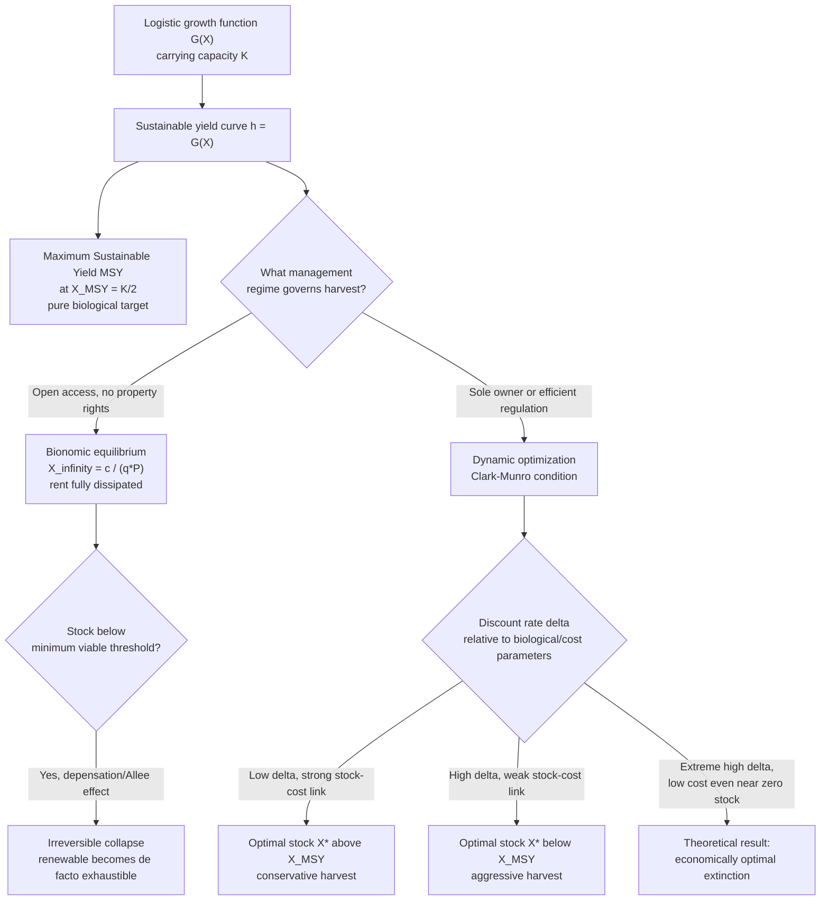

## Renewable Resource Dynamics and Sustainable Yield Concepts

### Conceptual Foundations

**Definition**

Renewable resource economics studies the optimal management of biological or naturally-regenerating resource stocks — fisheries, forests, groundwater aquifers, wildlife populations, and similar systems — that possess an intrinsic capacity for **natural growth or replenishment**, in contrast to exhaustible (nonrenewable) resources, which have no regeneration mechanism. This structural difference fundamentally changes the economics: whereas exhaustible-resource theory (Hotelling, Herfindahl) centers on optimal *depletion timing* of a fixed stock, renewable-resource theory centers on **optimal harvest/extraction rates relative to a stock's natural growth rate**, since a sufficiently conservative harvest policy can, in principle, sustain the resource indefinitely.

**Key Points**

- The defining feature of a renewable resource is a **biological (or hydrological) growth function** $G(X)$ that describes how the stock $X$ regenerates over time in the absence of harvesting — this growth function has no analogue in pure exhaustible-resource models.
- Renewable resource economics shares mathematical structure with exhaustible-resource dynamic optimization (both use optimal control / dynamic programming), but the presence of a growth function changes the qualitative nature of steady states, permitting stable, non-zero long-run equilibrium stock levels — something impossible for a genuinely nonrenewable resource.
- Mismanagement risk is asymmetric relative to exhaustible resources: because growth is often **nonlinear and subject to biological thresholds** (Allee effects, minimum viable population sizes, critical depensation), overharvesting a renewable resource can push it into an *irreversible* collapse, effectively converting a renewable resource into a de facto exhaustible one — a central concern distinguishing renewable-resource risk management from the exhaustible-resource case.

---

### The Biological Growth Function

**The Logistic (Verhulst) Growth Model**

The canonical starting point for renewable resource stock dynamics is the **logistic growth function**:

$$\dot{X}(t) = G(X(t)) = rX(t)\left(1 - \frac{X(t)}{K}\right)$$

where:

- $X(t)$ is the resource stock (biomass) at time $t$
- $r$ is the **intrinsic growth rate** (maximum per-capita growth rate at low stock levels)
- $K$ is the **carrying capacity** (the maximum stock level the environment can sustain in the absence of harvesting)

This function is **concave and inverted-U shaped** in $X$: growth is zero at $X=0$ (no population to reproduce) and at $X=K$ (population at capacity, resource-constrained), and reaches a maximum at some intermediate stock level.

**Incorporating Harvest**

With harvesting at rate $h(t)$, the resource stock evolves according to:

$$\dot{X}(t) = G(X(t)) - h(t) = rX(t)\left(1 - \frac{X(t)}{K}\right) - h(t)$$

A **steady state** (constant stock over time) requires $\dot{X}(t) = 0$, i.e., harvest exactly equal to natural growth at the prevailing stock level:

$$h = G(X) = rX\left(1 - \frac{X}{K}\right)$$

**Key Points**

- The logistic function is the workhorse model in the field (analogous to the role of Cobb-Douglas in production theory) but is a simplification; real biological populations often exhibit more complex dynamics (age-structured cohorts, seasonal reproduction, predator-prey interactions, environmental stochasticity) that the simple logistic form does not capture.
- Growth functions can also exhibit **depensation** (growth rate falls at very low stock, sometimes to the point of negative net growth — "critical depensation" or an Allee effect), which introduces a **minimum viable stock threshold** below which the population cannot recover even absent harvesting — a critical nonlinearity with major policy implications for near-collapse fisheries and wildlife populations.

---

### Maximum Sustainable Yield (MSY)

**Definition and Derivation**

**Maximum Sustainable Yield (MSY)** is the largest harvest level that can be sustained indefinitely — the highest point on the sustainable-yield curve $h = G(X)$. It is found by maximizing $G(X)$ with respect to $X$:

$$\frac{dG}{dX} = r\left(1 - \frac{2X}{K}\right) = 0 \quad \Longrightarrow \quad X_{MSY} = \frac{K}{2}$$

Substituting back:

$$h_{MSY} = G(X_{MSY}) = r\cdot\frac{K}{2}\left(1-\frac{1}{2}\right) = \frac{rK}{4}$$

Under the standard logistic model, **MSY occurs at exactly half the carrying capacity**, mirroring the "50% depletion" landmark seen in the Hubbert curve for exhaustible resources, though the underlying mechanism (biological growth-rate maximization vs. cumulative-depletion inflection) is entirely different.

**Key Points**

- MSY was, for much of the twentieth century, the dominant biological management target for fisheries and wildlife regulation, embedded in numerous international agreements (e.g., early UN Law of the Sea frameworks referencing MSY as a management benchmark).
- MSY is a **purely biological** concept — it says nothing about economic costs, prices, discount rates, or profitability, which is the central critique economists have raised against using MSY as a stand-alone management target (developed in the bioeconomic model below).
- Because $G(X)$ is concave, sustaining harvest at $h_{MSY}$ indefinitely requires holding the stock exactly at $X_{MSY} = K/2$; harvesting above $h_{MSY}$ at any stock level is **not sustainable** — the stock will decline monotonically toward zero if harvest permanently exceeds the maximum possible regenerative rate.

---

### Illustration: The Sustainable Yield Curve

<svg xmlns="http://www.w3.org/2000/svg" viewBox="0 0 640 400" font-family="Helvetica, Arial, sans-serif">
<title>Sustainable Yield Curve — Logistic Growth Model (svg_diagram)</title>
<rect x="0" y="0" width="640" height="400" fill="#ffffff" />
<line x1="70" y1="330" x2="600" y2="330" stroke="#333333" stroke-width="2" />
<line x1="70" y1="330" x2="70" y2="40" stroke="#333333" stroke-width="2" />
<text x="335" y="375" font-size="15" text-anchor="middle" fill="#111111">Resource Stock, X</text>
<text x="25" y="185" font-size="15" text-anchor="middle" fill="#111111" transform="rotate(-90 25 185)">Sustainable Harvest, h = G(X)</text>
<path d="M 70 330 Q 335 40 600 330" fill="none" stroke="#1f77b4" stroke-width="3" />
<line x1="335" y1="330" x2="335" y2="40" stroke="#888888" stroke-width="1" stroke-dasharray="4,3" />
<line x1="70" y1="40" x2="335" y2="40" stroke="#888888" stroke-width="1" stroke-dasharray="4,3" />
<circle cx="335" cy="40" r="5" fill="#d62728" />
<text x="335" y="30" font-size="13" text-anchor="middle" fill="#d62728" font-weight="bold">MSY = rK/4</text>
<text x="335" y="350" font-size="12" text-anchor="middle" fill="#555555">X_MSY = K/2</text>
<text x="600" y="350" font-size="12" text-anchor="end" fill="#555555">K (carrying capacity)</text>
<circle cx="220" cy="185" r="4" fill="#2ca02c" />
<text x="150" y="200" font-size="12" fill="#2ca02c">Bionomic equilibrium (open access)</text>
<text x="335" y="20" font-size="16" text-anchor="middle" font-weight="bold" fill="#111111">Sustainable Yield as a Function of Stock Level</text>
</svg>

---

### The Bioeconomic Model: Introducing Costs, Prices, and Discounting

**The Gordon-Schaefer Model**

The foundational bioeconomic model (H. Scott Gordon, 1954, economics; Schaefer, 1957, biology — jointly forming the **Gordon-Schaefer model**) integrates the logistic growth function with an economic harvest-cost structure. Harvest effort $E$ (e.g., fishing-fleet size or hours) produces harvest via a catch function:

$$h = qEX$$

where $q$ is the **catchability coefficient**. Cost of harvesting is assumed proportional to effort: $C = cE$, so total harvest cost as a function of stock and harvest is:

$$C(h, X) = \frac{c}{qX}h$$

This generates the crucial **stock-dependent cost** feature: at lower stock levels $X$, harvesting a given quantity requires more effort (fish are harder to find), raising marginal cost — directly analogous in form to the stock-dependent cost functions used in exhaustible-resource models, but here driven by search/catchability rather than ore-grade or geological depth.

**Static (Open-Access) Bionomic Equilibrium**

Under **open access** (no property rights, free entry of harvesters), effort will expand until total revenue equals total cost (economic profit driven to zero) — a pure rent-dissipation outcome:

$$P\cdot h = C(h,X) \quad \Longrightarrow \quad P\cdot qEX = cE \quad \Longrightarrow \quad X_{\infty} = \frac{c}{qP}$$

This is the **bionomic equilibrium** stock level under open access — generally located at a stock level **below** $X_{MSY}$ whenever cost/price conditions favor heavy exploitation, and importantly, **entirely independent of any discount rate or intertemporal optimization**, because open-access harvesters have no incentive to conserve stock for their own future benefit (any stock they leave will simply be caught by a competitor).

**Key Points**

- Open access is the renewable-resource analogue of the "tragedy of the commons" (Hardin, 1968) — because no individual harvester owns the resource stock, none has an incentive to restrict current harvest to preserve future stock, leading to **systematic overexploitation relative to any efficient (rent-maximizing or MSY) benchmark**.
- The bionomic equilibrium can, in extreme cases (high price, low cost, low catchability threshold), drive the stock toward biological collapse or extinction — the central real-world concern motivating fisheries and wildlife regulatory intervention.
- This static open-access model contrasts sharply with the **sole-owner (optimal) model** developed next, in which a single owner (or effective regulator) internalizes the full dynamic value of the stock.

---

### The Sole-Owner Optimal Dynamic Model

**Maximum Economic Yield (MEY) and the Optimal Steady State**

A sole owner (or a regulator implementing an efficient management regime) maximizes the present value of net economic benefits from harvesting:

$$\max_{h(t)} \int_0^\infty \left[P\cdot h(t) - C(h(t), X(t))\right]e^{-\delta t}\,dt \quad \text{s.t.} \quad \dot{X}(t) = G(X(t)) - h(t)$$

where $\delta$ is the discount rate. Solving this dynamic optimization problem yields the **modified golden rule for renewable resources**, often called the **Clark-Munro condition** (Colin Clark and Gordon Munro's foundational contributions to dynamic bioeconomic modeling):

$$G'(X^*) - \frac{C_X(h,X)}{P - C_h(h,X)} = \delta$$

This condition states that at the optimal steady-state stock $X^*$, the **marginal growth rate of the stock, adjusted for the stock effect on harvesting cost, equals the discount rate**. The intuition: the resource stock functions as a form of natural capital, and its "return" (biological growth rate, net of the cost-saving benefit of a larger stock) must equal the return available on alternative investments (the discount rate) for the owner to be indifferent between marginally conserving more stock versus harvesting it and investing the proceeds elsewhere.

**Key Points**

- The **optimal steady-state stock $X^*$ generally lies above $X_{MSY}$ when the discount rate is low or harvest costs are strongly stock-dependent**, but can lie *below* $X_{MSY}$ when the discount rate is high, cost is not strongly stock-dependent, or the resource has low intrinsic value relative to alternative investments — meaning "maximize sustainable biological yield" and "maximize economic value" are generically **different** targets, a central conceptual result of bioeconomics.
- As $\delta \to \infty$ (owner cares only about the present), the optimal policy converges toward harvesting the stock down to the point where **marginal harvesting profit is driven to zero regardless of future stock value** — potentially resulting in **economically optimal extinction** of the resource if costs remain low even as the stock approaches zero (a well-known, ethically fraught result in the Clark bioeconomic literature: extinction can be the *profit-maximizing* outcome under certain cost-discount rate combinations, since a species with no cost-effectiveness floor as it becomes rare provides no economic disincentive to complete depletion). [Inference — this "optimality of extinction" result is a rigorously derived theoretical implication of the model under specific parameter conditions, not a claim that extinction is common or inevitable in real managed fisheries; it functions primarily as a cautionary theoretical benchmark illustrating the limits of pure profit-maximization as a conservation safeguard.]
- Discounting therefore plays a **dual and sometimes perverse role** in renewable resource economics: a higher discount rate generally favors *faster* current extraction and a *lower* optimal steady-state stock, precisely the opposite of naive intuition that "renewable" resources are inherently safe from Hotelling-style scarcity dynamics.

---

### Diagram: Comparing Management Regimes and Their Steady-State Stock Levels

---

### Policy Instruments for Renewable Resource Management

**Key Points**

- **Total Allowable Catch (TAC) / quota systems**: Regulators set an aggregate harvest limit, often referencing (but not strictly equal to) MSY, distributed among harvesters via various allocation mechanisms.
- **Individual Transferable Quotas (ITQs)**: A market-based instrument assigning tradeable property rights to shares of the TAC, designed to replicate sole-owner incentives (internalizing the future stock value) within a multi-harvester industry, widely credited in the literature with reducing the race-to-fish dynamics and overcapitalization characteristic of open-access regimes in numerous documented fisheries (e.g., New Zealand's ITQ system is frequently cited as an influential early large-scale implementation). [Unverified — outcomes of specific ITQ programs vary by fishery and implementation quality; treat general effectiveness claims as a documented pattern with fishery-specific exceptions rather than a universal guarantee.]
- **Marine Protected Areas (MPAs) / no-take zones**: Spatial management tools that create refugia protecting a portion of the stock from harvest entirely, functioning as a hedge against parameter uncertainty (in growth rates, catchability, or minimum viable population thresholds) that pure quota-based instruments do not address.
- **Precautionary reference points**: Modern fisheries management increasingly supplements or replaces MSY-based targets with explicit precautionary buffers (e.g., a "limit reference point" well below MSY, triggering automatic harvest reductions), reflecting the accumulated recognition that parameter uncertainty and depensation risk make pure point-estimate MSY targeting insufficiently conservative in practice.

---

**Related Topics**

- The Gordon-Schaefer bioeconomic model and open-access rent dissipation
- Clark-Munro dynamic optimization and the "optimality of extinction" result
- Individual Transferable Quotas (ITQs) and property-rights-based fisheries management
- Extraction cost curves and the order of resource use (comparison to nonrenewable stock-dependent cost)
- Common-pool resource theory and the tragedy of the commons (Hardin, Ostrom)
- Depensation, Allee effects, and minimum viable population thresholds
- Discounting and intergenerational equity in renewable vs. exhaustible resource management
- Forestry economics and the Faustmann rotation model (a parallel renewable-resource optimization problem)
- Groundwater aquifer management as a renewable (or quasi-renewable) resource problem