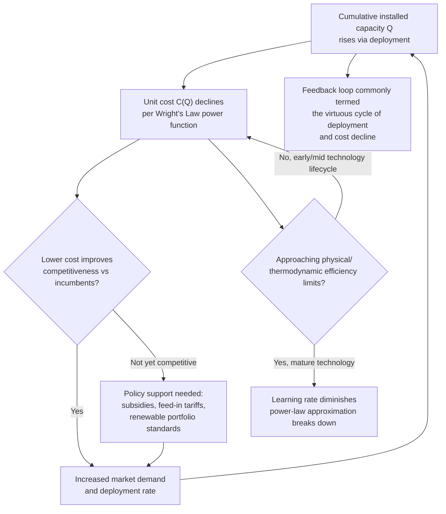

## Learning Curves and Cost Decline in Renewable Technologies

### Conceptual Foundations

**Definition**

A **learning curve** (also called an **experience curve**) describes the empirical regularity that the unit cost of producing a good or technology declines by a **roughly constant percentage** each time cumulative production (or cumulative installed capacity) doubles. In renewable-technology economics, learning curves are the primary analytical tool for explaining and forecasting the dramatic, sustained cost declines observed in solar photovoltaics, wind turbines, and lithium-ion batteries — a phenomenon central to understanding energy-transition economics and standing in structural contrast to the *rising* marginal cost dynamics characteristic of exhaustible resource extraction.

**Key Points**

- Learning curves are a **supply-side, technology-cost** concept, distinct from but complementary to demand-side and policy analyses of renewable energy adoption.
- The learning-curve framework directly inverts the typical exhaustible-resource cost narrative: instead of cost rising with cumulative extraction (as remaining reserves become harder to access), cost **falls** with cumulative production (as manufacturing experience, economies of scale, and technological refinement accumulate) — making this topic a natural conceptual counterpoint to the extraction-cost-curve material in exhaustible resource economics.
- Learning curves are empirically derived, statistical regularities rather than results of a single unified deep theoretical model — though several complementary theoretical mechanisms (discussed below) are commonly invoked to explain *why* the empirical pattern holds so robustly across many technologies.

---

### The Wright's Law / Experience Curve Formula

**Mathematical Specification**

The standard formulation, tracing to Theodore Wright's 1936 study of aircraft manufacturing costs, expresses unit cost as a power-law function of cumulative production:

$$C(Q) = C_1 \cdot Q^{-b}$$

where:

- $C(Q)$ is the unit cost at cumulative production level $Q$
- $C_1$ is the cost of the first unit produced
- $b$ is the **learning elasticity** (a positive parameter derived from the learning rate)

**The Learning Rate**

The more commonly cited and communicated parameter is the **learning rate (LR)**, defined as the percentage cost reduction associated with each doubling of cumulative production:

$$LR = 1 - 2^{-b} \quad \Longleftrightarrow \quad b = -\frac{\ln(1-LR)}{\ln 2}$$

A technology with a learning rate of, for example, 20% experiences a 20% cost reduction every time cumulative production doubles — regardless of how much *calendar time* that doubling takes, which is the crucial distinguishing feature of learning-curve dynamics relative to simple time-trend cost forecasting.

**Log-Linear Estimation Form**

Learning curves are typically estimated empirically by taking logarithms, which linearizes the power-law relationship:

$$\ln C(Q) = \ln C_1 - b\ln Q$$

allowing $b$ (and hence the learning rate) to be estimated via ordinary least squares regression of log unit cost on log cumulative production, using historical cost and deployment data.

**Key Points**

- The learning rate is a **doubling-based**, not time-based, metric — this is the single most important conceptual distinction separating learning curves from simple exponential time-decay cost models, since the *pace* of cost decline depends on how quickly cumulative production doubles, which itself depends on demand growth, policy support, and market size.
- Typical historically estimated learning rates: solar photovoltaic modules have exhibited learning rates in the rough vicinity of 20–24% per doubling of cumulative shipped capacity across multiple long-run studies; lithium-ion battery packs have shown comparably high or higher learning rates in several studies; onshore wind turbines have generally exhibited more modest learning rates (commonly cited in a lower range, roughly 10–15%, though estimates vary by study, time period, and cost component measured). [Unverified — precise learning-rate figures vary meaningfully across studies depending on data sources, time periods, geographic scope, and whether module cost, system cost, or levelized cost is measured; treat specific percentage figures as illustrative of a well-documented general pattern rather than as fixed, universally agreed constants, and consult current empirical literature (e.g., IRENA, NREL, IEA reports) for up-to-date figures in any applied context.]
- A learning rate near or above roughly 20% is considered unusually steep by historical cross-industry standards (many manufactured goods historically exhibit learning rates closer to 10–15%), which partly explains why solar PV cost declines have been particularly dramatic and have repeatedly outpaced even relatively optimistic contemporary forecasts.

---

### Illustration: The Experience Curve on Log-Log Axes

<svg xmlns="http://www.w3.org/2000/svg" viewBox="0 0 640 400" font-family="Helvetica, Arial, sans-serif">
<title>Experience Curve — Unit Cost vs Cumulative Production, Log-Log Scale (svg_diagram)</title>
<rect x="0" y="0" width="640" height="400" fill="#ffffff" />
<line x1="80" y1="330" x2="600" y2="330" stroke="#333333" stroke-width="2" />
<line x1="80" y1="330" x2="80" y2="40" stroke="#333333" stroke-width="2" />
<text x="340" y="375" font-size="15" text-anchor="middle" fill="#111111">log(Cumulative Production, Q)</text>
<text x="30" y="185" font-size="15" text-anchor="middle" fill="#111111" transform="rotate(-90 30 185)">log(Unit Cost, C)</text>
<line x1="100" y1="70" x2="580" y2="300" stroke="#1f77b4" stroke-width="3" />
<line x1="220" y1="330" x2="220" y2="145" stroke="#888888" stroke-width="1" stroke-dasharray="3,3" />
<line x1="340" y1="330" x2="340" y2="190" stroke="#888888" stroke-width="1" stroke-dasharray="3,3" />
<text x="220" y="345" font-size="11" text-anchor="middle" fill="#555555">Q0</text>
<text x="340" y="345" font-size="11" text-anchor="middle" fill="#555555">2×Q0</text>
<line x1="100" y1="145" x2="220" y2="145" stroke="#d62728" stroke-width="1" stroke-dasharray="2,2" />
<line x1="100" y1="190" x2="340" y2="190" stroke="#d62728" stroke-width="1" stroke-dasharray="2,2" />
<text x="105" y="135" font-size="11" fill="#d62728">C(Q0)</text>
<text x="105" y="180" font-size="11" fill="#d62728">C(2Q0) = (1-LR)·C(Q0)</text>
<text x="340" y="20" font-size="16" text-anchor="middle" font-weight="bold" fill="#111111">Slope = Learning Elasticity −b</text>
</svg>

---

### Theoretical Mechanisms Underlying Learning Curves

**Key Points**

- **Learning-by-doing (labor and process efficiency)**: Direct manufacturing and installation experience reduces labor time, defect rates, and process inefficiencies — the original mechanism identified by Wright in aircraft manufacturing, and the namesake source of the "learning" terminology.
- **Economies of scale**: As cumulative production rises, so typically does the scale of individual manufacturing facilities, enabling fixed-cost spreading, bulk input purchasing, and specialized capital equipment — a mechanism that is technically distinct from learning-by-doing (scale effects depend on plant/firm size, not cumulative historical output per se) but is often empirically entangled with it in aggregate learning-curve estimates, since cumulative production and typical plant scale tend to rise together historically.
- **Research and development / technological innovation**: Cumulative production often proxies for cumulative R&D investment and accumulated engineering knowledge (e.g., improved silicon wafer cutting techniques, improved wind turbine blade aerodynamics, improved battery chemistry), which is a source of cost decline analytically distinct from pure manufacturing-process learning.
- **Input/commodity price declines**: Some observed cost declines (e.g., a period of falling polysilicon prices in the solar supply chain) reflect upstream commodity market dynamics rather than technology-specific learning per se, and can create the appearance of a steeper learning curve than the "true" underlying rate of engineering-driven cost improvement, an important source of measurement ambiguity flagged repeatedly in the empirical literature.
- **Spillovers and knowledge diffusion**: Learning is not always confined to a single firm — industry-wide knowledge diffusion (through labor mobility, published research, reverse engineering, and supply-chain knowledge transfer) can generate cost declines for an entire industry even for firms without directly accumulated production experience of their own, a phenomenon sometimes modeled as "learning spillovers" and relevant to policy debates about whether learning benefits justify public subsidy of early-stage deployment.

---

### The Distinction: Learning Curves vs. Depletion-Driven Cost Curves

**Contrast with Exhaustible Resource Extraction Costs**

This topic forms a direct structural counterpoint to the extraction-cost-curve material covered under exhaustible resources:

| Dimension | Exhaustible Resource Extraction Cost | Renewable Technology Learning Curve |
| --- | --- | --- |
| Cost trend with cumulative output | Rising (stock depletion, declining ore grade/reservoir quality) | Falling (learning-by-doing, scale, R&D) |
| Driving mechanism | Physical/geological degradation of remaining stock | Accumulated manufacturing and engineering experience |
| Relevant "stock" concept | Finite, depleting reserve base | No natural fixed ceiling (though diminishing returns to learning are commonly observed at very high cumulative volumes) |
| Policy implication | Manage depletion timing, scarcity rent, intergenerational allocation | Accelerate deployment to capture learning, potential case for early-stage subsidy |
| Canonical mathematical form | $MC(Q) = a + bQ$ (rising, often approximately linear or convex) | $C(Q) = C_1 Q^{-b}$ (falling, power-law/log-linear) |

**Key Points**

- These are not merely two independent phenomena; they are frequently **structurally linked** within energy-transition economics, since the interaction between rising fossil-fuel extraction costs (or carbon pricing raising the effective cost of fossil fuels) and falling renewable technology costs jointly determines the timing and economics of energy-source substitution — directly connecting to the backstop-technology concept in exhaustible resource theory, where a "backstop" price ceiling was traditionally treated as fixed but is, in the case of renewables, actually falling over time due to learning effects.
- Some diminishing-returns behavior is empirically observed at very high cumulative production levels for mature technologies (the log-linear power-law relationship is an approximation that can break down as a technology matures and approaches fundamental physical/thermodynamic efficiency limits), meaning learning curves should not be extrapolated indefinitely without bound. [Inference — this eventual flattening is a standard theoretical expectation grounded in physical limits, though the specific cumulative-production level at which it occurs for any given technology remains uncertain and technology-specific.]

---

### Diagram: Interaction Between Learning-Driven Cost Decline and Deployment Policy

---

### Applied Uses: Forecasting and Policy Design

**Technology Cost Forecasting**

Learning curves are widely used by energy modelers, integrated assessment models (IAMs), and organizations such as the International Energy Agency (IEA), International Renewable Energy Agency (IRENA), and National Renewable Energy Laboratory (NREL) to project future technology costs as a function of projected future deployment volumes, rather than as a function of calendar time alone — a methodological choice that has repeatedly proven more accurate than naive time-trend extrapolation, since periods of accelerated deployment (often policy-driven) have historically produced correspondingly accelerated cost declines. [Inference — the general superiority of deployment-based over time-based forecasting is a widely cited methodological conclusion in the energy-modeling literature, though individual forecast accuracy still varies and historical solar PV cost declines have specifically and repeatedly outpaced even learning-curve-based projections from major energy agencies, a well-documented forecasting-error pattern.]

**Rationale for Early-Stage Deployment Subsidies**

The learning-curve mechanism provides a standard economic rationale for public subsidization of early-stage renewable technology deployment (feed-in tariffs, investment tax credits, renewable portfolio standards): if learning generates **spillover benefits** that individual firms cannot fully capture or monetize (a classic positive externality / public-good argument), private deployment decisions will be **suboptimally low** from a societal perspective, justifying public intervention to accelerate the cumulative-production trajectory and capture learning benefits sooner — a distinct rationale from, but complementary to, standard climate-externality (carbon pricing) justifications for renewable energy policy.

**Two-Factor Learning Curves**

More sophisticated variants decompose cost decline into **two separate factors** — cumulative production (capturing learning-by-doing/manufacturing effects) and cumulative R&D expenditure (capturing knowledge-stock effects) — allowing researchers to separately identify and evaluate the cost-reduction contribution of R&D policy versus deployment policy, an important refinement for designing efficient portfolios of innovation-support instruments. [Unverified — the empirical decomposition between these two factors is sensitive to model specification and data availability, and results vary meaningfully across studies.]

---

**Related Topics**

- Backstop technologies and the Nordhaus/Dasgupta-Heal transition-price model
- Extraction cost curves and the order of resource use (structural contrast: rising vs. falling cost)
- Levelized Cost of Energy (LCOE) methodology for comparing generation technologies
- Positive externalities, knowledge spillovers, and the economic case for R&D subsidy
- Renewable portfolio standards, feed-in tariffs, and deployment-policy design
- Integrated Assessment Models (IAMs) and technology-cost forecasting methodology
- Energy transition scenarios and the interaction of rising fossil-fuel costs with falling renewable costs
- Battery storage economics and grid-integration cost considerations
- Diminishing returns and technology maturity limits in the learning-curve framework