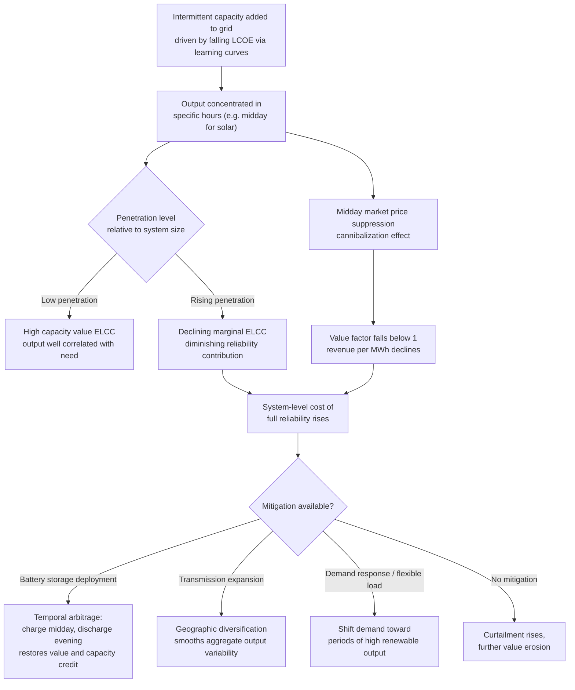

## Intermittency Economics and Capacity Value

### Conceptual Foundations

**Definition**

Intermittency economics addresses the distinctive valuation and system-integration challenges posed by electricity-generating resources — principally wind and solar photovoltaics — whose output is **variable and only partially predictable**, driven by weather and diurnal/seasonal patterns rather than dispatchable operator control. **Capacity value** (also called capacity credit) is the specific quantitative concept measuring **how much a given intermittent resource contributes to a power system's ability to reliably meet peak demand**, expressed typically as a percentage of the resource's nameplate capacity.

This topic sits structurally downstream of learning-curve cost decline: even as the *levelized* unit cost of wind and solar energy has fallen dramatically, intermittency economics explains why the **total system cost of integrating** these resources does not fall at the same rate, and why simple $/MWh cost comparisons between intermittent and dispatchable generation are economically incomplete.

**Key Points**

- Intermittency is fundamentally an economics-of-reliability and economics-of-flexibility problem, distinct from (though related to) the pure production-cost economics covered by learning curves.
- The central analytical challenge: electricity is a good that (with the exception of storage) must be consumed at the instant it is produced, so a generator's economic value depends not just on its average output but on **when, relative to demand and other supply, that output occurs**.
- Capacity value formalizes the intuition that a solar plant is more valuable to system reliability in a system with an afternoon demand peak than in one with an evening peak, even holding total annual energy output constant.

---

### Levelized Cost of Energy vs. Value-Adjusted Cost

**The LCOE Limitation**

**Levelized Cost of Energy (LCOE)** is calculated as the present value of total lifetime costs divided by the present value of total lifetime energy output:

$$LCOE = \frac{\sum_{t} \frac{I_t + M_t + F_t}{(1+r)^t}}{\sum_{t} \frac{E_t}{(1+r)^t}}$$

where $I_t$, $M_t$, $F_t$ are investment, operations/maintenance, and fuel costs in year $t$, $E_t$ is energy output, and $r$ is the discount rate. LCOE treats every megawatt-hour as **economically equivalent regardless of the time it is produced** — a simplification that is broadly acceptable for comparing dispatchable technologies against one another but becomes economically misleading when comparing intermittent to dispatchable resources, because a MWh delivered at 3 a.m. (low demand, often low price) and a MWh delivered at 6 p.m. (high demand, often high price) have systematically different economic value.

**Value-Adjusted (or "System") LCOE**

The economics literature has responded with **value-adjusted LCOE** concepts that weight output by the time-varying market or system value of energy, rather than treating all output as fungible:

$$\text{Value-Adjusted Cost} = \frac{LCOE}{\text{Value Factor}}, \qquad \text{Value Factor} = \frac{\text{Average revenue per MWh for the technology}}{\text{Average market price per MWh}}$$

A **value factor below 1** indicates the technology's generation profile is systematically correlated with periods of lower market prices — the empirically documented pattern for solar and wind in most electricity markets as their penetration rises (discussed below as "value deflation" or "cannibalization").

**Key Points**

- LCOE comparisons showing wind/solar as "cheapest source of electricity" are technically accurate on a pure production-cost basis but do not, by construction, capture integration costs or the declining marginal value of additional intermittent capacity — a frequently raised methodological critique in energy-economics literature and policy debate.
- Value-adjusted metrics require detailed time-series price and output data and are therefore more data- and modeling-intensive to compute than standard LCOE, which partly explains the continued widespread use of plain LCOE in public discourse despite its known limitations for cross-technology comparison.

---

### Capacity Value / Capacity Credit Methodology

**Effective Load Carrying Capability (ELCC)**

The standard, most rigorous methodology for computing capacity value is **Effective Load Carrying Capability (ELCC)**: the amount of additional *perfectly reliable* (firm) capacity that would need to be added to a system to achieve the same reliability level (typically measured via Loss of Load Expectation, LOLE) as adding the intermittent resource in question. Formally, if a system's reliability is characterized by a reliability metric $\Phi(\cdot)$ as a function of the installed resource mix, ELCC of a new resource with capacity $C_{new}$ solves:

$$\Phi(\text{existing mix} + C_{new}\text{ intermittent}) = \Phi(\text{existing mix} + C_{ELCC}\text{ firm capacity})$$

ELCC is then commonly expressed as a percentage: $\text{Capacity Value (\%)} = C_{ELCC}/C_{new} \times 100$.

**Simpler Approximation Methods**

Less computationally intensive approaches are also used in practice:

- **Capacity factor during peak hours**: average output of the resource during the historically highest-demand hours of the year, as a simple proxy for capacity value.
- **Loss of Load Probability (LOLP)-weighted output**: weighting the resource's output by the historical probability of a system shortfall in each hour, giving more weight to output coincident with high-risk periods.

**Key Points**

- ELCC is the theoretically preferred and most widely adopted methodology among system operators and regulators (used by, among others, US regional transmission organizations and NERC-affiliated reliability assessments) because it directly ties capacity value to the underlying reliability objective the power system is trying to achieve, rather than to an arbitrary proxy period.
- Solar capacity value is strongly linked to the **coincidence between solar output hours and system peak demand hours** — in a system with a hot-afternoon, air-conditioning-driven peak, solar can have relatively high capacity value; in a system with an evening peak (common as air conditioning saturates and as more systems shift toward electrified heating/EV charging with evening charging patterns), solar capacity value is structurally lower, since output has typically ended or is declining by the time the peak occurs.
- Wind capacity value is typically more variable and location/season dependent than solar, since wind resource availability is less tightly correlated with the diurnal demand cycle and instead depends on region-specific seasonal and synoptic weather patterns.

---

### Illustration: Declining Marginal Capacity Value with Penetration

<svg xmlns="http://www.w3.org/2000/svg" viewBox="0 0 640 400" font-family="Helvetica, Arial, sans-serif">
<title>Marginal Capacity Value Decline with Increasing Penetration (svg_diagram)</title>
<rect x="0" y="0" width="640" height="400" fill="#ffffff" />
<line x1="80" y1="330" x2="600" y2="330" stroke="#333333" stroke-width="2" />
<line x1="80" y1="330" x2="80" y2="40" stroke="#333333" stroke-width="2" />
<text x="340" y="375" font-size="15" text-anchor="middle" fill="#111111">Installed Intermittent Capacity (% of peak demand)</text>
<text x="30" y="185" font-size="15" text-anchor="middle" fill="#111111" transform="rotate(-90 30 185)">Capacity Value (%)</text>
<path d="M 90 90 Q 200 110 300 190 Q 400 260 500 300 Q 550 315 590 322" fill="none" stroke="#1f77b4" stroke-width="3" />
<text x="180" y="80" font-size="13" fill="#1f77b4">Solar ELCC curve</text>
<path d="M 90 150 Q 250 190 400 240 Q 500 270 590 290" fill="none" stroke="#2ca02c" stroke-width="3" stroke-dasharray="6,3" />
<text x="420" y="230" font-size="13" fill="#2ca02c">Wind ELCC curve</text>
<text x="340" y="20" font-size="16" text-anchor="middle" font-weight="bold" fill="#111111">Diminishing Marginal Capacity Value at Higher Penetration</text>
</svg>

---

### The Duck Curve and Value Deflation

**The California Duck Curve Phenomenon**

The **"duck curve"** — a term originating with the California Independent System Operator (CAISO) — describes the characteristic net-load (total demand minus intermittent renewable output) curve that emerges as solar penetration rises: net load falls sharply during midday hours as solar output peaks, then ramps up steeply in the early evening as solar output declines while demand remains elevated (the transition often called the "neck" of the duck). This creates two distinct system challenges: **midday oversupply/curtailment risk** and a **steep net-load ramp requirement** in the evening that must be met by fast-responding dispatchable resources or storage.

**Value Deflation / Cannibalization Effect**

As solar penetration increases within a given electricity market, solar generation increasingly coincides with **other solar generation**, systematically depressing midday wholesale prices during exactly the hours solar produces — a self-reinforcing dynamic sometimes called the **cannibalization effect**, since each additional unit of solar capacity earns progressively less revenue per MWh as aggregate solar penetration rises, distinct from (though related to) the ELCC capacity-value decline described above. This is a well-documented empirical pattern across multiple electricity markets with high solar penetration (e.g., California, parts of Australia, southern Europe), though the specific magnitude and threshold penetration levels at which cannibalization becomes economically material vary by market structure, transmission interconnection, and storage deployment. [Unverified — specific quantitative cannibalization rates are market- and time-period-specific; treat the qualitative pattern as well-established and specific percentages as requiring current market-specific data.]

**Key Points**

- The duck curve and cannibalization effect jointly explain why intermittent resource economics deteriorate endogenously with the resource's own success: the very deployment that captures learning-curve cost reductions (previous topic) simultaneously erodes the market value each additional unit of capacity can capture, creating a structural tension between technology-cost economics and system-value economics.
- These dynamics are the primary economic driver behind growing interest in and deployment of **battery energy storage**, which can arbitrage the temporal mismatch by charging during low-value midday hours and discharging during high-value evening ramp hours, directly addressing both the curtailment and ramp-rate problems simultaneously.

---

### Diagram: The Economic Feedback Loop of Intermittency at Scale

---

### Additional Cost Categories in Intermittency Economics

**Key Points**

- **Balancing/reserve costs**: additional operating reserves (spinning and non-spinning) must be procured to manage forecast error in intermittent output, an incremental system cost attributable to intermittency that does not appear in a generator's own LCOE.
- **Curtailment costs**: during periods of oversupply relative to transmission capacity or demand (frequently at high midday solar penetration), intermittent generation must be curtailed (output reduced below available potential), representing a real economic loss of otherwise-free marginal generation and a drag on the effective realized capacity factor and revenue of the affected plants.
- **Transmission and grid-integration costs**: because wind and solar resource quality is geographically concentrated (best wind sites, best solar irradiance) and often located far from demand centers, integrating large volumes of intermittent capacity frequently requires new transmission investment not captured in plant-level LCOE.
- **Forecast-error costs**: day-ahead and intraday forecast errors for wind and solar output require real-time balancing actions (often more expensive marginal resources), a cost category that scales with intermittent penetration and improves only gradually with forecasting technology advances.

---

**Related Topics**

- Learning curves and cost decline in renewable technologies (structural link: falling production cost vs. rising integration/value challenges)
- Battery storage economics and the arbitrage/capacity-value relationship
- Levelized Cost of Energy (LCOE) methodology and its comparative limitations
- Effective Load Carrying Capability (ELCC) modeling methodology in resource adequacy planning
- Electricity market design: capacity markets vs. energy-only markets
- Demand response and flexible load as intermittency-mitigation instruments
- Transmission planning and geographic diversification of renewable resources
- Loss of Load Expectation (LOLE) and resource adequacy standards
- Backstop technologies and the interaction between intermittent renewables and dispatchable backup capacity