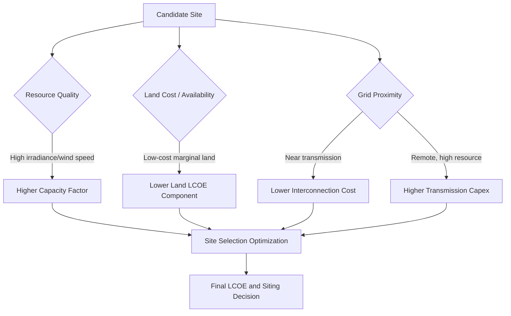

## Land Use and Siting Economics for Renewables

### Definition and Scope

Land use and siting economics examines how the spatial requirements of renewable energy technologies interact with land markets, opportunity costs, competing uses, and regulatory frameworks to determine project feasibility and total system cost. Unlike thermal generation, which concentrates energy conversion in a compact footprint, renewables — particularly wind and solar — are inherently land-extensive because they harvest diffuse natural flows (solar irradiance, wind kinetic energy) rather than energy-dense fuels. This makes land acquisition, siting approval, and land-opportunity cost a first-order component of the levelized cost of energy (LCOE), not a peripheral externality.

### Power Density and Land Intensity

The foundational metric is **power density** — the rate of energy generation per unit of land area, typically expressed in W/m² or MW/km².

$$\text{Power Density} = \frac{P_{rated} \times CF}{A}$$

where $P_{rated}$ is nameplate capacity, $CF$ is the capacity factor, and $A$ is total land area (including spacing, not just the physical footprint of equipment).

**Key Points**

- Utility-scale solar PV: approximately 5–10 W/m² of land actually used, though direct equipment footprint density is higher (~40–60 W/m² panel-only)
- Onshore wind: approximately 0.5–1.5 W/m² averaged over the full project area, but the physical turbine and access-road footprint is under 5% of that area — the rest remains available for agriculture or grazing
- Offshore wind: similar per-turbine density to onshore, but land-opportunity cost is replaced by seabed leasing and marine-use conflict costs
- Fossil and nuclear plants: 500–1,000+ W/m², reflecting energy density of fuel versus diffuse renewable flows

[Inference] The wide range in reported land-use intensity figures across studies (e.g., NREL land-use reviews showing 2–5x variation for solar) stems from inconsistent system boundaries — some studies count only panel footprint, others count the full fenced parcel including setbacks and access roads.

### Land Use Categories in Siting Economics

**1. Direct/Exclusive Land Use**

Land fully converted to project infrastructure — foundations, inverter pads, substations, access roads — and unavailable for alternative use during the project lifetime. For solar, this is close to 100% of the leased parcel. For wind, it is a small fraction of the total project envelope.

**2. Shared/Dual Use**

Land where the renewable installation coexists with an original use:

- **Agrivoltaics**: solar panels elevated or spaced to permit crop cultivation or livestock grazing beneath and between arrays
- **Wind-agriculture co-location**: crop or pasture land continues between turbine pads, with only the turbine base, crane pad, and access road removed from production
- **Floating solar (floatovoltaics)**: sited on reservoirs, irrigation ponds, or mine-pit lakes, avoiding terrestrial land competition entirely while also suppressing evaporation

**3. Buffer and Setback Land**

Land required by regulation or engineering practice but not directly occupied — noise setbacks, shadow-flicker buffers, wake-effect turbine spacing (typically 3–5 rotor diameters crosswind, 7–10 rotor diameters downwind), and wildfire or transmission clearances. This land often retains its prior economic use but carries development constraints that affect its market value.

### The Opportunity Cost Framework

Siting economics treats land not as a free input but as a factor with an opportunity cost equal to its value in the best alternative use (agriculture, conservation, real estate development, or another energy project). The land component of LCOE can be expressed as:

$$LCOE_{land} = \frac{L \times A}{\sum_{t=1}^{T} \frac{E_t}{(1+r)^t}}$$

where $L$ is the annualized land cost per unit area (lease payment or imputed rental value of owned land), $A$ is total area required, $E_t$ is energy generated in year $t$, and $r$ is the discount rate.

**Key Points**

- Lease payments to landowners are the typical mechanism by which land opportunity cost is internalized into project cash flows, commonly structured as a fixed per-acre annual payment, a per-MW capacity payment, or a royalty on revenue (often 2–6% of gross revenue for wind)
- In regions with high agricultural land value or dense population (e.g., much of Western Europe, parts of the U.S. Midwest, Japan), land cost and acquisition friction can materially raise effective LCOE relative to resource-rich but land-abundant regions
- Because renewables have near-zero variable fuel cost, land cost as a *share of total LCOE* is proportionally larger than for fossil generation, where fuel dominates variable costs

### Siting Trade-offs: Resource Quality vs. Land Cost vs. Grid Access

Optimal siting is a multi-objective problem balancing three frequently conflicting factors:

This creates a common tension: the highest-resource-quality sites (windiest ridgelines, sunniest deserts) are frequently remote from load centers and transmission infrastructure, while land near existing substations and demand centers is often more expensive or contested. Developers commonly solve this through a screening process that overlays resource maps, land cost/availability data, transmission capacity maps, and environmental/regulatory constraint layers.

### Regulatory and Zoning Dimensions

**Permitting frameworks** vary substantially by jurisdiction and materially affect project timelines and costs:

- Federal/national land leasing (e.g., U.S. Bureau of Land Management solar and wind lease programs on public land, with competitive auctions and per-acre rental plus megawatt-capacity fees)
- State/provincial and local zoning ordinances governing setbacks, height limits, and noise
- Environmental review requirements (habitat and species impact assessments, migratory bird and bat mortality studies for wind, viewshed and cultural-resource review)

**Setback regulations** are a major determinant of effective land-use efficiency. Municipal ordinances mandating large setbacks from property lines or residences (sometimes 1,000+ meters for wind turbines) can reduce the developable area of an otherwise suitable site far more than the engineering-driven wake-effect spacing would require. [Unverified] The specific setback distances vary widely and change frequently as local ordinances are revised, so any cited figure should be checked against current local code.

**Community and social acceptance costs** — sometimes termed the "social license to operate" — manifest economically as delay costs (extended permitting timelines), litigation costs, community benefit payments, or outright project cancellation. [Inference] These costs are difficult to quantify ex ante but are increasingly treated in project finance as a distinct risk premium affecting the required rate of return on siting-sensitive projects.

### Land Use Conflict Categories

| Conflict Type | Example | Typical Mitigation |
| --- | --- | --- |
| Agricultural displacement | Prime farmland converted to solar | Agrivoltaics, siting on marginal/degraded land |
| Habitat and biodiversity | Wind turbine avian/bat mortality; desert tortoise habitat for solar | Micrositing, curtailment during migration, habitat offset/mitigation banking |
| Visual/viewshed impact | Ridgeline wind turbines visible from scenic areas or residences | Setbacks, lighting design, community engagement |
| Competing energy infrastructure | Multiple developers targeting same interconnection-favorable parcels | Land banking, exclusivity option agreements |
| Indigenous and cultural land rights | Projects on or near tribal/indigenous lands | Benefit-sharing agreements, co-ownership models, free/prior/informed consent processes |

### Land Acquisition Structures

Developers typically secure land rights through one of several contractual mechanisms, each with distinct cost and risk implications:

- **Fee simple purchase**: outright land ownership; higher upfront capital cost but eliminates lease-renewal and landlord risk
- **Long-term lease**: the dominant model for wind and utility-scale solar, typically 20–30+ years with renewal options, preserving landowner title while securing developer usage rights
- **Easements**: narrower rights (e.g., for transmission corridors or access roads) without full site control
- **Option agreements**: developers pay landowners a smaller upfront fee to secure exclusive rights to negotiate a lease during project development/permitting, converting to a full lease only if the project reaches financial close — this structure limits developer capital at risk during the uncertain early-stage siting and permitting process

### Agrivoltaics: An Illustrative Land-Optimization Case

Agrivoltaics exemplifies how siting economics can convert an apparent land-use conflict into a complementary co-benefit.

**Key Points**

- Elevated or vertically-oriented bifacial panel arrays allow sufficient light penetration and equipment clearance for row crops, pollinator habitat, or sheep grazing beneath panels
- Panel shading can reduce heat stress and evaporative water loss for certain shade-tolerant crops, in some documented field trials improving yield for specific crop-climate combinations, while reducing yield for high-light-requirement crops
- The **Land Equivalent Ratio (LER)** is used to quantify the combined productivity benefit:

$$LER = \frac{Y_{PV,crop}}{Y_{crop,mono}} + \frac{Y_{PV,energy}}{Y_{energy,mono}}$$

An LER greater than 1 indicates the combined system produces more total value per unit land than either single use alone. [Inference] Reported LER values above 1.0 in academic agrivoltaic trials are promising but are typically site-specific and crop-specific, and should not be generalized as a universal outcome across all crop types or climates.

### Diagram: Siting Decision Cost Stack

The following SVG illustrates how land-related costs accumulate into total siting cost.

<svg xmlns="http://www.w3.org/2000/svg" viewBox="0 0 720 420">
<title>Siting Cost Stack for Renewable Projects (svg_diagram)</title>
\<style\>
.lbl { font-family: Arial, sans-serif; font-size: 14px; fill: #1a1a1a; }
.small { font-family: Arial, sans-serif; font-size: 11px; fill: #333333; }
.hdr { font-family: Arial, sans-serif; font-size: 16px; font-weight: bold; fill: #111111; }
\</style\>
<rect x="0" y="0" width="720" height="420" fill="#ffffff" />
<text x="360" y="28" text-anchor="middle" class="hdr">Siting Cost Stack for Renewable Projects (svg_diagram)</text>
<rect x="120" y="330" width="300" height="50" fill="#8fbf9f" stroke="#333" />
<text x="270" y="360" text-anchor="middle" class="lbl">Base Land Lease/Purchase Cost</text>
<rect x="120" y="280" width="300" height="50" fill="#a3c9e0" stroke="#333" />
<text x="270" y="310" text-anchor="middle" class="lbl">Setback/Buffer Opportunity Cost</text>
<rect x="120" y="230" width="300" height="50" fill="#e0c469" stroke="#333" />
<text x="270" y="260" text-anchor="middle" class="lbl">Permitting &amp; Regulatory Delay Cost</text>
<rect x="120" y="180" width="300" height="50" fill="#e0a469" stroke="#333" />
<text x="270" y="210" text-anchor="middle" class="lbl">Grid Interconnection/Transmission Cost</text>
<rect x="120" y="130" width="300" height="50" fill="#d98f8f" stroke="#333" />
<text x="270" y="160" text-anchor="middle" class="lbl">Community/Social License Premium</text>
<rect x="120" y="80" width="300" height="50" fill="#b79fd9" stroke="#333" />
<text x="270" y="110" text-anchor="middle" class="lbl">Environmental Mitigation Cost</text>
<line x1="450" y1="380" x2="450" y2="80" stroke="#000" stroke-width="2" marker-end="url(#arrow)" />
<text x="470" y="230" class="small" transform="rotate(-90 470,230)">Cumulative Effective Siting Cost</text>
<text x="20" y="405" class="small">Note: relative bar sizes are illustrative, not to precise economic scale.</text>

</svg>

### Regional Variation in Siting Economics

**Key Points**

- **Land-abundant, low-value regions** (e.g., U.S. Great Plains, Australian outback, parts of the MENA desert belt): low land lease costs, but often longer transmission distances to load centers, raising interconnection capex
- **Densely populated, high land-value regions** (e.g., Western Europe, Japan, South Korea): higher land cost and stronger local opposition risk, driving greater reliance on offshore wind, rooftop/distributed solar, brownfield redevelopment, and floating solar to avoid greenfield land competition
- **Repurposed/brownfield sites**: former mine sites, capped landfills, and retired fossil-fuel plant sites are increasingly favored siting locations because they combine existing grid interconnection infrastructure with lower land-opportunity cost and reduced permitting friction (no competing agricultural or conservation claims)

### Land Use in Offshore Wind

Offshore siting substitutes terrestrial land-opportunity cost with seabed leasing and marine spatial-use conflicts:

- Competing uses include commercial fishing grounds, shipping lanes, military exercise zones, and marine protected areas
- Leasing is typically administered through competitive government auctions for offshore acreage (e.g., BOEM lease auctions in the U.S., Crown Estate leasing rounds in the UK)
- Fixed-bottom foundations are economically limited to shallower waters (generally under ~60 meters depth); floating offshore wind expands siting options into deeper waters but at materially higher current capital cost

### Worked Example

**Example**

A 200 MW solar project requires approximately 800 hectares (assuming ~4 ha/MW, a commonly cited utility-scale solar planning ratio) at an annual lease rate of $500/hectare.

Annual land cost:

$$800 \times 500 = \$400{,}000/\text{year}$$

At a 25-year project life and 15% capacity factor, annual energy output:

$$E = 200{,}000 \text{ kW} \times 8{,}760 \text{ hr} \times 0.15 = 262{,}800{,}000 \text{ kWh/year}$$

Levelized land cost per kWh (undiscounted approximation):

$$\frac{400{,}000}{262{,}800{,}000} \approx \$0.0015/\text{kWh} \, (1.5 \text{ mills/kWh})$$

[Inference] This simplified calculation excludes discounting, escalation clauses common in real lease contracts, and buffer/setback land beyond the direct footprint, so it should be treated as an illustrative order-of-magnitude figure rather than a precise industry benchmark.

### Common Siting Economics Metrics Summary

| Metric | Formula/Definition | Use |
| --- | --- | --- |
| Power density | Rated capacity × CF ÷ Area | Compare land efficiency across technologies |
| Land Equivalent Ratio (LER) | Sum of relative yields in combined vs. mono use | Evaluate agrivoltaic/dual-use viability |
| Land cost per MWh | Annualized land cost ÷ annual energy output | Component of LCOE attributable to land |
| Capacity density | MW installed ÷ km² of project envelope | Regulatory and grid-planning capacity estimates |

### Related Topics

- Levelized Cost of Energy (LCOE) methodology and its components
- Grid interconnection queues and transmission cost allocation
- Agrivoltaics: crop yield trade-offs and shade-tolerance economics
- Offshore wind seabed leasing and marine spatial planning
- Environmental impact assessment and mitigation banking for energy infrastructure
- Community benefit agreements and social license to operate in energy siting
- Brownfield and reclaimed-land redevelopment for renewable energy
- Floating solar (floatovoltaics) economics and evaporation-suppression co-benefits
- Comparative land-use intensity of nuclear, fossil, and renewable generation
- Property rights, easements, and long-term lease structuring in project finance