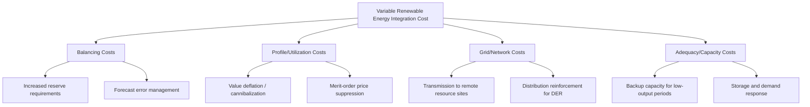

## Grid Integration Costs of Variable Renewable Energy

### Definition and Scope

Grid integration costs refer to the additional system-level costs incurred when incorporating variable renewable energy (VRE) — primarily wind and solar — into an electricity grid, beyond the plant-level generation cost captured by LCOE. These costs arise because VRE output is non-dispatchable, weather-dependent, and geographically diffuse, requiring the rest of the power system (other generators, transmission, storage, and operating procedures) to adapt. Integration costs are a central concept in energy economics because they explain why comparing renewables to conventional generation on LCOE alone systematically understates the true system cost of high VRE penetration.

### Taxonomy of Integration Costs

The standard economic decomposition, developed extensively in IEA and NREL system-cost literature, divides integration costs into four categories:

**1. Balancing Costs**

Costs of maintaining short-term supply-demand balance as VRE output deviates from forecast, requiring additional operating reserves (regulation, spinning, and non-spinning reserves) and more frequent ramping of flexible generators.

**2. Profile/Utilization Costs**

Also called "shape" costs — arise because VRE generation is concentrated in specific hours (midday for solar, variable but often nighttime for wind), reducing the market value of VRE relative to a flat-output baseload plant. This manifests economically as **value deflation** or **cannibalization**: as VRE penetration rises, the wholesale price during high-output hours falls, reducing the average revenue captured per MWh by VRE generators themselves.

**3. Grid/Network Costs**

Transmission and distribution investment needed to connect remote high-resource-quality sites (windy plains, sunny deserts) to load centers, plus reinforcement to handle bidirectional power flows from distributed generation.

**4. Adequacy/Capacity Costs**

Costs of maintaining system reliability during periods of low VRE output (e.g., calm, cloudy periods, or the "duck curve" evening ramp), typically requiring backup capacity, demand response, or storage that would not be needed in a system without VRE variability.

### Economic Mechanism: Merit-Order Effect and Value Deflation

VRE has near-zero marginal cost, so in wholesale markets it is dispatched first under merit-order principles, displacing higher-marginal-cost thermal generation and depressing the market clearing price during high-output hours. This is termed the **merit-order effect**.

$$P_t = MC_{marginal\ unit\ at\ demand\ level\ D_t - VRE_t}$$

As VRE output $VRE_t$ rises in a given hour, the residual demand curve shifts left, and the intersecting marginal cost $P_t$ falls — often to zero or negative in periods of oversupply relative to demand and grid flexibility.

**Key Points**

- The **capture price** (the average price a VRE generator actually receives, weighted by its own generation profile) tends to decline relative to the average system price as VRE penetration rises, since VRE increasingly competes with itself for the same high-output hours
- This dynamic is why VRE support mechanisms (feed-in tariffs, contracts-for-difference, power purchase agreements) are often structured to decouple generator revenue from the depressed real-time market price
- [Inference] The magnitude of value deflation is highly system-specific, depending on the flexibility of the remaining generation fleet, interconnection to neighboring markets, storage capacity, and demand elasticity — published capture-price discount figures from one market/year should not be assumed to transfer to another system

### Modeling the Duck Curve

The "duck curve," first popularized by CAISO analysis of the California grid, illustrates the net-load challenge created by high solar penetration.

<svg xmlns="http://www.w3.org/2000/svg" viewBox="0 0 720 420">
<title>Net Load Duck Curve Under Rising Solar Penetration (svg_diagram)</title>
\<style\>
.ax { stroke: #333; stroke-width: 1.5; }
.lbl { font-family: Arial, sans-serif; font-size: 13px; fill: #1a1a1a; }
.hdr { font-family: Arial, sans-serif; font-size: 16px; font-weight: bold; fill: #111111; }
.line1 { fill: none; stroke: #888888; stroke-width: 2; stroke-dasharray: 5,3; }
.line2 { fill: none; stroke: #2b6cb0; stroke-width: 2.5; }
\</style\>
<rect x="0" y="0" width="720" height="420" fill="#ffffff" />
<text x="360" y="26" text-anchor="middle" class="hdr">Net Load Duck Curve Under Rising Solar Penetration (svg_diagram)</text>
<line x1="70" y1="360" x2="670" y2="360" class="ax" />
<line x1="70" y1="360" x2="70" y2="60" class="ax" />
<text x="360" y="395" text-anchor="middle" class="lbl">Hour of Day (0-24h)</text>
<text x="30" y="210" text-anchor="middle" class="lbl" transform="rotate(-90 30,210)">System Load (MW)</text>
<path class="line1" d="M70,240 C150,230 220,220 300,215 C400,210 500,215 600,225 L670,230" />
<text x="600" y="205" class="lbl" fill="#888888">Gross Load</text>
<path class="line2" d="M70,250 C150,200 220,120 300,90 C400,80 470,150 520,230 C560,290 610,300 670,260" />
<text x="330" y="70" class="lbl" fill="#2b6cb0">Net Load (Gross - Solar)</text>

<text x="220" y="110" class="lbl" fill="`#2b6cb0`">Midday Belly (solar surplus)</text>

<line x1="480" y1="240" x2="560" y2="290" class="ax" stroke="`#c05621`" stroke-dasharray="3,2" />

<text x="500" y="330" class="lbl" fill="`#c05621`">Evening Ramp</text>

<text x="20" y="410" class="lbl" font-size="11">Illustrative curve shapes based on published CAISO duck-curve analyses; not scaled data.</text>

</svg>

**Key Points**

- The "belly" of the curve represents midday net-load depression as solar output peaks, potentially requiring curtailment or negative pricing when supply exceeds flexible demand
- The steep "neck" in late afternoon/early evening represents the ramp requirement as solar output falls while demand remains high (evening peak), requiring fast-ramping resources
- This ramp requirement drives specific integration costs: need for flexible gas peakers, batteries, or demand response capable of rapid output changes over a 2-4 hour window

### Estimating Integration Cost Components

**Balancing Cost Estimation**

Balancing costs are commonly estimated as the incremental cost of reserves required to manage forecast error:

$$C_{balance} = \sigma_{forecast} \times MC_{reserve} \times Q_{VRE}$$

where $\sigma_{forecast}$ is the standard deviation of day-ahead/real-time forecast error, $MC_{reserve}$ is the marginal cost of procuring reserve capacity, and $Q_{VRE}$ is VRE output volume.

**Key Points**

- Wind forecast errors are typically larger at longer lead times (day-ahead) and smaller close to real time, motivating markets to hold multiple reserve products (day-ahead, hour-ahead, 5-minute regulation)
- Solar forecast error is generally lower than wind under clear-sky conditions but spikes sharply during cloud transient events
- Studies commonly report that balancing costs at low-to-moderate VRE penetration (under ~10-20% of annual generation) are relatively modest, while grid and adequacy costs tend to become more significant at higher penetration levels; [Inference] however, the specific penetration threshold at which cost categories become dominant is highly system-dependent (existing flexibility, geographic diversity, interconnection) and estimates vary substantially across studies

### Network/Transmission Cost Drivers

**Key Points**

- **Locational mismatch**: high-quality wind and solar resources are frequently distant from load centers, requiring new high-voltage transmission that would not be needed for a load-center-sited thermal plant
- **Interconnection queue costs**: in many liberalized markets, individual VRE projects bear some or all of the cost of network upgrades triggered by their interconnection request, creating substantial "interconnection cost risk" that can determine project viability
- **Curtailment as a substitute for transmission investment**: rather than building transmission capacity sized to rare peak output events, system operators frequently accept periodic curtailment of VRE output as a lower-cost alternative — an explicit economic trade-off between capital cost (wires) and forgone energy value (curtailed generation)
- **Distribution-level costs**: rooftop and distributed solar can require distribution network reinforcement (voltage regulation, transformer upgrades) as two-way power flow becomes more common, particularly in circuits with high residential PV penetration

### Adequacy and Capacity Value

As VRE penetration rises, its **capacity value** — the extent to which it can be relied upon to meet peak demand — typically declines on a per-MW basis, because VRE output correlations mean multiple installations tend to be simultaneously low during systemic events (e.g., calm winter evenings, prolonged cloud cover).

**Key Points**

- Capacity value is commonly measured via the **Effective Load Carrying Capability (ELCC)** metric — the amount of additional firm (perfectly reliable) capacity that a given VRE addition can displace while maintaining the same system reliability target
- ELCC for solar tends to correlate strongly with whether peak system demand coincides with solar output hours; ELCC declines as solar penetration increases because incremental solar additions increasingly overlap with existing solar generation on the same sunny days
- ELCC for wind varies by region depending on the correlation between wind resource seasonality and system peak demand timing
- These declining marginal capacity values are a core justification for adequacy-related integration costs: maintaining reliability at high VRE penetration requires either overbuilding VRE capacity relative to its firm-capacity contribution, adding storage, or retaining dispatchable backup capacity

### Mitigation Strategies and Their Economic Trade-offs

| Strategy | Mechanism | Primary Cost Category Addressed | Trade-off |
| --- | --- | --- | --- |
| Energy storage (batteries, pumped hydro) | Time-shifts VRE output to align with demand | Profile/utilization, adequacy | High capital cost; storage duration limits |
| Transmission expansion | Connects diverse VRE resource regions, smooths aggregate output | Grid, adequacy | Long lead times, siting/permitting challenges |
| Demand response/flexible load | Shifts demand to match VRE availability | Balancing, profile | Requires enabling technology and consumer participation |
| Sector coupling (electrification, power-to-X) | Creates flexible new demand that absorbs surplus VRE | Profile, adequacy | Requires new infrastructure (EVs, electrolyzers, heat pumps) |
| Geographic diversification | Aggregates VRE across wider areas to reduce correlated variability | Balancing, adequacy | Requires transmission interconnection between regions |
| Improved forecasting | Reduces forecast error, lowering required reserves | Balancing | Diminishing returns; cannot eliminate weather uncertainty |
| Curtailment | Discards excess VRE output rather than building infrastructure | Grid, profile | Direct loss of otherwise "free" energy; reduces effective capacity factor |

### Worked Example: Reserve Cost Impact

**Example**

A system operator estimates that adding 500 MW of wind capacity increases the required regulation reserve by 50 MW (a 10% ratio, illustrative) due to forecast uncertainty. If the marginal cost of procuring regulation reserve is $15/MW-hour, and this incremental reserve is required for an average of 6 hours/day:

$$C_{annual} = 50 \text{ MW} \times \$15/\text{MW-hr} \times 6 \text{ hr/day} \times 365 \text{ days} = \$1{,}642{,}500/\text{year}$$

Spread across the wind plant's estimated annual energy output (assuming a 35% capacity factor):

$$E_{annual} = 500{,}000 \text{ kW} \times 8{,}760 \text{ hr} \times 0.35 = 1{,}533{,}000{,}000 \text{ kWh}$$

Implied balancing cost adder:

$$\frac{1{,}642{,}500}{1{,}533{,}000{,}000} \approx \$0.0011/\text{kWh} \, (1.1 \text{ mills/kWh})$$

[Inference] The 10% reserve ratio and $15/MW-hr reserve price used here are illustrative assumptions for demonstrating the calculation method, not empirically derived system-specific values; actual figures require system-specific forecast-error and reserve-market data.

### System Cost vs. Plant-Level LCOE

A central conceptual point in energy economics is that comparing generation technologies purely on LCOE is analytically incomplete at any meaningful penetration level, because LCOE excludes integration costs entirely. The more complete comparison metric is **system LCOE** or **value-adjusted LCOE**:

$$LCOE_{system} = LCOE_{plant} + C_{balance} + C_{profile} + C_{grid} + C_{adequacy}$$

**Key Points**

- This framework, emphasized in IEA/NEA joint cost-of-electricity studies, shows that integration costs generally rise with VRE penetration share, meaning the "true" marginal system cost of an additional MW of VRE is not constant but increases as penetration grows
- Conversely, integration costs can be partially offset by portfolio effects: diverse VRE technology mixes (wind + solar) and geographic spread tend to have lower aggregate variability than single-technology, single-region deployment
- Policy and market design responses — capacity markets, ancillary service markets, locational marginal pricing, storage mandates — are largely mechanisms for pricing and allocating these integration costs among market participants rather than eliminating them

### Related Topics

- Effective Load Carrying Capability (ELCC) methodology and calculation
- Energy storage economics: arbitrage value, capacity value, and duration trade-offs
- Capacity markets and resource adequacy mechanisms
- Merit-order effect and wholesale price cannibalization
- Demand response program design and valuation
- Sector coupling and power-to-X as flexibility resources
- Transmission planning and interconnection queue reform
- Ancillary services markets and reserve product design
- Locational marginal pricing (LMP) and congestion cost allocation
- Capacity value decline curves and marginal VRE penetration effects