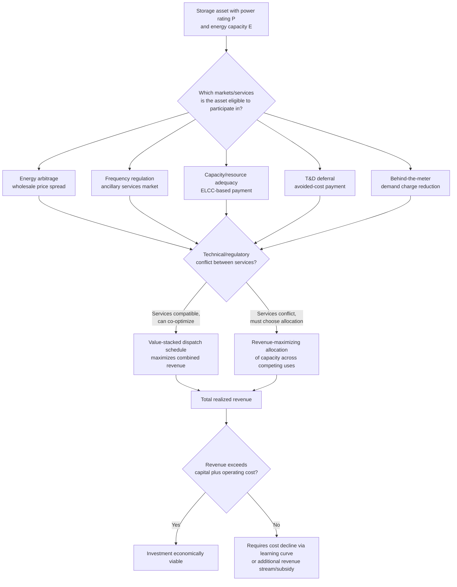

## Storage Economics and Value Stacking

### Conceptual Foundations

**Definition**

Storage economics analyzes how energy storage technologies — predominantly lithium-ion battery systems at present, alongside pumped hydro, and emerging long-duration alternatives — generate economic value by **shifting energy across time**, and how that value is captured, allocated, and monetized in electricity markets. **Value stacking** refers to the practice of aggregating revenue from **multiple distinct services simultaneously** from a single storage asset, since no single revenue stream is typically sufficient on its own to justify the capital cost of storage under most current cost structures.

**Key Points**

- Storage is the direct economic complement to the intermittency and duck-curve challenges discussed previously: it converts a temporal mismatch problem (low-value midday solar output, high-value evening ramp) into an arbitrage opportunity, and its economic viability determines how much of the intermittency-driven value deflation can actually be recovered.
- Unlike a generator, storage has **no fuel cost and (approximately) no marginal production cost**, but it has a finite energy capacity (measured in MWh) separate from its power rating (MW) and a limited cycle life — meaning storage economics fundamentally revolve around **when** to charge and discharge (an optimal-control/dispatch problem) rather than how much to produce.
- Because storage can participate in several markets and provide several distinct grid services from the same physical asset, its revenue-optimization problem is structurally different from — and more complex than — a single-service generation asset, motivating the "value stacking" framework as the central analytical lens for the topic.

---

### The Core Storage Arbitrage Model

**Basic Energy Arbitrage**

The simplest storage revenue stream is **price arbitrage**: charging when electricity prices are low (typically midday during high solar output, or overnight during low demand) and discharging when prices are high (typically evening peak). For a storage system with round-trip efficiency $\eta$, capacity $E_{max}$ (MWh), and power rating $P_{max}$ (MW), the arbitrage profit-maximization problem over a price series $\{p_t\}$ is:

$$\max_{c_t, d_t} \sum_t \left[ p_t \cdot d_t - p_t \cdot \frac{c_t}{\eta} \right]$$

subject to:

$$0 \le c_t \le P_{max}, \quad 0 \le d_t \le P_{max}, \quad 0 \le S_t \le E_{max}$$

$$S_{t+1} = S_t + \eta \cdot c_t - d_t$$

where $c_t$ and $d_t$ are charge and discharge rates and $S_t$ is the state of charge. This is a linear program (or, with additional operational constraints, a mixed-integer program) solvable via standard optimization techniques, and it is the foundational quantitative model underlying most storage dispatch-optimization software.

**Round-Trip Efficiency and the Arbitrage Spread Requirement**

Because $\eta < 1$ (lithium-ion systems commonly exhibit round-trip efficiencies in a high range, though some energy is always lost to charging/discharging losses and auxiliary loads), a storage operator requires the discharge price to exceed the charge price by **more than the efficiency loss** to profit:

$$p_{discharge} > \frac{p_{charge}}{\eta}$$

**Key Points**

- Pure energy arbitrage revenue depends entirely on the **magnitude and frequency of price spreads** in the relevant wholesale market — a market with flat, low-volatility prices offers little arbitrage opportunity regardless of storage cost, while a market with large, frequent price swings (often itself a symptom of high intermittent renewable penetration, per the duck-curve dynamics) offers substantial arbitrage value.
- Arbitrage revenue is inherently **self-limiting at scale**: as more storage capacity enters a market and performs the same charge-low/discharge-high strategy, the act of charging during low-price periods raises those prices, and discharging during high-price periods lowers those prices, compressing the very price spread the arbitrage strategy depends on — a market-flattening feedback effect that parallels the "cannibalization" dynamic discussed for solar generation.

---

### Illustration: Storage Arbitrage Against a Daily Price Curve

<svg xmlns="http://www.w3.org/2000/svg" viewBox="0 0 640 400" font-family="Helvetica, Arial, sans-serif">
<title>Storage Charge/Discharge Against Daily Wholesale Price Curve (svg_diagram)</title>
<rect x="0" y="0" width="640" height="400" fill="#ffffff" />
<line x1="70" y1="330" x2="600" y2="330" stroke="#333333" stroke-width="2" />
<line x1="70" y1="330" x2="70" y2="40" stroke="#333333" stroke-width="2" />
<text x="335" y="375" font-size="15" text-anchor="middle" fill="#111111">Hour of Day</text>
<text x="25" y="185" font-size="15" text-anchor="middle" fill="#111111" transform="rotate(-90 25 185)">Wholesale Price ($/MWh)</text>
<path d="M 90 220 Q 150 280 220 310 Q 300 320 350 300 Q 420 220 470 120 Q 520 70 570 90" fill="none" stroke="#1f77b4" stroke-width="3" />
<rect x="200" y="290" width="120" height="30" fill="#2ca02c" opacity="0.3" />
<text x="260" y="345" font-size="12" text-anchor="middle" fill="#2ca02c">Charge (midday low price)</text>
<rect x="450" y="80" width="100" height="30" fill="#d62728" opacity="0.3" />
<text x="500" y="60" font-size="12" text-anchor="middle" fill="#d62728">Discharge (evening peak)</text>
<text x="335" y="20" font-size="16" text-anchor="middle" font-weight="bold" fill="#111111">Temporal Arbitrage Across the Duck-Curve Price Profile</text>
</svg>

---

### The Value Stack: Distinct Revenue Streams

**Enumeration of Stackable Services**

Storage assets can, subject to market rules and technical capability, simultaneously or sequentially provide:

- **Energy arbitrage**: buying low, selling high in wholesale energy markets (detailed above).
- **Frequency regulation**: rapid, bidirectional power adjustments to help system operators maintain grid frequency at its nominal value, typically compensated through dedicated ancillary service markets and commanding comparatively high per-MW payments due to storage's fast response characteristics relative to conventional generation.
- **Spinning/non-spinning reserves**: capacity held in readiness to respond to unexpected generation shortfalls or demand surges, compensated through capacity-style reserve payments even when not actually dispatched.
- **Capacity value / resource adequacy payments**: in markets with capacity markets or resource-adequacy mechanisms, storage can earn payments for its contribution to system reliability, calculated via ELCC-style methodologies analogous to those used for intermittent generation, though storage's ELCC depends critically on **duration** (a 4-hour battery contributes differently to reliability than a 1-hour battery, since it must be able to discharge through the full peak period).
- **Transmission and distribution (T&D) deferral**: storage sited at strategic grid locations can defer or avoid the need for costly T&D infrastructure upgrades by locally managing peak load, a service typically valued through avoided-cost analysis specific to the constrained circuit or substation.
- **Renewable integration / curtailment reduction**: storage that charges from otherwise-curtailed renewable output captures energy that would have been wasted, converting a zero-value (curtailed) MWh into a positive-value dischargeable MWh.
- **Demand charge management (behind-the-meter)**: for commercial and industrial customers, storage can reduce peak demand charges by discharging during the customer's own peak-demand intervals, a customer-side (rather than wholesale-market) value stream.
- **Backup power / resilience value**: the option value of storage providing power during grid outages, difficult to monetize directly in most wholesale market structures but increasingly recognized in customer willingness-to-pay and some emerging resilience-specific compensation mechanisms.

**Key Points**

- No single service in the stack is typically sufficient alone to justify battery capital costs in most markets under prevailing cost structures — the economic viability case for storage assets generally depends on **combining multiple services**, which is precisely the origin of the "value stacking" terminology.
- Stacking is subject to **technical and regulatory constraints**: a battery committed to providing frequency regulation at a given moment has reduced capability to simultaneously perform energy arbitrage or reserve capacity, and market rules in many jurisdictions restrict or complicate the ability of a single asset to bid into multiple market products concurrently — a significant practical friction distinct from the pure technical optimization problem.
- The relative value of each stack component varies substantially by market structure, storage duration, and grid characteristics: short-duration batteries (1–2 hour) tend to derive relatively more value from fast-response ancillary services, while longer-duration systems (4+ hours) derive relatively more value from energy arbitrage and capacity/resource-adequacy payments. [Inference — the specific optimal service mix is highly market- and technology-specific and is an active area of ongoing techno-economic modeling research rather than a fixed universal allocation.]

---

### Diagram: The Value Stacking Optimization Problem

---

### Cost Structure and the Role of Learning Curves

**Capital Cost Components**

Battery storage system costs are typically decomposed into the battery pack/cell cost, power conversion system (inverter) cost, balance-of-system costs (enclosure, thermal management, controls), and installation/soft costs (engineering, permitting, interconnection) — directly connecting this topic to the learning-curve framework, since lithium-ion battery pack costs have historically exhibited among the steepest learning rates of any major energy technology, a primary driver of storage's rapidly improving economic viability over the past decade. [Inference — this connection to the learning-curve mechanism is well-established qualitatively; specific current cost figures should be verified against up-to-date sources given the pace of change in this sector.]

**Levelized Cost of Storage (LCOS)**

An analogue to LCOE has been developed for storage — **Levelized Cost of Storage (LCOS)** — expressing lifetime cost per MWh of energy discharged over the asset's life, accounting for round-trip efficiency losses, degradation-driven capacity fade, and cycle-life-limited replacement schedules. LCOS is a necessary but not sufficient input to the storage investment decision, since (per the value-stacking logic above) revenue is earned from a multi-service stack rather than from a single energy-sales channel, meaning LCOS comparisons across projects can be misleading without also accounting for each project's achievable revenue stack.

**Degradation Economics**

Battery capacity degrades with cycling and calendar aging, creating a **dynamic optimization tension**: more intensive cycling (to capture more arbitrage or ancillary service revenue) accelerates degradation and shortens useful life or increases replacement/augmentation costs, meaning the profit-maximizing dispatch strategy must endogenize a **degradation cost per cycle**, not just the immediate price-spread revenue — a refinement of the basic arbitrage model above that is standard in more sophisticated commercial storage-dispatch optimization tools.

**Key Points**

- Storage economics are unusually dynamic relative to most other energy technologies discussed in this course, given the combination of rapidly falling capital costs (learning curve), rapidly evolving market rules for service participation, and the still-maturing state of degradation modeling and long-duration alternatives.
- The interaction between falling LCOS and the self-limiting nature of arbitrage/service revenue (per the market-flattening effect noted above) creates an important open question in the field: whether storage costs will continue falling fast enough to remain profitable even as its own deployment compresses the price spreads and service-scarcity premiums it depends on for revenue. [Speculation — this remains a genuinely unresolved, actively studied question in current energy-economics research rather than a settled conclusion.]

---

**Related Topics**

- Intermittency economics and capacity value (the duck curve and value deflation dynamics storage addresses)
- Learning curves and cost decline in renewable technologies (direct applicability to battery pack cost trajectories)
- Grid integration costs of variable renewable energy
- Effective Load Carrying Capability (ELCC) methodology extended to storage duration requirements
- Ancillary services markets and frequency regulation compensation design
- Levelized Cost of Storage (LCOS) methodology and its limitations
- Long-duration energy storage technologies (flow batteries, compressed air, thermal storage, hydrogen)
- Behind-the-meter storage economics and demand charge management
- Market design reforms for multi-service storage participation (e.g., FERC Order 841 in the U.S. context)