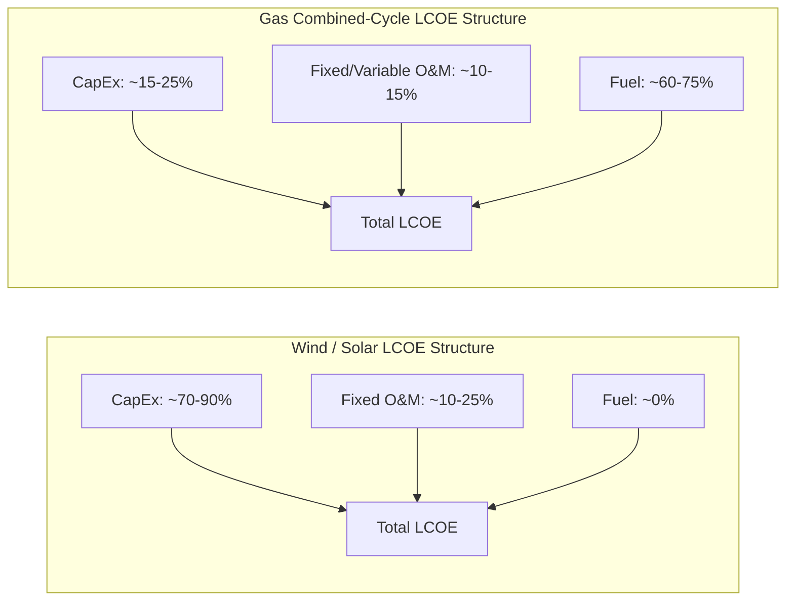

## Levelized Cost of Energy Methodology and Limitations

### Definition

The Levelized Cost of Energy (LCOE), also called Levelized Cost of Electricity, is a discounted cash-flow metric representing the constant per-unit price of electricity that, if received over the entire operating life of a generation asset, would exactly cover all costs (capital, operating, fuel, financing) and provide the assumed rate of return. It is the single most widely used metric for comparing generation technologies on a common cost basis, particularly across technologies with fundamentally different cost structures (capital-intensive renewables vs. fuel-intensive thermal plants).

### Core Formula

$$LCOE = \frac{\sum_{t=0}^{T} \frac{CapEx_t + OpEx_t + Fuel_t}{(1+r)^t}}{\sum_{t=0}^{T} \frac{E_t}{(1+r)^t}}$$

where:

- $CapEx_t$ = capital expenditure in year $t$ (concentrated in early construction years)
- $OpEx_t$ = fixed and variable operating and maintenance costs in year $t$
- $Fuel_t$ = fuel costs in year $t$ (zero for wind and solar)
- $E_t$ = electricity generated in year $t$
- $r$ = discount rate (often the weighted average cost of capital, WACC)
- $T$ = total operating lifetime of the asset

Both numerator (lifetime costs) and denominator (lifetime energy) are discounted to present value using the same rate, ensuring like-for-like comparison of cash flows and physical output that occur at different points in time.

### Component Breakdown

**Key Points**

- **CapEx**: includes equipment procurement, construction/installation labor, interconnection costs, and development costs (permitting, land acquisition, engineering). For renewables, this is the dominant cost component, often 70-90% of total lifetime LCOE cost for solar and wind
- **Fixed O&M**: costs incurred regardless of output level — insurance, land lease payments, scheduled maintenance staffing, property taxes
- **Variable O&M**: costs that scale with energy output — for renewables this is minimal (occasional component replacement, cleaning); for thermal plants it includes fuel handling and consumable wear
- **Fuel cost**: zero for wind, solar, and most non-depletable resources; a major and volatile cost component for natural gas, coal, and nuclear generation
- **Decommissioning cost**: end-of-life dismantlement and site restoration, sometimes included as a discounted terminal cost in $T$

### Capacity Factor's Central Role

Capacity factor ($CF$) — the ratio of actual energy produced to the theoretical maximum if the plant operated at rated capacity continuously — enters the denominator and is one of the most sensitive LCOE inputs:

$$E_t = P_{rated} \times 8{,}760 \text{ hours} \times CF$$

**Key Points**

- A plant with the same CapEx and OpEx but a lower capacity factor spreads its costs over fewer units of energy, mechanically raising LCOE
- Capacity factor assumptions are a common source of LCOE estimate divergence between studies — wind and solar capacity factors vary substantially by geography (a coastal high-wind-speed site vs. a low-wind inland site can differ by 15-20 percentage points), and are frequently a source of disagreement or inconsistency between comparative LCOE studies covering different regions
- [Inference] Because published capacity factor assumptions are rarely fully disclosed alongside headline LCOE figures in popular reporting, cross-study or cross-technology LCOE comparisons should be treated cautiously unless capacity factor methodology is explicitly stated and comparable

### Discount Rate Sensitivity

The discount rate $r$ has an outsized effect on capital-intensive, low-operating-cost technologies (wind, solar, nuclear) because their cost is concentrated in the CapEx term, which is discounted least (occurring early), while their energy output is spread over many future years, which is discounted more heavily as $r$ rises.

$$\frac{\partial LCOE}{\partial r} \Big|_{\text{high CapEx share}} \gg \frac{\partial LCOE}{\partial r} \Big|_{\text{high fuel-cost share}}$$

**Key Points**

- Raising the discount rate disproportionately increases LCOE for renewables and nuclear relative to gas-fired generation, because gas plants recover a larger share of lifetime cost from near-term fuel-indexed revenue rather than far-future discounted energy sales
- This makes financing cost and perceived project risk (which feed into WACC) a major lever in renewable competitiveness — countries or regions with lower cost of capital for renewable projects (e.g., via government-backed guarantees, green bonds, or stable regulatory environments) can achieve materially lower LCOE for otherwise identical technology
- [Inference] Precise numerical sensitivity of LCOE to discount rate changes varies by technology cost structure and project-specific financing terms, so general statements about "X% LCOE change per 1% discount rate change" from any single study should not be treated as universally transferable

### Diagram: LCOE Cost Structure Comparison

[Inference] The percentage ranges shown are illustrative approximations reflecting commonly cited cost-structure patterns in LCOE literature; exact shares vary by project, region, and prevailing fuel prices at time of estimation.

### Worked Example

**Example**

A utility-scale solar project: CapEx = $1,000/kW, annual fixed O&M = $15/kW-year, capacity factor = 22%, project life = 25 years, discount rate = 6%, no fuel cost.

Annual energy output per kW:

$$E = 1 \text{ kW} \times 8{,}760 \times 0.22 = 1{,}927.2 \text{ kWh/year}$$

Present value of lifetime energy (using the annuity/discounting factor for 25 years at 6%):

$$PV_{energy} = 1{,}927.2 \times \sum_{t=1}^{25} \frac{1}{(1.06)^t} \approx 1{,}927.2 \times 12.783 \approx 24{,}635 \text{ kWh (discounted)}$$

Present value of lifetime costs (CapEx upfront + discounted annual O&M):

$$PV_{cost} = 1{,}000 + 15 \times 12.783 \approx 1{,}000 + 191.7 = 1{,}191.7$$

$$LCOE = \frac{1{,}191.7}{24{,}635} \approx \$0.0484/\text{kWh} \, (\$48.4/\text{MWh})$$

[Inference] This is a simplified single-point illustration using round assumed inputs; real-world LCOE estimates incorporate degradation rates, inflation escalators on O&M, tax effects, and financing structure detail not captured in this basic worked calculation.

### Standard Use Cases

**Key Points**

- **Technology screening**: comparing generic cost competitiveness of wind, solar, gas, coal, and nuclear on a standardized basis (e.g., annual Lazard LCOE reports, IEA/NEA "Projected Costs of Generating Electricity")
- **Policy analysis**: informing subsidy design, auction reserve prices, and renewable portfolio standard cost projections
- **Project finance screening**: an initial feasibility filter before more detailed project-specific cash-flow modeling
- **Auction/PPA benchmarking**: reference point for evaluating whether bid prices in competitive renewable auctions are reasonable relative to underlying cost

### Limitations of LCOE

**1. Excludes System/Integration Costs**

LCOE is a plant-level metric and does not capture the grid-level costs that variable renewables impose on the broader system — balancing costs, transmission investment, and capacity adequacy costs (see related topic: grid integration costs). Comparing LCOE across dispatchable and non-dispatchable technologies without adjustment therefore systematically favors VRE in a way that understates its full system cost, particularly at higher penetration levels.

**2. Ignores Timing/Value of Generation**

LCOE treats all MWh as equally valuable regardless of when they are produced. In reality, electricity has time-varying value — a MWh delivered during peak demand hours is worth more than one delivered during an oversupplied midday period. This omission is especially significant for solar, whose output concentrates in hours that, at high penetration, tend to have below-average market prices (see merit-order/value-deflation effect). Metrics like **Levelized Avoided Cost of Energy (LACE)** and **value-adjusted LCOE** attempt to correct for this by comparing LCOE to the actual market value of the energy produced.

**3. Ignores Locational Value**

A MWh generated adjacent to a load center has different economic value than one generated in a remote, transmission-constrained region, even if plant-level LCOE is identical. Standard LCOE excludes locational marginal price differences and transmission congestion costs.

**4. Sensitive to Assumptions, Reducing Comparability**

Capacity factor, discount rate, project lifetime, and inflation assumptions vary widely across published LCOE studies, and results are highly sensitive to each. Two studies citing "LCOE of solar" can differ by 2x or more purely due to differing input assumptions rather than genuine cost differences. [Unverified] Because underlying assumption sets are not always fully disclosed in summary tables or media reporting of LCOE figures, apparent cost trends over time or across sources should be interpreted cautiously without confirming assumption consistency.

**5. Does Not Capture Reliability/Capacity Value**

A dispatchable plant that can be called upon during system stress events provides a reliability service that a weather-dependent VRE plant, on average, cannot guarantee to the same degree. LCOE, being purely an energy-cost metric, does not price this capacity/reliability contribution, which is instead handled separately through capacity markets or ELCC-based capacity payments.

**6. Excludes External Costs and Benefits**

Standard LCOE excludes externalities — air pollution health costs and carbon emissions damages for fossil generation, and any environmental co-benefits or land-use costs for renewables — unless a separate "social cost" adjustment (e.g., adding a carbon price to fuel cost) is explicitly applied.

**7. Financing Structure Sensitivity**

LCOE calculations typically assume a single blended discount rate, which can obscure the actual mix of debt and equity financing, tax incentives (e.g., investment tax credits, production tax credits), and depreciation schedules that materially affect real-world project economics and after-tax returns.

### Complementary and Alternative Metrics

| Metric | What It Adds | Primary Use |
| --- | --- | --- |
| LACE (Levelized Avoided Cost of Energy) | Values energy at what it displaces/avoids in the existing system | Compares LCOE to actual system value, not just cost |
| Value-adjusted LCOE | Incorporates capture price / market value time-profile | Accounts for time-varying value of generation |
| System LCOE | Adds integration costs (balancing, grid, adequacy) | Full system-cost comparison at given penetration level |
| Levelized Cost of Storage (LCOS) | Analogous framework adapted for storage assets | Storage technology comparison |
| Net Present Value (NPV) / Internal Rate of Return (IRR) | Full project-specific cash flow and financing detail | Actual investment decision-making, not generic comparison |

### When LCOE Comparisons Are Most and Least Reliable

**Key Points**

- Most reliable: comparing similar dispatchable technologies (e.g., gas combined-cycle vs. gas peaker) with comparable capacity factors and duty cycles, where timing and system-value distortions are smaller
- Least reliable: comparing a variable, non-dispatchable technology (solar) directly against a dispatchable, always-available technology (nuclear or gas baseload) without any value or system-cost adjustment, since the two provide materially different services to the grid despite potentially similar LCOE figures
- Increasingly, major LCOE publications (e.g., Lazard's annual analysis, IEA/NEA studies) present LCOE alongside explicit caveats or supplementary system-cost/value metrics precisely because of these known limitations

### Related Topics

- Levelized Avoided Cost of Energy (LACE) and value-adjusted LCOE
- Grid integration costs of variable renewable energy
- Capacity markets and Effective Load Carrying Capability (ELCC)
- Weighted Average Cost of Capital (WACC) in renewable project finance
- Merit-order effect and wholesale price cannibalization
- Levelized Cost of Storage (LCOS) methodology
- Carbon pricing and externality-adjusted generation cost comparisons
- Power Purchase Agreement (PPA) pricing and auction mechanism design
- Tax incentive structures (ITC, PTC) and their effect on effective project cost