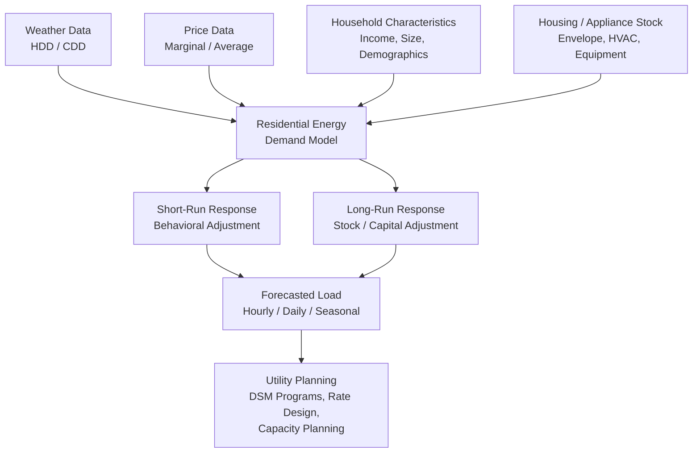

## Residential Energy Demand Modeling

### Overview

Residential energy demand modeling is the quantitative study of how households consume energy — electricity, natural gas, heating oil, and other fuels — and how that consumption responds to price, income, weather, appliance stock, demographics, and policy interventions. It sits at the intersection of applied microeconomics, engineering end-use analysis, and statistical forecasting, and it underpins utility load forecasting, demand-side management (DSM) program design, building codes, and climate policy analysis.

Residential demand differs structurally from industrial or commercial demand because it is driven largely by end uses tied to comfort and daily living (space heating/cooling, water heating, lighting, appliances) rather than production output. This makes weather, dwelling characteristics, and household demographics first-order explanatory variables alongside price and income.

### Core Conceptual Framework

#### The Residential Energy Demand Function

The canonical reduced-form specification treats energy consumption $E$ as a function of price, income, weather, and structural/demographic characteristics:

$$E = f(P, Y, W, S, D, \varepsilon)$$

where $P$ is the energy price (often a marginal or average price), $Y$ is household income, $W$ is a weather index (heating/cooling degree days), $S$ is the housing/appliance stock vector, $D$ is demographic composition, and $\varepsilon$ is the stochastic error term.

#### Short-Run vs. Long-Run Demand

A defining feature of residential energy demand is the sharp divergence between short-run and long-run elasticities, because most consumption is mediated by a durable capital stock (furnaces, air conditioners, water heaters, building envelope) that cannot be adjusted instantaneously.

- **Short-run demand**: conditional on the existing appliance and building stock; adjustment occurs through behavioral changes (thermostat setpoints, usage intensity, occupancy patterns).
- **Long-run demand**: allows the capital stock itself to adjust (appliance replacement, retrofits, new construction), which materially changes the responsiveness of consumption to price signals.

This is typically modeled with a partial adjustment (stock adjustment) framework:

$$E_t = E_{t-1} + \lambda(E_t^* - E_{t-1})$$

where $E_t^*$ is the desired long-run equilibrium demand and $\lambda \in (0,1]$ is the speed-of-adjustment parameter. Estimating $\lambda$ empirically yields the short-run elasticity as a fraction of the long-run elasticity, i.e., short-run elasticity $\approx \lambda \times$ long-run elasticity.

### Structural Determinants of Residential Demand

#### 1. Weather and Climate

Weather is the single largest source of variation in residential demand at daily-to-seasonal frequencies, primarily through heating and cooling.

- **Heating Degree Days (HDD)**: $HDD = \max(0, T_{base} - T_{avg})$, summed over the period.
- **Cooling Degree Days (CDD)**: $CDD = \max(0, T_{avg} - T_{base})$, summed over the period.

$T_{base}$ is conventionally 65°F (18.3°C) in North American utility practice, though it is increasingly estimated econometrically per building or per utility service territory rather than assumed.

Modern practice replaces the fixed-base HDD/CDD with piecewise-linear or spline temperature-response functions, since the true relationship between temperature and load is often non-linear near the balance point and asymmetric in the tails (extreme heat drives sharper marginal load growth than extreme cold in electrified systems).

#### 2. Price

Two price constructs are used depending on rate structure:

- **Average price**: total bill divided by total consumption — administratively simple but endogenous to consumption itself (simultaneity bias) since usage determines which tier/block a household falls into.
- **Marginal price**: the price of the last unit consumed, which is the theoretically correct price variable under standard consumer theory but is harder to instrument, especially under increasing-block or tiered rate structures.

Under **increasing block pricing (IBP)**, households face a marginal price that changes with total usage. The Hausman (1981) two-part approach models this using both the marginal price and a "virtual income" (or "rate differential") term that captures the income effect of facing a piecewise-linear budget constraint rather than a linear one, correcting for the simultaneity between marginal price and quantity consumed.

#### 3. Income

Income effects operate primarily through appliance ownership, dwelling size, and equipment efficiency choices rather than through moment-to-moment usage intensity. Income elasticity of residential electricity demand is typically estimated in the 0.1–0.3 range in developed economies — energy is a normal good but not a luxury good in most specifications, though this varies significantly with electrification depth and climate.

#### 4. Housing and Appliance Stock

- Dwelling type (single-family detached, multi-family, mobile home)
- Building envelope characteristics (insulation, window type, air infiltration/leakage rate)
- Heating/cooling system type (heat pump, resistance, gas furnace, central vs. window AC)
- Appliance saturation (dishwashers, clothes dryers, electric water heaters)
- Vintage effects (newer stock reflects contemporary efficiency codes)

#### 5. Demographics and Behavior

Household size, number of occupants, occupancy schedule (work-from-home vs. commuting), age composition, and behavioral/psychological factors (comfort preferences, environmental attitudes) all shift the demand function, particularly for discretionary end uses like cooling and lighting.

### Modeling Approaches

#### A. Econometric (Statistical) Approaches

**1. Conditional Demand Analysis (CDA)**

CDA regresses total household energy consumption on the presence/count of appliances (as dummy or count variables) interacted with weather and demographic variables, without requiring sub-metered end-use data:

$$E_i = \sum_{k} \beta_k A_{ik} + \gamma W_i + \delta X_i + \varepsilon_i$$

where $A_{ik}$ indicates ownership of appliance $k$ in household $i$. The estimated $\beta_k$ coefficients are interpreted as the implied average annual consumption attributable to appliance $k$. CDA is attractive because it uses only aggregate billing data plus a household appliance survey, but it is vulnerable to multicollinearity among correlated appliances and omitted-variable bias from unobserved usage intensity.

**2. Discrete-Continuous Choice Models**

These jointly model the discrete choice of appliance/technology (e.g., heat pump vs. gas furnace, or efficiency tier) and the continuous choice of utilization intensity conditional on that choice, addressing the fact that appliance choice and usage are not independent decisions (a household that anticipates high usage may select a more efficient unit — the "rebound effect" and selection bias both arise here).

**3. Panel Data / Fixed Effects Models**

Household- or meter-level panel data (increasingly available via smart meters) allow household fixed effects to absorb time-invariant unobserved heterogeneity (dwelling characteristics, latent preferences), isolating price and weather responses from within-household variation over time:

$$E_{it} = \alpha_i + \beta P_{it} + \gamma W_{it} + \delta X_{it} + \tau_t + \varepsilon_{it}$$

where $\alpha_i$ is the household fixed effect and $\tau_t$ captures time fixed effects (seasonality, macro shocks).

**4. Time-Series and Load Forecasting Models**

For short-term operational forecasting (day-ahead, hour-ahead), utilities commonly use:

- **ARIMA/SARIMA** models capturing autocorrelation and seasonality in aggregate load.
- **Regression with weather variables** ("weather-normalized" load models).
- **Machine learning approaches** (gradient boosting, random forests, LSTM neural networks) for non-linear temperature-response and multi-variate interaction effects, particularly valuable given growing electrification (EVs, heat pumps) that introduces new non-linear load shapes.

#### B. Engineering (Bottom-Up) Approaches

**Building energy simulation** models (e.g., DOE-2/EnergyPlus-style engines) compute end-use consumption from first-principles physics: building envelope heat transfer, HVAC system performance curves, occupancy schedules, and equipment specifications. These are aggregated across archetypal building/household categories to construct regional or national demand estimates.

- **Advantages**: transparent mechanistic causality; useful for evaluating hypothetical retrofits or code changes with no historical analog.
- **Disadvantages**: heavy data requirements (detailed building stock surveys); calibration challenges against actual metered consumption ("performance gap" between modeled and actual usage, often attributed to occupant behavior).

#### C. Hybrid Approaches

Modern utility integrated resource planning (IRP) and demand forecasting increasingly combine engineering end-use models (to capture technology transitions like heat pump and EV adoption) with econometric calibration against historical billing/AMI (advanced metering infrastructure) data, sometimes termed "hybrid" or "statistically adjusted engineering (SAE)" models.

### Elasticity Concepts

| Elasticity Type | Definition | Typical Range (Residential Electricity) |
| --- | --- | --- |
| Short-run price elasticity | % change in $E$ / % change in $P$, stock fixed | −0.1 to −0.3 |
| Long-run price elasticity | % change in $E$ / % change in $P$, stock adjusts | −0.3 to −0.9 |
| Income elasticity | % change in $E$ / % change in $Y$ | 0.1 to 0.3 |
| Cross-price elasticity (electricity–gas) | % change in $E_{elec}$ / % change in $P_{gas}$ | Positive (substitutes) in space/water heating |

**[Unverified]** Reported elasticity magnitudes vary considerably by country, climate zone, rate structure, and estimation method; the ranges above reflect commonly cited synthesis findings in the energy economics literature and should be treated as indicative rather than universal constants.

The wide gap between short-run and long-run elasticities has direct policy relevance: a carbon tax or price increase will show a muted consumption response initially, with the full long-run response materializing only as households replace appliances and retrofit buildings over years to decades.

### The Rebound Effect

When efficiency improves (e.g., a household upgrades to a higher-efficiency heat pump), the effective price of the energy service (comfort, hot water) falls, which partially offsets the expected energy savings because households consume more of the now-cheaper service — a direct rebound effect. This is formalized as:

$$\text{Rebound} = -\eta_{\text{service}}$$

where $\eta_{\text{service}}$ is the price elasticity of demand for the energy service with respect to its effective price. Direct rebound effects for residential space heating/cooling are commonly estimated in the 10–30% range **[Unverified — estimates vary substantially by study design, country, and end use]**, meaning 10–30% of the engineering-predicted savings from an efficiency upgrade may be "taken back" as increased consumption, with the remainder realized as actual energy savings.

### Model Diagram

### Worked Example: Stock Adjustment Elasticity Estimation

**Setup:** A utility estimates the following log-linear panel regression on household-month electricity consumption:

$$\ln E_{it} = \alpha_i + \beta_1 \ln P_{it} + \beta_2 \ln E_{i,t-1} + \beta_3 HDD_{it} + \beta_4 CDD_{it} + \varepsilon_{it}$$

Suppose estimation yields $\hat{\beta}_1 = -0.08$ (short-run price coefficient) and $\hat{\beta}_2 = 0.65$ (lagged consumption/partial-adjustment coefficient).

**Interpretation:**

- Short-run price elasticity $\approx \hat{\beta}_1 = -0.08$ (a 10% price increase reduces consumption by about 0.8% in the current period).
- Speed of adjustment: $\lambda = 1 - \hat{\beta}_2 = 0.35$.
- Long-run elasticity $= \dfrac{\hat{\beta}_1}{1-\hat{\beta}_2} = \dfrac{-0.08}{0.35} \approx -0.23$.

This shows the full long-run response (−0.23) is nearly three times larger than the short-run response (−0.08), illustrating why utility rate-design impact assessments must specify a time horizon explicitly.

### Data Sources and Practical Estimation Considerations

- **Smart meter / AMI data**: enables hourly or sub-hourly load curve estimation, disaggregation via load-disaggregation ("non-intrusive load monitoring," NILM) algorithms, and much richer panel econometric identification than monthly billing data.
- **Household energy surveys** (e.g., RECS — Residential Energy Consumption Survey in the U.S.): provide appliance stock, dwelling characteristics, and self-reported behavior needed for CDA and engineering calibration.
- **Weather station data**: must be spatially matched to service territory; degree-day base temperatures should ideally be estimated per climate zone rather than assumed uniformly.
- **Endogeneity concerns**: price-quantity simultaneity under block-rate structures, and the appliance-choice/utilization joint decision, are the two most common sources of bias requiring instrumental variables or structural discrete-continuous methods.

### Applications

- **Load forecasting** for system planning and capacity adequacy.
- **Demand-side management (DSM) program evaluation**: estimating avoided consumption from efficiency rebates, time-of-use pricing, or behavioral nudges (e.g., OPower-style comparative usage reports).
- **Rate design**: assessing revenue and equity impacts of moving from tiered/IBP rates to time-of-use or dynamic pricing.
- **Climate and electrification policy**: projecting load growth from heat pump and EV adoption under decarbonization scenarios.
- **Energy poverty / affordability analysis**: identifying vulnerable households through the interaction of low income elasticity of substitution and high heating/cooling burden shares.

**Related Topics**

- Commercial and industrial energy demand modeling
- Price elasticity estimation and instrumental variable methods in energy economics
- Demand-side management (DSM) program design and evaluation
- Smart meter data analytics and load disaggregation (NILM)
- Time-of-use and dynamic electricity pricing
- Building energy codes and retrofit economics
- The energy efficiency gap and rebound effect
- Energy poverty and affordability metrics
- Electrification of heating (heat pump adoption modeling)
- Weather normalization methods in utility forecasting