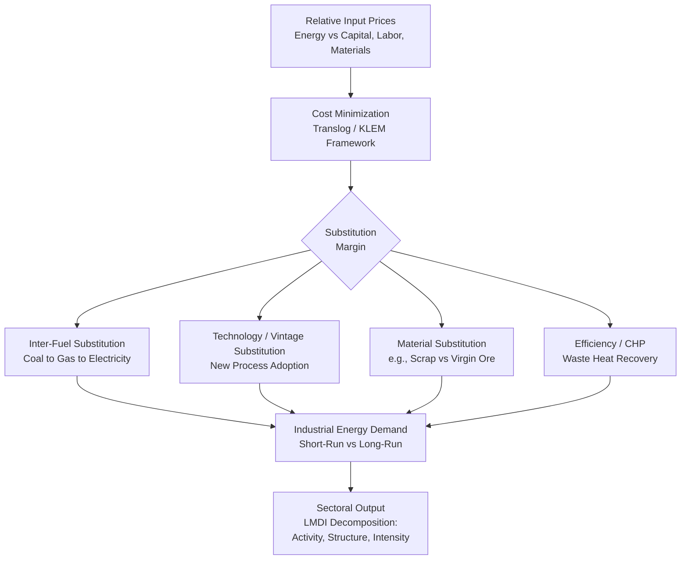

## Industrial Energy Demand and Process Substitution

### Overview

Industrial energy demand is the study of how manufacturing, mining, and processing sectors consume energy as an input to production, and how that consumption responds to relative fuel prices, output levels, technological change, and regulatory constraints. Unlike residential demand — driven by comfort-related end uses — industrial demand is fundamentally a **derived demand**: energy is not consumed for its own sake but as one input among several (capital, labor, materials, energy) in a production process. This makes industrial energy economics inseparable from production theory, and it introduces the central analytical concept of this topic: **inter-fuel and inter-input substitution**.

### Theoretical Foundation: Energy as a Derived Input

#### Production Function Framework

Industrial output $Q$ is modeled as a function of capital $K$, labor $L$, energy $E$, and materials $M$ (the **KLEM** framework):

$$Q = f(K, L, E, M)$$

Firms minimize cost subject to the production function, or equivalently maximize output subject to a budget constraint. Energy demand is therefore a **conditional factor demand**, derived from cost minimization:

$$\min_{K,L,E,M} \; r K + w L + P_E E + P_M M \quad \text{s.t.} \quad Q = f(K,L,E,M)$$

The resulting energy demand function depends on the output target $Q$, the price of energy $P_E$, and the prices of all other inputs (since inputs are generally substitutable or complementary to varying degrees).

#### Translog Cost Function

The dominant empirical framework for estimating industrial input substitution is the **translog (transcendental logarithmic) cost function**, a flexible functional form that does not impose a priori restrictions on substitution elasticities (unlike Cobb-Douglas, which forces unit elasticity of substitution between all input pairs):

$$\ln C = \alpha_0 + \sum_i \alpha_i \ln P_i + \frac{1}{2}\sum_i \sum_j \gamma_{ij} \ln P_i \ln P_j + \beta_Q \ln Q + \varepsilon$$

where $i, j \in \{K, L, E, M\}$. Applying Shephard's Lemma yields cost-share equations:

$$S_i = \frac{\partial \ln C}{\partial \ln P_i} = \alpha_i + \sum_j \gamma_{ij} \ln P_j + \gamma_{iQ}\ln Q$$

These share equations are estimated as a system (typically via Seemingly Unrelated Regression, SUR, or iterative maximum likelihood), and the estimated $\gamma_{ij}$ parameters are used to compute **Allen-Uzawa partial elasticities of substitution (AES)**:

$$\sigma_{ij} = \frac{\gamma_{ij} + S_i S_j}{S_i S_j}$$

- $\sigma_{ij} > 0$: inputs $i$ and $j$ are **substitutes** (e.g., electricity and natural gas in boiler fuel choice).
- $\sigma_{ij} < 0$: inputs $i$ and $j$ are **complements** (e.g., energy and certain capital equipment that cannot operate without it).

### Own-Price and Cross-Price Elasticities

From the cost-share system, own-price and cross-price elasticities of demand for each input are derived:

$$\eta_{ii} = S_i \sigma_{ii}, \qquad \eta_{ij} = S_j \sigma_{ij}$$

**Typical empirical findings in the industrial energy economics literature [Unverified — magnitudes are highly sector- and country-specific]:**

| Elasticity | Typical Sign/Range | Interpretation |
| --- | --- | --- |
| Own-price elasticity of energy, $\eta_{EE}$ | −0.2 to −0.8 | Higher energy prices reduce energy use per unit of output |
| Capital-energy elasticity, $\sigma_{KE}$ | Often complementary (negative) in short run | Energy-using equipment cannot easily be substituted away from once installed |
| Capital-energy elasticity, long run | Often substitutable (positive) | New capital vintages can embody more efficient, less energy-intensive technology |
| Labor-energy elasticity, $\sigma_{LE}$ | Mixed | Automation can be either energy-substituting or energy-using depending on sector |
| Inter-fuel elasticity (e.g., gas-electricity) | Positive (substitutes) | Boiler/furnace fuel switching is a well-documented margin of substitution |

The **capital-energy complementarity/substitutability debate** is one of the most cited controversies in this literature: in the short run, energy and capital tend to be complements (a firm cannot reduce energy use without also idling capital), but in the long run — as the capital stock turns over — new, more efficient equipment allows capital and energy to become substitutes.

### Short-Run vs. Long-Run Industrial Demand

As with residential demand, the capital-stock constraint creates a wedge between short-run and long-run elasticities, but the mechanism is somewhat different: industrial substitution occurs primarily at the point of **capital investment/replacement**, not through simple behavioral adjustment.

- **Short run**: fixed technology/equipment; the firm can only adjust utilization (e.g., run a boiler at lower intensity, adjust production schedules, engage in minor fuel-switching where dual-fuel capability exists).
- **Long run**: firm can replace equipment, redesign processes, or relocate production, enabling much larger substitution responses.

A partial-adjustment/vintage-capital model is often used:

$$E_t = E_{t-1} + \lambda(E_t^{*} - E_{t-1})$$

where $\lambda$ reflects the capital replacement/turnover rate specific to the industrial sub-sector (e.g., cement kilns have multi-decade lifespans, implying very slow $\lambda$; motors and smaller equipment turn over faster).

### Process Substitution: Mechanisms

"Process substitution" refers specifically to changing the **production process itself** — not just fuel choice within an unchanged process — in response to relative energy prices or policy. Key mechanisms include:

#### 1. Inter-Fuel Substitution

Switching between energy carriers for the same end use (e.g., coal → natural gas → electricity for process heat). This is the most commonly estimated and most policy-relevant margin, since it underlies fuel-switching responses to carbon pricing.

#### 2. Technology/Vintage Substitution

Replacing an entire production technology with a less energy-intensive one (e.g., basic oxygen furnace → electric arc furnace in steelmaking; wet-process → dry-process cement kilns). This substitution embeds both energy savings and often capital, labor, and material input changes simultaneously.

#### 3. Material Substitution

Changing input materials to reduce embodied energy demand in processing (e.g., increased scrap steel recycling reduces the energy-intensive ore-reduction step).

#### 4. Energy Efficiency / Process Intensification

Adopting waste heat recovery, cogeneration (combined heat and power, CHP), or process integration (pinch analysis) to reduce energy input per unit of output without changing the fundamental process.

#### 5. Electrification of Process Heat

A structurally important and growing substitution margin: replacing direct fossil-fuel combustion (process heat, furnaces) with electric alternatives (electric arc furnaces, induction heating, electric boilers, heat pumps for low/medium-temperature process heat), driven by decarbonization policy and, in some contexts, relative price shifts.

### Energy Intensity Decomposition

Industrial energy demand analysis frequently decomposes changes in aggregate sectoral energy consumption into distinct drivers using **Index Decomposition Analysis (IDA)**, most commonly the **Logarithmic Mean Divisia Index (LMDI)** method:

$$\Delta E = \Delta E_{activity} + \Delta E_{structure} + \Delta E_{intensity}$$

- **Activity effect**: change in total output/production volume.
- **Structure effect**: shift in output composition across sub-sectors of differing energy intensity (e.g., shift from steel to electronics manufacturing).
- **Intensity effect**: change in energy use per unit of output within each sub-sector (captures true efficiency/technology/process substitution effects, net of composition and scale).

LMDI is preferred in current practice because it satisfies the "factor reversal" and "zero-value robustness" properties and leaves no unexplained residual, unlike older Laspeyres-based decomposition methods.

### Diagram: Industrial Demand and Substitution Pathways

### Worked Example: Translog Elasticity Calculation

**Setup:** A steel-sector translog cost model estimates cost shares $S_K = 0.35$, $S_E = 0.15$, and a cross-price parameter $\gamma_{KE} = -0.02$.

**Step 1 — Allen-Uzawa elasticity of substitution:**

$$\sigma_{KE} = \frac{\gamma_{KE} + S_K S_E}{S_K S_E} = \frac{-0.02 + (0.35)(0.15)}{(0.35)(0.15)} = \frac{-0.02 + 0.0525}{0.0525} = \frac{0.0325}{0.0525} \approx 0.62$$

**Step 2 — Interpretation:** $\sigma_{KE} \approx 0.62 > 0$ indicates capital and energy are **substitutes** in this estimated long-run relationship — consistent with a scenario where the sector has significant vintage turnover allowing efficient new equipment to displace energy use.

**Step 3 — Cross-price elasticity of energy demand with respect to capital price:**

$$\eta_{EK} = S_K \sigma_{KE} = (0.35)(0.62) \approx 0.22$$

A 10% increase in the price of capital would be associated with roughly a 2.2% increase in energy demand, consistent with firms substituting toward energy-intensive, less capital-intensive processes when capital becomes relatively expensive.

### Sector-Specific Considerations

- **Energy-intensive, trade-exposed (EITE) sectors** (steel, cement, aluminum, chemicals, pulp & paper, glass, refining) dominate industrial energy demand analysis because they are simultaneously the largest consumers and the most sensitive to carbon pricing and trade competitiveness concerns (motivating policy responses like border carbon adjustments and free allocation under cap-and-trade systems).
- **Process emissions vs. energy emissions**: some industrial processes (notably cement calcination, and reduction chemistry in steel and aluminum) generate CO₂ from the chemical process itself, not merely from energy combustion — this limits how far fuel substitution alone can decarbonize the sector and is a key driver of interest in Carbon Capture, Utilization, and Storage (CCUS) and novel process chemistries (e.g., hydrogen-based direct reduced iron).
- **Combined Heat and Power (CHP)**: widely adopted in chemicals, refining, and pulp/paper because these processes have simultaneous, correlated demand for electricity and process steam, making CHP thermodynamically efficient (avoiding separate generation and boiler losses).

### Policy Applications

- **Carbon pricing impact assessment**: translog/KLEM elasticity estimates are the standard inputs to computable general equilibrium (CGE) and partial-equilibrium industrial sector models used to project fuel-switching and abatement responses to carbon taxes or cap-and-trade programs.
- **Marginal abatement cost curves (MACCs)**: process substitution options (fuel switching, CHP, efficiency, technology replacement) are ranked by cost per tonne of CO₂ abated to inform policy sequencing.
- **Border carbon adjustment (BCA) design**: relies on estimates of the price elasticity of process substitution to assess leakage risk in EITE sectors.
- **Industrial decarbonization roadmaps**: national and corporate net-zero strategies depend on assumptions about the pace of technology/vintage substitution (capital turnover rates) in hard-to-abate sectors.

**Related Topics**

- KLEM production and cost function estimation methods
- Marginal abatement cost curves (MACC) in industrial decarbonization
- Carbon pricing and industrial competitiveness / carbon leakage
- Combined heat and power (CHP) economics
- LMDI and index decomposition analysis of energy intensity
- Hydrogen-based process substitution (e.g., direct reduced iron)
- Border carbon adjustment mechanisms
- Capital vintage models and technology diffusion in energy-intensive industry
- Residential energy demand modeling
- Computable general equilibrium (CGE) modeling of energy policy