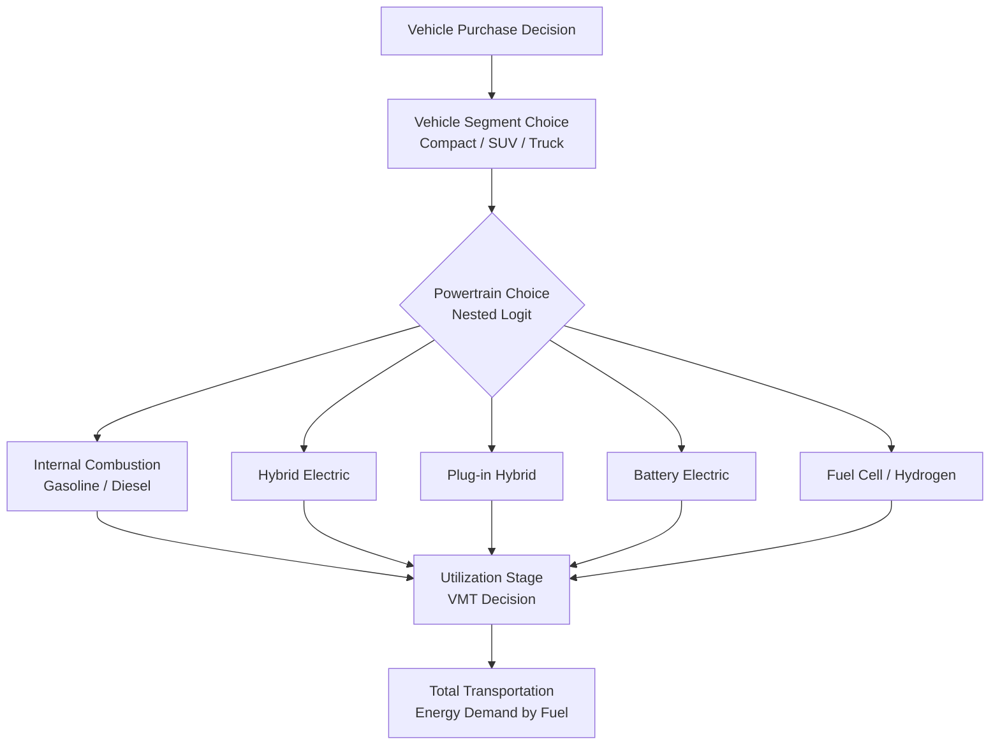

## Transportation Energy Demand and Fuel Switching

### Overview

Transportation energy demand analyzes how the movement of people and goods translates into energy consumption, and how that consumption responds to fuel prices, vehicle technology, infrastructure, and policy. It is distinctive among the major demand sectors (residential, industrial, transportation) because energy use is mediated by a **discrete, long-lived durable good** — the vehicle — whose technology choice locks in the fuel type for years to decades. This makes transportation demand analysis inseparable from the study of vehicle choice, fleet turnover, and fuel switching, particularly as electrification and biofuels create new substitution margins that did not exist under a near-monopoly of petroleum products.

### The ASIF / Kaya-Type Decomposition Framework

Transportation energy demand is conventionally decomposed using the **ASIF framework** (Activity, Structure, Intensity, Fuel), a sector-specific analog to the Kaya identity used in aggregate emissions accounting:

$$E = \sum_{i} A \times S_i \times I_i \times F_i$$

where, for mode $i$:

- $A$ = total activity (e.g., passenger-kilometers or tonne-kilometers traveled)
- $S_i$ = modal structure/share (fraction of activity by mode $i$ — car, rail, air, marine)
- $I_i$ = energy intensity of mode $i$ (energy per passenger-km or tonne-km)
- $F_i$ = fuel/carbon factor (emissions or fuel type per unit energy)

This decomposition cleanly separates the four levers available to reduce transportation energy demand: reduce travel activity, shift modal share toward less energy-intensive modes, improve vehicle/engine efficiency, and switch to lower-carbon fuels — the last being the focus of "fuel switching" analysis specifically.

### Demand for Vehicle-Miles Traveled (VMT)

#### The Two-Stage Demand Structure

Transportation energy demand is typically modeled as a **two-stage (or nested) decision**:

1. **Stage 1 — Vehicle choice**: household or firm selects a vehicle (or vehicle fleet) with a given fuel type and fuel economy, a discrete choice conditioned on purchase price, expected fuel costs, range, charging/refueling infrastructure, and vehicle attributes.
2. **Stage 2 — Utilization choice**: conditional on the vehicle owned, the household chooses how much to drive it (VMT), a continuous choice responsive to the **marginal cost per mile** (fuel price divided by fuel economy).

This is formally a **discrete-continuous choice model**, analogous to the appliance-choice/utilization models used in residential demand, and it is essential because the two margins have very different elasticities and policy implications.

#### The Rebound Effect in Transportation

Because fuel economy improvements lower the marginal cost per mile, they induce increased driving — the transportation **rebound effect** is one of the most extensively studied in the entire energy economics literature:

$$\text{Direct rebound} = -\eta_{VMT, \, cost/mile}$$

**[Unverified — estimates vary by study design, region, and time period]** commonly cited direct rebound estimates for U.S. passenger vehicles fall in the 10–30% range, meaning roughly 10–30% of the fuel savings expected from a fuel economy improvement (holding driving behavior fixed) is offset by increased VMT.

### Fuel Price Elasticities

| Elasticity | Typical Range | Notes |
| --- | --- | --- |
| Short-run price elasticity of gasoline demand | −0.02 to −0.10 | Reflects VMT and load-factor adjustments only |
| Long-run price elasticity of gasoline demand | −0.20 to −0.60 | Reflects vehicle stock turnover to more efficient/alternative-fuel vehicles |
| Short-run VMT elasticity w.r.t. fuel price | −0.05 to −0.15 | Driving behavior is highly inelastic in the short run |
| Fuel economy elasticity w.r.t. fuel price (long run) | Positive | Higher fuel prices shift new-vehicle purchases toward higher-MPG or EV models |

**[Unverified]** These ranges synthesize commonly cited findings across the transportation economics literature; actual magnitudes are sensitive to public transit availability, urban form, income levels, and the time period studied (post-2010 estimates in many developed economies show smaller elasticities than 1970s–1980s estimates, plausibly reflecting reduced substitutability as driving becomes more embedded in built-environment patterns).

### Fuel Switching: Structural Framework

#### Why Transportation Fuel Switching Differs from Industrial/Residential Switching

In stationary sectors, fuel switching can often occur at the equipment level with moderate capital cost (e.g., swap a burner). In transportation, switching fuels almost always requires switching the **entire vehicle powertrain**, because internal combustion, battery-electric, and fuel-cell drivetrains are not interchangeable within a single vehicle platform (with the partial exception of flex-fuel and bi-fuel/dual-fuel vehicles, e.g., CNG/gasoline). This makes the vehicle purchase decision the primary fuel-switching margin, governed by **discrete choice / random utility models**.

#### Discrete Choice Model of Powertrain Selection

Vehicle purchase choice among competing powertrains is standardly modeled with a **random utility / multinomial or nested logit** framework:

$$U_{ij} = \beta_1 (\text{Purchase Price}_{ij}) + \beta_2 (\text{Operating Cost}_{ij}) + \beta_3 (\text{Range}_{ij}) + \beta_4 (\text{Refueling/Charging Access}_{ij}) + \gamma X_j + \varepsilon_{ij}$$

for consumer $i$ choosing vehicle powertrain $j$ (ICE, hybrid, plug-in hybrid, battery electric, fuel cell). The probability of choosing powertrain $j$ under a multinomial logit specification is:

$$P_{ij} = \frac{e^{U_{ij}}}{\sum_{k} e^{U_{ik}}}$$

**Key modeled attributes specific to alternative fuel vehicle (AFV) adoption:**

- **Total cost of ownership (TCO)**, not just sticker price — operating cost savings from lower per-mile electricity/hydrogen costs relative to gasoline are central to EV adoption economics.
- **Range anxiety / infrastructure availability**: charging or hydrogen refueling station density is typically modeled as a network-effect variable, often with an explicit "infrastructure availability" term that itself evolves endogenously with fleet adoption (a chicken-and-egg dynamic requiring dynamic/agent-based extensions to static discrete choice models).
- **Battery cost trajectories**: EV adoption models are highly sensitive to assumed battery pack cost decline curves (historically following an experience-curve/learning-rate pattern).

#### Nested Logit Structure for Fuel Switching

A common refinement nests fuel/powertrain choice below or alongside vehicle segment choice (compact, SUV, truck) to reflect that consumers may first choose a vehicle class and then a powertrain within that class, avoiding the unrealistic **Independence of Irrelevant Alternatives (IIA)** property of simple multinomial logit (which implausibly assumes cross-elasticities are equal across all competing alternatives).

### Freight and Non-Passenger Transportation

Freight (trucking, rail, marine, aviation cargo) follows a structurally similar but distinct framework:

- **Modal shift elasticities**: freight fuel switching often occurs at the **modal** level (truck → rail → marine) rather than the powertrain level, because rail and marine are inherently more energy-efficient per tonne-km, and mode choice responds to relative freight rates, transit time value, and reliability.
- **Heavy-duty vehicle electrification**: battery electric trucking faces distinct constraints from passenger EVs — payload-range tradeoffs from battery weight, and megawatt-scale charging infrastructure requirements — making hydrogen fuel cells a more actively competing alternative in long-haul heavy-duty segments than in passenger cars.
- **Marine and aviation**: face the fewest near-term fuel-switching options due to energy density requirements; current substitution research centers on sustainable aviation fuel (SAF), ammonia, and methanol as marine bunker fuel alternatives, generally at a cost premium over conventional bunker fuel and jet kerosene.

### Policy Instruments Affecting Fuel Switching

| Instrument | Mechanism | Primary Margin Affected |
| --- | --- | --- |
| Fuel taxes / carbon pricing | Raises marginal operating cost per mile by fuel type | VMT (short run), vehicle choice (long run) |
| Fuel economy standards (CAFE-type) | Mandates fleet-average efficiency | New vehicle technology mix |
| Zero-emission vehicle (ZEV) mandates | Requires minimum EV/AFV sales share | Powertrain choice directly |
| Purchase subsidies / tax credits | Reduces upfront EV/AFV cost | Powertrain choice (addresses capital cost barrier) |
| Charging/refueling infrastructure investment | Reduces range anxiety / infrastructure cost term | Powertrain choice (addresses network externality) |
| Low-carbon fuel standards (LCFS) | Credits for low-carbon fuel intensity | Fuel supply mix (biofuels, renewable diesel, electricity) |

### Worked Example: Comparing Cost-per-Mile Across Powertrains

**Setup:** Compare operating cost per mile for a gasoline ICE vehicle and a battery electric vehicle (BEV) under illustrative inputs.

**Gasoline ICE:**

- Fuel economy: 30 miles per gallon (mpg)
- Gasoline price: $3.50/gallon

$$\text{Cost per mile}_{ICE} = \frac{\$3.50}{30} \approx \$0.117/\text{mile}$$

**Battery Electric Vehicle:**

- Efficiency: 3.5 miles per kWh
- Electricity price: $0.15/kWh

$$\text{Cost per mile}_{BEV} = \frac{\$0.15}{3.5} \approx \$0.043/\text{mile}$$

**Interpretation:** Under these illustrative parameters, the BEV's operating cost is roughly 63% lower per mile than the ICE vehicle. This operating-cost gap is the primary variable entering the TCO term of the discrete choice utility function above, and it is why EV adoption modeling is highly sensitive to relative electricity-to-gasoline price ratios, which vary substantially by region and over time. **[Behavior may vary]** — actual realized cost differentials depend on regional electricity rates, time-of-use charging patterns, home vs. public charging cost differentials, and gasoline price volatility.

### Data Sources and Empirical Considerations

- **Household travel surveys** (e.g., National Household Travel Survey in the U.S.) provide VMT, vehicle ownership, and trip-purpose data needed for two-stage demand estimation.
- **Vehicle registration and fleet turnover data** are essential for tracking the pace of fuel-switching, since transportation decarbonization is gated by the **fleet replacement rate** (average vehicle lifespan of 12–15 years in many developed markets implies decades-long full-fleet turnover even under aggressive new-sales mandates).
- **Endogeneity concerns**: fuel economy and VMT are jointly determined (a driver anticipating high mileage may select a more efficient vehicle), requiring the same discrete-continuous modeling caution applied in residential appliance-choice models.
- **Charging infrastructure data**: increasingly central to EV adoption models; often sourced from utility interconnection filings or private charging network APIs.

### Applications

- **Fuel economy / emissions standard design** (CAFE, EU CO₂ standards): relies on estimated own- and cross-price elasticities and discrete choice model outputs to project compliance pathways and rebound offsets.
- **EV adoption forecasting**: utility system planners use nested logit / agent-based fuel-switching models to project charging load growth for grid capacity planning.
- **Carbon pricing incidence analysis**: given inelastic short-run VMT response, fuel/carbon taxes are assessed for regressivity and geographic equity (rural/low-transit-access households face higher effective burden).
- **Infrastructure investment prioritization**: charging/refueling network buildout planning uses adoption elasticity estimates to identify infrastructure "tipping points."

**Related Topics**

- Discrete-continuous choice models of vehicle ownership and utilization
- Electric vehicle adoption and charging infrastructure economics
- Fuel economy standards and rebound effect estimation
- Residential energy demand modeling
- Industrial energy demand and process substitution
- Low-carbon fuel standards and biofuel policy
- Freight decarbonization and heavy-duty vehicle electrification
- Battery cost learning curves and technology diffusion modeling
- Carbon pricing incidence and transportation equity
- Sustainable aviation fuel and marine fuel substitution economics