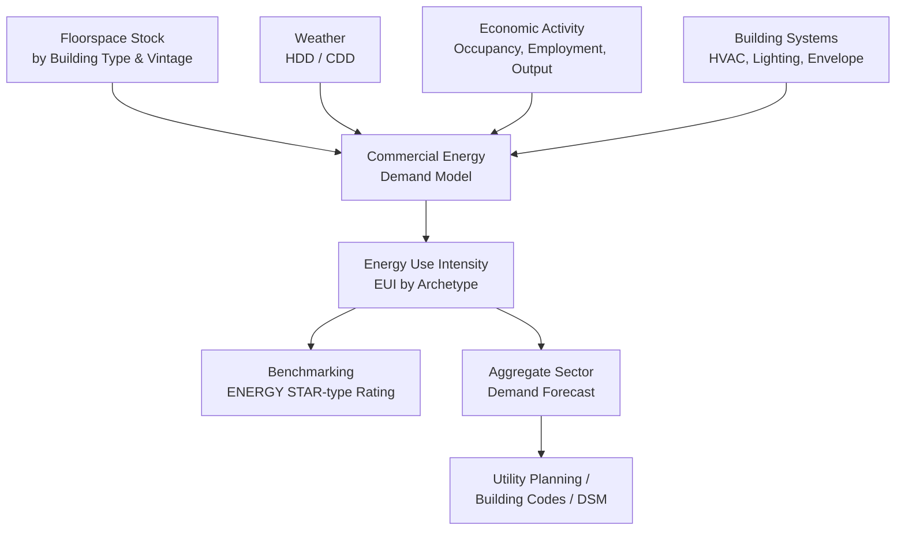

## Commercial and Service-Sector Energy Demand

### Overview

Commercial and service-sector energy demand covers energy consumption in buildings and facilities used for non-residential, non-industrial economic activity — offices, retail, education, healthcare, hospitality, warehousing, and public services. It occupies a structural middle ground between residential and industrial demand: like residential demand, it is dominated by building end uses (HVAC, lighting, water heating) tied to occupant comfort; like industrial demand, it is a **derived demand** tied to economic output and floorspace utilization, and it exhibits substantial heterogeneity across sub-sectors that share little in common beyond occupying a building envelope.

This heterogeneity — a hospital's 24/7 continuous load bears little resemblance to a school's academic-calendar-driven load — is the defining analytical challenge of the sector, and it drives the field's reliance on disaggregation by building type rather than sector-wide aggregate modeling.

### Structural Characteristics of the Sector

#### Floorspace as the Fundamental Activity Variable

Unlike residential demand (households) or industrial demand (output/value-added), the commercial sector's natural activity denominator is **floorspace** (square footage/meters), since energy-consuming end uses (lighting, HVAC, plug loads) scale primarily with conditioned building area rather than headcount or revenue directly:

$$E = I \times FA$$

where $I$ is **energy use intensity (EUI)**, typically expressed in kBtu/ft²/year or kWh/m²/year, and $FA$ is total conditioned floor area. EUI is the sector's standard normalized metric, analogous to per-capita consumption in residential analysis, and is the basis for benchmarking frameworks such as ENERGY STAR Portfolio Manager in the U.S.

#### Building Type Heterogeneity

Commercial demand modeling is conventionally disaggregated into building-type archetypes because end-use shares and load shapes differ dramatically by activity:

| Building Type | Dominant End Uses | Load Shape Characteristics |
| --- | --- | --- |
| Office | HVAC, lighting, plug loads (computers) | Weekday, business-hours peak; low weekend/night |
| Retail | Lighting, HVAC, refrigeration (grocery) | Extended hours, seasonal peaks around holidays |
| Education (K-12/university) | HVAC, lighting | Strong academic-calendar seasonality; low summer occupancy (non-cooling load) |
| Healthcare (hospital) | HVAC, medical equipment, sterilization | Continuous, near-flat 24/7 baseload |
| Hospitality (hotel/restaurant) | HVAC, water heating, kitchen equipment (food service) | High and variable, driven by occupancy/covers |
| Warehouse/distribution | Lighting, refrigeration (cold storage), minimal HVAC | Low intensity but growing with e-commerce cold-chain and automation |
| Data centers | Cooling, IT equipment (servers) | Continuous, extremely high density load — increasingly treated as a distinct demand category |

### End-Use Breakdown and Drivers

Commercial building energy consumption is dominated by a small number of end uses, though the exact mix varies substantially by building type and climate zone:

- **Space heating and cooling (HVAC)**: typically the largest or second-largest end use; driven by building envelope, HVAC system type/efficiency, occupancy schedule, and climate (heating/cooling degree days, as in residential modeling).
- **Lighting**: historically a dominant commercial end use; declining in relative share due to LED adoption, though total lighting load reduction has been partially offset by extended operating hours in some sub-sectors.
- **Water heating**: significant in food service and hospitality; minor in most office/retail.
- **Plug and process loads**: computers, office equipment, refrigeration, and specialized equipment (medical, food service, IT). This category has grown as a share of total commercial demand as HVAC and lighting efficiency has improved, and it is generally the least well-characterized end use in engineering models due to equipment diversity.
- **Ventilation**: distinct from heating/cooling in modern high-performance buildings; increasingly significant given post-2020 indoor air quality standards affecting outdoor air exchange rates.

### Modeling Approaches

#### A. Statistically Adjusted Engineering (SAE) / Hybrid Models

The commercial sector's building-type heterogeneity makes pure econometric (top-down) demand estimation less reliable than in residential analysis, so the dominant modeling paradigm blends **engineering end-use simulation** (bottom-up, by building archetype) with **statistical calibration** against metered utility data — a "statistically adjusted engineering" or hybrid approach, structurally identical in logic to the hybrid methods used in residential and industrial modeling, but organized around building-type prototypes rather than household archetypes.

$$E_{sector} = \sum_{k} FA_k \times I_k(P, W, V, S)$$

where $k$ indexes building type/vintage archetype, $FA_k$ is floorspace in that archetype, and $I_k$ is its intensity as a function of price $P$, weather $W$, vintage/code-era $V$, and system type $S$.

#### B. Conditional Demand Analysis (CDA)

As in residential modeling, CDA regresses metered consumption on the presence/capacity of major systems (chiller type, boiler type, lighting density) interacted with floorspace and weather, using utility billing data plus a building characteristics survey (analogous to the U.S. Commercial Buildings Energy Consumption Survey, CBECS). This is a common approach when detailed engineering simulation inputs are unavailable at scale.

#### C. Building Energy Simulation (Bottom-Up Engineering)

Detailed physics-based simulation (EnergyPlus-class engines) models heat transfer, HVAC system performance, occupancy/schedule profiles, and equipment loads for representative prototype buildings, then scales results by floorspace stock. This approach is essential for **policy counterfactual analysis** — evaluating building codes, equipment standards, or retrofit programs — where no historical price/consumption variation exists to estimate econometrically.

#### D. Panel/Fixed-Effects Econometric Models

Where sufficient billing/AMI panel data exists at the building or meter level, fixed-effects models analogous to residential panel methods are used:

$$\ln E_{it} = \alpha_i + \beta_1 \ln P_{it} + \beta_2 HDD_{it} + \beta_3 CDD_{it} + \beta_4 \ln Y_{it} + \tau_t + \varepsilon_{it}$$

where $\alpha_i$ is a building fixed effect (absorbing time-invariant envelope/system characteristics) and $Y_{it}$ is an economic activity proxy (e.g., sector employment, sales, or occupancy rate) capturing the sector's derived-demand character.

### Elasticity Concepts

| Elasticity Type | Typical Range **[Unverified — highly sector- and study-dependent]** | Notes |
| --- | --- | --- |
| Short-run price elasticity | −0.1 to −0.3 | Split-incentive problem often dampens tenant response |
| Long-run price elasticity | −0.3 to −0.8 | Reflects HVAC/lighting system replacement and envelope retrofits |
| Activity/output elasticity | 0.3 to 0.7 | Weaker than 1:1 due to fixed base load components (security lighting, minimum ventilation) independent of occupancy intensity |

The **split-incentive (principal-agent) problem** is a defining friction specific to this sector: in leased commercial space, the party paying utility bills (tenant, under a "gross" or "net" lease structure) often differs from the party controlling capital investment in efficiency (landlord), which structurally dampens both price responsiveness and the pace of long-run efficiency adjustment relative to owner-occupied buildings.

### Diagram: Commercial Demand Model Structure

### The Split-Incentive Problem in Detail

Commercial leasing structures materially affect demand responsiveness:

- **Gross lease**: landlord pays utilities, tenant pays fixed rent — landlord bears efficiency investment cost but tenant controls usage behavior (thermostat setpoints, equipment use), creating a moral hazard on the usage side.
- **Net lease (triple net)**: tenant pays utilities directly — tenant is price-responsive on usage, but typically lacks capital authority or lease-term incentive to invest in efficiency retrofits (especially under short remaining lease terms), dampening the long-run elasticity.
- **Policy responses**: green leases (contractually aligning efficiency investment costs and energy cost savings between landlord and tenant), on-bill financing, and mandatory disclosure/benchmarking ordinances (requiring public EUI reporting) are the primary mechanisms designed to correct this friction, since it cannot be resolved through price signals alone.

### Worked Example: EUI Benchmarking Calculation

**Setup:** A 100,000 ft² office building consumes 3,200,000 kWh of electricity and 15,000 therms of natural gas annually.

**Step 1 — Convert to common units (kBtu):**

$$\text{Electricity: } 3{,}200{,}000 \text{ kWh} \times 3.412 \text{ kBtu/kWh} = 10{,}918{,}400 \text{ kBtu}$$

$$\text{Natural gas: } 15{,}000 \text{ therms} \times 100 \text{ kBtu/therm} = 1{,}500{,}000 \text{ kBtu}$$

**Step 2 — Total site energy:**

$$10{,}918{,}400 + 1{,}500{,}000 = 12{,}418{,}400 \text{ kBtu}$$

**Step 3 — Energy Use Intensity:**

$$EUI = \frac{12{,}418{,}400 \text{ kBtu}}{100{,}000 \text{ ft}^2} \approx 124.2 \text{ kBtu/ft}^2/\text{year}$$

**Interpretation:** This EUI can be compared against sector-median benchmarks (e.g., CBECS office medians typically fall in a comparable range, though exact medians shift with survey vintage) to flag under- or over-performing buildings, informing retro-commissioning or retrofit prioritization. **[Behavior may vary]** — actual comparability depends on climate zone normalization, operating hours, and whether plug/process loads specific to the tenant (e.g., data closets) are included.

### Emerging and Structurally Significant Sub-Segments

- **Data centers**: rapidly growing as a distinct high-density commercial load category, driven by cloud computing and AI compute demand; increasingly analyzed separately from general commercial stock due to extreme load density (measured in W/ft² an order of magnitude above office space) and near-continuous, weather-insensitive baseload profile dominated by IT equipment and cooling (quantified via Power Usage Effectiveness, PUE).
- **Cold-chain/refrigerated warehousing**: growing with e-commerce and grocery delivery expansion, shifting warehouse-sector load profiles toward higher intensity and refrigeration-dominated end-use shares.
- **Electrification of commercial HVAC and water heating**: heat pump adoption in commercial buildings follows similar substitution economics to residential electrification but is complicated by larger-scale system integration (chiller plants, VRF systems) and longer equipment replacement cycles.

### Data Sources

- **Building energy benchmarking datasets** (e.g., CBECS in the U.S., and mandatory disclosure ordinance datasets in cities with benchmarking laws) provide building characteristics and metered consumption needed for CDA and archetype calibration.
- **Utility AMI/interval data** at the building or meter level, increasingly available for larger commercial accounts, enabling load-shape and panel-based econometric analysis.
- **ENERGY STAR Portfolio Manager** (or equivalent regional benchmarking platforms) provides standardized EUI data widely used in both compliance reporting and academic/utility demand studies.

### Applications

- **Building codes and equipment standards**: engineering simulation of prototype buildings informs commercial energy code stringency analysis (e.g., ASHRAE 90.1-aligned code cycles).
- **Utility commercial DSM program design**: targeting retrofit incentives requires building-type-specific EUI and end-use data to identify highest-impact intervention categories per sub-sector.
- **Mandatory benchmarking and disclosure policy evaluation**: assessing whether public EUI reporting requirements induce measurable efficiency improvement ("informational nudge" effects) is an active area of applied research.
- **Grid planning for data center load growth**: utilities increasingly treat large data center interconnection requests as a distinct forecasting category given their scale and speed of growth relative to traditional commercial floorspace expansion.

**Related Topics**

- Residential energy demand modeling
- Industrial energy demand and process substitution
- Building energy codes and retrofit economics
- Split-incentive problems and green lease structures
- Energy benchmarking and disclosure policy (ENERGY STAR, CBECS)
- Data center energy demand and Power Usage Effectiveness (PUE)
- Combined heat and power (CHP) economics
- Demand-side management (DSM) program design and evaluation
- Electrification of commercial HVAC and water heating
- Weather normalization methods in utility forecasting