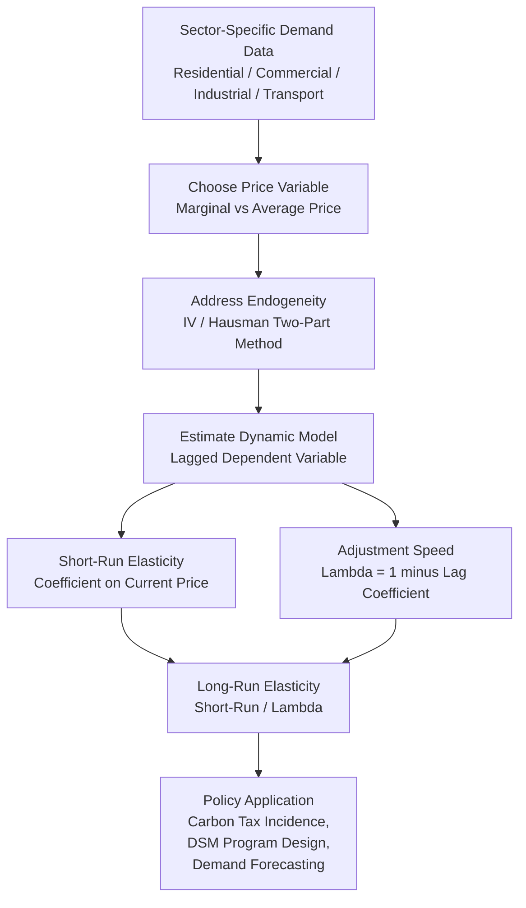

## Income and Price Elasticities Across Sectors

### Overview

Income and price elasticities are the central quantitative parameters of energy demand analysis, measuring the proportional responsiveness of energy consumption to proportional changes in income and price. While each sector — residential, commercial, industrial, and transportation — has its own structural drivers (covered in dedicated sector-specific treatments), the elasticity concept itself is a unifying analytical device that allows cross-sector comparison, aggregation into economy-wide demand models, and direct use in policy impact assessment (carbon pricing, subsidy reform, tax incidence). This topic synthesizes the elasticity concept formally, compares typical magnitudes across sectors, and addresses the estimation methods and biases common to all of them.

### Formal Definitions

#### Price Elasticity of Demand

$$\eta_P = \frac{\partial \ln E}{\partial \ln P} = \frac{\partial E / E}{\partial P / P}$$

Energy is a normal good with a downward-sloping demand curve in virtually all empirical contexts, so $\eta_P < 0$. The magnitude (absolute value) determines the classification:

- $|\eta_P| < 1$: **inelastic** demand — energy expenditure share of income rises as price rises.
- $|\eta_P| > 1$: **elastic** demand — expenditure share falls as price rises.
- $|\eta_P| = 0$: **perfectly inelastic**.

Energy demand across virtually all sectors is empirically inelastic in the short run, and this near-universal inelasticity is the single most policy-relevant stylized fact in energy economics: it means price-based instruments (carbon taxes, fuel taxes) generate substantial revenue and limited immediate consumption response, with larger responses only materializing over the long run as capital stock adjusts.

#### Income Elasticity of Demand

$$\eta_Y = \frac{\partial \ln E}{\partial \ln Y} = \frac{\partial E / E}{\partial Y / Y}$$

- $\eta_Y > 0$: normal good (virtually all energy demand).
- $0 < \eta_Y < 1$: normal good, but a **necessity** — energy budget share falls as income rises (typical finding for residential/transportation fuels in developed economies).
- $\eta_Y > 1$: **luxury good** — budget share rises with income (more commonly observed in developing-economy contexts during early stages of appliance/vehicle ownership diffusion, and in specific discretionary categories like air travel).

#### Cross-Price Elasticity

$$\eta_{ij} = \frac{\partial \ln E_i}{\partial \ln P_j}$$

measures the responsiveness of demand for energy type/input $i$ to the price of a different input or fuel $j$. Positive cross-price elasticity indicates **substitutes** (e.g., natural gas and electricity in space heating); negative indicates **complements** (e.g., gasoline and automobiles — a durable/fuel pairing).

### Short-Run vs. Long-Run Elasticities: The Unifying Mechanism

Across every sector treated in this course, the short-run/long-run elasticity gap arises from the same structural cause: energy consumption is mediated by a **durable capital stock** (appliances, buildings, industrial equipment, vehicles) that cannot be instantaneously adjusted. The **partial (stock) adjustment model** formalizes this uniformly:

$$E_t = E_{t-1} + \lambda(E_t^{*} - E_{t-1}), \qquad 0 < \lambda \le 1$$

Estimating a dynamic (lagged-dependent-variable) regression of the form:

$$\ln E_t = \alpha + \beta_1 \ln P_t + \beta_2 \ln E_{t-1} + \gamma X_t + \varepsilon_t$$

yields the short-run elasticity directly as $\hat\beta_1$, the speed of adjustment as $\lambda = 1 - \hat\beta_2$, and the long-run elasticity as:

$$\eta_P^{LR} = \frac{\hat\beta_1}{1 - \hat\beta_2} = \frac{\hat\beta_1}{\lambda}$$

Because $\lambda < 1$, long-run elasticity always exceeds short-run elasticity in absolute value — a mathematical necessity of this framework, not merely an empirical regularity.

### Cross-Sector Comparison Table

**[Unverified — the following ranges synthesize commonly cited findings across the energy economics literature; actual estimates vary substantially by country, time period, rate structure, and estimation method, and should be treated as indicative rather than universal constants.]**

| Sector | Short-Run Price Elasticity | Long-Run Price Elasticity | Income/Activity Elasticity | Key Structural Driver of Elasticity Level |
| --- | --- | --- | --- | --- |
| Residential (electricity) | −0.1 to −0.3 | −0.3 to −0.9 | 0.1 to 0.3 | Appliance/HVAC stock replacement rate |
| Residential (natural gas, heating) | −0.1 to −0.2 | −0.3 to −0.5 | 0.1 to 0.3 | Furnace/envelope replacement rate |
| Commercial | −0.1 to −0.3 | −0.3 to −0.8 | 0.3 to 0.7 | Split-incentive/lease structure friction |
| Industrial (aggregate energy) | −0.2 to −0.5 | −0.5 to −1.0+ | Output elasticity often near 1.0 | Capital vintage turnover; process substitution |
| Transportation (gasoline) | −0.02 to −0.10 | −0.20 to −0.60 | 0.3 to 0.8 (VMT w.r.t. income) | Vehicle fleet turnover rate (12–15 year average life) |

**Pattern observed across the table**: transportation (specifically gasoline) exhibits the smallest short-run elasticity of any major sector, plausibly reflecting the lack of any substitute for driving in most built environments in the immediate term, while industrial demand shows comparatively higher short-run responsiveness where dual-fuel/interruptible utilization flexibility exists (e.g., boilers capable of running at reduced load or switching fuel with minimal capital adjustment).

### Why Elasticities Differ Across Sectors: Structural Explanations

1. **Substitutability of the underlying capital stock.** Industrial boilers and furnaces often have dual-fuel capability at modest capital cost, generating meaningfully larger short-run elasticity than transportation, where switching fuel requires replacing the entire vehicle.
2. **Budget share.** Sectors/end-uses where energy is a small share of total cost (e.g., commuting fuel relative to total household budget, or energy cost relative to total industrial input cost in low-energy-intensity manufacturing) show smaller price elasticities, consistent with the general microeconomic principle that goods with small expenditure shares tend to have lower elasticities (a corollary of the Slutsky decomposition, where the income effect component scales with budget share).
3. **Necessity vs. discretionary character.** Space heating/cooling and essential lighting are closer to necessities (low income elasticity, low price elasticity), whereas some transportation (leisure air travel) and some commercial end uses (discretionary retail operating hours) are more discretionary (higher elasticity of both types).
4. **Availability of substitutes.** Inter-fuel substitution (industrial), modal substitution (freight transportation), and appliance/HVAC substitution (residential/commercial) all raise the achievable long-run elasticity relative to sectors/end-uses lacking a ready substitute (e.g., aviation, where no scalable low-carbon substitute currently exists at comparable cost).
5. **Split-incentive and principal-agent frictions.** As detailed in the commercial-sector treatment, misalignment between the bill-payer and the capital-investment decision-maker structurally dampens observed elasticity relative to what full-information, single-decision-maker theory would predict — a friction largely absent in owner-occupied residential and vertically integrated industrial contexts.
6. **Rate structure and price salience.** Increasing block pricing, bundled billing, and infrequent billing cycles reduce the salience of the true marginal price, which several studies argue explains why measured "price elasticity" is smaller when average price is used as a proxy for the true (harder-to-observe) marginal price relevant to consumer decision-making.

### Diagram: The Elasticity Estimation Pipeline (Cross-Sector)

### Estimation Challenges Common Across All Sectors

#### 1. Price Endogeneity Under Non-Linear Rate Structures

Under increasing block pricing (residential) or demand charges (commercial/industrial), the price a consumer faces depends on their own consumption level, creating simultaneity bias if average price is regressed directly on quantity. The standard correction is the **Hausman (1981) two-part specification**, including both the marginal price and a "virtual income" (or "difference/rate differential") variable representing the income effect of the piecewise-linear budget constraint, applicable in principle to any sector facing tiered or non-linear pricing.

#### 2. Omitted Variable Bias from Unobserved Capital Stock

Cross-sectional or short panel estimates that lack controls for appliance/equipment stock, building envelope, or vehicle characteristics risk attributing structural/technology differences to price responsiveness. Household/firm/building/vehicle **fixed-effects panel models** are the standard remedy, since they absorb time-invariant unobserved heterogeneity and identify elasticities from within-unit variation over time.

#### 3. Weather/Activity Confounding

Because weather (residential/commercial) and output/activity (industrial/transportation) are often correlated with price cycles at business-cycle or seasonal frequency, elasticity models must explicitly control for these variables (HDD/CDD, industrial output index, VMT/activity proxy) to avoid attributing weather- or activity-driven consumption swings to price effects.

#### 4. Aggregation Bias

Sector-level or economy-wide elasticity estimates aggregate heterogeneous sub-populations (different climate zones, income deciles, industrial sub-sectors, vehicle classes) with potentially very different true elasticities; aggregate estimates represent a weighted average that can mask substantial underlying heterogeneity relevant to distributional/equity policy analysis (e.g., low-income households may face higher effective price elasticity constraints due to budget limits, or lower elasticity due to inability to finance efficiency investment — the direction is empirically ambiguous and context-dependent).

### Worked Example: Comparing Long-Run Response Across Two Sectors

**Setup:** A carbon price increases the effective price of energy by 10% uniformly. Using illustrative long-run elasticities of −0.6 (residential electricity) and −0.9 (industrial energy, aggregate) from the table above:

**Residential long-run response:**

$$\% \Delta E_{res} = \eta_P^{LR} \times \% \Delta P = (-0.6) \times (10\%) = -6\%$$

**Industrial long-run response:**

$$\% \Delta E_{ind} = (-0.9) \times (10\%) = -9\%$$

**Interpretation:** Under these illustrative parameters, the same proportional price shock generates a 50% larger proportional consumption reduction in the industrial sector than in the residential sector in the long run, consistent with industry's greater access to process substitution and fuel-switching margins relative to the residential sector's more constrained substitution set (behavioral adjustment and appliance replacement only). **[Behavior may vary]** — actual realized responses depend on the specific elasticity estimates applicable to the jurisdiction, time horizon, and rate/tax design in question, which should be estimated or sourced empirically for any specific policy application rather than assumed from illustrative ranges.

### Applications

- **Carbon tax revenue and abatement forecasting**: sector-differentiated elasticities are the core input to projecting both fiscal revenue (higher with inelastic demand) and emissions abatement (lower with inelastic demand) from a given carbon price path.
- **Cross-sector policy sequencing**: given industry's typically higher long-run elasticity and existing fuel-switching infrastructure, carbon pricing is often modeled as achieving earlier abatement in industrial and power-generation sectors than in transportation, informing complementary policy design (fuel economy standards, ZEV mandates) where price elasticity alone is insufficient.
- **Demand forecasting models (utility IRP)**: elasticity parameters are direct inputs to econometric and hybrid demand forecasting models used in integrated resource planning.
- **Distributional/equity analysis**: income elasticity estimates by income decile inform assessment of carbon tax regressivity and rebate/dividend policy design.
- **Cross-fuel substitution policy**: cross-price elasticities between electricity and natural gas, or between competing transportation fuels, inform projections of electrification and fuel-switching responses to relative price shifts (e.g., from carbon pricing or fuel taxation asymmetries).

**Related Topics**

- Residential energy demand modeling
- Industrial energy demand and process substitution
- Transportation energy demand and fuel switching
- Commercial and service-sector energy demand
- Hausman two-part pricing models under increasing block rates
- Carbon tax incidence and distributional analysis
- Rebound effect estimation across sectors
- Panel data and fixed-effects methods in energy demand estimation
- Energy demand forecasting for utility integrated resource planning
- KLEM production and cost function estimation methods