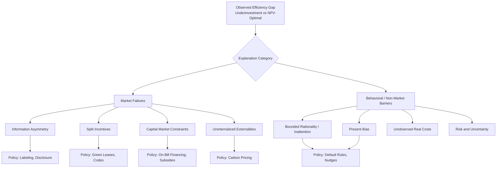
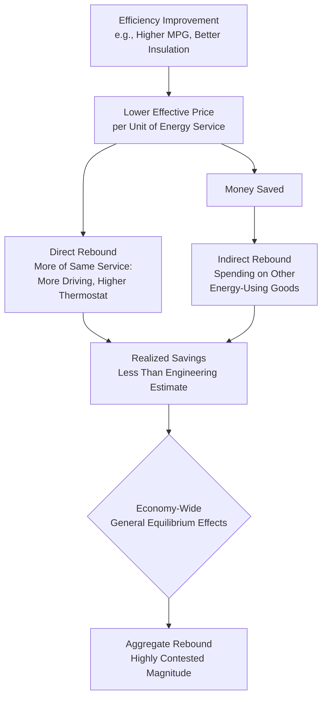

## Energy Efficiency Gap and the Rebound Effect

### Overview

The energy efficiency gap and the rebound effect are two related but distinct phenomena that explain why observed energy savings from efficiency improvements systematically diverge from what engineering-economic models predict — in opposite directions. The **efficiency gap** describes the puzzle that cost-effective, positive-net-present-value efficiency investments remain widely unadopted, implying realized savings potential falls short of the technically/economically achievable level. The **rebound effect** describes the separate phenomenon that even when efficiency improvements are adopted, realized energy savings fall short of the engineering prediction because efficiency gains induce increased consumption. Both concepts are essential to interpreting efficiency policy evaluation, and both recur across every demand sector treated elsewhere in this course (residential, industrial, transportation, commercial).

### Part I: The Energy Efficiency Gap

#### Definition and the Core Puzzle

The energy efficiency gap refers to the empirically documented tendency of households and firms to forgo energy efficiency investments that appear to pay for themselves through discounted future energy savings — investments with a positive net present value (NPV) and implied internal rate of return (IRR) far exceeding conventional capital market discount rates. This was first systematically identified in the engineering-economics literature (notably Jaffe and Stavins, 1994) as a persistent divergence between the technically/economically "optimal" level of efficiency adoption and the observed level.

#### The Implied Discount Rate Puzzle

The gap is most starkly illustrated through **implied discount rates**: solving for the discount rate $r$ that would make a household indifferent between a higher-efficiency and lower-efficiency option, given the NPV condition:

$$\sum_{t=1}^{T} \frac{\Delta S_t}{(1+r)^t} = \Delta C_0$$

where $\Delta S_t$ is the annual energy cost savings from the efficient option, $\Delta C_0$ is the incremental upfront cost, and $T$ is the equipment lifetime. Empirical studies solving for the household's revealed $r$ from actual purchase decisions (e.g., in appliance or vehicle choice) have historically found **implied discount rates in the range of 20–300%** **[Unverified — this range synthesizes commonly cited historical findings; more recent studies using better-controlled designs often find smaller, though still elevated, implied rates]**, dramatically exceeding typical consumer borrowing rates (often single-digit to low-teens percentages) or firms' cost of capital, suggesting either genuinely high implicit discounting of future savings or the presence of unmodeled costs and barriers.

#### Competing Explanations for the Gap

The literature offers several non-mutually-exclusive explanations, generally grouped into market failures (which justify policy intervention on efficiency grounds) and behavioral/non-market barriers (whose policy implications are more contested):

**A. Market Failures**

1. **Information asymmetry and imperfect information**: consumers/firms may lack reliable information on true operating cost differentials, or face high search costs to acquire it. Labeling policies (ENERGY STAR, EU energy labels, fuel economy window stickers) are direct policy responses to this specific failure.
2. **Split incentives (principal-agent problems)**: as detailed in the commercial-sector treatment, the party bearing the capital cost of efficiency investment often differs from the party capturing the energy savings (landlord-tenant, and analogously builder-buyer in new construction where builders bear efficiency costs but buyers capture operating savings).
3. **Capital market imperfections**: credit-constrained households/firms may be unable to finance the upfront cost of efficient equipment even when the investment is NPV-positive, particularly relevant for lower-income households facing higher effective borrowing costs or credit access barriers.
4. **Externalities**: the social cost of carbon and other emissions is not internalized in private energy prices absent a carbon price, meaning private efficiency incentives are systematically weaker than socially optimal ones — this is an argument for the existence of a *socially* efficient gap even if consumers are fully rational, distinct from the behavioral gap discussed below.

**B. Behavioral and Non-Market Barriers**

5. **Bounded rationality and inattention**: consumers may not fully process or salience-weight future energy costs relative to more visible upfront purchase price, consistent with broader behavioral economics findings on inattention to non-salient costs.
6. **Present bias / hyperbolic discounting**: consumers may exhibit time-inconsistent preferences that overweight the immediate upfront cost relative to standard exponential discounting, distinct from simply having a high but consistent discount rate.
7. **Heterogeneous and unobserved costs**: apparent "irrationality" may partly reflect real but unmodeled costs — aesthetic/performance differences, transaction/hassle costs, uncertainty about future occupancy duration (reducing the effective payback horizon), or genuine heterogeneity in energy prices/usage intensity across the population that a single "representative agent" NPV calculation does not capture.
8. **Risk and uncertainty**: future energy price paths and personal circumstances (moving, resale) are uncertain, and risk-averse consumers may rationally discount uncertain future savings more heavily than a risk-neutral NPV calculation implies.

**[Inference]** The relative contribution of each explanation remains actively contested in the literature, and most researchers now regard the "gap" as likely reflecting a combination of genuine market failures, rational responses to unmodeled costs/risks, and behavioral biases, rather than any single dominant cause — the appropriate policy response differs substantially depending on which explanation dominates in a given context.

### Diagram: Sources of the Efficiency Gap

### Part II: The Rebound Effect

#### Definition

The rebound effect describes the phenomenon whereby improvements in energy efficiency lower the effective price of the energy service being delivered (comfort, mobility, illumination), inducing consumers to purchase more of that service, which offsets — partially, fully, or in rare cases more than fully — the energy savings that a pure engineering calculation (holding usage behavior fixed) would predict.

#### Taxonomy of Rebound Effects

**1. Direct Rebound Effect**

Increased consumption of the *same* energy service whose efficiency improved, arising from the reduced effective price per unit of service:

$$\text{Direct rebound} = -\eta_{\text{service}, \, \text{effective price}}$$

where $\eta$ is the price elasticity of demand for the specific service (e.g., vehicle-miles-traveled, indoor temperature/conditioned space) with respect to its effective per-unit price. Examples: driving more because a more fuel-efficient car lowers cost-per-mile; setting a warmer winter thermostat because better insulation lowers cost-per-degree of comfort.

**2. Indirect Rebound Effect**

Money saved on the original energy service is reallocated to spending on *other* goods and services, which themselves have embodied energy content, generating additional energy consumption elsewhere in the economy. Example: fuel savings from an efficient vehicle are spent on airline travel, which has its own energy footprint.

**3. Economy-Wide (Macroeconomic) Rebound Effect**

Efficiency improvements at scale reduce the effective price of energy services economy-wide, which can stimulate broader economic growth (a general equilibrium effect operating through reduced production costs, increased real income, and changed relative prices across the whole economy), generating additional aggregate energy demand beyond the direct and indirect effects captured at the individual consumer/firm level. This channel is the most difficult to estimate empirically and the most theoretically contested.

**4. Backfire (Khazzoom-Brookes Postulate)**

The extreme case where rebound effects exceed 100% — efficiency improvement leads to a *net increase* in total energy consumption rather than a reduction. This remains a genuinely contested empirical question rather than settled fact: **[Unverified/Speculation]** most microeconomic (direct + indirect) rebound estimates for developed-economy contexts fall well short of 100%, but some economy-wide macroeconomic estimates — particularly for large-scale, economy-wide efficiency improvements interacting with energy-intensive growth sectors — have been argued by some researchers to approach or exceed full backfire, while other researchers dispute this finding; the debate remains unresolved in the literature and estimates are highly sensitive to modeling assumptions.

#### Formal Decomposition

Total realized savings can be expressed relative to the engineering (technical potential) savings estimate:

$$\text{Realized savings} = \text{Engineering savings} \times (1 - \text{Rebound})$$

$$\text{Rebound} = \text{Direct} + \text{Indirect} + \text{Economy-wide}$$

#### Sector-Specific Rebound Magnitudes

| Sector / End Use | Direct Rebound Estimate **[Unverified — ranges vary substantially by study]** | Notes |
| --- | --- | --- |
| Passenger vehicle fuel economy | 10–30% | Most extensively studied rebound estimate in the literature |
| Residential space heating | 10–30% | Often manifests as higher thermostat setpoints post-retrofit |
| Residential space cooling | Similar or somewhat higher range | Cooling rebound may be larger in warming climates/growing AC penetration |
| Industrial process energy | Generally smaller | Output is typically demand-constrained by external markets rather than energy cost alone |
| Lighting (post-LED transition) | Historically documented, though shrinking | Lower marginal cost per lumen has historically induced increased illumination use in some contexts |

### Diagram: Rebound Effect Pathway

### Worked Example: Direct Rebound Calculation for Vehicle Efficiency

**Setup:** A household upgrades from a 25 mpg to a 40 mpg vehicle, at a constant gasoline price of $3.50/gallon and constant annual driving pattern absent behavioral response.

**Step 1 — Engineering-predicted savings (no rebound):**

Original annual fuel use at 12,000 miles/year: $12{,}000 / 25 = 480$ gallons

New vehicle fuel use at same 12,000 miles/year: $12{,}000 / 40 = 300$ gallons

Engineering-predicted savings: $480 - 300 = 180$ gallons/year

**Step 2 — Effective cost-per-mile change:**

$$\text{Cost/mile}_{old} = \$3.50 / 25 = \$0.140/\text{mile}, \qquad \text{Cost/mile}_{new} = \$3.50 / 40 = \$0.0875/\text{mile}$$

$$\% \Delta \text{cost per mile} = \frac{0.0875 - 0.140}{0.140} \approx -37.5\%$$

**Step 3 — Apply illustrative direct rebound elasticity of $\eta = -0.15$ (midpoint of typical range):**

$$\% \Delta \text{VMT} = -\eta \times \% \Delta \text{cost/mile} = 0.15 \times 37.5\% \approx 5.6\%$$

New VMT: $12{,}000 \times 1.056 \approx 12{,}675$ miles

**Step 4 — Realized fuel consumption and savings:**

$$\text{New fuel use} = 12{,}675 / 40 \approx 317 \text{ gallons}$$

$$\text{Realized savings} = 480 - 317 = 163 \text{ gallons}, \quad \text{vs. } 180 \text{ gallons engineering estimate}$$

$$\text{Rebound share} = \frac{180 - 163}{180} \approx 9.4\%$$

**Interpretation:** Under these illustrative parameters, roughly 9% of the technically predicted fuel savings is "taken back" through increased driving, meaning the household realizes about 91% of the engineering-projected savings rather than the full amount. **[Behavior may vary]** — actual rebound magnitude depends on the household's true price elasticity of VMT, which varies by income, urban form, and time period, and this example excludes indirect and economy-wide rebound channels entirely.

### Relationship Between the Two Concepts

Though often discussed together, the efficiency gap and rebound effect operate in **opposite directions** relative to naive predictions and are frequently conflated in public discourse:

- The **efficiency gap** implies *less* efficiency adoption occurs than a pure NPV calculation predicts (a barrier to realizing potential savings in the first place).
- The **rebound effect** implies *less* energy savings is realized *per unit of efficiency actually adopted* than engineering calculations predict (a leakage in savings after adoption occurs).

A full policy evaluation of any efficiency program must therefore separately account for (a) how much additional adoption the program induces beyond the counterfactual baseline (addressing the gap), and (b) how much of the resulting engineering-predicted savings will be realized net of rebound — conflating the two, or ignoring either, produces systematically biased program savings estimates, a well-documented issue in utility DSM program evaluation, measurement, and verification (EM&V) practice.

### Applications

- **Utility DSM program cost-effectiveness testing**: EM&V protocols increasingly incorporate rebound adjustment factors (sometimes termed "net-to-gross" ratios, though that term also captures free-ridership and spillover effects distinct from rebound specifically) to avoid overstating claimed savings.
- **Building code and appliance standard impact assessment**: government regulatory impact analyses (e.g., U.S. DOE appliance standards rulemakings) explicitly model both adoption barriers (justifying mandatory minimum standards as a response to the efficiency gap) and rebound-adjusted realized savings.
- **Carbon policy modeling**: economy-wide rebound estimates are a key source of uncertainty in projecting aggregate emissions reductions from efficiency-focused climate policy, as distinct from price-based (carbon tax) policy.
- **Green lease and information disclosure policy design**: directly targets specific efficiency-gap explanations (split incentives, information asymmetry) rather than relying on price signals alone.

**Related Topics**

- Residential energy demand modeling
- Industrial energy demand and process substitution
- Transportation energy demand and fuel switching
- Commercial and service-sector energy demand
- Income and price elasticities across sectors
- Demand-side management (DSM) program design and evaluation
- Behavioral economics applications in energy policy
- Building energy codes and appliance efficiency standards
- Split-incentive problems and green lease structures
- Social cost of carbon and externality-based policy justification