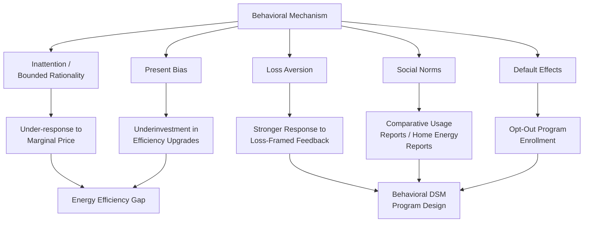

## Behavioral Economics of Energy Consumption Decisions

### Overview

Behavioral economics applies insights from psychology and bounded-rationality models to explain systematic, persistent deviations of actual energy consumption and investment decisions from the predictions of the standard neoclassical rational-agent model. Where the neoclassical framework treats consumers as fully informed, exponentially discounting expected-utility maximizers, the behavioral approach documents and models specific cognitive and motivational mechanisms — inattention, present bias, social preferences, default effects, and framing — that produce measurable, replicable, and policy-exploitable gaps between observed and "rational" energy behavior. This field provides the microfoundations underlying several phenomena treated elsewhere in this course, most directly the energy efficiency gap, and it is the theoretical basis for the fastest-growing category of utility demand-side management: behavioral interventions ("nudges") that require no price change or capital subsidy.

### Theoretical Departures from the Neoclassical Baseline

#### 1. Bounded Rationality and Inattention

Standard demand theory assumes consumers process all relevant price and cost information and optimize accordingly. In practice, energy costs are frequently **low-salience** — bundled into infrequent, aggregated utility bills that obscure the marginal cost of any single consumption decision (e.g., running a specific appliance). This generates:

- **Inattention to marginal price**: Several empirical studies find consumers respond more strongly to **average price** (visible on the bill) than to **marginal price** (the economically relevant signal under tiered/block rate structures), a direct contradiction of standard consumer theory and consistent with rational inattention models where costly cognitive processing of complex rate schedules is itself optimized against.
- **Inattention to future operating costs at point of purchase**: consumers systematically under-weight lifetime energy costs relative to upfront purchase price when buying durable goods (appliances, vehicles), a mechanism directly contributing to the energy efficiency gap.

#### 2. Present Bias and Hyperbolic Discounting

Standard NPV analysis assumes exponential (time-consistent) discounting. Behavioral models instead posit **quasi-hyperbolic (β-δ) discounting**:

$$U = u_0 + \beta \sum_{t=1}^{T} \delta^t u_t, \qquad 0 < \beta < 1$$

where $\beta$ introduces a discrete "present bias" — a disproportionate preference for the current period relative to any future period, distinct from a simply high but time-consistent discount rate $\delta$. This distinction matters for policy: a genuinely high but consistent discount rate is a stable preference to be respected, whereas present bias implies **time-inconsistent preferences** where the consumer's own future self would prefer they had chosen differently — creating a normative basis for "libertarian paternalist" interventions (defaults, commitment devices) that a purely high-discount-rate explanation would not support.

#### 3. Loss Aversion and Reference Dependence

Under prospect theory (Kahneman and Tversky), consumers evaluate outcomes relative to a reference point and weight losses more heavily than equivalent gains ($\lambda_{loss} > \lambda_{gain}$ in the value function). Applied to energy: framing an efficiency intervention as **avoiding a loss** (e.g., "you're paying $40 more than efficient neighbors") tends to generate a stronger behavioral response than framing the equivalent information as a potential gain ("you could save $40"), a finding central to the design of comparative usage feedback programs.

#### 4. Social Norms and Social Comparison

Energy consumption decisions are influenced by perceived social norms — what similar others do — independent of price or income effects. This operates through two related channels identified in the social psychology literature:

- **Descriptive norms**: information about what others actually do (e.g., "your neighbors use less energy than you").
- **Injunctive norms**: information about what is socially approved/disapproved (commonly operationalized via emoji/smiley-face feedback indicating approval or disapproval of relative consumption levels).

**Boomerang effect caution**: descriptive norm messaging alone can backfire for below-average consumers, who may increase consumption toward the norm upon learning they use less than their neighbors — a well-documented risk that motivates pairing descriptive norms with injunctive (approval/disapproval) signals to prevent upward convergence among already-efficient households.

#### 5. Default Effects and Choice Architecture

Because changing a pre-set default requires active effort (bounded rationality/inertia), the default option in any enrollment decision exerts outsized influence on outcomes relative to a purely rational model, where defaults should be neutral if switching costs are trivial. This is the mechanism behind "opt-out" green power or efficiency program enrollment achieving dramatically higher participation than economically equivalent "opt-in" designs.

#### 6. Anchoring and Framing Effects

The presentation format of energy information — units (kWh vs. cost), comparison points, and visual design — measurably affects consumption decisions independent of the underlying information content, consistent with framing effects documented broadly in behavioral decision research.

### Diagram: Behavioral Mechanisms Mapped to Energy Decisions

### Applied Program Category: Home Energy Reports (HERs)

The most extensively studied and commercially deployed behavioral energy intervention is the **Home Energy Report (HER)**, pioneered by the company Opower (now part of Oracle Utilities) and now offered by numerous vendors and directly by utilities. The standard design:

- Mails or emails households a **comparative usage report** showing their consumption relative to a reference group of similar (typically nearby, similarly-sized) homes.
- Combines descriptive norms (neighbor comparison) with injunctive norms (smiley-face rating system) and, in most designs, actionable efficiency tips.
- Deployed via **randomized controlled trials (RCTs)** at utility scale, making this one of the best-causally-identified categories of energy policy intervention in the literature, in contrast to many price-elasticity studies that rely on observational/quasi-experimental identification.

**Typical documented effect sizes [Unverified — magnitudes vary by study, program design, and target population]**: HER programs commonly report savings in the range of 1–3% of household electricity consumption, which — while modest per household — has been assessed by numerous program administrators as highly cost-effective per unit of energy saved given the near-zero marginal cost of report distribution relative to capital-intensive efficiency programs, and the interventions have been noted for effects that in some studies persist for a period after treatment discontinuation, plausibly consistent with some habit-formation component alongside the ongoing-feedback-driven response, though the durability and precise decay pattern of post-treatment effects is an area of continued study.

### Randomized Controlled Trials (RCTs) as the Methodological Standard

Behavioral energy economics is distinguished from much of the broader demand-elasticity literature by its heavy reliance on **field RCTs** rather than observational econometric identification, because:

1. Behavioral treatments (messaging, framing, defaults) can be randomly assigned at low cost and with minimal ethical concern, unlike price variation (which utilities cannot ethically or legally randomize across customers in most regulatory contexts).
2. RCT designs directly address the endogeneity and omitted-variable concerns that pervade observational price-elasticity estimation (covered in the elasticity topic), since random assignment by construction breaks any correlation between treatment and unobserved household characteristics.
3. Utility-scale HER rollouts have generated some of the largest field experiments in applied microeconomics, with treatment/control groups numbering in the hundreds of thousands of households, providing unusually high statistical power for detecting even small effect sizes.

### Behavioral Barriers Specific to Efficiency Investment (vs. Usage Behavior)

Distinct from usage-behavior nudges (HERs), a separate behavioral literature addresses why efficiency *investment* decisions (equipment purchase, retrofit adoption) are particularly susceptible to behavioral barriers:

- **Choice overload**: complex efficiency program offerings (multiple rebate tiers, financing options, contractor choices) can reduce program uptake through decision paralysis, motivating "simplified pathway" or "one-stop-shop" program redesigns.
- **Trust and credibility of savings claims**: consumers may discount efficiency vendor or program-administrator savings estimates due to perceived conflicts of interest, an information-credibility barrier distinct from pure information asymmetry.
- **Hassle costs and transaction costs**: search, scheduling, and disruption costs of retrofit installation are often unmodeled in pure engineering-economic NPV calculations but are highly salient to the consumer, providing a partially "rational" (non-behavioral) explanation that competes with purely psychological accounts for the same observed underinvestment — this ambiguity is central to the efficiency-gap debate covered in the dedicated efficiency-gap treatment.

### Worked Example: Present-Bias-Adjusted Investment Valuation

**Setup:** A household evaluates an efficiency upgrade costing $1,000 upfront, generating $150/year in savings for 10 years. Assume a market interest rate of $\delta$-equivalent 5% annually, but the household exhibits quasi-hyperbolic discounting with present-bias parameter $\beta = 0.7$.

**Step 1 — Standard exponential-discounting NPV (rational benchmark):**

$$NPV = -1000 + \sum_{t=1}^{10} \frac{150}{(1.05)^t}$$

Using the annuity formula: $\sum_{t=1}^{10} \frac{150}{(1.05)^t} = 150 \times \frac{1-(1.05)^{-10}}{0.05} \approx 150 \times 7.722 \approx \$1{,}158$

$$NPV_{standard} = -1000 + 1158 = \$158 \; (\text{positive — investment is NPV-justified})$$

**Step 2 — Quasi-hyperbolic present-biased valuation (all future periods discounted by additional factor $\beta$):**

$$NPV_{\beta} = -1000 + \beta \times 1158 = -1000 + (0.7)(1158) = -1000 + 811 \approx -\$189$$

**Interpretation:** Under standard exponential discounting the investment is worthwhile (+$158 NPV), but the present-biased household perceives it as unattractive (−$189), leading to rational-seeming but suboptimal-by-the-household's-own-long-run-preferences non-adoption. This illustrates precisely why present bias — as distinct from a simply high discount rate — is used to justify commitment-device and default-based policy interventions rather than purely informational ones, since even perfect information about the $158 NPV would not resolve a present-bias-driven rejection. **[Behavior may vary]** — actual household discounting behavior is heterogeneous, and not all documented non-adoption reflects present bias specifically rather than the other efficiency-gap explanations (unobserved costs, capital constraints) discussed in the dedicated efficiency-gap treatment.

### Policy and Program Design Implications

| Behavioral Mechanism | Policy/Program Response |
| --- | --- |
| Inattention to marginal price / bill opacity | Real-time feedback devices, in-home displays, simplified/itemized billing |
| Present bias | Default enrollment, commitment devices, on-bill financing (aligns payment timing with savings realization) |
| Loss aversion | Loss-framed messaging in comparative reports |
| Social norms | Home Energy Reports, neighbor comparison programs |
| Default inertia | Opt-out (rather than opt-in) green power and efficiency program enrollment |
| Choice overload | Simplified, pre-qualified "one-stop-shop" retrofit program pathways |
| Trust/credibility barriers | Third-party verification, standardized disclosure/certification labels |

### Critiques and Limitations of the Behavioral Approach

- **External validity**: RCT results from a specific utility service territory, climate, or demographic population may not generalize to other contexts — a general concern with field experiments across applied economics, not unique to energy.
- **Persistence and habituation**: some behavioral interventions show effect decay over time as novelty wears off, raising questions about long-run cost-effectiveness relative to capital-intensive efficiency investments with more durable savings profiles.
- **Interaction with price-based policy**: behavioral and price instruments are not always additive — some studies suggest behavioral nudges may partially crowd out or interact non-linearly with concurrent price signals, an active area of ongoing research rather than settled finding.
- **Equity considerations**: behavioral interventions rely on data collection (smart meter access, comparison-group construction) that may be unevenly available across income groups or renter/owner status, raising distributional considerations distinct from, but related to, the split-incentive problem discussed in the commercial-sector and efficiency-gap treatments.

### Applications

- **Utility DSM program portfolios**: behavioral programs are now a standard, often mandated, component of utility energy-efficiency portfolios in many U.S. states and other jurisdictions, evaluated via the same EM&V (measurement and verification) frameworks used for capital-intensive efficiency programs.
- **Building/appliance efficiency labeling design**: informed by framing and salience research to maximize the behavioral impact of mandatory disclosure requirements.
- **Real-time feedback and smart meter/AMI-enabled interventions**: in-home displays and mobile app usage alerts apply salience and immediacy principles directly to the inattention mechanism.
- **Rate design complementarity**: behavioral insights inform how dynamic/time-of-use pricing programs are communicated and defaulted (e.g., opt-out enrollment in TOU rates) to maximize both comprehension and participation.

**Related Topics**

- Energy efficiency gap and the rebound effect
- Residential energy demand modeling
- Demand-side management (DSM) program design and evaluation
- Income and price elasticities across sectors
- Randomized controlled trial methods in applied energy economics
- Time-of-use and dynamic electricity pricing
- Smart meter data analytics and real-time feedback systems
- Choice architecture and default-option design in energy policy
- Split-incentive problems and green lease structures
- Behavioral welfare economics and libertarian paternalism