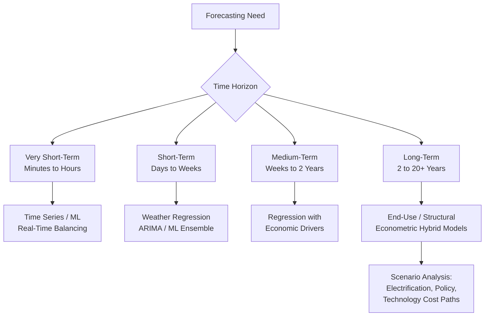

## Demand Forecasting Methods and Models

### Overview

Demand forecasting is the applied discipline of projecting future energy consumption across time horizons ranging from minutes (real-time grid operations) to decades (integrated resource planning), synthesizing the sector-specific structural drivers, elasticities, and behavioral mechanisms covered elsewhere in this course into operational predictive models. Unlike the primarily explanatory/causal focus of elasticity estimation, forecasting is fundamentally a **predictive** exercise, and the methods used are selected primarily for out-of-sample accuracy rather than structural interpretability — though the best-practice forecasting models increasingly blend both objectives. This topic surveys the forecasting horizon taxonomy, the major model families, and the evaluation and uncertainty-quantification methods standard in utility, system operator, and policy-planning practice.

### The Forecasting Horizon Taxonomy

Forecasting method choice is driven primarily by the operational decision the forecast supports, which determines the required time horizon and update frequency:

| Horizon | Typical Range | Primary Use Case | Dominant Method Family |
| --- | --- | --- | --- |
| Very short-term (VSTLF) | Minutes to hours ahead | Real-time grid balancing, automatic generation control | Statistical time series, ML (gradient boosting, neural nets) |
| Short-term (STLF) | 1 day to 2 weeks ahead | Day-ahead unit commitment, market bidding, operational scheduling | Weather-driven regression, ARIMA/SARIMA, ML ensemble methods |
| Medium-term (MTLF) | Weeks to ~2 years ahead | Fuel procurement, maintenance scheduling, budget planning | Regression with weather/economic drivers, hybrid statistical-engineering |
| Long-term (LTLF) | 2 to 20+ years ahead | Integrated resource planning (IRP), transmission/generation capacity planning, policy impact assessment | End-use/econometric hybrid models, scenario-based structural models |

The **structural driver mix shifts systematically with horizon**: short-term forecasts are dominated by weather and calendar effects (since the underlying capital/demographic stock is essentially fixed over days to weeks), while long-term forecasts must explicitly model capital stock evolution, demographic/economic growth, technology adoption (electrification, distributed generation), and policy change — the same stock-adjustment dynamics covered in the sector-specific and elasticity treatments become first-order forecasting inputs at this horizon.

### Model Family 1: Statistical Time Series Methods

#### ARIMA / SARIMA

Autoregressive Integrated Moving Average models, extended to Seasonal ARIMA (SARIMA) for load data's strong daily/weekly/annual periodicity, model load as a function of its own lagged values, lagged forecast errors, and differencing to achieve stationarity:

$$\phi(B)(1-B)^d(1-B^s)^D Y_t = \theta(B)\Theta(B^s)\varepsilon_t$$

where $B$ is the backshift operator, $d$ and $D$ are non-seasonal and seasonal differencing orders, $s$ is the seasonal period (e.g., 24 for hourly data with daily seasonality, or 8,760 for annual hourly cycles), and $\phi, \theta, \Theta$ are the autoregressive, moving-average, and seasonal moving-average polynomials.

**Strengths**: well-established statistical inference, computationally efficient, strong performance for short horizons with stable seasonal patterns.

**Limitations**: struggles with non-linear temperature-response relationships (the load-temperature curve is typically U- or V-shaped around a balance point, not linear) and requires exogenous regressor extensions (ARIMAX) to incorporate weather directly.

#### Exponential Smoothing / Holt-Winters

Weighted-average methods that give exponentially declining weight to older observations, with Holt-Winters extending this to capture trend and seasonal components simultaneously. Computationally lightweight and often used as a robust operational baseline against which more complex models are benchmarked.

### Model Family 2: Econometric Regression Models

#### Weather-Normalized Regression

The workhorse operational STLF/MTLF model, regressing load on weather variables (typically piecewise-linear or spline temperature response rather than simple degree-days, per the residential demand treatment), calendar effects, and sometimes price:

$$L_t = \beta_0 + \sum_k \beta_k f_k(T_t) + \gamma_1 D_t + \gamma_2 H_t + \delta \text{Trend}_t + \varepsilon_t$$

where $f_k(T_t)$ are basis functions (splines or piecewise segments) of temperature capturing the non-linear heating/cooling response, $D_t$ and $H_t$ are day-of-week and holiday indicators, and $\text{Trend}_t$ captures underlying demographic/economic growth.

**Weather normalization** — re-estimating what load "would have been" under normal/average weather conditions — is a standard operational output of these models, used to separate weather-driven variance from underlying structural demand growth for rate-case and planning purposes.

#### Structural Econometric Models (Long-Term)

For long-term forecasting, the sector-specific structural demand models covered elsewhere in this course (residential stock-adjustment, industrial KLEM/translog, transportation discrete-continuous choice) are the direct forecasting inputs, projected forward using assumed future paths of their explanatory variables (income/GDP growth, price paths, demographic projections, technology cost trajectories).

### Model Family 3: End-Use / Engineering (Bottom-Up) Models

As detailed in the residential and commercial demand treatments, end-use simulation models build up aggregate demand from physics-based or survey-calibrated archetype consumption, multiplied by projected stock (housing units, floorspace, vehicle fleet). For long-term forecasting specifically, these models are essential because they can represent **structural breaks with no historical analog** — most importantly, large-scale electrification (heat pump and EV adoption) that shifts load shape and magnitude in ways no time-series extrapolation of historical billing data could capture.

### Model Family 4: Machine Learning Methods

#### Tree-Based Ensemble Methods (Gradient Boosting, Random Forests)

Increasingly the standard for short-to-medium-term load forecasting competitions and utility operational deployment, because they naturally capture non-linear temperature-response interactions and high-order feature interactions (e.g., temperature × time-of-day × day-of-week) without requiring the analyst to pre-specify functional form, unlike parametric regression.

#### Neural Network Methods (LSTM, Temporal Convolutional Networks, Transformers)

Recurrent and sequence-based deep learning architectures (Long Short-Term Memory networks, and increasingly transformer-based architectures adapted from broader time-series forecasting research) are used where sufficient training data volume exists (e.g., smart-meter-rich utility territories) to capture complex temporal dependencies, particularly valuable for very-short-term forecasting and for probabilistic (distributional) forecasting extensions.

**[Unverified]** The relative accuracy advantage of deep learning over well-tuned gradient boosting or econometric methods for load forecasting specifically remains an actively studied and somewhat contested question in the forecasting literature; performance rankings are sensitive to data volume, forecast horizon, and evaluation metric, and no single method family dominates uniformly across all published benchmarking studies.

#### Emerging Considerations: Increasing Non-Linearity from Electrification

The rapid growth of electric vehicle charging and heat pump adoption is introducing load shapes with different temperature sensitivity and time-of-day patterns than traditional HVAC-and-lighting-dominated load, motivating renewed methodological interest in ML approaches capable of learning these newly emerging non-linear patterns without requiring the analyst to hand-specify new structural terms for each emerging technology, and motivating hybrid approaches that combine engineering-based technology-adoption sub-models (for the genuinely new load components) with statistical/ML methods for the traditional weather-driven base load.

### Diagram: Forecasting Model Selection by Horizon and Purpose

### Probabilistic Forecasting and Uncertainty Quantification

Point forecasts (a single predicted value) are increasingly supplemented or replaced by **probabilistic forecasts** — full predictive distributions or quantile forecasts — reflecting the recognition that planning and operational decisions (reserve margin sizing, capacity procurement) depend on the *distribution* of possible outcomes, not just the expected value.

- **Quantile regression**: directly estimates conditional quantiles (e.g., the 10th, 50th, 90th percentile of load) rather than the conditional mean, useful for capacity planning where tail (peak) outcomes matter more than central tendency.
- **Scenario-based long-term forecasting**: rather than a single long-term point forecast, planners construct multiple structurally distinct scenarios (e.g., "high electrification," "reference," "low growth") reflecting different assumptions about technology adoption, policy, and economic growth paths — standard practice in utility Integrated Resource Planning (IRP) filings and in national/international energy outlook publications.
- **Ensemble/model-averaging methods**: combining forecasts from multiple model families (statistical, ML, structural) via weighted averaging, often outperforming any single constituent model — a well-established finding in the broader forecasting literature (forecast combination puzzle) that extends robustly to load forecasting applications.

### Forecast Evaluation Metrics

| Metric | Formula | Use Case |
| --- | --- | --- |
| Mean Absolute Percentage Error (MAPE) | $\frac{1}{n}\sum \left\lvert \frac{L_t - \hat{L}_t}{L_t} \right\rvert \times 100$ | Standard operational STLF benchmark; scale-independent |
| Root Mean Squared Error (RMSE) | $\sqrt{\frac{1}{n}\sum (L_t - \hat{L}_t)^2}$ | Penalizes large errors more heavily; sensitive to peak-period misses |
| Mean Absolute Error (MAE) | $\frac{1}{n}\sum \lvert L_t - \hat{L}_t \rvert$ | Robust to outliers relative to RMSE |
| Pinball Loss (Quantile Loss) | Asymmetric loss weighted by quantile level | Evaluating probabilistic/quantile forecasts |

Utility STLF operational benchmarks commonly target **[Unverified — targets vary by utility, system size, and season]** single-digit-percentage MAPE for day-ahead system-level forecasts, though accuracy degrades substantially at more granular geographic/temporal resolution (individual feeder or hourly-within-day forecasts) and during extreme weather events, which are simultaneously the periods when forecast accuracy matters most operationally (peak/reliability risk).

### Worked Example: Weather-Normalized Regression Forecast

**Setup:** A utility's short-term load model estimates the following simplified relationship for a summer peak day:

$$L = 2{,}000 + 45 \times \max(0, T - 65)$$

(load in MW, temperature $T$ in °F, base temperature 65°F, cooling-load slope of 45 MW per degree above base)

**Step 1 — Forecast under normal weather ($T = 88°F$, per climatological normal):**

$$L_{normal} = 2{,}000 + 45 \times (88-65) = 2{,}000 + 45 \times 23 = 2{,}000 + 1{,}035 = 3{,}035 \text{ MW}$$

**Step 2 — Forecast under an extreme heat scenario ($T = 98°F$, per a 1-in-10-year heat event assumption):**

$$L_{extreme} = 2{,}000 + 45 \times (98-65) = 2{,}000 + 45 \times 33 = 2{,}000 + 1{,}485 = 3{,}485 \text{ MW}$$

**Interpretation:** The 10°F temperature difference between normal and extreme scenarios drives a 450 MW (roughly 15%) swing in forecasted peak load, illustrating why capacity planning relies on probabilistic/scenario-based extreme-weather forecasts rather than single normal-weather point estimates, and why the slope coefficient (cooling sensitivity) itself is a critical, closely monitored parameter that utilities re-estimate regularly as it can shift over time with changing AC saturation and building stock efficiency. **[Behavior may vary]** — this simplified single-variable model omits humidity, prior-day thermal lag, and non-linear extreme-temperature effects that operational models typically incorporate.

### Applications

- **Grid operations and unit commitment**: STLF/VSTLF forecasts directly drive day-ahead and real-time generation dispatch decisions in wholesale electricity markets.
- **Integrated Resource Planning (IRP)**: long-term structural forecasts, combined with scenario analysis, determine utility capacity procurement and generation/transmission investment decisions subject to regulatory review.
- **Distribution system planning**: granular (feeder-level) load forecasts, increasingly incorporating distributed energy resource (rooftop solar, EV charging, battery storage) adoption forecasts, inform local grid upgrade investment timing.
- **Demand response and DSM program sizing**: forecasts of peak load and its weather sensitivity inform how much demand response capacity is needed to manage system peaks cost-effectively.
- **Rate case and revenue forecasting**: regulatory proceedings rely on weather-normalized demand forecasts to project utility revenue requirements and set rates.
- **Climate and electrification scenario planning**: long-term forecasts increasingly serve as the demand-side input to broader decarbonization pathway and grid transformation studies.

**Related Topics**

- Residential energy demand modeling
- Commercial and service-sector energy demand
- Income and price elasticities across sectors
- Weather normalization methods in utility forecasting
- Integrated Resource Planning (IRP) and capacity procurement
- Electric vehicle adoption and charging infrastructure economics
- Distributed energy resources and distribution system planning
- Machine learning applications in energy systems analysis
- Probabilistic forecasting and scenario analysis methods
- Demand response and dynamic pricing program design