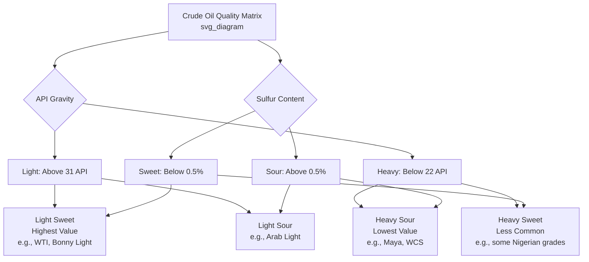
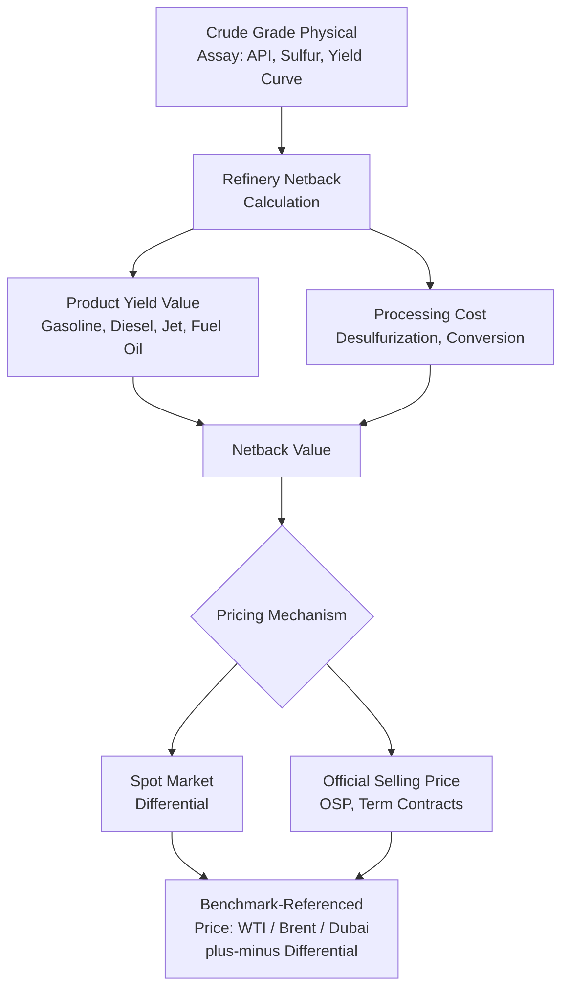

## Crude Oil Classification and Quality Differentials

### Overview

Crude oil is not a homogeneous commodity: physical and chemical characteristics vary substantially across producing regions, and these characteristics directly determine refining cost, product yield, and market price. Crude oil classification systems and quality differentials are the analytical and commercial mechanisms by which this heterogeneity is priced, benchmarked, and traded. Understanding quality differentials is foundational to oil market economics because virtually every price quoted in oil markets — benchmark prices, netbacks, refinery margins, transportation economics — is implicitly or explicitly a statement about *some specific grade* of crude, not "oil" as an undifferentiated good.

### Core Physical/Chemical Classification Dimensions

#### 1. API Gravity (Density)

API gravity, defined by the American Petroleum Institute, measures the density of crude oil relative to water on an inverse scale — higher API gravity means lighter (less dense) oil:

$$API° = \frac{141.5}{SG} - 131.5$$

where $SG$ is specific gravity relative to water at standard conditions. Classification bands:

| Category | API Gravity Range | Characteristics |
| --- | --- | --- |
| Light | Above 31.1° API | Higher yield of high-value light products (gasoline, naphtha, jet fuel) |
| Medium | 22.3° to 31.1° API | Balanced yield profile |
| Heavy | 10° to 22.3° API | Higher yield of residual fuel oil; requires more complex refining |
| Extra Heavy | Below 10° API | Bitumen-like; often requires upgrading or dilution before pipeline transport |

Lighter crude generally commands a **price premium** because it yields a higher proportion of light, high-value refined products (gasoline, diesel, jet fuel) through simple atmospheric distillation, requiring less capital-intensive downstream conversion (cracking, coking) to achieve an equivalent light-product yield from heavier feedstock.

#### 2. Sulfur Content

Crude is classified as "sweet" or "sour" based on sulfur content by weight:

- **Sweet crude**: typically below 0.5% sulfur by weight.
- **Sour crude**: typically above 0.5% sulfur by weight (some classification schemes use a 1.0% threshold as the sweet/sour boundary; conventions vary by market and reference source).

High-sulfur (sour) crude requires additional refinery desulfurization processing (hydrotreating) to meet product sulfur specifications (increasingly stringent under environmental regulations such as IMO 2020 marine fuel sulfur limits and on-road diesel/gasoline sulfur standards), raising refining cost and typically commanding a **price discount** relative to sweet crude of comparable API gravity.

#### 3. Combined Classification and the API-Sulfur Quality Matrix

The two dimensions combine multiplicatively in determining crude value — "light sweet" crude (e.g., WTI) is generally the most desirable and highest-priced category, while "heavy sour" crude (e.g., Mexican Maya, Canadian Western Select) trades at the largest discount, reflecting the compounding cost of both extensive conversion capacity (for heaviness) and desulfurization capacity (for sourness) required to process it into equivalent light, clean products.

### Other Quality Parameters

Beyond API gravity and sulfur, refiners assess additional characteristics that affect processing economics and are reflected, to varying degrees, in transaction-specific pricing:

- **Metals content** (nickel, vanadium): elevated in heavier crudes; poisons refinery catalysts (particularly in fluid catalytic cracking and hydrotreating units), raising processing cost.
- **Total Acid Number (TAN)**: measures organic acid content; high-TAN ("acidic") crudes are corrosive to refinery equipment, requiring specialized metallurgy and commanding additional discounts.
- **Pour point**: temperature below which the crude will not flow, relevant to transport/pipeline logistics, particularly for waxy crudes.
- **Distillation/yield curve**: the proportion of the crude that vaporizes at successive temperature cuts, directly determining the achievable yield of gasoline, diesel, jet fuel, and residual fractions from simple distillation — this is, in effect, the most complete single description of a crude's inherent value, with API gravity serving as a widely used proxy for it.

### Benchmark Crudes and Their Role

#### The Three Dominant Global Benchmarks

Physical crude trade is overwhelmingly priced as a **differential to a benchmark**, rather than through direct absolute price discovery for every individual grade, because there are hundreds of distinct traded crude streams globally but only a small number of sufficiently liquid, well-specified reference grades:

| Benchmark | Region | API Gravity | Sulfur | Delivery Point |
| --- | --- | --- | --- | --- |
| West Texas Intermediate (WTI) | United States | ~39.6° (light) | ~0.24% (sweet) | Cushing, Oklahoma |
| Brent | North Sea | ~38.3° (light) | ~0.37% (sweet) | North Sea / seaborne, ICE futures cash-settled against a basket |
| Dubai/Oman | Middle East | ~31° (medium) | ~2.0% (sour) | Persian Gulf, key Asian benchmark |

**WTI** is a landlocked, pipeline-delivered benchmark historically priced at Cushing, Oklahoma, a major storage and pipeline hub; its price can diverge from seaborne benchmarks during periods of pipeline capacity constraint or storage congestion, a dynamic widely observed during periods of rapid U.S. shale production growth outpacing takeaway infrastructure buildout.

**Brent** is the dominant global benchmark for internationally traded crude, underlying the pricing of a majority of globally traded barrels either directly or through differential formulas; it is a seaborne blend (historically of several North Sea fields, with the underlying basket having been adjusted over time as individual field production has declined) which gives it broader applicability to international seaborne trade than the landlocked WTI.

**Dubai/Oman** serves as the key reference for sour crude priced into Asian markets, particularly Middle Eastern exports to Asia, reflecting the sourer, heavier quality profile more representative of Gulf production than the light sweet Atlantic Basin benchmarks.

#### Why Multiple Benchmarks Persist

The persistence of regionally distinct benchmarks (rather than convergence to a single global price) reflects genuine transportation cost, quality, and logistical segmentation across the Atlantic Basin, Middle East/Asia, and other regional markets — arbitrage between benchmarks is bounded by tanker freight costs, pipeline capacity, and quality-adjustment costs, meaning benchmark spreads can persist and fluctuate meaningfully rather than collapsing to zero, and studying these spreads (WTI-Brent, Brent-Dubai) is itself a standard applied topic in oil market analysis.

### Quality Differential Pricing Mechanics

#### The Netback/Formula Pricing Approach

Most physical crude sold outside spot benchmark transactions is priced via a **formula** referencing a benchmark plus or minus a quality/location differential:

$$P_{grade} = P_{benchmark} \pm \text{Differential}$$

The differential itself is determined through a combination of:

1. **Refinery netback value**: the value refiners are willing to pay for the crude, calculated as the sum of the market value of the products it yields (weighted by yield percentage) minus refining/transportation/conversion costs — the theoretically "correct" economic basis for quality differentials.
2. **Market-clearing spot differentials**: for actively traded grades, direct spot market transactions establish observable differentials that are published by price reporting agencies.
3. **Official Selling Prices (OSPs)**: state oil companies (e.g., Saudi Aramco, ADNOC) set monthly official differentials for term contract sales to different destination markets, based on internal netback analysis, competitive positioning, and market intelligence — these OSP-setting decisions are closely watched market signals in their own right.

#### Diagram: Quality Differential Determination Pathway

### Worked Example: Simplified Netback Differential Calculation

**Setup:** Compare the approximate netback value of a hypothetical heavy sour grade against a light sweet benchmark, using simplified illustrative product yields and prices.

**Light sweet benchmark crude** — illustrative yield: 45% gasoline, 35% diesel, 20% fuel oil

**Heavy sour grade** — illustrative yield: 25% gasoline, 30% diesel, 45% fuel oil

**Illustrative product prices**: Gasoline $95/bbl-equivalent, Diesel $90/bbl-equivalent, Fuel oil $65/bbl-equivalent

**Step 1 — Light sweet netback (gross product value, pre-refining-cost):**

$$0.45(95) + 0.35(90) + 0.20(65) = 42.75 + 31.50 + 13.00 = \$87.25/\text{bbl}$$

**Step 2 — Heavy sour netback (gross product value, pre-refining-cost):**

$$0.25(95) + 0.30(90) + 0.45(65) = 23.75 + 27.00 + 29.25 = \$80.00/\text{bbl}$$

**Step 3 — Gross quality differential (before accounting for the heavy grade's additional processing cost, e.g., higher desulfurization/conversion capex and opex):**

$$87.25 - 80.00 = \$7.25/\text{bbl}$$

**Interpretation:** Even before adding the heavy sour grade's higher processing cost (which would widen the observed market discount further), the shift toward lower-value fuel oil yield alone accounts for a meaningful quality discount under these illustrative parameters. **[Behavior may vary]** — actual netback differentials depend on the specific refinery configuration (a complex refinery with substantial conversion capacity captures more value from heavy crude than a simple topping refinery), prevailing product crack spreads (which vary significantly with season and refined-product demand balance), and region-specific desulfurization/conversion cost structures; this example is illustrative only and does not represent actual current market differentials.

### Structural Drivers of Differential Volatility

- **Refinery configuration mix**: global growth in conversion-capacity-heavy ("complex") refineries has historically tended to narrow light-heavy differentials by increasing demand for and processing capability of heavier grades, while a simple-refinery-dominated market tends to widen the discount on heavy/sour grades.
- **Sanctions and geopolitical supply disruption**: removal or addition of specific grades from the traded market (e.g., sanctions-affected sour crude exports) can sharply move differentials for chemically similar substitute grades independent of the broader benchmark price level.
- **Seasonal product demand patterns**: differentials shift with seasonal shifts in gasoline versus diesel/heating-oil demand, since crude grades yield these products in different proportions.
- **Regulatory shifts affecting sulfur specifications**: the IMO 2020 marine bunker fuel sulfur regulation is a widely cited example of a regulatory change that materially shifted sweet-sour differentials by altering relative demand for low-sulfur versus high-sulfur fuel oil blending components.
- **Transportation/logistics bottlenecks**: pipeline, storage, and tanker capacity constraints (as with WTI-Cushing dynamics noted above) can drive location-specific differential volatility independent of underlying quality characteristics.

### Applications

- **Refinery feedstock selection and optimization**: refiners use netback analysis across available crude grades to select the economically optimal feedstock slate given their specific conversion capability and target product mix.
- **Crude trading and arbitrage**: understanding quality and locational differentials is the basis of physical crude trading desks' arbitrage strategies between regions and grades.
- **Upstream project economics**: quality differentials directly affect the realized wellhead price and therefore the economic viability of specific field development projects, particularly for heavy/sour or otherwise discounted grades.
- **Benchmark and futures market design**: the specification of deliverable grades and quality adjustment mechanisms in futures contracts (e.g., WTI's delivery specification) is itself an important market microstructure topic connected directly to this material.
- **Sanctions and price cap enforcement analysis**: assessing compliance with mechanisms such as price caps on specific national crude exports requires understanding the appropriate quality-adjusted benchmark differential for the grade in question.

**Related Topics**

- Benchmark crude oil pricing (WTI, Brent, Dubai/Oman) and futures market structure
- Refinery configuration and conversion economics
- Crude oil transportation economics and pipeline/tanker logistics
- OPEC+ production decisions and official selling price mechanisms
- Refining margins and crack spread analysis
- IMO 2020 and marine fuel sulfur regulation impacts
- Sanctions, price caps, and crude oil trade flow disruption
- Oil price benchmarks and financial derivatives (futures, swaps)
- Upstream project economics and wellhead netback analysis