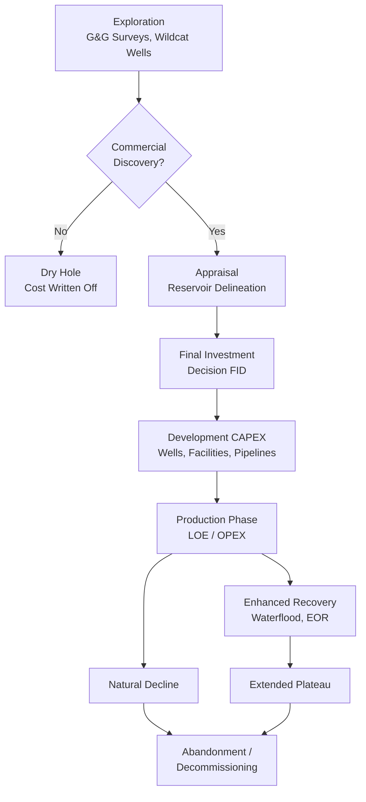

## Upstream Economics: Exploration, Development, Production Costs

### Overview

Upstream economics is the study of the costs, cash flows, and investment decision framework governing the exploration for and production of crude oil and natural gas, spanning the full lifecycle from initial seismic surveys through field abandonment. It differs fundamentally from downstream and midstream economics in that upstream projects involve **large, front-loaded, largely sunk capital investment under significant geological and price uncertainty**, followed by a multi-year to multi-decade production tail with declining output — a cost and cash-flow structure that shapes nearly every distinctive feature of oil market supply behavior, including the sector's characteristic capital cycle volatility, the economic logic of the resource classification systems used throughout the industry, and the price-responsiveness (or lack thereof) of short-run supply.

### The Upstream Project Lifecycle and Cost Categories

Upstream costs are conventionally organized into sequential lifecycle phases, each with a distinct cost structure and risk profile:

#### 1. Exploration Costs

- **Geological and geophysical (G&G) costs**: seismic surveying (2D, 3D, and increasingly 4D/time-lapse seismic), geological mapping, and basin analysis to identify prospective structures.
- **Exploration drilling (wildcat wells)**: the highest-risk capital expenditure category, since a large share of exploration wells are unsuccessful ("dry holes") even in geologically promising basins; typical exploration success rates vary enormously by basin maturity and play type.
- **Leasehold/license acquisition costs**: bonus payments and signature costs to acquire exploration rights from mineral owners or governments.

Exploration costs are economically distinctive because they are incurred with **binary, largely unpredictable outcomes** (commercial discovery vs. dry hole) prior to any revenue-generating certainty, which is why exploration risk is typically modeled using discovery probability distributions and portfolio (multi-prospect) risk diversification logic rather than single-project deterministic NPV alone.

#### 2. Appraisal Costs

Following a discovery, appraisal wells and further seismic work reduce uncertainty about reservoir size, quality, and productivity before committing to full-field development capital — a distinct phase economically because it represents a real option to gather information before the much larger irreversible development investment is committed.

#### 3. Development Costs (Capital Expenditure, CAPEX)

The largest capital outlay in most projects, covering:

- **Drilling and completion of development wells**: substantially lower per-well risk than exploration wells since reservoir presence is confirmed, but still the dominant CAPEX line item.
- **Surface facilities**: production platforms (offshore), gathering systems, processing facilities, and storage.
- **Subsea infrastructure** (offshore): subsea trees, flowlines, and umbilicals for deepwater/ultra-deepwater developments, representing some of the highest per-barrel capital intensity in the industry.
- **Pipeline/export infrastructure**: connecting the field to transportation and market access.

#### 4. Production Costs (Operating Expenditure, OPEX)

Ongoing costs incurred once production begins, generally classified as:

- **Lease Operating Expenses (LOE)**: direct field-level costs — labor, chemicals, maintenance, workover operations — scaling with the number of active wells and facilities rather than directly with production volume, which is why per-barrel OPEX rises mechanically as a field's production naturally declines (fixed costs spread over a shrinking volume base).
- **Enhanced/secondary and tertiary recovery costs**: costs of waterflooding, gas injection, or chemical/thermal enhanced oil recovery (EOR) methods deployed to sustain production and improve ultimate recovery as natural reservoir pressure declines.
- **Transportation and processing tariffs**: costs to move produced hydrocarbons to a sales point, distinct from LOE.

#### 5. Abandonment / Decommissioning Costs

End-of-life plugging and abandonment (P&A) of wells and removal of surface/subsea infrastructure, increasingly significant in mature basins (notably the North Sea and Gulf of Mexico) where decommissioning liability is a material component of total project lifecycle cost and an area of growing regulatory and financial scrutiny.

### Diagram: Upstream Project Lifecycle and Cost Structure

### The Resource Classification Framework

Upstream economic analysis relies on a standardized resource classification system — most widely the **Petroleum Resources Management System (PRMS)**, jointly developed by the Society of Petroleum Engineers (SPE) and other industry bodies — which categorizes hydrocarbon volumes by the combined dimensions of **commercial maturity** and **geological/technical uncertainty**:

| Category | Definition | Economic Implication |
| --- | --- | --- |
| Reserves (Proved, 1P) | Commercially recoverable with reasonable certainty (typically ≥90% confidence, P90) under existing economic conditions | Bankable; basis for reserve-based lending and financial reporting |
| Reserves (Proved + Probable, 2P) | P50 confidence level | Common basis for project sanctioning/FID economic evaluation |
| Reserves (Proved + Probable + Possible, 3P) | P10 confidence level (low probability, high upside) | Used for upside-case sensitivity analysis |
| Contingent Resources | Discovered but not yet commercially viable (technology, price, or infrastructure contingency) | Potential future reserves pending development decision |
| Prospective Resources | Undiscovered, estimated recoverable volumes from prospects/leads | Exploration target sizing, pre-discovery |

This **P90/P50/P10 probabilistic framework** reflects the fundamentally probabilistic nature of subsurface reservoir characterization — actual recoverable volume is never known with certainty until a field is fully produced, and reserve estimates are revised over the field's life as new well and production data reduce geological uncertainty ("reserve growth" and, less favorably, downward "reserve write-downs" are both routine features of upstream financial reporting).

### Cost Metrics: Breakeven Price and Full-Cycle Economics

#### Breakeven Price

The single most widely used upstream economic metric is the **breakeven price** — the oil (or gas) price at which a project's cash flows, discounted at the firm's cost of capital, yield zero NPV:

$$NPV = \sum_{t=0}^{T} \frac{(P \times Q_t) - OPEX_t - CAPEX_t - Tax_t}{(1+r)^t} = 0$$

Solving for $P$ gives the breakeven price. This is distinct from, and should not be conflated with, the **operating (cash) breakeven** — the lower price threshold at which a project's OPEX alone (ignoring already-sunk CAPEX) is covered, which is the economically relevant threshold governing whether an *already-developed* field continues producing during a price downturn, since sunk development capital is irrelevant to the marginal shut-in decision under standard investment theory.

$$P_{operating\;breakeven} = \frac{OPEX_t}{Q_t}$$

**This sunk-cost distinction is central to understanding oil supply behavior during price crashes**: producers with high full-cycle (development-inclusive) breakevens but low operating breakevens will continue producing from already-sanctioned fields even at prices well below their full-cycle breakeven, because the CAPEX is sunk and the marginal decision is simply whether operating cash flow remains positive — this explains why observed production is typically far less price-responsive in the short run than aggregate "breakeven price" figures might suggest.

#### Full-Cycle vs. Half-Cycle Economics

- **Full-cycle economics**: includes all exploration, development, and operating costs — the relevant metric for the initial investment decision (should this project be sanctioned at all).
- **Half-cycle (or "point-forward") economics**: includes only costs not yet sunk at the decision point — the relevant metric for ongoing operating decisions once a project is already developed, explaining continued production/drilling activity even when full-cycle breakevens exceed current prices.

### The Real Options Framework

Because upstream investment decisions are irreversible, made under significant price and geological uncertainty, and can often be sequenced or delayed (explore now vs. later; develop now vs. wait for better price/information), upstream project valuation is increasingly analyzed through a **real options** lens rather than static discounted cash flow (DCF)/NPV alone:

- **Option to delay**: the value of waiting for more price or geological information before committing to development CAPEX, which standard NPV analysis (evaluated at a single point in time) does not capture but which can materially affect optimal investment timing, particularly under high price volatility.
- **Option to expand/appraise**: the value embedded in appraisal drilling as an information-gathering exercise ahead of full-field development commitment.
- **Option to abandon**: the value of the ability to cease production (rather than being contractually obligated to continue) when prices fall below the operating breakeven.

**[Inference]** Real options valuation is generally regarded in the corporate finance and energy economics literature as a theoretically superior framework to static NPV for upstream investment timing decisions specifically because of the combination of irreversibility, uncertainty, and decision flexibility characterizing the sector, though standard risk-adjusted NPV/DCF remains the dominant practical tool in most day-to-day industry project evaluation due to its relative simplicity and the greater data/modeling complexity real options analysis requires.

### Cost Trends by Resource Type

| Resource Type | Relative CAPEX Intensity | Relative Cycle Time (Discovery to First Production) | Key Cost Driver |
| --- | --- | --- | --- |
| Conventional onshore | Low-moderate | Months to a few years | Reservoir depth, well count |
| Conventional offshore (shelf) | Moderate | 2–5 years | Platform/facility cost |
| Deepwater/ultra-deepwater | Very high | 5–10+ years | Subsea infrastructure, specialized rig day-rates |
| Tight oil/shale (unconventional) | Low per-well, but requires continuous drilling | Weeks to months per well | Drilling/completion (fracturing) cost per well, steep decline curves requiring continuous reinvestment |
| Oil sands (bitumen) | Very high (mining) or high (in-situ/SAGD) | Multi-year | Upgrading/dilution cost, steam generation (in-situ) |

**Unconventional (shale/tight oil) economics** are structurally distinctive within this framework: individual wells have relatively low CAPEX and rapid time-to-production compared to conventional/offshore projects, but exhibit steep initial production decline rates, meaning aggregate field-level or basin-level output requires continuous drilling reinvestment to sustain — a structural feature widely cited as contributing to shale's comparatively faster supply responsiveness to price signals relative to long-cycle conventional and deepwater projects, which involve years-long lead times between the investment decision and first production.

### Worked Example: Full-Cycle vs. Operating Breakeven Comparison

**Setup:** A hypothetical offshore development has the following illustrative economics:

- Development CAPEX: $800 million (sunk once spent)
- Expected recoverable reserves: 100 million barrels
- OPEX: $12/barrel
- Royalty and production tax: 15% of gross revenue
- Discount rate: 10%; assume, for simplicity, production occurs evenly over a 10-year plateau (10 million bbl/year) with no ramp-up/decline profile, purely for illustrative calculation purposes

**Step 1 — Approximate full-cycle breakeven** (simplified annuity approach, ignoring timing of CAPEX and production ramp for illustration):

Required annual net cash flow to recover $800M CAPEX over 10 years at 10% discount rate (capital recovery factor):

$$CRF = \frac{r(1+r)^n}{(1+r)^n - 1} = \frac{0.10(1.10)^{10}}{(1.10)^{10}-1} \approx 0.1627$$

$$\text{Required annual CAPEX recovery} = 800M \times 0.1627 \approx \$130.2M/\text{year}$$

Required net cash flow per barrel: $130.2M / 10M\;bbl = \$13.02/bbl$ (CAPEX recovery only)

Adding OPEX ($12/bbl) and accounting for the 15% royalty/tax taken off gross revenue:

$$P \times (1 - 0.15) - 12 = 13.02 \quad \Rightarrow \quad P = \frac{13.02 + 12}{0.85} \approx \$29.4/\text{bbl}$$

**Step 2 — Operating (cash) breakeven** (CAPEX excluded, sunk):

$$P \times (1-0.15) - 12 = 0 \quad \Rightarrow \quad P = \frac{12}{0.85} \approx \$14.1/\text{bbl}$$

**Interpretation:** Under these illustrative assumptions, the project requires roughly $29/bbl to justify the *initial* investment decision (full-cycle breakeven), but once the $800M CAPEX is sunk, the field will remain economically rational to continue operating down to roughly $14/bbl (operating breakeven) — a more than two-fold gap that explains why already-producing fields continue operating through price downturns that would have prevented their initial sanctioning. **[Behavior may vary]** — this is a deliberately simplified illustrative calculation; real project economics involve production decline curves, CAPEX phasing, more complex fiscal terms, and price/cost uncertainty distributions rather than single deterministic figures.

### Fiscal Regimes and Government Take

Upstream project economics are materially shaped by the host government fiscal regime, which determines how project cash flow is divided between investor and government:

- **Concessionary/royalty-tax systems**: investor holds title to production, subject to royalty and income tax (as in the worked example above).
- **Production sharing contracts (PSCs)**: government retains resource ownership; investor recovers costs from a "cost oil" allocation before "profit oil" is split between investor and government per a negotiated formula, often with sliding-scale splits tied to profitability or production rate.
- **Service contracts**: investor is paid a fee for services rendered rather than holding an equity claim to produced hydrocarbons.

**[Inference]** The choice and structure of fiscal regime is a major determinant of investment attractiveness across competing jurisdictions and is a central topic in international petroleum economics and resource nationalism analysis, distinct from but directly interacting with the underlying technical cost economics covered in this topic.

### Applications

- **Final Investment Decision (FID) analysis**: full-cycle NPV, breakeven price, and increasingly real-options analysis are the standard toolkit for corporate upstream investment sanctioning.
- **Supply curve construction for oil market modeling**: aggregating project-level breakeven economics across global fields/basins produces the marginal cost supply curves used in long-term oil price and market balance forecasting.
- **Reserve-based lending and financial reporting**: proved reserve estimates under the PRMS/SEC framework directly determine the collateral basis for upstream project and corporate debt financing.
- **National oil company and resource policy analysis**: fiscal regime design and government take calculations rely directly on the cost structure and breakeven concepts developed in this topic.
- **Decommissioning liability and financial assurance policy**: growing regulatory focus on ensuring operators (and successor owners in mature-basin asset sales) retain sufficient capital to meet abandonment obligations.

**Related Topics**

- Crude oil classification and quality differentials
- OPEC+ supply management and spare capacity economics
- Shale/tight oil production economics and decline curve analysis
- Oil price volatility and the upstream capital investment cycle
- Petroleum fiscal regimes and production sharing contracts
- Real options valuation in natural resource investment
- Reserve estimation, PRMS classification, and reserve-based lending
- Offshore and deepwater project economics
- Enhanced oil recovery (EOR) technology and economics
- Oil and gas decommissioning liability and financial assurance