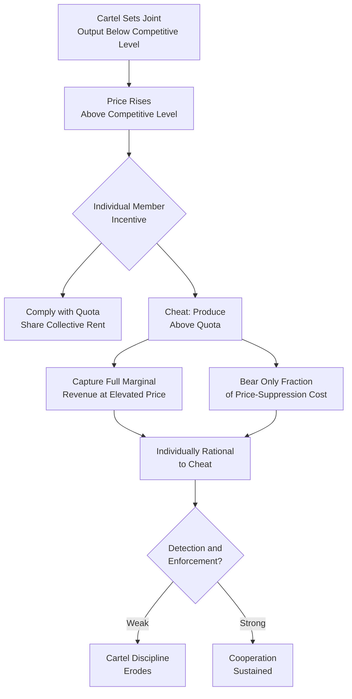
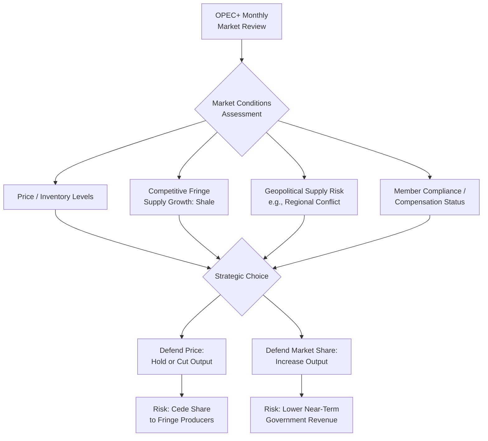

## OPEC and OPEC+ as a Cartel: Theory and Behavior

### Overview

OPEC (the Organization of the Petroleum Exporting Countries) and its extended coalition, OPEC+ (OPEC plus a group of allied non-OPEC producers including Russia), represent one of the longest-studied and most consequential examples of a producer coalition attempting to exercise market power in a globally traded commodity market. Analyzing OPEC through the lens of cartel theory — while simultaneously recognizing where it departs from the textbook cartel model — is central to understanding oil price formation, supply behavior, and the structural tensions between member incentives that recur throughout the group's history.

### Cartel Theory: The Textbook Benchmark

#### The Basic Cartel Problem

A cartel is a coalition of producers that coordinates output (or price) to jointly maximize group profit rather than allowing each member to behave as an independent price-taker. Under standard oligopoly theory, if the cartel collectively controls a sufficient share of a market with an inelastic short-run demand curve, restricting joint output below the competitive (or Cournot-Nash) level raises price and can raise aggregate group profit, following the standard monopoly logic applied to a coalition rather than a single firm:

$$MR = P\left(1 + \frac{1}{\eta_D}\right) = MC$$

where $\eta_D$ is the price elasticity of demand. Because oil demand is well-documented as short-run price-inelastic (as covered in the demand-elasticity treatment of this course), the potential price impact of coordinated output restriction is theoretically large — this inelasticity is precisely why oil has historically been considered a commodity particularly amenable to cartelization compared to more elastic-demand goods.

#### The Fundamental Instability Problem

Standard cartel theory identifies an inherent incentive-compatibility problem: at the cartel-optimal (restricted) output level and resulting elevated price, **each individual member has a unilateral incentive to cheat** — to produce above its assigned quota — because the individual member captures the full marginal revenue of the additional barrel at the cartel-supported price while bearing only a small fraction of the resulting price-suppression cost (which is spread across all members). This is formally a repeated-game/prisoner's-dilemma-type structure: cooperation (quota compliance) is collectively optimal but individually vulnerable to defection, and sustaining cooperation requires either a credible punishment mechanism for detected cheating or sufficiently patient members valuing future cartel rents over immediate defection gains (a folk-theorem-type condition from repeated-game theory).

### Diagram: The Cartel Coordination Problem

### Why OPEC Departs from the Textbook Cartel Model

#### 1. Heterogeneous Member Costs, Reserves, and Fiscal Needs

Unlike the simplified textbook cartel of identical firms, OPEC members differ enormously in production cost structure, remaining reserve base, population size, and fiscal breakeven oil price (the price required to balance the government budget, distinct from the upstream operating/full-cycle breakeven covered in the upstream economics treatment). Saudi Arabia's combination of very low per-barrel production cost and very large remaining reserves gives it a materially different optimal strategy — and different tolerance for temporary low prices — than smaller, higher-cost, reserve-constrained members, a heterogeneity that is a persistent source of intra-cartel negotiation friction and a major departure from the single-representative-firm cartel model.

#### 2. Swing Producer Role and Spare Capacity

Saudi Arabia, and to a lesser degree a small number of other Gulf members, have historically maintained meaningful **spare production capacity** — capacity held offline and available for rapid deployment — functioning as a "swing producer" that can unilaterally adjust output to influence price or offset supply disruptions elsewhere in the market. This capability is economically significant beyond simple quota-setting: it gives the swing producer disproportionate influence within the coalition's internal bargaining and provides the group with a credible mechanism for signaling commitment to a target price range or for managing supply shocks (as illustrated by OPEC+'s repeated 2026 statements citing "regional energy infrastructure" attacks and Middle East supply uncertainty as considerations in production decisions).

#### 3. Government (Not Private Firm) Ownership

OPEC members are sovereign states acting through national oil companies, meaning production decisions are shaped by government fiscal needs, geopolitical objectives, and domestic political economy considerations (employment, social spending commitments) alongside — and sometimes in tension with — pure profit-maximizing cartel logic, a structural feature entirely absent from the standard private-firm cartel model.

#### 4. Absence of Formal Legal Enforcement Mechanisms

Unlike a cartel that could theoretically use binding contracts (illegal under competition law in most jurisdictions but theoretically available to a supra-national coalition), OPEC/OPEC+ compliance is enforced entirely through reputational, diplomatic, and repeated-game mechanisms — there is no external legal authority members can appeal to for enforcement, making the group's cohesion entirely dependent on the self-enforcing repeated-game logic described above.

#### 5. The Extension to OPEC+ and Non-OPEC Coordination

The formation of **OPEC+** in 2016 (adding Russia and other non-OPEC producers to formal coordination with OPEC) reflects a structural adaptation to the group's declining share of global supply as non-OPEC production (notably U.S. shale) grew — extending coordination beyond the original OPEC membership was, in effect, a response to the eroding market power of the narrower cartel, since a coalition's ability to move price is a direct function of its share of global supply relative to the elasticity of competitive-fringe (non-cartel) supply.

### The Competitive Fringe and the Limits of Cartel Power

#### Non-OPEC Supply Response

A defining constraint on OPEC/OPEC+ pricing power is the behavior of the **competitive fringe** — non-member producers (historically North Sea, more recently and consequentially U.S. shale) who behave as price-takers and expand output when the cartel-elevated price exceeds their (typically higher) marginal cost. U.S. shale's comparatively short investment-to-production cycle time (as detailed in the upstream economics treatment) makes it a particularly fast-responding competitive fringe relative to long-cycle conventional/offshore production, which has been widely discussed as constraining the *sustainable* price OPEC+ can support without inducing substantial fringe supply growth that erodes the cartel's market share over time.

#### Market Share vs. Price Trade-off

OPEC/OPEC+ faces a structural trade-off between defending price (restricting output, ceding market share to the competitive fringe) and defending market share (raising output, accepting lower price to discourage fringe investment) — this trade-off has been explicitly and repeatedly visible in the group's actual strategic pivots, including the widely studied 2014–2016 episode of deliberately not cutting output in the face of falling prices (interpreted by many analysts as a market-share-defense strategy against growing shale supply) versus the more recent multi-year pattern (2023 onward) of voluntary output cuts explicitly aimed at price support.

### Recent Behavior: 2023–2026 Cut-and-Unwind Cycle

Current search results confirm this dynamic remains highly active. OPEC+ implemented substantial voluntary production cuts beginning in April 2023 — with cuts peaking at 5.85 million barrels per day, of which 2.2 million were voluntary reductions — and has since 2025 been gradually unwinding those cuts in successive monthly increments. Recent decisions illustrate the group's characteristic month-by-month, consensus-based recalibration process: seven core members of OPEC+ agreed to a crude oil production adjustment of 188,000 barrels per day for August 2026, matching similar increases in preceding months, with the group citing the gradual reopening of the Strait of Hormuz for oil exports amid falling prices as a relevant market consideration. The September 2026 increase was expected to complete the reversal of the roughly 3.5 million bpd of 2023 cuts, with delegates indicating quotas would likely hold steady through the remainder of 2026, though many members remain unable to raise output to their allotted quotas due to technical and operational constraints — itself a reminder that stated quotas and actual production capacity diverge for several members, complicating simple compliance-monitoring analysis. [Oil Production Growth for Q1 2026 Blocked by OPEC+ +4](https://energyindustryreview.com/oil-gas/oil-production-growth-for-q1-2026-blocked-by-opec/)

Notably, coverage of these decisions also illustrates a recurring analytical hazard specific to this topic: multiple outlets have mischaracterized the incremental "phase out" of voluntary cuts as a production "cut" rather than an increase, since each monthly step raises the output ceiling relative to the prior cut-constrained level even though the group frames it cautiously and reserves the right to pause or reverse the unwind. This terminological confusion is a practical illustration of why precise reading of OPEC+ communiqués — distinguishing a *reduced cut* (still net-restrictive relative to pre-2023 baseline capacity) from an absolute increase relative to the *prior month* — is essential to correctly interpreting the group's actual market stance at any given time. [Vision2030](https://vision2030.ai/analysis/opec-august-2026-output-increase/)

A further structural development: the UAE announced its exit from OPEC and OPEC+ in April 2026, which contributed to a downward revision of the initially planned 206,000 bpd increase for June — illustrating that membership composition itself remains a live variable affecting the group's coordination capacity and total controlled supply share, consistent with the heterogeneous-member-incentive dynamics discussed above. [MacroMicro](https://en.macromicro.me/time_line?id=21)[Egyptoil-Gas](https://egyptoil-gas.com/news/opec-approves-188000-bbl-d-output-increase-for-august-2026/)

### Compensation Mechanisms and Internal Discipline

A distinctive feature of the current OPEC+ framework is its explicit **compensation cut mechanism**: members that have historically over-produced relative to their assigned quota are required to implement additional offsetting cuts in subsequent periods to "compensate" for prior over-production, with the group noting that certain output increases provide an opportunity for participating countries to accelerate their compensation. This represents a relatively sophisticated, semi-formalized internal enforcement mechanism — an attempt to address the fundamental cheating-incentive problem of cartel theory through negotiated, monitored offsetting adjustments rather than relying purely on reputational sanction, though its practical effectiveness in fully offsetting historical over-production has been a subject of ongoing market skepticism and analyst scrutiny. [Egyptoil-Gas](https://egyptoil-gas.com/news/opec-approves-188000-bbl-d-output-increase-for-august-2026/)

### Diagram: OPEC+ Strategic Decision Framework

### Empirical Assessment of OPEC's Market Power

**[Inference]** The academic and applied literature on OPEC's actual price-setting power remains genuinely divided rather than settled: some studies find evidence consistent with meaningful cartel-like price effects (particularly around major coordinated cut episodes), while others argue OPEC behaves more consistently with a "dominant firm with a competitive fringe" model (where Saudi Arabia specifically, rather than the full membership acting as a unified cartel, exercises the主要 price-influencing role) or even find periods where measured behavior is difficult to distinguish from a loose, imperfectly-coordinated oligopoly rather than a fully effective cartel. This ambiguity is itself an important analytical takeaway: OPEC's influence over price is real and economically significant but neither absolute nor perfectly explained by the simplest textbook cartel model, and its effectiveness appears to vary meaningfully across different historical episodes and market conditions.

### Applications

- **Oil price forecasting and scenario analysis**: OPEC+ quota decisions are a standard, closely monitored input to short- and medium-term oil price forecasting models.
- **Geopolitical risk assessment**: OPEC+ statements regarding regional conflict and infrastructure security (as reflected in 2026 communiqués) are directly incorporated into oil market risk premium analysis.
- **Upstream investment decision-making**: non-OPEC producers' investment timing decisions are influenced by expectations of OPEC+'s price-defense versus market-share strategic stance, connecting directly to the real-options investment-timing framework covered in the upstream economics treatment.
- **Antitrust and international relations policy analysis**: OPEC's status as a government-coordinated (rather than private-firm) cartel raises distinct legal and diplomatic questions (e.g., periodic U.S. legislative proposals such as "NOPEC" bills) not applicable to conventional domestic antitrust enforcement.
- **Sanctions and price cap policy design**: understanding cartel cohesion and compensation/compliance dynamics is directly relevant to assessing the effectiveness of measures such as price caps on specific members' exports (e.g., Russia, referenced in current search results regarding sanctions on Russian oil companies).

**Related Topics**

- Crude oil classification and quality differentials
- Upstream economics: exploration, development, production costs
- Oil price volatility and the upstream capital investment cycle
- Shale/tight oil production economics and the competitive fringe
- Game theory and repeated-game models of collusion
- Swing producer behavior and spare capacity economics
- Sanctions, price caps, and crude oil trade flow disruption
- Dominant firm/competitive fringe models of market power
- National oil companies and resource nationalism
- Oil market inventory dynamics and price signal interpretation