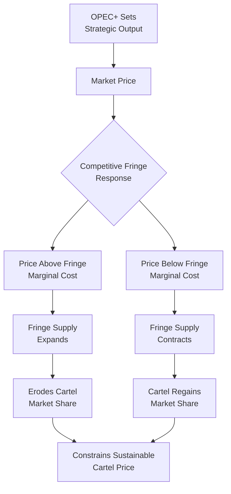
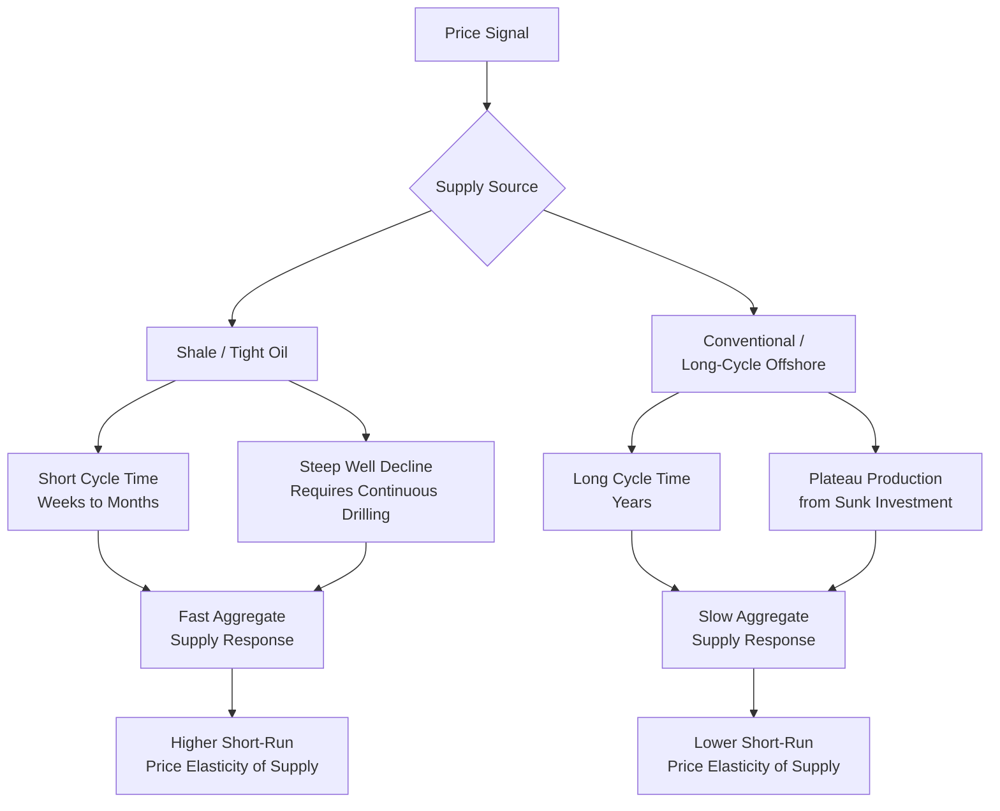

## Non-OPEC Supply Response and Shale Oil Economics

### Overview

Non-OPEC supply response refers to how producers outside the OPEC+ coalition adjust output in reaction to price signals, and it is the necessary counterpart to the OPEC/OPEC+ cartel analysis covered elsewhere in this course: a cartel's ability to sustain elevated prices is fundamentally constrained by how quickly and how much competitive, price-taking supply expands to erode that price. Since the mid-2000s, **U.S. shale (tight) oil** has become the single most important component of this non-OPEC competitive fringe, and its distinctive cost structure, decline dynamics, and financing model have materially reshaped global oil market supply elasticity and, by extension, the strategic environment facing OPEC+.

### The Competitive Fringe Concept

#### Dominant Firm / Competitive Fringe Market Structure

Oil market structure is often modeled as a **dominant firm (or dominant coalition) with a competitive fringe**: OPEC+ sets output/price strategically (as covered in the cartel theory treatment), while non-OPEC producers behave approximately as price-takers, expanding output whenever the prevailing price exceeds their marginal cost of production and contracting when it falls below. The fringe's aggregate supply curve — its cost distribution across the global resource base — directly determines how much price OPEC+ can sustain before inducing fringe expansion large enough to erode the cartel's targeted price or market share.

$$Q_{fringe} = S(P), \qquad S'(P) > 0$$

The **elasticity and speed** of this fringe response, not just its eventual magnitude, is the critical variable: a fringe that responds slowly (long-cycle conventional/offshore projects, as detailed in the upstream economics treatment) constrains the cartel far less in the short-to-medium term than a fringe capable of rapid, large-scale output adjustment — which is precisely the structural role shale has come to occupy.

### Diagram: Dominant Firm–Competitive Fringe Market Structure

### Shale/Tight Oil: Distinctive Resource and Cost Characteristics

#### Geological Basis

Shale (or "tight") oil is produced from low-permeability source rock formations that do not allow hydrocarbons to flow readily under natural reservoir pressure, requiring **horizontal drilling combined with multi-stage hydraulic fracturing** to create artificial permeability (fracture networks) sufficient for commercial flow rates. This is technologically and economically distinct from conventional reservoirs (covered in the upstream economics treatment), where hydrocarbons are naturally mobile within a porous, permeable rock formation.

#### The Decline Curve: Shale's Defining Economic Feature

The single most consequential economic characteristic of shale wells is their **steep initial production decline rate**, typically far steeper than conventional wells:

$$q(t) = q_i (1 + bDt)^{-1/b}$$

(a hyperbolic decline curve, where $q_i$ is initial production rate, $D$ is the initial decline rate, and $b$ is the hyperbolic exponent — the standard functional form used in shale reservoir engineering to fit observed production decline, distinct from the simpler exponential decline more characteristic of many conventional reservoirs)

Shale wells commonly lose a large share of their eventual ultimate recovery within the first one to two years of production, in sharp contrast to conventional fields that can sustain a multi-year plateau before gradual decline. **[Unverified — exact decline percentages vary substantially by basin, formation, and well completion design]** this steep front-loaded decline is nonetheless a well-established and widely documented structural feature of shale production across all major U.S. shale plays.

### Why Steep Decline Curves Reshape Supply Elasticity

The decline-curve characteristic has a first-order implication for aggregate supply behavior that distinguishes shale fundamentally from conventional oil supply dynamics:

- **Continuous reinvestment requirement**: because individual wells decline so rapidly, sustaining or growing *aggregate* basin-level output requires continuous drilling of new wells to replace declining production from existing wells — aggregate shale output is therefore a function of the **current drilling rate**, not primarily a function of historically sunk capital, unlike a conventional field whose plateau output largely reflects investment decisions made years earlier.
- **Short cycle time**: the time from a drilling decision to first production for a shale well is typically weeks to a few months (versus years for offshore/deepwater conventional development, as detailed in the upstream economics treatment), meaning shale drilling activity — and therefore aggregate shale supply — can respond to price signals far more quickly than long-cycle conventional supply.
- **Implication for aggregate price elasticity of supply**: this combination (rapid decline requiring continuous reinvestment, plus short cycle time) is the principal mechanism by which shale has been widely credited with increasing the overall **short-run price elasticity of global oil supply**, compared to a hypothetical world where marginal supply came predominantly from long-cycle conventional/offshore projects — a structural shift with direct implications for how much and how quickly OPEC+ output decisions transmit into sustained price changes.

### Shale Cost Structure and Breakeven Economics

#### Per-Well Economics

Applying the full-cycle/operating breakeven distinction from the upstream economics treatment to shale specifically:

- **Drilling and completion (D&C) cost**: the dominant capital cost per well, covering the horizontal drilling and multi-stage fracturing operation; this cost has historically exhibited meaningful sensitivity to oilfield service sector activity levels (drilling rig and fracturing crew day-rates rise during high-activity periods and fall during downturns), introducing a **pro-cyclical cost feedback loop** distinct from most conventional project cost structures.
- **Operating (lease operating) expenses**: generally lower on a per-well basis than complex offshore facilities but must be considered against the smaller per-well reserve base and faster decline.
- **Breakeven heterogeneity across and within basins**: shale breakeven economics vary substantially not only across major basins (e.g., the Permian Basin has been widely characterized in industry and analyst commentary as having a lower average breakeven than several other U.S. shale plays) but also across sub-areas ("tiers" or "core" versus "non-core" acreage) within a single basin, reflecting rock quality and well productivity heterogeneity — meaning any single "shale breakeven price" figure necessarily obscures a wide underlying cost distribution rather than a single homogeneous marginal cost.

#### The Efficiency and Productivity Learning Curve

A widely documented feature of the shale sector's cost evolution has been substantial **drilling and completion efficiency gains** over time — longer horizontal laterals, increased proppant/fluid intensity per well, and faster drilling times — which have historically tended to lower the effective breakeven cost per barrel of the fringe over time, distinct from and additional to any cyclical service-cost fluctuation. **[Inference]** The pace of such efficiency gains is not indefinite or guaranteed to continue at historical rates, and analysts have periodically debated whether "core acreage exhaustion" (the depletion of the highest-quality, lowest-cost drilling locations within mature basins) could offset continued efficiency-driven cost reductions going forward — this remains a genuinely contested, forward-looking question rather than a settled empirical fact.

### The Financing Model and Capital Discipline Shift

#### Early Shale Era: Growth-Oriented, Debt-Financed Drilling

In the shale sector's earlier growth phase, many independent producers pursued aggressive, often debt- and external-equity-financed drilling programs prioritizing production growth over free cash flow generation, a financing model that has been widely credited by market analysts with contributing to shale's historically rapid volume response to elevated prices, since capital availability (rather than only geological/technical constraints) was often the binding constraint on drilling activity expansion.

#### Post-2015/2020 Shift Toward Capital Discipline

Following the 2014–2016 price downturn and again after the 2020 pandemic-driven price collapse, the U.S. shale sector has been widely characterized in industry and financial analysis as having shifted toward greater **capital discipline** — prioritizing free cash flow generation, shareholder returns (dividends and buybacks), and debt reduction over pure production growth, a shift often attributed to investor pressure following a period of weak aggregate sector financial returns relative to growth-phase capital deployed. **[Inference]** This shift has been widely discussed by market analysts as having *dampened* shale's supply responsiveness to price signals relative to the earlier growth-oriented era, since producers facing capital discipline expectations from shareholders and lenders may choose not to fully ramp drilling activity even when price would have justified it under the earlier volume-maximizing financing model — though the durability and magnitude of this dampening effect across different price cycles remains a subject of ongoing market analysis rather than a fully settled quantitative finding.

### Diagram: Shale Supply Response Mechanism vs. Conventional Supply

### Other Non-OPEC Supply Sources

While shale dominates recent non-OPEC supply-response analysis, other non-OPEC sources contribute distinct supply dynamics:

- **Deepwater/offshore non-OPEC production** (e.g., U.S. Gulf of Mexico, Brazil, Guyana, parts of West Africa): follows the long-cycle conventional investment logic detailed in the upstream economics treatment, contributing to non-OPEC supply growth but with multi-year lags relative to the price signals that motivated the original investment decisions.
- **Canadian oil sands**: high upfront capital intensity but very long-lived, low-decline production once developed, giving it a supply-response profile closer to conventional long-cycle production than to shale, despite also being a relatively "unconventional" resource in geological terms.
- **Russian production**: subject to substantial non-price (sanctions, OPEC+ coordination membership) influences on output in the current market environment, complicating its classification as a pure "competitive fringe" price-taker in recent years specifically.
- **Legacy conventional non-OPEC basins** (e.g., mature North Sea, parts of Latin America): generally characterized by natural production decline as fields mature, acting as a slow structural drag on non-OPEC supply that new shale and deepwater production must offset to achieve net non-OPEC supply growth.

### Worked Example: Aggregate Basin Output Under Continuous Drilling

**Setup:** Illustrate why aggregate shale basin output requires continuous drilling, using simplified assumptions: each new well produces an average of 500 bbl/d in its first year, declining by 60% in year two, and 25% in year three onward (a simplified discrete approximation of a hyperbolic decline curve for illustrative purposes only).

**Scenario: constant drilling of 100 new wells per year, indefinitely**

| Year | New Wells (Year 1 output) | Prior Year-1 Wells (Year 2 output, −60%) | Prior Year-2+ Wells (Year 3+, −25%/yr) | Approximate Total bbl/d |
| --- | --- | --- | --- | --- |
| 1 | 100 × 500 = 50,000 | — | — | 50,000 |
| 2 | 100 × 500 = 50,000 | 100 × 200 = 20,000 | — | 70,000 |
| 3 | 100 × 500 = 50,000 | 100 × 200 = 20,000 | 100 × 150 = 15,000 | 85,000 |

**Interpretation:** Under these illustrative assumptions, aggregate output continues rising even at a *constant* drilling rate because each year's new wells add more first-year production than the incremental decline loss from the aging well population — but this equilibrium is entirely contingent on maintaining the assumed constant drilling pace. If drilling activity were to stop entirely, aggregate output would begin declining rapidly within one to two years, dominated by the compounding decline of the existing well stock — illustrating concretely why shale aggregate supply is best understood as a **flow variable tied to ongoing drilling activity**, not a stock of already-installed productive capacity in the way conventional plateau production behaves. **[Behavior may vary]** — actual decline rates, well productivity, and required reinvestment vary substantially by basin, formation, and well vintage, and this example uses simplified illustrative figures rather than actual field data.

### Structural Implications for Global Oil Market Dynamics

- **Shorter and shallower price cycles**: many market analysts and researchers have argued that the shale sector's combination of short cycle time and (in its growth-oriented financing era) price-responsive drilling activity has contributed to historically shorter, shallower oil price cycles compared to earlier eras dominated by long-cycle conventional investment, though this remains subject to ongoing empirical debate given the relatively limited number of full price cycles observed since shale became a material share of global supply.
- **OPEC+ strategic recalibration**: as discussed in the cartel theory treatment, OPEC+'s explicit and repeated citation of competitive supply dynamics in its strategic communications and decision-making reflects direct, ongoing adaptation to shale's altered competitive fringe characteristics.
- **Reduced (but not eliminated) OPEC+ pricing power at higher price levels**: the widely discussed logic is that shale's fast-responding supply establishes an effective — though evolving and not fixed — ceiling on how far OPEC+ can push price before inducing enough fringe supply growth to erode its market share, a dynamic that interacts directly with the market-share-versus-price strategic trade-off discussed in the cartel theory treatment.

### Applications

- **Oil price forecasting**: non-OPEC/shale supply-response modeling is a standard, essential complement to OPEC+ decision analysis in constructing global supply-demand balance forecasts.
- **Upstream investment and capital markets analysis**: shale producer capital discipline trends are closely monitored by equity and credit analysts as a key determinant of sector-level drilling activity and free cash flow generation.
- **OPEC+ strategic scenario analysis**: assessing the credibility and sustainability of alternative OPEC+ strategies (price defense vs. market share defense) requires explicit modeling of the shale supply-response function as the key competitive constraint.
- **Energy security and geopolitical risk assessment**: the scale and responsiveness of non-OPEC (particularly U.S. shale) supply is a central consideration in assessing global oil market resilience to supply disruptions originating in OPEC+ member states.
- **Regional economic impact analysis**: shale drilling activity cyclicality has material regional economic effects (employment, state/local fiscal revenue) in producing regions, a distinct but related applied economics topic.

**Related Topics**

- OPEC and OPEC+ as a cartel: theory and behavior
- Upstream economics: exploration, development, production costs
- Crude oil classification and quality differentials
- Oil price volatility and the upstream capital investment cycle
- Decline curve analysis and reservoir engineering economics
- Oilfield services sector cost cyclicality
- Dominant firm/competitive fringe models of market power
- Canadian oil sands and unconventional resource economics
- Capital markets financing of upstream oil and gas producers
- Global oil supply-demand balance and inventory dynamics