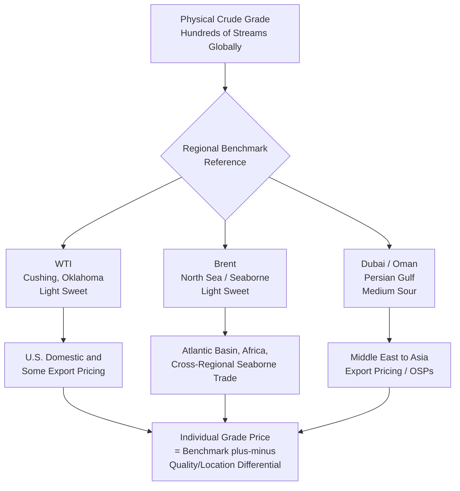
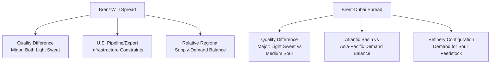

## Oil Price Formation and Benchmark Pricing (Brent, WTI, Dubai)

### Overview

Global crude oil pricing is not the outcome of a single centralized market, but rather a **layered system of benchmark price discovery and differential-based physical pricing**, in which a small number of highly liquid reference contracts (principally Brent, WTI, and Dubai/Oman) anchor the pricing of hundreds of individually traded crude streams worldwide. Understanding how these benchmarks are constructed, how they interact with each other, and how the broader financial derivatives ecosystem built around them shapes observed spot prices is foundational to interpreting virtually every other topic in oil market economics — quality differentials, upstream investment decisions, and OPEC+ strategic behavior are all ultimately transmitted through, and observed via, this benchmark pricing architecture.

### Why Benchmark Pricing Exists

#### The Fragmentation Problem

Physical crude oil is a highly heterogeneous good (as detailed in the quality differentials treatment), traded across geographically dispersed production regions with distinct transportation logistics, quality specifications, and buyer relationships. Establishing a unique, continuously observable market price for each of the hundreds of individually traded crude grades would require far more liquidity than exists for most individual streams. **Benchmark pricing solves this fragmentation problem** by concentrating trading liquidity into a small number of standardized, highly transparent reference instruments, with the vast majority of physical trade priced as a differential (premium or discount) to one of these benchmarks rather than through independent price discovery for every grade.

#### Requirements for an Effective Benchmark

An effective price benchmark requires:

1. **Sufficient production/deliverable supply** to prevent manipulation via supply squeezes.
2. **Deep, liquid trading activity** across both physical and financial (futures/derivatives) markets.
3. **Transparent, well-defined delivery/settlement mechanics.**
4. **Broad acceptance** by the trading community as a fair reference point.
5. **Price representativeness** relative to the broader market it is meant to proxy.

These requirements explain why only a small number of benchmarks have achieved durable global significance, and why benchmark specifications themselves are periodically revised (e.g., adjustments to the physical delivery basket underlying Brent) as underlying production from originally specified fields naturally declines.

### The Three Major Global Benchmarks

#### West Texas Intermediate (WTI)

- **Delivery point**: Cushing, Oklahoma — a major U.S. pipeline and storage hub, historically termed the "pipeline crossroads of the world."
- **Quality**: light, sweet crude (~39.6° API, ~0.24% sulfur).
- **Contract mechanics**: the NYMEX WTI futures contract is **physically deliverable**, meaning a trader holding a contract to expiration can be required to take or make physical delivery at Cushing — a structural feature with important consequences (detailed below) distinguishing it from cash-settled benchmarks.
- **Landlocked character**: because Cushing is an inland hub rather than a seaborne export point, WTI pricing is sensitive to U.S. pipeline takeaway capacity and Cushing storage utilization, which can cause WTI to diverge meaningfully from seaborne benchmark prices during periods of infrastructure constraint or storage congestion — most dramatically illustrated by the WTI futures contract's brief excursion into **negative prices in April 2020**, when pandemic-driven demand collapse combined with rapidly filling Cushing storage capacity made physical delivery acceptance so undesirable that some holders paid counterparties to take delivery off their hands rather than accept physical crude with no available storage.

#### Brent

- **Delivery/settlement basis**: originally based on a small number of North Sea fields (historically including Brent, Forties, Oseberg, and Ekofisk — the "BFOE" basket — with the underlying field composition periodically revised as individual field production has declined over time to maintain adequate deliverable supply).
- **Quality**: light, sweet crude (~38.3° API, ~0.37% sulfur).
- **Contract mechanics**: the ICE Brent futures contract is predominantly **cash-settled** against an underlying physical price assessment (rather than requiring universal physical delivery), reflecting Brent's role as a seaborne, internationally traded reference rather than a delivery-constrained inland hub price.
- **Global reach**: Brent is the dominant reference for the large majority of internationally, seaborne-traded crude, underlying pricing formulas for crude exported from Africa, the Middle East (in some cases), Russia (historically, and currently subject to sanctions-related pricing mechanisms), and other Atlantic Basin and cross-regional trade.

#### Dubai/Oman

- **Delivery basis**: Persian Gulf crude, historically assessed via the Dubai and Oman grades and increasingly incorporating additional Middle Eastern sour grades into the assessment methodology used by price reporting agencies.
- **Quality**: medium, sour crude (~31° API, ~2.0% sulfur) — reflecting the heavier, sourer character of Gulf production relative to the light sweet Atlantic Basin benchmarks.
- **Role**: the key reference for Middle Eastern crude exports priced into Asian markets, particularly for Official Selling Price (OSP) formulas used by Gulf state oil companies (as detailed in the quality differentials treatment) for term contract sales to Asian refiners.

### Diagram: The Global Benchmark Pricing Architecture

### Price Discovery Mechanisms

#### Futures Markets and Financialization

The dominant price discovery mechanism for global benchmarks occurs in **futures markets** (NYMEX for WTI, ICE for Brent) rather than in physical spot transactions directly, reflecting the vastly greater trading volume in financial derivatives relative to physical barrel transactions — futures market volumes for major benchmarks are commonly many multiples of actual global physical daily production, reflecting the participation of financial market participants (hedge funds, index investors, algorithmic traders) alongside physical market participants (producers, refiners, traders) using the contracts for genuine hedging purposes.

**Financialization implications**: because trading in these benchmarks is dominated by financial rather than pure physical-market participants, oil prices can be influenced by factors beyond immediate physical supply-demand fundamentals — including macroeconomic sentiment, currency movements (crude is dollar-denominated, so USD strength/weakness affects prices for non-dollar buyers), broader risk-asset positioning, and speculative flow — a phenomenon extensively studied and debated in the academic and applied literature on commodity financialization, with the relative contribution of "financial" versus "fundamental" drivers to observed price movements remaining a genuinely contested empirical question rather than a settled finding.

#### Price Reporting Agencies (PRAs)

For many physical transactions and for benchmarks like Dubai that rely more heavily on assessed rather than exchange-traded prices, **Price Reporting Agencies** (notably S&P Global Platts and Argus Media) play a central role, collecting reported bids, offers, and concluded transaction data from market participants during a defined daily assessment window (the "Platts window" being a widely referenced example for Dubai and other assessed benchmarks) and publishing a resulting daily price assessment used as the settlement reference for enormous volumes of both physical and financial contracts. This assessment-based mechanism has periodically drawn scrutiny and debate regarding transparency and potential susceptibility to manipulation given the relatively limited volume of trades occurring within some narrow assessment windows relative to the total contract volume referencing the resulting price.

### Inter-Benchmark Spreads

#### The Brent-WTI Spread

The spread between Brent and WTI prices is one of the most closely monitored relationships in oil market analysis, reflecting the combination of:

- **Quality differences** (Brent and WTI are both light sweet, but not chemically identical).
- **Transportation/logistics costs and constraints** between the U.S. inland market and international seaborne markets — historically, periods of rapid U.S. shale production growth outpacing pipeline/export infrastructure buildout have driven WTI to trade at a substantial discount to Brent, since domestically constrained U.S. supply had to clear at a lower price to attract sufficient inland demand or await new export capacity.
- **Relative regional supply-demand balance shifts**, including changes in U.S. crude export policy (the lifting of the decades-long U.S. crude export ban in December 2015 materially altered the structural relationship between WTI and Brent by allowing U.S. crude greater direct access to international markets).

#### The Brent-Dubai Spread (EFS — East-West spread)

The spread between Brent and Dubai reflects the light-sweet/medium-sour quality differential (per the quality differentials treatment) combined with the relative supply-demand balance between the Atlantic Basin and Asian/Middle Eastern markets, and is itself a traded financial instrument (the Brent-Dubai Exchange of Futures for Swaps, EFS) used by market participants to hedge or speculate on relative regional/quality value shifts, particularly relevant to refiners deciding between sourcing light sweet Atlantic Basin versus medium sour Gulf crude.

### Diagram: Inter-Benchmark Spread Determinants

### Price Formation Under Term Contracts vs. Spot Markets

Beyond the exchange-traded futures benchmarks themselves, actual physical crude sales occur through two broad mechanisms:

- **Term contracts**: longer-duration supply agreements (common for national oil company exports, particularly to Asian refiners) priced via a formula referencing the relevant benchmark plus a periodically announced Official Selling Price (OSP) differential, as detailed in the quality differentials treatment.
- **Spot market transactions**: individual cargo sales negotiated at prevailing market conditions, providing the real-time transactional data that underlies PRA price assessments and offering flexibility for both buyers and sellers to respond to short-term market conditions, though generally representing a smaller share of total physical volume than term contract sales for most major exporting nations.

### Worked Example: Deriving a Delivered Price via Benchmark-Plus-Differential Formula

**Setup:** A refiner purchases a cargo of a medium sour Middle Eastern grade under a term contract priced as Dubai/Oman benchmark plus an announced OSP differential, with separately quoted freight.

**Given (illustrative figures only):**

- Dubai/Oman benchmark assessed price: $78.50/bbl
- Announced OSP differential for this grade to this destination: +$1.20/bbl
- Freight (tanker charter cost, converted to $/bbl basis): $2.10/bbl

**Step 1 — FOB (Free on Board) price at loading port:**

$$P_{FOB} = 78.50 + 1.20 = \$79.70/\text{bbl}$$

**Step 2 — Delivered (CIF/landed) price at destination port:**

$$P_{delivered} = P_{FOB} + \text{Freight} = 79.70 + 2.10 = \$81.80/\text{bbl}$$

**Interpretation:** This layered calculation — benchmark price, plus a quality/relationship-specific differential set by the seller (per the OSP mechanism detailed in the quality differentials treatment), plus transportation cost to the specific destination — illustrates concretely how the small number of globally observed benchmark prices translate into the actual, grade- and route-specific delivered price paid by any individual refiner. **[Behavior may vary]** — actual OSP differentials, freight rates, and benchmark levels fluctuate continuously with market conditions; this example uses illustrative figures for demonstration purposes only and does not represent current market pricing.

### Structural Evolution and Emerging Considerations

- **Declining North Sea production and Brent basket revisions**: as originally specified North Sea fields underlying the Brent benchmark have matured and declined in output, the benchmark's physical delivery basket has been periodically expanded to include additional fields to maintain sufficient deliverable supply and prevent the benchmark from becoming vulnerable to manipulation via supply squeezes — an ongoing structural maintenance process rather than a one-time event.
- **Growing significance of alternative and regional benchmarks**: various additional regional benchmarks (including Shanghai crude oil futures, denominated in Chinese yuan, and various U.S. Gulf Coast-specific export-linked benchmarks reflecting growing U.S. crude export volumes) have gained varying degrees of trading activity and regional significance, reflecting the evolving geography of global crude production and consumption, though none has yet displaced the three-benchmark architecture (WTI, Brent, Dubai) described here as the dominant global reference framework as of the current knowledge base.
- **Sanctions-related pricing distortions**: sanctions on specific exporting nations (most prominently, mechanisms such as the G7 price cap on Russian seaborne crude exports) have introduced additional, non-standard pricing and reporting complexities for the affected volumes, including reduced transparency and the emergence of discounted, sanctions-adjusted pricing for affected grades relative to their historical benchmark-differential relationship.

### Applications

- **Upstream project economics and hedging**: benchmark futures and swaps are the primary instruments used by producers to hedge forward price risk on projected future production, directly relevant to the upstream investment decision framework covered elsewhere in this course.
- **Refining margin and crack spread analysis**: refiners' feedstock costs are benchmark-and-differential-based, making benchmark price formation directly foundational to downstream refining margin calculations.
- **OPEC+ strategic decision-making**: OPEC+ production decisions are made with direct reference to benchmark price levels and the group's assessment of prevailing market balance, as reflected in the cartel behavior treatment.
- **Macroeconomic and inflation analysis**: benchmark crude prices are a standard input to macroeconomic forecasting and inflation analysis given oil's broad economy-wide cost pass-through.
- **Financial derivatives and risk management**: benchmark futures, options, and swaps underlie a vast financial risk-management ecosystem serving producers, refiners, airlines, shipping companies, and financial market participants seeking oil price exposure or hedging.

**Related Topics**

- Crude oil classification and quality differentials
- OPEC and OPEC+ as a cartel: theory and behavior
- Non-OPEC supply response and shale oil economics
- Upstream economics: exploration, development, production costs
- Refining margins and crack spread analysis
- Commodity financialization and futures market speculation
- Sanctions, price caps, and crude oil trade flow disruption
- Oil market inventory dynamics and price signal interpretation
- Currency effects and dollar-denominated commodity pricing
- Crude oil transportation economics and pipeline/tanker logistics