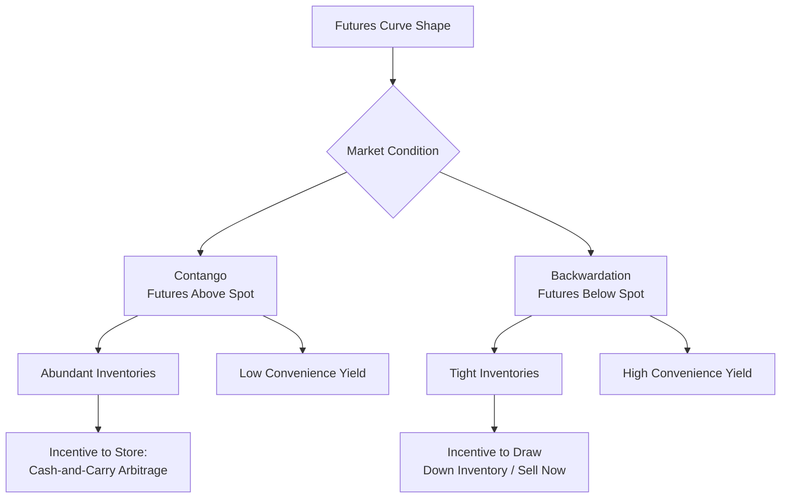
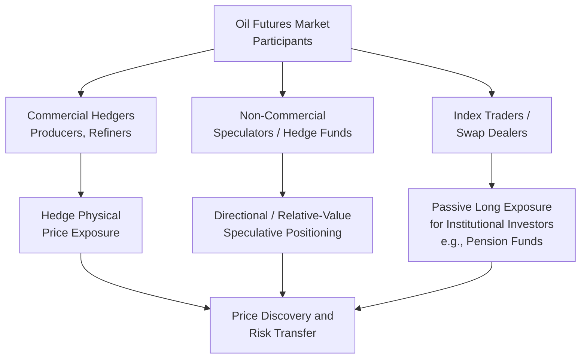

## Oil Futures, Spot Markets, and Financialization

### Overview

Oil futures and spot markets constitute the trading infrastructure through which the benchmark prices covered elsewhere in this course are actually discovered, and the "financialization" of oil refers to the historically significant growth in financial (as opposed to purely physical/commercial) participation in these markets. This topic examines futures contract mechanics, the term structure of oil prices (contango and backwardation) and its economic interpretation via the theory of storage, the growth and composition of financial participation, and the ongoing debate over whether and how financialization has altered oil price behavior relative to a purely physical-fundamentals-driven market.

### Spot vs. Futures Markets: Basic Structure

#### Spot Markets

Spot transactions involve the purchase/sale of a physical crude cargo for near-term delivery at the prevailing market price. Spot markets provide the real-time transactional data underlying Price Reporting Agency benchmark assessments (as detailed in the benchmark pricing treatment) but represent a comparatively small share of total physical crude sold, given the dominance of term contracts in much of global crude trade.

#### Futures Markets

A futures contract is a standardized, exchange-traded agreement to buy or sell a specified quantity of a commodity at a predetermined price on a specified future date. The two dominant oil futures exchanges are the **New York Mercantile Exchange (NYMEX)**, part of the CME Group, trading WTI futures, and **Intercontinental Exchange (ICE)**, trading Brent futures. Key structural features:

- **Standardization**: contract size, quality specification, and delivery terms are fixed by the exchange, enabling deep liquidity that individually negotiated physical contracts cannot achieve.
- **Clearing house guarantee**: the exchange's clearing house stands as counterparty to every trade, substantially reducing counterparty credit risk relative to bilateral physical contracts — a structural feature critical to enabling the enormous trading volumes observed in these markets.
- **Margin requirements**: traders post initial and maintenance margin (a fraction of contract value) rather than full notional payment, enabling leveraged exposure — a feature central to both the hedging utility and the speculative attractiveness of futures relative to physical positions.
- **Settlement mechanics**: as detailed in the benchmark pricing treatment, WTI is predominantly physically deliverable while Brent is predominantly cash-settled, a distinction with meaningful practical consequences (illustrated dramatically by the April 2020 negative WTI price episode, where physical delivery obligation combined with unavailable storage drove the anomalous outcome).

### The Term Structure of Oil Prices

#### Contango and Backwardation Defined

The **futures curve** — the set of futures prices for a given commodity across successively distant delivery months — can take two basic shapes:

- **Contango**: futures prices for more distant delivery months are *higher* than near-term/spot prices, an upward-sloping curve.
- **Backwardation**: futures prices for more distant delivery months are *lower* than near-term/spot prices, a downward-sloping curve.

$$F_{t,T} \gtrless S_t$$

where $F_{t,T}$ is the futures price at time $t$ for delivery at time $T$, and $S_t$ is the current spot price; contango corresponds to $F_{t,T} > S_t$ and backwardation to $F_{t,T} < S_t$.

#### The Theory of Storage

The standard economic explanation for the term structure shape is the **theory of storage** (or cost-of-carry model), which decomposes the futures-spot relationship into financing/storage costs and a "convenience yield":

$$F_{t,T} = S_t \times e^{(r + u - y)(T-t)}$$

where $r$ is the risk-free interest rate, $u$ is the physical storage cost, and $y$ is the **convenience yield** — the non-monetary benefit of holding physical inventory (operational flexibility, insurance against supply disruption, ability to meet unexpected demand) rather than a forward claim on future delivery.

- **Contango** arises when the convenience yield is low relative to financing and storage costs — typically occurring when physical inventories are abundant (low scarcity value of holding barrels now), such that the market rewards holding a barrel for later delivery rather than now.
- **Backwardation** arises when the convenience yield is high — typically occurring when physical inventories are tight and immediate physical availability is scarce and valuable, such that holders of physical barrels demand a premium (a higher spot price relative to future delivery) to part with immediate supply.

#### Diagram: Contango vs. Backwardation and Inventory Signaling

#### Cash-and-Carry Arbitrage

When the observed contango spread exceeds the actual cost of physical storage plus financing (i.e., the market is in a state exceeding "full carry"), a **cash-and-carry arbitrage** becomes profitable: purchase physical crude spot, store it, and simultaneously sell a futures contract for future delivery at the higher price, locking in a risk-free profit net of storage and financing cost. This arbitrage mechanism is the market-clearing force that generally prevents contango from exceeding full carry for extended periods where storage capacity is available, and its activation (or the exhaustion of available storage capacity, as occurred dramatically in April 2020) is itself informative about physical market tightness.

### The Financialization of Oil Markets

#### What "Financialization" Means

Financialization refers to the substantial growth, particularly from the mid-2000s onward, in participation by financial investors — commodity index funds, hedge funds, exchange-traded products, and other institutional investors — in oil futures markets, alongside the traditional participation of physical market participants (producers, refiners, merchants) using futures primarily for hedging purposes. Financial participants generally have no intent to take or make physical delivery and instead seek price exposure, portfolio diversification, or speculative return, closing out or rolling their positions before contract expiration.

#### Trader Classification Framework

Regulatory reporting (notably the U.S. Commodity Futures Trading Commission's Commitments of Traders, COT, reports) classifies market participants into categories widely used in financialization analysis:

- **Commercial traders (hedgers)**: producers, refiners, merchants using futures to hedge physical price exposure arising from their underlying business.
- **Non-commercial traders (speculators/money managers)**: hedge funds and other financial entities taking directional positions for speculative return rather than hedging an underlying physical exposure.
- **Index traders/swap dealers**: entities providing commodity index exposure to institutional investors (e.g., pension funds seeking commodity allocation as an asset class), typically maintaining large, relatively passive long positions rolled systematically across contract months.

The relative size and positioning of these trader categories — closely monitored via published COT data — is a widely used, though imperfect, gauge of speculative sentiment and positioning in oil futures markets.

#### Diagram: Oil Futures Market Participant Composition

### The Financialization Debate: Does Speculation Distort Prices?

#### The Core Empirical Question

A substantial and genuinely contested academic and policy literature has examined whether the growth of financial participation — particularly passive index investment flows — has caused oil prices to deviate systematically from levels justified by physical supply-demand fundamentals, most prominently debated in the context of the 2007–2008 oil price spike, when WTI prices rose to historically unprecedented levels before collapsing sharply amid the global financial crisis.

**[Inference]** The literature on this question remains genuinely divided rather than settled: some studies have found evidence consistent with index/speculative flows exerting meaningful, if temporary, upward pressure on prices independent of contemporaneous physical fundamentals, while other studies — including some conducted by regulatory bodies and central banks — have found limited or no robust evidence that speculative positioning, as opposed to genuine physical supply-demand factors and expectations about future fundamentals, was the primary driver of the observed price movements. This remains an active area of applied econometric research rather than a topic with clear scholarly consensus, and the appropriate methodological approach to isolating "speculative" from "fundamental" price drivers is itself a matter of ongoing debate given that speculative positioning and fundamental expectations are not independently observable and may be correlated rather than causally distinct.

#### Channels Through Which Financialization Could Plausibly Affect Prices

Even setting aside the unresolved empirical debate on the 2007-2008 episode specifically, the theoretical literature has identified several channels through which financial participation could, in principle, affect price levels or dynamics distinct from pure information-aggregation/price-discovery functions:

1. **Price pressure from large, correlated flows**: systematic, non-fundamentals-driven buying or selling (e.g., mechanical index rebalancing flows) could in principle move prices temporarily if market-making capacity is insufficient to absorb the flow without price impact, though the persistence of any such effect depends on whether arbitrageurs can identify and correct the resulting mispricing.
2. **Cross-market spillovers and increased correlation with broader financial assets**: financialization has been associated in several empirical studies with increased correlation between oil futures returns and broader equity/financial market returns, a pattern less pronounced in earlier, less financialized periods — interpreted by some researchers as evidence of financial-market-driven co-movement distinct from commodity-specific fundamentals.
3. **Information aggregation and price discovery improvement**: conversely, an alternative and not mutually exclusive view holds that increased financial participation improves market liquidity and price discovery by incorporating a broader information set (including forward-looking expectations about future supply-demand balance) into current prices more efficiently than a purely physical-participant market would achieve — a generally positive characterization of financialization's role, in contrast to the price-distortion concern above.

### Options and Other Derivatives

Beyond the futures contracts discussed above, a broader derivatives ecosystem has developed around the major benchmarks:

- **Options on futures**: give the holder the right, but not obligation, to buy (call) or sell (put) a futures contract at a specified strike price, used for asymmetric hedging strategies (e.g., producers purchasing put options to establish a price floor while retaining upside exposure) and for speculative volatility-based strategies.
- **Swaps**: over-the-counter (OTC) agreements to exchange cash flows based on the difference between a fixed and a floating (benchmark-referenced) price, widely used by producers, refiners, and airlines for customized hedging not perfectly served by standardized exchange contracts.
- **Crack spread and calendar spread instruments**: derivative contracts on the *relationship* between two prices (e.g., the refining crack spread between crude and refined product prices, or the calendar spread between different futures delivery months) rather than an outright price level, used for relative-value trading and hedging strategies distinct from directional price exposure.

### Worked Example: Cash-and-Carry Arbitrage Threshold Calculation

**Setup:** WTI spot price is $70.00/bbl; the 6-month futures contract is trading at $74.50/bbl (contango). Monthly physical storage cost is $0.40/bbl, and the risk-free financing cost is 5% annualized.

**Step 1 — Calculate full carrying cost over 6 months:**

Storage cost: $0.40 \times 6 = \$2.40/bbl$

Financing cost (simple approximation): $70.00 \times 0.05 \times (6/12) = \$1.75/bbl$

Total carrying cost: $2.40 + 1.75 = \$4.15/bbl$

**Step 2 — Compare to observed contango spread:**

Observed spread: $74.50 - 70.00 = \$4.50/bbl$

**Step 3 — Arbitrage assessment:**

$$\$4.50 > \$4.15 \implies \text{Arbitrage profit available} = \$4.50 - \$4.15 = \$0.35/\text{bbl}$$

**Interpretation:** Under these illustrative figures, the observed contango spread modestly exceeds full carrying cost, implying a cash-and-carry arbitrage opportunity of roughly $0.35/bbl (before considering transaction costs, storage availability constraints, and quality/location basis risk) — market participants exploiting this opportunity (buying spot, storing, selling forward) would be expected to bid up spot prices and/or sell down futures prices until the spread converges toward full carry, absent binding storage capacity constraints. **[Behavior may vary]** — this is a simplified illustrative calculation; actual arbitrage economics depend on available storage capacity and cost, realized versus assumed financing rates, and basis/quality risk between the specific spot grade and futures delivery specification.

### Applications

- **Producer and consumer hedging strategy design**: understanding futures, options, and swap instruments is foundational to how upstream producers, refiners, airlines, and shipping companies manage price risk exposure arising from their underlying physical business.
- **Inventory and storage investment decisions**: the term structure (contango/backwardation) directly signals the economic incentive to build or draw down physical storage capacity, informing midstream storage infrastructure investment decisions.
- **Oil price volatility analysis and risk management**: understanding financialization's role in price dynamics informs both academic research and practical risk management/scenario planning by market participants exposed to oil price volatility.
- **Regulatory policy design**: the financialization debate has directly informed periodic regulatory discussions (e.g., position limit rules considered by the U.S. CFTC) regarding appropriate limits on speculative positioning in commodity futures markets.
- **Macro-financial market analysis**: the increased correlation between oil futures and broader financial asset returns associated with financialization is directly relevant to portfolio construction and cross-asset risk management practice.

**Related Topics**

- Oil price formation and benchmark pricing (Brent, WTI, Dubai)
- Crude oil classification and quality differentials
- OPEC and OPEC+ as a cartel: theory and behavior
- Oil market inventory dynamics and price signal interpretation
- Refining margins and crack spread analysis
- Commodity index investment and institutional asset allocation
- Oil price volatility and the upstream capital investment cycle
- Midstream storage economics and infrastructure investment
- Sanctions, price caps, and crude oil trade flow disruption
- Currency effects and dollar-denominated commodity pricing